# 物理

普通高中教科书

必修

第一册

人民教育出版社 课程教材研究所

编著

物理课程教材研究开发中心

·北京·

总主编：彭前程 黄恕伯

本册主编：彭前程 秦建云

编写人员：（以姓氏笔画为序）

秦建云 黄恕伯 彭前程

责任编辑：孙新 彭征

美术编辑：王艾

普通高中教科书 物理 必修 第一册

人民教育出版社 课程教材研究所

物理课程教材研究开发中心

出版 人民教育出版社

（北京市海淀区中关村南大街17号院1号楼 邮编：100081）

网址 http://www.pep.com.cn

重印 ××× 出版社

发行 ××× 新华书店

印刷 ××× 印刷厂

版 次 年 月第 版

印 次 年 月第 次印刷

开 本 890 毫米 × 1240 毫米 1/16

印 张 7.5

字 数 160 千字

印 数 册

书号 ISBN 978-7-107-33576-1

定价元

定价批号：××号 审图号：GS（××××）××××号

版权所有·未经许可不得采用任何方式擅自复制或使用本产品任何部分·违者必究

如发现内容质量问题，请登录中小学教材意见反馈平台：jcyjfk.pep.com.cn

如发现印、装质量问题，影响阅读，请与×××联系调换。电话：xxx-xxxxxx

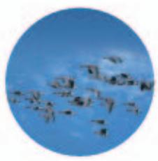

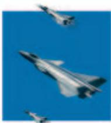

## 目录

致同学们 1  
序言 物理学：研究物质及其运动规律的科学 2  
第一章 运动的描述 10  
1. 质点 参考系 11  
2. 时间 位移 14  
3. 位置变化快慢的描述——速度 19  
4. 速度变化快慢的描述——加速度 25  
第二章 匀变速直线运动的研究 33  
1. 实验：探究小车速度随时间变化的规律 34  
2. 匀变速直线运动的速度与时间的关系 37  
3. 匀变速直线运动的位移与时间的关系 40  
4. 自由落体运动 45  
第三章 相互作用——力 54  
1. 重力与弹力 55  
2. 摩擦力 60  
3. 牛顿第三定律 64  
4. 力的合成和分解 68  
5. 共点力的平衡 72  
第四章 运动和力的关系 78  
1. 牛顿第一定律 79  
2. 实验：探究加速度与力、质量的关系 83  
3. 牛顿第二定律 88  
4. 力学单位制 93  
5. 牛顿运动定律的应用 97  
6. 超重和失重 101  
课题研究 108  
学生实验 112  
索引 116

人数版®

## 致同学们

同学们好！从这学期开始，本套书将陪伴大家一起学习高中物理。

中学物理是科学课程中非常重要的一门课，它对我们了解客观世界、学习探索世界的方法、培养科学的思维、形成科学的态度与责任等都有非常重要的作用。在今后的学习中，同学们既要注意概念、规律的确切含义，同时也要注意体会、思考在建立概念和探索规律时，所涉及的一些科学思维和方法，培养自己理性思考、敢于质疑、不断创新的科学素养。

为了使大家能更好地学习、探索浩瀚的物理世界，本书设计了以下栏目。

问题 每节开始创设的一个情境问题，以引发同学们对所要学习的内容主动思考，培养大家的问题意识及提出问题的能力。

实验 同学们自己动脑、动手操作的实践活动。

演示 主要是老师展示、供大家观察的实践活动。

思考与讨论 用于引发思考、展开交流等而设计的问题。

做一做 小型的动手操作类活动，目的是引发思考、体验和感悟。

科学方法 物理学中常用和重要的科学思想、方法。应注意的是，更多的科学思想及方法在相应的正文和旁批中体现。

拓展学习 体现弹性，属于选学、选做的内容。主要内容是知识的拓展、延伸，或者是用传感器、计算机等设备自动记录和处理数据的实验，供有条件的学校选用。

STSE 主要介绍和探讨科学·技术·社会·环境间相互关联的一些问题，属于选学内容。

科学漫步 介绍物理学的重要史实或前沿进展，为开阔视野的内容，以引发同学们自己主动学习，属于选学内容。

练习与应用 针对每节内容所设计的练习题，用于巩固所学的概念、规律和方法。

复习与提高 针对全章内容所设计的练习题，分 A、B 两组，用于巩固及提高。A 组相对容易一些，属于共同要求；B 组相对难一些，属于选学内容。

## 序言物理学：研究物质及其运动规律的科学

人类自古以来就对自然界充满好奇。日出日落、辰宿列张、春华秋实、寒来暑往，大自然的各种神奇现象让人们惊叹不已，强烈渴望弄清其背后的规律和联系。这种好奇心和人类提高生产力水平的需求，构成了自然科学发展最主要的两个动力。在它们的驱使下，人类对自然规律进行着不懈的探索。物理学是这些探索过程中结出的最重要的果实之一。

在初中，大家已经学习了一些有趣的物理知识和思考物理问题的方法。进入高中，我们将认识更丰富多彩的物理现象，学到更为深刻的物理知识。在学习过程中，大家还要进一步领悟科学研究的方法，受到科学精神的陶冶。这里，让我们先概览一下物理这门学科。

## 洞天察地，万物之理——物理学概述

早在2000多年前的古希腊时期，亚里士多德、阿基米德等一批科学家就开始了对物理现象和规律的探索，并发现了杠杆原理、浮力定律等规律。这是物理学的萌芽时期。 $16\sim 17$ 世纪，伽利略和牛顿等人在前人工作的基础上创立了系统性的力学理论，建立了实验观测和理论分析计算相结合的现代研究方式。1687年，牛顿出版了他的名著《自然哲学的数学原理》。这标志着现代意义的物理学正式诞生。

经过四个世纪的发展，物理学已经成为一门分支众多、深刻影响当代科学技术发展乃至人类社会文明进步的基础学科。

远到宇宙深处，近至咫尺之间，面对广袤苍穹之浩瀚、基本粒子之精微（图0-2），物理学定量地研究物质的存在形式、基本性质以及运动和转化规律。物理学不仅要探索物质的深层次结构，还要在不同层次上认识物质的组成部分及其相互作用。因此，说物理学是关于“万物之理”的学问并不为过。

物理学是一门实验科学，也是一门崇尚理性、遵循逻辑推理的理论科学。由于物质世界纷繁复杂，有限的实验和观察难以完全揭示其背后的本质规律和内在联系。因此，在依赖先进的科学装置的同时，物理学的发展也必须借助于强有力的数学工具和大型计算技术，以及深刻的洞察力和丰富的想象力。

今天，物理学中的基本概念和理论、实验方法和手段，已经越来越广泛地应用于其他学科，极大地丰富了人类对物质世界的认识，推动了科学技术的创新和革命，促进了生产力的发展和人类文明的进步。

观察现象，揭示本质——物理学研究的特点

物理学通过定量的实验和严谨的逻辑分析，不断地揭示出自然界的客观规律和各种现象的内在联系。其中有的和直觉

图0-2 物质世界的空间尺度

吻合，也有很多与直觉不尽相同，需要通过严密的实验和思考，才能透过表象看到本质。这些成果极大地丰富了人类对物质世界的认识，也展现了人类理性思维的巨大威力。这可以从物理学发展中的几个典型例子看出。

古人曾凭直觉认为，地球是宇宙的中心。16～17世纪，哥白尼、第谷和开普勒等人通过详尽的观测和分析，逐渐认识到地球和其他行星都在绕着太阳运动，并找到了这些运动的规律。最终，依据这些观测和分析，牛顿发现了万有引力定律，揭示了这些运动规律的根源。伽利略和牛顿还认识到物体即便在不受力的情况下也会一直运动下去，这也与通常的直觉相反。这种对内在规律深刻的认识，靠的是精确的实验和严密的逻辑分析，二者缺一不可。

19世纪初，人们已经知道电流能产生磁场，于是很自然地问：电能生磁，那么磁应该也能生电吧？英国科学家法拉第对此进行了大量实验。一开始，他从直觉出发，认为既然稳定的电流能产生磁场，那么稳定的磁场也应该能产生电场，但是实验都失败了。后来他偶然发现，变化的磁场才能产生电场，这就是著名的电磁感应定律。总的来说，磁能生电的规律是符合直觉的，但其产生方式却和最初的直觉很不相同。可见，客观规律是否与直觉一致，是不能一概而论的，需要针对具体情况通过认真的研究才能搞清楚。

一代代物理学家在探究客观世界的过程中发展了很多行之有效的研究方法。在物理学习中，我们不但要掌握具体的知识，而且要学习和体会这些科学方法，并努力运用它们解决各种实际问题。

物理学的发展和成就与它所蕴含的科学精神密不可分。

首先是学以致知的探索精神。前面说过，人类对自然界的好奇心是科学发展最重要的动力之一。人们在它的驱使下研究很多问题，其中，有的能直接转化成技术，服务于实际应用，但是也有很多是当时看不到直接用途的，比如伽利略研究的力和运动的问题、牛顿发现的万有引力定律，当时都属于无用之学。正是这些看似没有用的、以求知为目的的探索，使人们获得了对自然规律完整深入的认识。

其次是实事求是的客观精神。物理学的目的是求真，客观事实是判断对错的标准，对就是对，错就是错。猜想和论断必须能经受得住实验的检验和逻辑的推敲。19世纪末20世纪初，当人们发现权威的牛顿学说不适用于微观和高速情况时，便认真地对其进行修正；1936年，大名鼎鼎的爱因斯坦向杂志投出一篇论文，审稿人和编辑发现论文有错，便毫不犹豫地指出并拒稿。这些都是物理学史上实事求是、务实求真的佳话。

还有就是理性分析的精神。物理学强调数学计算和逻辑分析，环环相扣，有原因才有结果。不合乎逻辑的地方必然意味着有问题，必须搞清楚。物理学的殿堂中，没有诡辩者的位置。

需要指出的是，科学精神不仅对科学研究很重要，而且在社会生产、日常生活的各方面都是有价值的。现代社会分工精细、节奏紧凑，很多时候“失之毫厘，差之千里”。这就要求我们在工作和生活中要做到实事求是、严谨认真并且讲求逻辑，敬畏和尊重客观规律，从而提高效率、减少失误。另外，秉承实事求是和讲求逻辑的精神，还会使我们在碰到问题的时候，面对现实、认真分析，根据实际作出判断与选择，不盲从、不走极端。

## 揭示自然，造福人类——物理学的应用

物理学的发展，推动了工业、农业和信息技术等方面的进步，引发了一次次的产业革命，改变了人类的生产和生活方式。技术的进步又为物理学的研究提供了更为强大的手段，并引发人们对物理问题进行更深入的思考，从而反过来促进物理学的发展。

创立于17世纪的牛顿力学，被广泛地应用于工程技术，大大推动了社会发展。18～19世纪，工程上对蒸汽机等热机的改进需求，又迫使人们对热的问题进行深入研究，引发了热力学的巨大进步（图0-3）。

19～20世纪初，电磁学的发展，直接导致发电机和无线电通信的诞生，使电能被广泛利用。电走进了千家万户，世界被电灯点亮，电话和电报把各地的人们连接起来，人类从此进入了电气时代。

进入20世纪以后，物理学的研究范围更加广阔。人们掌握了微观世界的规律，这更为有力地推动了技术的进步和社会的变革。对原子核的认识，使人们掌握了核能，建造了核电站并发展了治疗肿瘤的放疗等技术；对固体中电子运动的研究，引发了半导体工业的诞生，导致了晶体管、集成电路和大容量电子存储技术的发明，从而使人们可以制造半导体芯片（图0-4）；对原子、分子物理和光学的深入研究，引发了原子钟、激光和光纤通信等技术的诞生。原子钟是卫星定位系统的核心，激光被广泛用于工业、通信、医疗和国防，而遍布全球的光纤网是互联网的物理载体，它把全世界连在一起。毫不夸张地说，20世纪是物理学的世纪，人们每时每刻都在享受物理学发展带来的果实。今天世界的整个面貌，都和物理学的巨大进步密不可分。

20世纪技术的迅猛发展，也大大推动了物理学的研究。利用现代工业手段，人们制造了巨大的望远镜和粒子加速器（图0-5）等设备，从而把研究的目光投向更深邃的宇宙和更微小的粒子；利用大型计算机，人们可以完成更为复杂和准确的计算并处理海量的实验数据；在现代交通工具和信息技术的帮助下，学术交流变得更加便捷、高效。

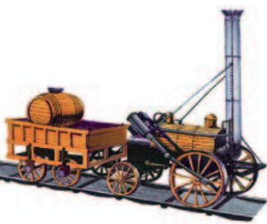  
图0-3 第一辆蒸汽机车（模型）

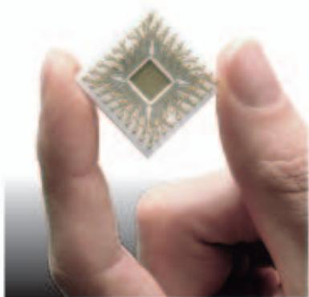  
图0-4 半导体芯片

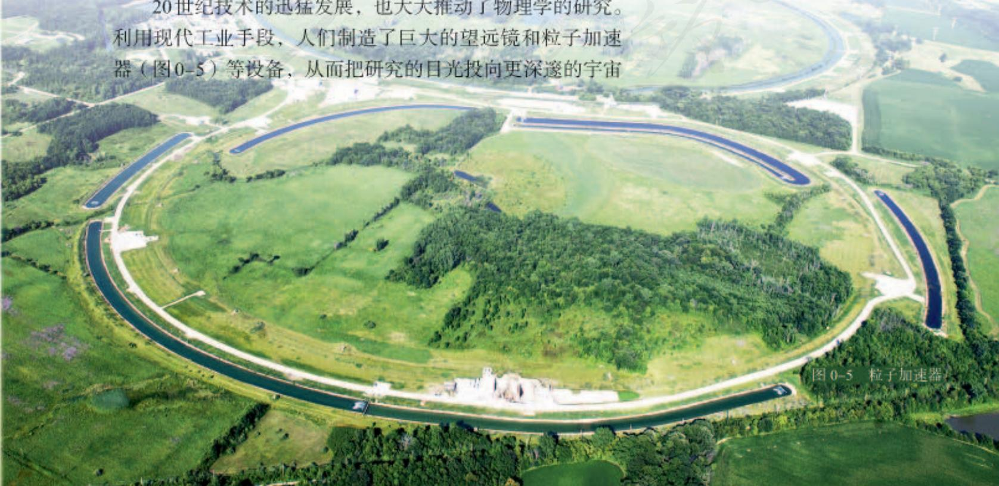

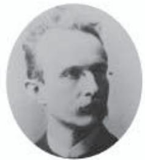  
普朗克

  
居里夫人

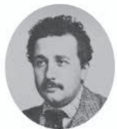  
爱因斯坦

## 前景广阔，充满挑战——物理学的未来

19世纪下半叶，以力学、热学和电磁学为主要内容的经典物理学，几乎能解释当时已知的所有物理现象。因此，当20世纪第一个春天来临之际，英国物理学家开尔文在“新春献词”的演说中，踌躇满志地宣告：“科学大厦已经基本建成……后辈物理学家只需做一些零碎的修补工作就行了。”但话音刚落，他的预言就被一个接一个的重大发现所打破。从下表中可以看出，在20世纪，物理学捷报频传，重大发现此伏彼起，从来没有停止过。

那么，21世纪还会有重要的发现吗？著名法国物理学家、诺贝尔奖得主德布罗意在《物理学的未来》一文中说：

“我们的知识越是发展，自然就越是以其多种表现证明它拥有无尽的财富，甚至在很先进的科学领域，如物理学，我们也没有理由认为我们已经‘耗尽’了自然财富，或者认为我们已经接近完整地掌握了自然界的全部财富。”

事实正是这样的，当前，还有许多困扰物理学的难题。例如，目前的物质结构理论认为“夸克”构成了质子、中子等强子，但是，夸克为什么不能单独存在？如何将描述微观世界运动的量子力学和描述引力的广义相对论结合起来，以解释宇宙的起源和演化？能否像用麦克斯韦理论统一描述电和磁一样，用某一理论统一描述自然界的四种基本相互作用（弱力、强力、电磁力和引力）？这些问题都有待人们去探索。此外，技术发展的需求，也提出了许多有价值的问题。如何制造可以方便使用的超导材料？如何开发更为清洁的能源？如何进一步提升计算机的性能？这些问题都与物理学直接相关。

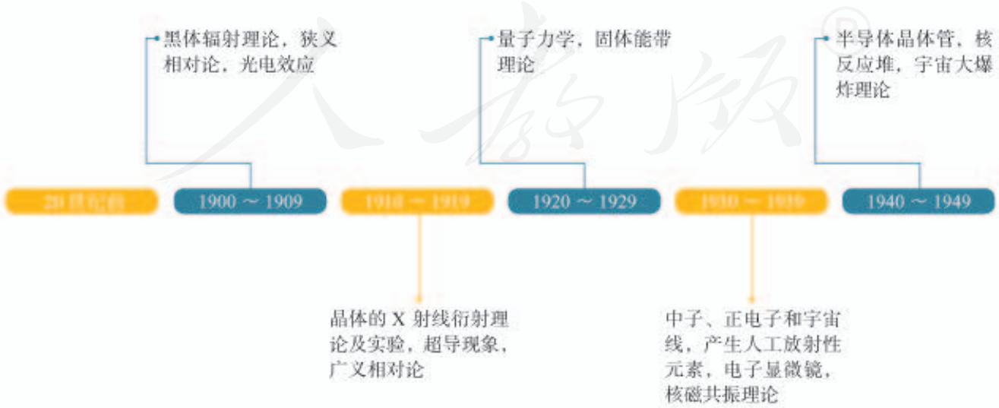  
表 20 世纪以来物理学重大发现和与物理学相关的重大技术进步

物理学如同一座大厦，已经被建设得很壮观了，但尚未完工，也许永远也不会完工，更壮观的还在后面，还在等待着我们去建设和探索。

“江山代有才人出，各领风骚数百年。”综观世界科技史，许多重要的科学发现都产生于科学家风华正茂的青年时期，在这个阶段他们思维敏捷、敢于创新。年轻的同学们，你们当中一定会有人沿着前辈的足迹，为物理学的发展作出自己的贡献。千里之行，始于足下，学好高中物理，你就在通向成功的道路上迈出了坚实的一步。

当然，多数同学今后未必进行基础科学的研究，但是，不论从事什么职业，高中物理积累的科学知识，学到的科学方法和实事求是、讲求逻辑的理性科学精神，都将会使你终身受益。

  
杨振宁

  
李政道

  
丁肇中

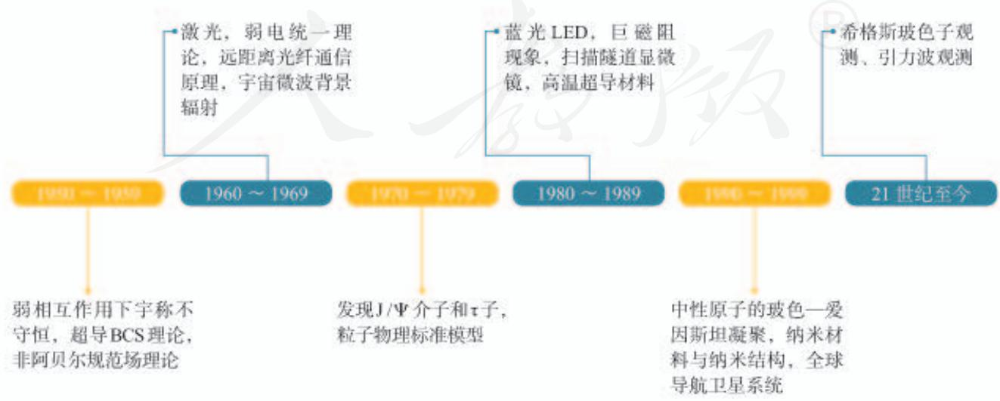

# 第一章运动的描述

在我们周围，到处可以看到物体在运动：汽车在公路上行驶，巨轮在海上航行，飞机在天空中飞行，树叶在摇动，鸟儿在飞翔……就连我们脚下的地球，也在不停地自转、公转。

物体的空间位置随时间的变化，是自然界中最简单、最基本的运动形态，叫作机械运动（mechanical motion）。在物理学中，研究物体做机械运动规律的分支叫作力学（mechanics）。人们在力学的研究中，不仅认识了物体做机械运动的规律，而且还创立了科学研究的基本方法。这一章，我们学习机械运动的描述。

# 1 质点 参考系

## 问题

生活中随处可见运动的物体，例如玩耍的孩童、行驶的汽车、翱翔的雄鹰……对于这些运动的物体，我们如何准确地描述它们的运动呢？

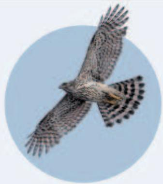

## 物体和质点

雄鹰拍打着翅膀在空中翱翔时，身体在向前运动，但它的翅膀在向前运动的同时还在上下运动；足球在绿茵场上滚动时，它在向前运动的同时还在转动……可见，要准确地描述物体的运动，并不是一件容易的事。

困难和麻烦出在哪里？稍加分析就可以知道，这是因为任何物体都有一定的大小和形状，物体各部分的运动情况一般说来并不一样。不过，我们有时关注物体各部分的运动，有时关注物体整体的运动。所以，如何描述物体的运动要看我们关注的问题是什么。例如，要研究雄鹰是如何飞行的，它的翅膀的运动方式很重要；但是，如果我们只关注雄鹰从哪里移动到了哪里，就不必太在意它的形状，把它看成一个点来描述它的运动就容易了。

下面我们来分析一些具体的实例，看看什么样的问题可以把物体看成一个点，什么样的问题不能把物体看成一个点。

我们生活的客观世界是物质的，物质由分子、原子等组成，我们所看到的物体是物质的聚集状态。研究机械运动，需要描述物体位置随时间变化的规律。

  
图1.1-1 什么情况下列车可以视为一个点？

人类居住的地球在绕太阳公转，同时又在自转。因此，地球各部分离太阳的距离不断变化。但是，如果考虑到地球的直径（约 $1.3 \times 10^{4}$ km）还不到地日距离（约 $1.5 \times 10^{8}$ km）的万分之一，在研究地球公转引起的位置变化问题时，由地球的大小引起的运动差异很小，因此，可以忽略地球的大小和形状而把它视为点。

有些物体上各点的运动差异虽然不小，但如果我们不研究各点的运动差异，而只关注物体整体的运动时，同样可以把物体看作一个点。例如，列车在平直轨道上行驶（图1.1-1），尽管它的传动机构及车轮的运动很复杂，但是，当我们只关心列车整体的运动情况时，就可以不考虑上述各部分的运动差异，而用一个点的运动代替整列列车的运动。

在物理学中，突出问题的主要因素，忽略次要因素，建立理想化的物理模型，并将其作为研究对象，是经常采用的一种科学研究方法。质点这一理想化模型就是这种方法的具体应用。

看来，在某些情况下，确实可以忽略物体的大小和形状，把它简化为一个具有质量的点，这样的点叫作质点 $^{①}$ （mass point）。还有一种情况，虽然不能忽略物体的大小和形状，但是，物体上各点的运动情况完全相同。从描述运动的角度看，物体上任意一点的运动完全能反映整个物体的运动，于是，整个物体的运动也可以简化为一个点的运动，把物体的质量赋予这个点，它也就成了一个质点。

从前面的讨论可以看出，一个物体能否看成质点是由所要研究的问题决定的。同一个物体，由于所要研究的问题不同，有时可以看成质点，有时不能看成质点。

## 思考与讨论

运动员踢足球的不同部位，会使球产生不同的运动。足球运动中常说的“香蕉球”是球在空中旋转、整体运动径迹为类似香蕉型弧线的一种运动（图1.1-2）。在研究如何才能踢出“香蕉球”时，能把足球看作质点吗？研究什么样的问题可以把足球看作质点？

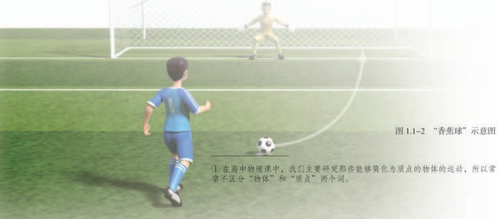

要描述物体的运动，通常要先判断它是运动的还是静止的；如果物体是运动的，再根据需要来说明它是怎样运动的。我们说房屋、树木是静止的，这大概是不会错的。但是，房屋、树木在随着地球一起运动，这也是事实。再比如，行驶的列车中的乘务员与旅客在交流，列车外的人认为他们随列车一起运动，但他们彼此看对方却是静止的。为什么人们的看法会不一样呢？

自然界的一切物体都处于永恒的运动中，绝对静止的物体是不存在的。就此意义而言，我们说运动是绝对的。但是，描述某个物体的位置随时间的变化，却又总是相对于其他物体而言的。这便是运动的相对性。

可见，要描述一个物体的运动，首先要选定某个其他物体作为参考，观察物体的位置相对于这个“其他物体”是否随时间变化，以及怎样变化。这种用来作为参考的物体叫作参考系（reference frame）。

在描述一个物体的运动时，参考系可以任意选择。但是，选择不同的参考系来观察同一物体的运动，其结果会有所不同。参考系选取得当，会使问题的研究变得简洁、方便。当然，凡是提到运动，都应该弄清楚是相对于哪个参考系而言的。通常情况下，在讨论地面上物体的运动时，都以地面为参考系。

## 练习与应用

1. 两个运动的物体：一个是被球拍击出的乒乓球，另一个是正在飞行的歼-20隐形战斗机。

请你为乒乓球和战斗机各创设两个问题，一个问题中可以把它（乒乓球或战斗机）看成质点；另一个问题中不能把它看成质点。

2. 平常说的“一江春水向东流”“地球的公转”“钟表的时针在转动”“太阳东升西落”等，分别是说什么物体相对什么参考系在运动？

3. 将近1000年前，宋代诗人陈与义乘着小船在风和日丽的春日出游时曾经作了一首诗：飞花两岸照船红，百里榆堤半日风。卧看满天云不动，不知云与我俱东（图1.1-3）。诗人艺术性地表达了他对运动相对性的理解。诗中描述了什么物体的运动？它们分别是以什么物体为参考系的？你对诗人关于“榆堤”“云”“我”的运动与静止的说法有没有不同的认识？

  
图1.1-3

## 2 时间 位移

## 问题

要讨论物体位置随时间的变化，就要涉及位置、时间等概念。如果要准确地描述一辆行驶在北京长安街上的汽车所处的位置，你认为应该采用什么方法？你对时间是怎样认识的？

## 时刻和时间间隔

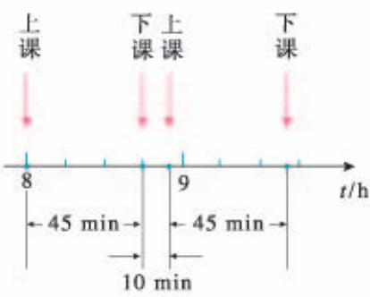

要描述物体位置随时间的变化，首先要清楚“时间”一词的含义。说到时间，不能不说时刻和时间间隔。时刻和时间间隔既有联系又有区别。

上午8时上课、8时45分下课，这里的“8时”“8时45分”是指这节课开始和结束的时刻，而这两个时刻之间的 $45\mathrm{min}$ ，则是这两个时刻之间的时间间隔（图1.2-1）。

图1.2-1 时刻和时间间隔  
在表示时间的数轴上，时刻用点表示，时间间隔用线段表示。我们平时说的“时间”，有时指的是时刻，有时指的是时间间隔，要根据上下文认清它的含义。  

## 位置和位移

为了定量地描述物体的位置，需要在参考系上建立适当的坐标系（coordinate system）。例如，若想说明地面上某人所处的位置，可以采用平面直角坐标系来描述；如果物体做直线运动，可以用一维坐标系来描述。

物体做直线运动时，通常选取这条直线为 $x$ 轴，在 $x$ 轴上任选一点作为原点，规定好坐标轴的正方向和单位长度，物体的位置就可以用它的位置坐标来描述。例如，我们要确定一辆行驶在北京长安街上汽车的位置，可以沿东西方向建立一维坐标系， $x$ 轴的正方向指东，选取路上的某交通岗亭作为坐标原点 $O$ ，汽车的位置就可以用它的坐标准确地描述出来。如果汽车的坐标是 $30 \mathrm{~m}$ ，表示它在岗亭以东 $30 \mathrm{~m}$ 处；如果汽车的坐标是 $-20 \mathrm{~m}$ ，表示它在岗亭以西 $20 \mathrm{~m}$ 处（图1.2-2）。

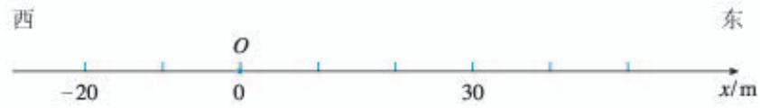  
图1.2-2 物体位置的表示

物体位置的描述我们清楚了，那么，物体位置的变化该怎样描述呢？

如图1.2-3，某人从北京去重庆，可以选择不同的交通方式。既可以乘火车，也可以乘飞机，还可以先乘火车到武汉，然后乘轮船沿长江而上。图中的几种情况表明，旅行者所经过的线路不同。我们在初中已经知道，路程（path）是物体运动轨迹的长度，说明这个人旅行的路程也不同。但是，就位置的变动来说，无论使用什么交通工具、走过了怎样不同的路径，他总是从北京到达了西南方向、直线距离约 $1300\mathrm{km}$ 的重庆，即位置的变化是相同的。从图中可以看出，由初位置指向末位置的有向线段能准确地描述旅行者位置的变化。只要物体的初、末位置确定，这个有向线段就是确定的，它不因路径的不同而改变。物理学中用位移（displacement）来描述物体位置的变化，并用/表示（图1.2-4）。

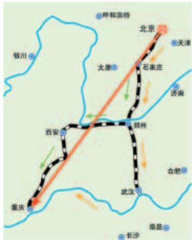  
图 1.2-3 北京至重庆的不同路线及其位置变化

在物理学中，像位移这样的物理量叫作矢量，它既有大小又有方向；像温度、路程这样的物理量叫作标量，它们只有大小，没有方向。

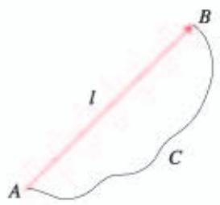  
图1.2-4 从初位置到末位置的有向线段表示位移

## 直线运动的位移

前面学习了用一维坐标系描述物体的位置，那么，在一维坐标系中位移应该如何表示呢？

如图1.2-5，做直线运动的物体，它的初位置为 $x_{1}$ ，末位置为 $x_{2}$ ，则物体的位移应该是由 $x_{1}$ 指向 $x_{2}$ 的红色有向线段，其大小等于末位置与初位置坐标之差 $x_{2}-x_{1}$ 。

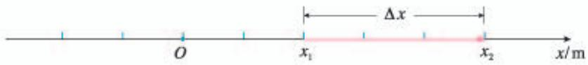  
图1.2-5 位置坐标的变化量表示位移

由于常用 $\Delta x$ 表示坐标之差，所以在研究直线运动时，常用 $\Delta x$ 表示位移，记为

$$
\Delta x = x _ {2} - x _ {1}
$$

若两坐标之差为正，则位移的方向指向 $x$ 轴的正方向；若两坐标之差为负，则位移的方向指向 $x$ 轴的负方向。

## 思考与讨论

某物体从A点运动到B点，坐标 $x_{A}$ 为5m， $x_{B}$ 为2m，物体的位移大小等于多少？方向如何？

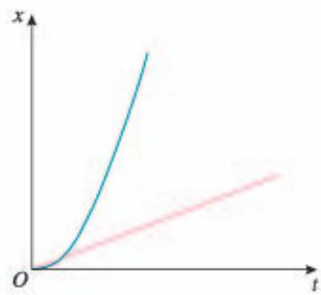  
图1.2-6 $x - t$ 图像

## 位移—时间图像

物体在每一时刻的位置或每一时间间隔的位移可以用图像直观地表示。

如图1.2-6，在直角坐标系中选时刻 $t$ 为横轴，选位置 $x$ 为纵轴，其上的图线就是位置一时间图像，通过它能直观地看出物体在任意时刻的位置。如果将物体运动的初始位置选作位置坐标原点 $O$ ，则位置与位移大小相等 $(x = \Delta x)$ ，位置一时间图像就成为位移一时间图像，又称 $x - t$ 图像。从 $x - t$ 图像可以直观地看出物体在不同时间内的位移。

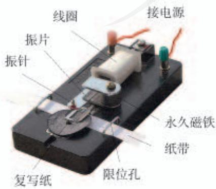  
图1.2-7 电磁打点计时器

## 位移和时间的测量

生活中，人们可以用多种方法记录某一时刻物体运动的位置，从而推断出它在一段时间内的位移。例如，可以用照相的方法记录物体的位置，用钟表记录物体运动的时刻，也可以用频闪照相的方法同时记录物体运动的时刻和位置。学校实验室中常用打点计时器来记录时间和位移。

电磁打点计时器是一种使用交变电源的计时仪器（图1.2-7），工作电压约为 $8\mathrm{V}$ ，能够按照相同的时间间隔，在纸带上连续打点。当电源频率是 $50\mathrm{Hz}$ 时，每隔 $0.02\mathrm{s}$ 打一次点。如果把纸带和运动的物体连在一起，纸带上各点之间的距离就表示相应时间间隔中物体的位移大小。由这些点的位置，我们可以了解物体运动的情况。

还有一种打点计时器叫作电火花计时器，它的计时原理与电磁打点计时器相同，不过，在纸带上打点的不是振针和复写纸，而是电火花和墨粉。

## 实验

## 练习使用打点计时器

1. 了解打点计时器的构造，然后把它固定好。

2. 安装纸带。

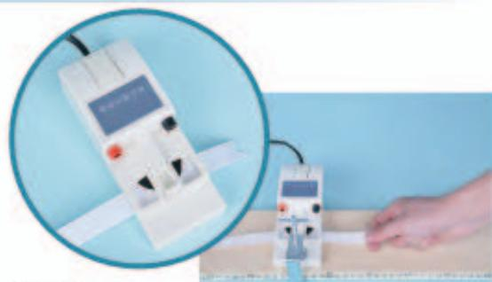

3. 启动电源，用手水平拉动纸带（图 1.2-8），纸带上就打出一行小点。随后关闭电源。

4. 取下纸带，从能够看清的某个点开始（起始点），往后数出若干个点。例如数出 n 个点，算出纸带从起始点到第 n 个点的运动时间 t。

图1.2-8 使用电火花计时器

5. 用刻度尺测量出从起始点到第 n 个点的位移 x。

测量之前，自己先设计一个表格，用来记录时间及位移。

通过测量仪器直接读取的数据是原始数据。它是宝贵的实验资料，要如实记录、妥善保存。

## 科学漫步

## 全球导航卫星系统

全球导航卫星系统（GNSS）是目前广泛应用的新一代导航定位系统，利用近地空间的卫星为各类用户提供可靠和高精度的定位、导航和授时服务（图1.2-9）。

全球导航卫星系统一般分为空间部分、地面测控部分和用户三大部分。空间部分即导航卫星系统，一般由数十颗卫星组成，每颗卫星可以发送导航卫星信号，编织成细密的网络，使得地球上任意地点任意时刻都能观测到4颗以上的导航卫星。地面测控部分则负责操控系统和向卫星注入导航电文等。用户通过接收机能够接收导航卫星发送的信号，并精准地进行定位、授时和测速。

全球导航卫星系统能够在全球范围内实时、全天候和全天时地提供服务，也就是说不受地域和天气影响，全球任何时刻都能得到持续可靠的定位服务。因此，从身边的车载导航、手机定位，到机场调度、海事救援和地质测绘等，都有广泛的应用。感兴趣的同学可以上网查一查全球导航卫星系统在有关方面的具体应用。

常用的全球导航卫星系统有美国的全球定位系统（GPS）、我国的北斗系统（COMPASS）、俄罗斯的格洛纳斯系统（GLONASS）和欧盟的伽利略系统（GALILEO）。2012年我国的北斗系统开始为亚太地区提供定位、导航和授时服务，2020年该系统将实现在全球范围内提供服务。

图1.2-9 全球导航卫星系统（示意图）  
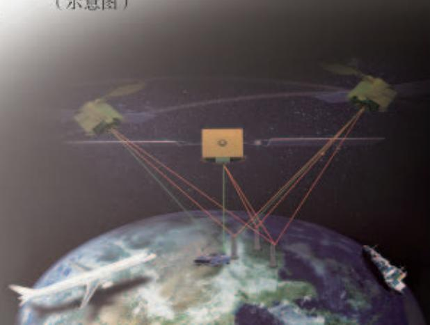

1. 以下各种说法中，哪些指时间间隔？哪些指时刻？

（1）列车员说：“火车8时42分到站，停车8分。”

（2）“您这么早就来啦，抱歉！让您等了这么久。”

（3）“前 3 s”“最后 3 s”“第 3 s 末”“第 3 s 内”。

2. 某市出租汽车的收费标准有 1.20 元/km、1.60 元/km、2.00 元/km，其中的千米说的是路程还是位移？

3. 田径运动场跑道周长是 400 m。

（1）百米赛跑选用跑道的直道部分，运动员跑完全程的路程是多少？位移大小是多少？

(2) 800 m 跑比赛中, 不同跑道的运动员跑完全程的路程相同吗? 跑完全程的位移相同吗? 请结合田径比赛的规则想一想。

4. 如图 1.2-10，一个物体从 P 点运动到 Q 点，坐标 $x_{P}$ 为 3 m， $x_{Q}$ 为 -2 m，它的位移大小是多少？方向如何？请你画出它的位置坐标和位移矢量。

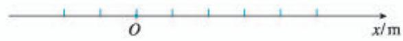  
图1.2-10

5. 一辆汽车在教练场上沿平直道路行驶，以 x 表示它相对于出发点的位移。图 1.2-11 近似描写了汽车在 0 时刻到 40 s 这段时间的 x-t 图像。通过分析回答以下问题。

(1) 汽车最远位置距离出发点约为多少米?

(2) 汽车在哪段时间没有行驶?

（3）汽车在哪段时间驶离出发点，在哪段时间驶向出发点？

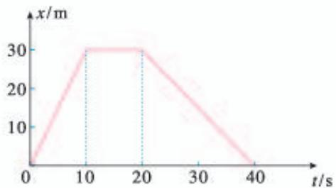  
图1.2-11

6. 从高出地面 $3 \mathrm{~m}$ 的位置竖直向上抛出一个小球，它上升 $5 \mathrm{~m}$ 后回落，最后到达地面（图1.2-12）。分别以地面和抛出点为原点建立一维坐标系，方向均以向上为正，填写以下表格。

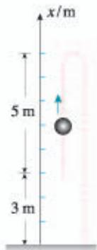  
图1.2-12

表 坚直向上抛出小球的坐标和位移

<table><tr><td>坐标原点</td><td>抛出点的坐标</td><td>最高点的坐标</td><td>落地点的坐标</td><td>从抛出点到最高点的位移</td><td>从最高点到落地点的位移</td><td>从抛出点到落地点的位移</td></tr><tr><td>地面</td><td></td><td></td><td></td><td></td><td></td><td></td></tr><tr><td>抛出点</td><td></td><td></td><td></td><td></td><td></td><td></td></tr></table>

## 3 位置变化快慢的描述——速度

## 问题

生活和科学研究中经常需要知道物体运动的快慢和方向，你还记得初中是怎样描述物体运动快慢的吗？运动员在比赛中的不同时段，运动的快慢一样吗？

## 速度

不同的运动，位置变化的快慢往往不同，也就是说，运动的快慢不同。我们已经用位移来表示位置的变化，那么，怎样比较物体运动的快慢呢？物理学中用位移与发生这段位移所用时间之比表示物体运动的快慢，这就是速度（velocity）。

▶ 这里的速度和初中所学的速度含义不完全相同。

速度通常用字母 $v$ 表示，如果在时间 $\Delta t$ 内物体的位移是 $\Delta x$ ，它的速度就可以表示为

$$
v = \frac {\Delta x}{\Delta t}
$$

在国际单位制中，速度的单位是米每秒，符号是 m/s 或 $m \cdot s^{-1}$ 。常用的单位还有千米每时（km/h 或 $km \cdot h^{-1}$ ）、厘米每秒（cm/s 或 $cm \cdot s^{-1}$ ）等。

速度是矢量，它既有大小，又有方向。速度 $v$ 的方向与时间 $\Delta t$ 内的位移 $\Delta x$ 的方向相同。

## 平均速度和瞬时速度

一般来说，物体在某一段时间内，运动的快慢通常是变化的。所以，由 $\frac{\Delta x}{\Delta t}$ 求得的速度v，表示的只是物体在时间 $\Delta t$ 内运动的平均快慢程度，叫作平均速度（average velocity）。

## 思考与讨论

平均速度描述物体在一段时间内运动的平均快慢程度及方向。那么，怎样描述物体在某一时刻运动的快慢和方向呢？

可以设想，用由时刻 t 到 $t + \Delta t$ 一小段时间内的平均速度来代替时刻 t 物体的速度，如果 $\Delta t$ 取得小一些，物体在 $\Delta t$ 这样一个较小的时间内，运动快慢的差异就不会太大。 $\Delta t$ 越小，运动快慢的差异就越小。当 $\Delta t$ 非常非常小时，运动快慢的差异可以忽略不计，此时，我们就把 $\frac{\Delta x}{\Delta t}$ 叫作物体在时刻 t 的瞬时速度（instantaneous velocity）。

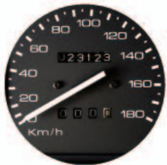  
图1.3-1 汽车速度计

匀速直线运动是瞬时速度保持不变的运动。在匀速直线运动中，平均速度与瞬时速度相等。

瞬时速度的大小通常叫作速率（speed）。汽车速度计不能显示车辆运动的方向，它的示数实际是汽车的速率（图1.3-1）。日常生活中说到的“速度”，有时是指速率，要根据上下文判断。

## 实验

## 测量纸带的平均速度和瞬时速度

测量平均速度 我们知道，用手拉通过打点计时器的纸带时，纸带运动确定时间内的位移信息就被记录下来，据此，可以计算纸带的运动速度。

图1.3-2是打点计时器打出的一条纸带示意图。若想计算实验时运动的纸带在 $D$ 、 $G$ 两点间的平均速度 $v$ ，只需测出 $D$ 、 $G$ 间的位移 $\Delta x$ 和所用的时间 $\Delta t$ ，就可以算出平均速度

$$
v = \frac {\Delta x}{\Delta t}
$$

请根据上述方法，计算上节实验中运动的纸带某些点间的平均速度。

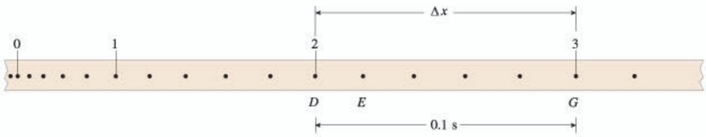  
图1.3-2 计算每隔 $0.1\mathrm{s}$ 的平均速度纸带示意图

每隔 0.1 s（或更短）计算一次平均速度。

1. 在图 1.3-2 中选取纸带上一点为起始点 0，后面每 5 个点取一个计数点，分别用数字 1, 2, 3, … 标出这些计数点；

2. 测量各计数点到起始点 0 的距离 x，记录在表 1 中；

3. 计算两相邻计数点间的位移 $\Delta x$ ，同时记录对应的时间 $\Delta t$ ;

4. 根据 $\Delta x$ 和 $\Delta t$ 计算纸带在相邻计数点间的平均速度 $v$ 。

表 1 手拉纸带的位移和平均速度

<table><tr><td>位置</td><td>0</td><td>1</td><td>2</td><td>3</td><td>4</td><td>...</td></tr><tr><td>x/m</td><td></td><td></td><td></td><td></td><td></td><td></td></tr><tr><td>Δx/m</td><td></td><td></td><td></td><td></td><td></td><td></td></tr><tr><td>Δt/s</td><td></td><td></td><td></td><td></td><td></td><td></td></tr><tr><td>v/(m·s-1)</td><td></td><td></td><td></td><td></td><td></td><td></td></tr></table>

测量瞬时速度 如何测量运动物体在某一时刻或某一位置（例如图1.3-2中 $E$ 点）的瞬时速度？

我们可以这样考虑：E 点在 D、G 两点之间，D、G 两点间的平均速度我们可以求出。如果不要求很精确，用这个平均速度粗略地代表 E 点的瞬时速度，也未尝不可。不过，如果把包含 E 点在内的间隔取得小一些，例如取图 1.3-3 中的 DF 线段，那么经过 D、F 两点所用的时间 $\Delta t$ 就会变短，用两点间的位移 $\Delta x$ 和时间 $\Delta t$ 算出的平均速度代表纸带在 E 点的瞬时速度，就会精确一些。D、F 两点离 E 点越近，算出的平均速度越接近 E 点的瞬时速度。

D、F两点间距离过小，测量误差会增大。所以，实际测量中要根据需要及所用仪器的情况，在要测量的点附近选取合适的位移和时间。请考虑此实验中产生误差的原因。

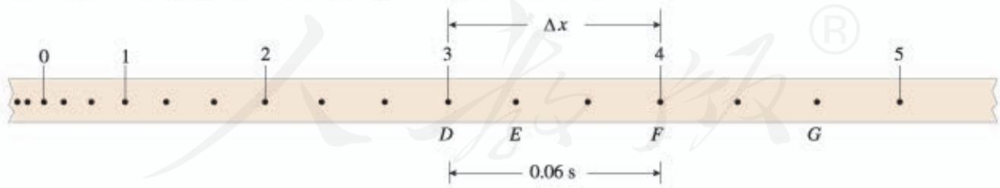  
图1.3-3 计算每隔 $0.06\mathrm{s}$ 的平均速度纸带示意图

请根据上述测量瞬时速度的方法，计算上节实验中纸带上各计数点的瞬时速度。每隔 $0.06\mathrm{s}$ 计算一次速度。

1. 从纸带起始点0算起，后面每3个点取一个计数点；

2. 测量各计数点到起始点0的距离 $x$ ，记录在表2中；

3. 计算两相邻计数点间的位移 $\Delta x$ ，同时记录对应的时间 $\Delta t$ ；

4. 根据 $\Delta x$ 和 $\Delta t$ 算出的速度值就可以代表在 $\Delta x$ 这一区间内任意一点的瞬时速度。将算出的各计数点的速度值记录在表2中。

表 2 手拉纸带各计数点的瞬时速度

<table><tr><td>位置</td><td>0</td><td>1</td><td>2</td><td>3</td><td>4</td><td>5</td><td>6</td><td>...</td></tr><tr><td> $x/\mathrm{m}$ </td><td></td><td></td><td></td><td></td><td></td><td></td><td></td><td></td></tr><tr><td> ${\Delta x}/\mathrm{m}$ </td><td></td><td></td><td></td><td></td><td></td><td></td><td></td><td></td></tr><tr><td> ${\Delta t}/\mathrm{s}$ </td><td></td><td></td><td></td><td></td><td></td><td></td><td></td><td></td></tr><tr><td> $v/\left( {\mathrm{m} \cdot {\mathrm{s}}^{-1}}\right)$ </td><td></td><td></td><td></td><td></td><td></td><td></td><td></td><td></td></tr></table>

## 速度—时间图像

物体运动的速度随时间变化的情况可以用图像来直观表示。以时间 $t$ 为横轴，速度 $v$ 为纵轴，坐标系中的图像即为速度一时间图像或 $v - t$ 图像。

在方格纸上建立直角坐标系，根据自己算出的手拉纸带的 v、t 数据，在坐标系中描点，练习画 v-t 图像。

图 1.3-4 甲是根据某同学的实测数据所描的点，从这些点的走向能够大致看出纸带运动速度的变化规律。为了更清晰些，可以用折线把这些点连起来（图 1.3-4 乙）。然而我们知道，通常速度不会发生突变，所以，如果用一条平滑的曲线来描出这些点，曲线所反映的情况就会与实际更加接近（图 1.3-4 丙）。

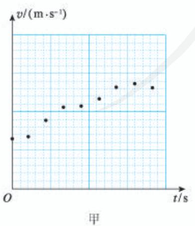

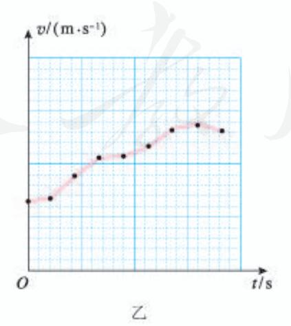  
图1.3-4 某同学手拉纸带运动的 $v - t$ 图像

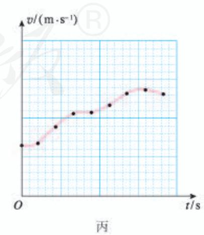

## 借助传感器与计算机测速度

随着信息技术的发展，中学物理的实验手段也在不断进步。用“位移传感器”把物体运动的位移、时间转换成电信号，经过计算机的处理，可以立刻在屏幕上显示物体运动的速度，自动绘制出物体运动的v-t图像（图1.3-5）。这样，同学们就可以用更多的时间和精力对物理过程进行分析。

图1.3-6是利用位移传感器测量速度的示意图。这个系统由发射器A与接收器B组成，发射器A能够发射红外线和超声波信号，接收器B可以接收红外线和超声波信号。发射器A固定在被测的运动物体上，接收器B固定在桌面上或滑轨上。测量时A向B同时发射一个红外线脉冲和一个超声波脉冲（即持续时间很短的一束红外线和一束超声波）。B接收到红外线脉冲开始计时，接收到超声波脉冲时停止计时。根据两者的时差和空气中的声速，计算机自动算出A与B的距离（红外线的传播时间可以忽略）。

经过短暂的时间 $\Delta t$ 后，传感器和计算机系统自动进行第二次测量，得到物体的新位置。算出两个位置差，即物体运动的位移 $\Delta x$ ，系统按照

$$
v = \frac {\Delta x}{\Delta t}
$$

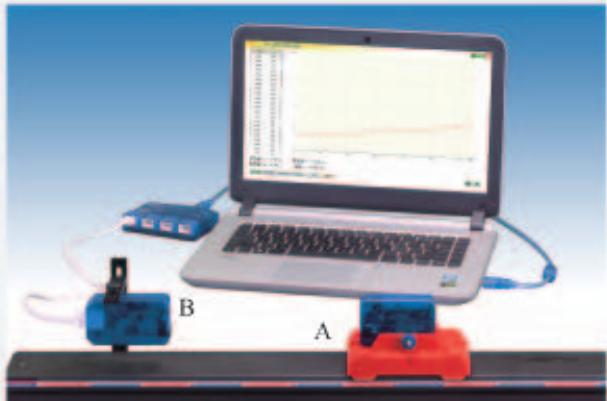  
图 1.3-5 实验室用位移传感器测速度的装置

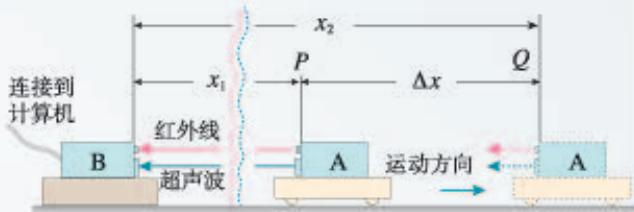  
图1.3-6 位移传感器测速度的原理

算出速度v，显示在屏幕上。所有这些操作都可以在不到1s的时间内自动完成。

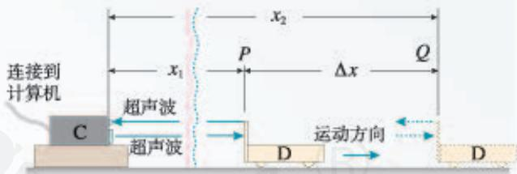  
图1.3-7 另一种位移传感器测速度的原理

这样测出的速度是发射器A在时间 $\Delta t$ 内的平均速度。然而 $\Delta t$ 很短，通常设置为 $0.02\mathrm{s}$ ，所以 $\Delta x$ 与 $\Delta t$ 之比可以代表此刻发射器A（即运动物体）的瞬时速度。

还有另外一种位移传感器，如图1.3-7所示。这个系统只有一个不动的小盒C，工作时小盒C向被测物体D发出短暂的超声波脉冲，脉冲被运动物体反射后又被小盒C接收。根据发射与接收超声波脉冲的时间差和空气中的声速，可以得到小盒C与运动物体D的距离 $x_{1}$ 、 $x_{2}$ 以及 $\Delta x$ 和 $\Delta t$ ，从而系统也能算出运动物体D的速度v。

1. 把纸带的下端固定在重物上，纸带穿过打点计时器，上端用手提着。接通电源后将纸带释放，重物便拉着纸带下落，纸带被打出一系列点，其中有一段如图1.3-8所示。

  
图1.3-8

(1) 图中所示的纸带，哪端与重物相连？

（2）怎样计算在纸带上打A点时重物的瞬时速度？说出你的理由。

2. 图1.3-9是甲、乙两物体沿某一直线运动的 $v - t$ 图像，至少从以下三个方面分别说明它们的速度是怎样变化的。

(1) 物体是从静止开始运动还是具有一定的初速度?

(2) 速度的大小变化吗？是加速还是减速？

(3) 运动的方向是否变化?

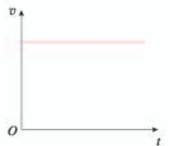  
甲

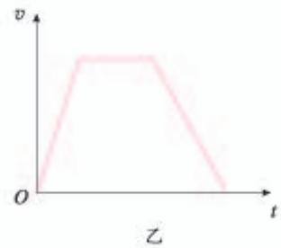  
图1.3-9

3. 汽车从制动到停止共用了5 s。这段时间内，汽车每1 s前进的距离分别是9 m、7 m、5 m、3 m、1 m（图1.3-10）。

(1) 求汽车前 $1 \mathrm{~s}$ 、前 $2 \mathrm{~s}$ 、前 $3 \mathrm{~s}$ 、前 $4 \mathrm{~s}$ 和全程的平均速度。在这五个平均速度中，哪一个最接近汽车刚制动时的瞬时速度？它比这个瞬时速度略大些，还是略小些？

(2) 汽车运动的最后2s的平均速度是多少?

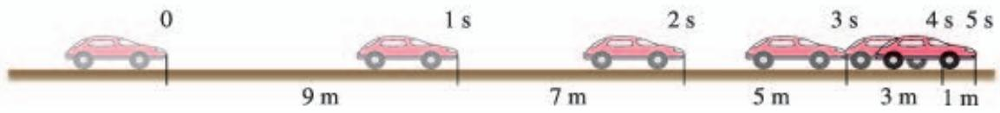  
图1.3-10

## 4 速度变化快慢的描述——加速度

## 问题

一辆小汽车在10 s内，速度从0达到100 km/h，一列火车在300 s内速度也从0达到100 km/h。虽然汽车和火车速度都从0达到100 km/h，但是它们的运动情况显然不同。你觉得用“速度大”或“速度变化大”能描述这种不同吗？如果不能，应该怎样描述呢？

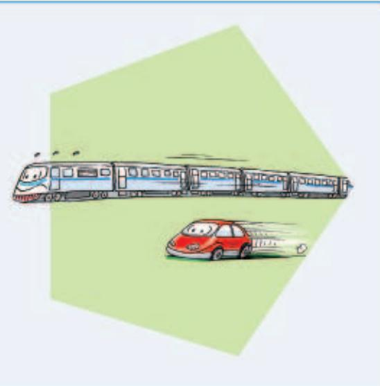

## 加速度

小汽车和火车的速度都在增加，或者说两者都在做变速运动，并且它们的“速度变化”相同，但所用的时间不同。这两种情形的本质区别是“速度变化的快慢”不同。看来“速度变化的快慢”是一个不同于“速度”的概念。

两个物体速度变化相同，所用时间短的当然速度变化得快。如果两个物体速度变化不同，所用时间也不同，怎样比较它们速度变化的快慢呢？

在学习速度时我们知道，位移表示的是位置的变化。要比较位置变化的快慢，可以用位移除以时间。同理，要比较速度变化的快慢，可以用速度的变化量除以时间。

物理学中把速度的变化量与发生这一变化所用时间之比，叫作加速度（acceleration）。通常用 a 表示。若用 $\Delta v$ 表示速度在时间 $\Delta t$ 内的变化量，则有

$$
a = \frac {\Delta v}{\Delta t}
$$

在国际单位制中，加速度的单位是米每二次方秒，符号是 $m/s^{2}$ 或 $m\cdot s^{-2}$ 。加速度是矢量，它既有大小，也有方向。现在讨论做直线运动的物体加速度的方向。

在这里，我们用两个物理量（速度的变化量和时间）之比定义了一个新的物理量——加速度，它的物理意义与原来的两个物理量不同。用物理量之比定义新的物理量是物理学中常用的方法。

## 加速度的方向

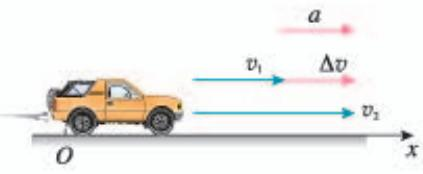  
甲 速度增加时的情况

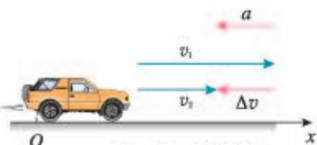  
乙 速度减小时的情况  
图1.4-1 加速度方向与速度方向的关系示意图

如图1.4-1，汽车原来的速度是 $v_{1}$ ，经过一小段时间 $\Delta t$ 之后，速度变为 $v_{2}$ 。为了在图中表示加速度，我们以原来的速度 $v_{1}$ 的箭头端为起点，以后来的速度 $v_{2}$ 的箭头端为终点，作出一个新的有向线段，它就表示速度的变化量 $\Delta v$ 。由于加速度 $a = \frac{\Delta v}{\Delta t}$ ，所以加速度 $a$ 的方向与速度的变化量 $\Delta v$ 的方向相同。确定了 $\Delta v$ 的方向，也就确定了加速度 $a$ 的方向。

从图中可以看出，汽车在直线运动中，如果速度增加，即加速运动，加速度的方向与初速度的方向相同；如果速度减小，即减速运动，加速度的方向与初速度的方向相反。

## 思考与讨论

对运动的物体而言，可以问“它运动了多远”，这是路程或位移的概念；也可以问“它运动得多快”，这是速度的概念。然而，在生活用语中，却没有与加速度对应的词语。

日常生活中一般只有笼统的“快”和“慢”，这里有时指的是速度，有时模模糊糊地指的是加速度。你能分别举出这样的例子吗？

## 从 $v - t$ 图像看加速度

v-t 图像反映的是物体的速度随时间变化的情况。你认为由 v-t 图像能知道物体的加速度吗？

图1.4-2中的两条直线 $a$ 、 $b$ 分别是两个物体A和B运动的 $v - t$ 图像。 $E$ 、 $F$ 两点所表示的时刻和速度分别为 $t_1$ 、 $t_2$ 和 $v_{1}$ 、 $v_{2}$ 。从图中可以看出，小三角形的一条直角边代表时间间隔 $\Delta t$ ，另一条直角边代表速度的变化量 $\Delta v$ ， $\Delta v$ 与 $\Delta t$ 的比为加速度，其比值为该直线的斜率。因此，由 v-t 图像中图线的倾斜程度可以判断加速度的大小。物体 A 的加速度比物体 B 的大。

生活中做变速运动的物体很多，它们加速度的大小也各不相同，有时差异还很大。下表为一些运动物体的加速度。

表 一些运动物体的加速度（近似值）  
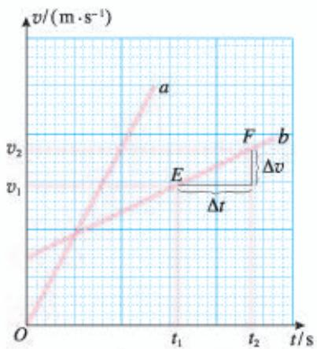

<table><tr><td>运动物体</td><td> $a/(m·s^{-2})$ </td><td>运动物体</td><td> $a/(m·s^{-2})$ </td></tr><tr><td>子弹在枪筒中</td><td> $5×10^{4}$ </td><td>赛车起步</td><td>4.5</td></tr><tr><td>伞兵着陆</td><td>-25</td><td>汽车起步</td><td>2</td></tr><tr><td>汽车急刹车</td><td>-5</td><td>高铁起步</td><td>0.35</td></tr></table>

图1.4-2 从 $v - t$ 图像看物体的加速度

## 科学漫步

## 变化率

番茄在成熟的过程中，它的大小、含糖量等会随时间变化；树木在成长过程中，它的高度、树干的直径会随时间变化；河流、湖泊的水位会随时间变化；某种商品的价格会随时间变化；我国的人口生育量也会随时间变化……这些变化，有时快、有时慢。描述变化快慢的量就是变化率。

自然界中某量 $D$ 的变化可以记为 $\Delta D$ ，发生这个变化所用的时间间隔可以记为 $\Delta t$ ；当 $\Delta t$ 极小时，变化量 $\Delta D$ 与 $\Delta t$ 之比就是这个量对时间的变化率，简称变化率。显然，变化率在描述各种变化过程时起着非常重要的作用，速度和加速度就是两个很好的例子。

生活中还有哪些实例与变化率相关？例如飞机起飞时，在同样的时间间隔内，飞机的位移不断增大（图1.4-3）。

某个量大，不表示它的变化率大。速度大，加速度不一定大。例如匀速飞行的高空侦察机，尽管它的速度可能接近 $1000\mathrm{m / s}$ ，但它的加速度为0。相反，速度小，加速度也可以很大。例如枪筒里的子弹，在开始运动时，尽管子弹的速度接近0，但它的加速度可以达到 $5\times 10^{4}\mathrm{m / s}^{2}$ 。

  
图1.4-3 在同一底片上相隔同样时间多次曝光“拍摄”的飞机起飞时的照片（合成照片）

人类自发明木轮车（图1.4-4）直到制成速度 $500\mathrm{km / h}$ 的磁悬浮列车，以及超音速飞机，为了获得高速交通工具，奋斗了几千年。从某种意义上说，在人类发明的各种机械中，交通工具最深刻地改变了我们的生活。我们所用的物品，几乎没有一件不是由铁路或公路运输而来的。不难想象，如果没有了火车和汽车，现代社会将会瘫痪。

交通工具与社会发展  
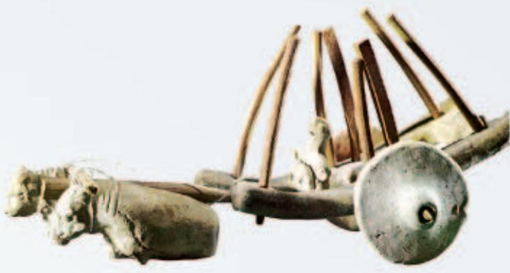  
图 1.4-4 公元前 2000 年印度河谷哈拉巴人所用的车辆的泥塑模型

从世界各国的城市发展史上看，大城市规模的大小与车速的提高密切相关。大城市的直径一般就是当时最快的交通工具在1 h内行走的距离。以北京为例，清朝末年北京的“内城”大约是一个边长5 km的正方形，马车的速度大约就是5 km/h；今天，有了发达的公路系统，有了快速轨道交通，汽车、地铁的速度大约是几十千米每时，北京城区的直径也扩大到了几十千米。

城市中的车速不能无限提高，城市的规模也就不能无限扩大。“摊大饼”式的城市规划可能带来以交通问题为主的许多矛盾。目前许多人认为，合理的发展模式是建立中心市区与卫星城组成的城市群。

运兵工具和武器运载工具的发展改变了战争的面貌。现代战争的“战场”已经与过去的意义完全不同。相距几千千米、几万千米的敌对力量之间很短时间内就能爆发大规模战争。空中打击的力量大大加强，过去的一些战术方法已经不再适用。由于车辆的使用，部队的机动性大大提高，速战速决的战争理论有所发展。

交通网络的形成大大缩短了不同地域的时空距离，促进了国与国、民族与民族之间的物资交流和人员往来。贸易上的互补，可以优化物质资源和人力资源的配置，促进世界经济的发展。不同文化的交融进一步促进了社会的进步。

然而，大量汽车带来了交通堵塞、频繁的事故、能源的过度消耗、尾气与噪声污染等一系列社会问题。这些不仅妨碍了人们的工作和生活，而且制约着社会经济的进一步发展。

如何处理这些矛盾，一直是人们努力探索的课题。随着可持续发展战略的实施，人们对发展交通的意义有了新的认识，采取了许多有效的措施。例如，研制各种绿色汽车（使用压缩天然气或液化石油气的汽车、太阳能车、电动车……），对现有汽车的使用在时间和道路上进行限制，根据城市规模发展地上、地下快速的立体化交通和轨道交通。

讨论：交通工具的速度是不是越快越好？

1. 小型轿车从静止开始加速到 $100 \mathrm{~km} / \mathrm{h}$ 所用的最短时间, 是反映汽车性能的重要参数。A、B、C三种型号的轿车实测的结果分别为 $11.3 \mathrm{~s} 、 13.2 \mathrm{~s} 、 15.5 \mathrm{~s}$ , 分别计算它们在测试时的加速度有多大。

2. 有没有符合下列说法的实例？若有，请举例。

A. 物体运动的加速度等于0，而速度却不等于0；

B. 两物体相比，一个物体的速度变化量比较大，而加速度却比较小；

C. 物体具有向东的加速度，而速度的方向却向西；

D. 物体做直线运动，后一阶段的加速度比前一阶段小，但速度却比前一阶段大。

3. 以下描述了四个不同的运动过程。

A. 一架超音速飞机以 $500 \mathrm{~m} / \mathrm{s}$ 的速度在天空沿直线匀速飞行了 $10 \mathrm{~s}$ ;

B. 一辆自行车以 $3 \, m/s$ 的速度从某一陡坡的顶端加速冲下，经过 $3 \, s$ 到达坡路底端时，速度变为 $12 \, m/s$ ;

C. 一只蜗牛由静止开始爬行，经过0.2 s，获得了0.002 m/s的速度（图1.4-5）；

D. 一列动车在离开车站加速行驶中，用了100 s使速度由72 km/h增加到144 km/h。

（1）以上四个运动过程，哪个过程速度最大？请按速度的数值把它们由大到小排列。

（2）以上四个运动过程，哪个过程速度的变化量最大？请按速度变化量的数值把它们由大到小排列。

（3）以上四个运动过程，哪个过程加速度最大？请按加速度的数值把它们由大到小排列。

4. 一个物体在水平面上向东运动，某时刻速度大小为 $20 \mathrm{~m} / \mathrm{s}$ ，然后开始减速， $2 \mathrm{~min}$ 后该物体的速度减小为0。求物体的加速度大小及方向。

5. 图1.4-6中的三条直线 $a$ 、 $b$ 、 $c$ 描述了A、B、C三个物体的运动。先初步判断一下哪个物体的加速度最大，再根据图中的数据计算它们的加速度，并说明加速度的方向。

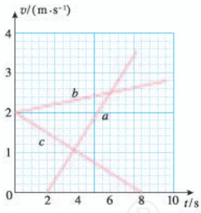  
图1.4-6

## 章小结示例

学习是一个不断探究、积累和总结的过程。学习的每一阶段都应该适时地总结，把学到的知识、方法、过程和体会等及时地加以梳理，以便更好地理解和把握。

总结会有不同的方法，比如，语言归纳、框图和概念图等方法。下面给出了某位同学在学习过本章后作出的小结，请根据自己的体会，把你认为不够完整以及没有完成的地方加以完善。

以后每学习完一章，请你用自己擅长的方法对这一章进行小结，写出自己的学习心得。

## 概念梳理

运动的描述
研究运动的两个基本概念
质 点（研究对象的理想模型）
参考系（观察运动的参照物体）
描述运动的三个物理量
位 移（位置的变化）
速 度（位置的变化率）
加速度（速度的变化率）

## 研究方法

知道了质点模型的抽象条件及意义。如果物体的形状和体积对问题的研究不影响或影响可忽略时，可以把物体看成质点。质点是一种理想模型，建立物理模型的思想对解决实际问题非常重要。

了解了极限思维方法。能体会在极短的时间或位移中，质点的平均速度可以看成它在此时刻或此位置的瞬时速度的思维方法。

学会了用图像描述运动。图像可以描述质点的运动。v-t 图像可以反映速度的变化规律，图像的斜率反映加速度的大小和方向。

......

## 实验工具

可用打点计时器研究物体的运动。打点计时器在纸带上打出的点迹，不仅记录了时间信息，而且记录了打点时间间隔内与纸带连接物体的运动位移。用打点计时器可以测量物体的平均速度和瞬时速度。

......

## ● 态度责任

认识到物理研究需要对物理现象（如运动）进行客观描述；体会到只有如实记录实验数据，才能真实反映现象，得到有价值的研究结果；通过小组实验，感受到科学研究需要团队合作。

• • • • • •

## A组

1. 以下情景中，哪些带下划线的物体可看成质点，哪些不能看成质点？将结果填入括号内。

（1）小敏观察蚂蚁拖动饭粒时，蚂蚁的肢体是如何分工的。（）

（2）小英测算蚂蚁拖动饭粒时，蚂蚁1 min爬行的路程。 （）

（3）在跳水比赛中，裁判员给跳水运动员评分。 （）

（4）教练在训练中观察跳高运动员的跳高过程。 （）

2. 图1-1是特技跳伞运动员的空中造型图。当运动员们保持该造型向下落时，若其中某一位运动员以对面的运动员为参考系，则他自己的运动情况怎样？当他俯视大地时，看到大地迎面而来，他是以什么物体为参考系的？

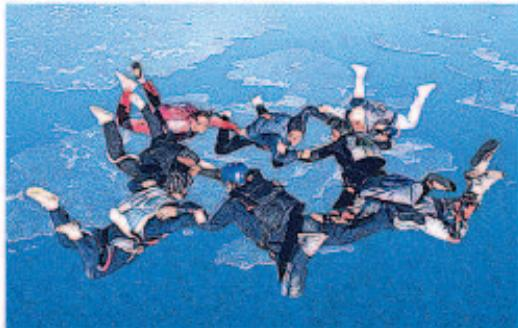  
图1-1

3. 以下对话，其含义是指时刻还是指时间间隔？写在括号内。

问：这车什么时候开？ （）

答：过一会儿就要开了。 （）

问：我离开一下，10min就赶回来，行不？（）

答：你不能晚过车票上的开车时间。（）

4. 关于位移和路程，下列四位同学的说法是否正确？如果不正确，错在哪里？

同学甲：位移和路程在大小上总相等，只是位移有方向，是矢量，路程无方向，是标量。

同学乙：位移用来描述直线运动，路程用来描述曲线运动。

同学丙：位移是矢量，它取决于物体的始末位置；路程是标量，它取决于物体实际通过的路线。

同学丁：其实，位移和路程是一回事。

5. 一辆汽车沿直线从甲地开往乙地，前一半位移内的平均速度为 $30 \mathrm{~km} / \mathrm{h}$ ，后一半位移内的平均速度是 $60 \mathrm{~km} / \mathrm{h}$ ，这辆汽车全程的平均速度是多少？

6. 在台球比赛中，某球以 $1.5 \, m/s$ 的速度垂直撞击边框后，以 $1.3 \, m/s$ 的速度反向弹回，球与边框接触的时间 $\Delta t$ 为 $0.08 \, s$ ，求该撞击过程中球的加速度。

7. 以下是三种交通工具在某段时间中的运动记录。

表 三种交通工具的运动记录

<table><tr><td>交通工具</td><td>初速度 /(m·s-1)</td><td>经过时间 /s</td><td>末速度 /(m·s-1)</td></tr><tr><td>自行车下坡</td><td>2</td><td>2</td><td>6</td></tr><tr><td>火车出站</td><td>0</td><td>100</td><td>20</td></tr><tr><td>飞机飞行</td><td>200</td><td>10</td><td>200</td></tr></table>

（1）以上有没有速度大而加速度小的情况？如果有，请列举。

（2）以上有没有速度变化量大而加速度小的情况？

## B组

1. 小李讲了龟兔沿直线赛道赛跑的故事，故事情节中兔子和乌龟运动的x-t图像如图1-2所示。请你依照图像中的坐标，并结合物理学的术语来讲述这个故事。在讲故事之前，先回答下列问题：

（1）故事中的兔子和乌龟是否在同一地点同时出发？

(2) 乌龟做的是什么运动?

（3）兔子和乌龟在比赛途中相遇过几次？

(4) 哪一个先通过预定位移到达终点?

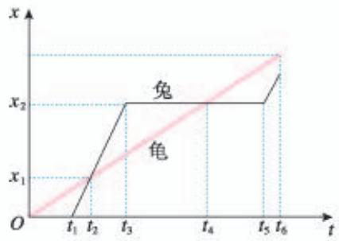  
图1-2

2. 图1-3是某物体做直线运动的x-t图像，请说明x-t图像中每段运动过程的速度大小和方向，并作出v-t图像，描述相应过程。

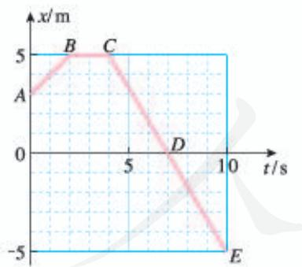  
图1-3

3. 某物体做直线运动，它的 $v - t$ 图像如图1-4所示。设向东为速度 $v$ 坐标轴的正方向。

（1）请说出物体在第1s、第2s、第3s时间内的运动方向。在3 s时间内的速度大小怎样变化？

（2）请说出物体在第1 s、第2 s、第3 s时间内的加速度大小和方向。

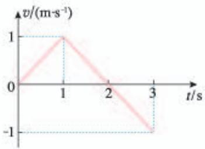  
图1-4

4. 为了测定气垫导轨上滑块的加速度，滑块上安装了宽度为 $2.0 \mathrm{~cm}$ 的遮光条。如图1-5，滑块在牵引力作用下先后通过两个光电门，配套的数字计时器记录了遮光条通过第一个光电门的时间 $\Delta t_{1}$ 为 $0.20 \mathrm{~s}$ ，通过第二个光电门的时间 $\Delta t_{2}$ 为 $0.05 \mathrm{~s}$ ，遮光条从开始遮住第一个光电门到开始遮住第二个光电门的时间 $t$ 为 $2.5 \mathrm{~s}$ ，试估算滑块的加速度。

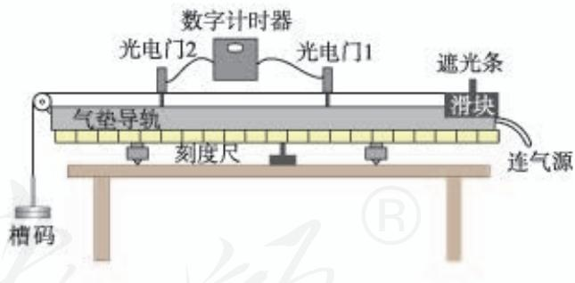  
图1-5

5. 某电梯从3楼出发，下降至2楼略停后继续下降到1楼，随后又载人上升至2楼停下。请大致绘出该电梯在这段时间内的v-t图像。设向下为速度v坐标轴的正方向。

## 第二章 匀变速直线运动的研究

世界上第一条商业运行的磁悬浮列车——“上海磁浮”，已于2003年10月1日正式运营。据报道，上海磁浮线路总长 $33 \mathrm{~km}$ ，一次试车时全程行驶了约 $7 \mathrm{~min} 30 \mathrm{~s}$ ，其中以 $430 \mathrm{~km/h}$ 的最高速度行驶约 $30 \mathrm{~s}$ 。磁悬浮列车的行驶速度比汽车快得多，是不是它的加速度也会很大？

学过这一章后请你根据报纸上的数据，再按照实际情况给出一些简化的假设，自己尝试着估算它的加速度。

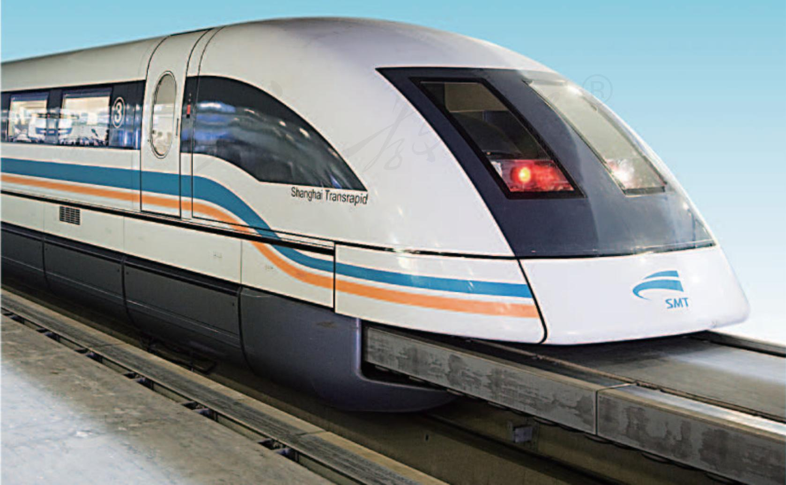

——普朗克 $^{①}$

# 1 实验: 探究小车速度随时间变化的规律

寻求一种运动的特点和规律，一般要从某个具体事例开始。这一节我们研究小车在重物牵引下的运动，看看小车的速度是怎样随时间变化的。

## 实验思路

要研究小车在重物牵引下速度随时间变化的规律，你认为如何设计此实验？需要测量哪些物理量？选用什么器材？请你把自己研究的方案写出来，并和同学交流。

要研究小车速度随时间变化的规律，就要想办法测量小车在不同时刻的瞬时速度，而打点计时器具有此功能。如果用打点计时器测量速度，就可以如图2.1-1所示，把一端带有滑轮的长木板平放在实验桌上，木板上放一个可以左右移动的小车，小车一端连接穿过打点计时器的纸带，另一端连接绕过滑轮系有槽码的细绳。小车在槽码的牵引下运动，通过研究纸带上的信息，就可以知道小车运动的速度是怎样随时间变化的。

## 进行实验

把小车停在靠近打点计时器的位置。启动计时器，然后放开小车，让它拖着纸带运动。于是，打点计时器在纸带上打下一行小点。随后，立即关闭电源。

增减所挂的槽码（或在小车上放置重物），更换纸带，再做两次实验。

## 数据记录

为了便于测量，舍掉纸带开头一些过于密集的点，找一个适当的点作为计时起点。

可选择相隔0.1 s（或更短）的若干计数点进行测量，记入自己设计的表格，利用第一章第3节所学的方法得出各计数点的瞬时速度，填入表1中标有“ $v_{1}$ ”的一行。

同理，计算增减槽码后两次实验的速度，分别填入表1中标有“ $v_{2}$ ”和“ $v_{3}$ ”的两行内。

表 1 小车在几个时刻的瞬时速度

<table><tr><td>位置编号</td><td>0</td><td>1</td><td>2</td><td>3</td><td>4</td><td>5</td><td>6</td><td>...</td></tr><tr><td>时间 $t/\mathrm{s}$ </td><td>0</td><td>0.1</td><td>0.2</td><td>0.3</td><td>0.4</td><td>0.5</td><td>0.6</td><td></td></tr><tr><td> ${v}_{1}/\left( {\mathrm{m} \cdot {\mathrm{s}}^{-1}}\right)$ </td><td></td><td></td><td></td><td></td><td></td><td></td><td></td><td></td></tr><tr><td> ${v}_{2}/\left( {\mathrm{m} \cdot {\mathrm{s}}^{-1}}\right)$ </td><td></td><td></td><td></td><td></td><td></td><td></td><td></td><td></td></tr><tr><td> ${v}_{3}/\left( {\mathrm{m} \cdot {\mathrm{s}}^{-1}}\right)$ </td><td></td><td></td><td></td><td></td><td></td><td></td><td></td><td></td></tr><tr><td>...</td><td></td><td></td><td></td><td></td><td></td><td></td><td></td><td></td></tr></table>

## 数据分析

你能否从表格中的数据看出小车速度随时间变化的定量关系？如果不能，怎么办？

可以考虑用 $v - t$ 图像分析速度 $v$ 与时间 $t$ 的定量关系。以时间 $t$ 为横轴、速度 $v$ 为纵轴建立直角坐标系。根据表1中的 $v, t$ 数据，在坐标系中描点作出 $v - t$ 图像。如何根据描出的点找出速度随时间变化的规律？

▶ 如果有些点难以落在曲线上，应该使它们大致均匀地分布在曲线两侧。这样曲线就更符合实际的规律。

## 做一做

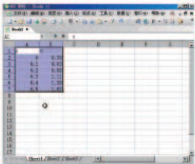

图2.1-2  
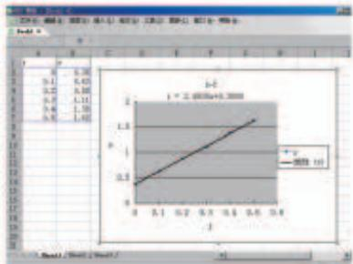  
图2.1-3

## 用计算机绘制 $v - t$ 图像

借助常用的数表软件，可以迅速、准确地根据表中的数据作出 $v - t$ 图像，甚至能够写出图像所代表的公式。下面以WPS表格软件为例作简要说明，有兴趣的同学可以试一试。

在 WPS 表格软件工作簿的某一列的单元格中依次输入测量时间，在相邻的一列输入对应的速度值（图 2.1-2）。用鼠标选中这些数据，按照“插入”中的“图表”的提示就能一步步地得到所画的图像（图 2.1-3）。

操作过程中 WPS 会要求确定 “图表类型”，这时可以选择 “平滑散点图”；还会出现 “添加趋势线” 的对话框，里面也有一个 “类型” 标签，其中有几种可选择的函数。由于我们这个实验的数据几乎分布在一条直线上，所以应该选择 “线性” 类型。

## 练习与应用

1. 为研究实验小车沿斜面向下运动的规律，把打点计时器纸带的一端固定在小车上，小车拖动纸带运动时，纸带上打出的点如图2.1-4所示。

（1）某同学用以下方法绘制了小车运动的v-t图像。先把纸带每隔0.1s剪断，得到若干短纸条。再把这些纸条并排贴在一张纸上，使这些纸条下端对齐，作为时间坐标轴，标出时间。最后将纸条上端中心连起来，于是得到v-t图像。请你按以上办法（用一张薄纸压在图2.1-4上，复制得到纸带）绘制这个v-t图像。

(2) 这样做有道理吗？说说你的看法。

  
图2.1-4 一次实验的纸带

2. 列车沿长直坡路向下行驶。开始时速度表上的示数是54 km/h，以后每5 s读取一次数据，见表2。

（1）在表2中填写以 $m\cdot s^{-1}$ 为单位表示的速度值。

（2）作出列车速度与时间关系的 $v - t$ 图像。

表 2 列车速度表

<table><tr><td>时间t/s</td><td>0</td><td>5</td><td>10</td><td>15</td><td>20</td><td>25</td><td>30</td></tr><tr><td>速度v/(km·h-1)</td><td>54</td><td>59</td><td>65</td><td>70</td><td>76</td><td>81</td><td>86</td></tr><tr><td>速度v/(m·s-1)</td><td></td><td></td><td></td><td></td><td></td><td></td><td></td></tr></table>

## 2 匀变速直线运动的速度与时间的关系

## 问题

如果 C919 飞机沿直线做匀速运动，它的 v-t 图像是一条平行于时间轴的直线。在上节课的实验中，小车在重物牵引下运动的 v-t 图像是一条倾斜的直线，它表示小车在做什么样的运动？

## 匀变速直线运动

由上节课的实验我们看到，小车运动的v-t图像类似于图2.2-1所示的v-t图像，是一条倾斜的直线。无论 $\Delta t$ 选在什么区间，对应的速度的变化量 $\Delta v$ 与时间的变化量 $\Delta t$ 之比都是一样的，即物体运动的加速度保持不变。所以，实验中小车的运动是加速度不变的运动。沿着一条直线，且加速度不变的运动，叫作匀变速直线运动（uniform variable rectilinear motion）。匀变速直线运动的v-t图像是一条倾斜的直线。

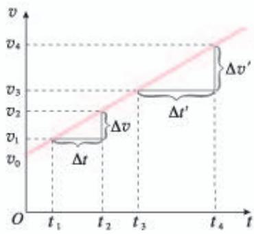  
图2.2-1 匀变速直线运动的 $v - t$ 图像

在匀变速直线运动中，如果物体的速度随时间均匀增加，这种运动叫作匀加速直线运动；如果物体的速度随时间均匀减小，这种运动叫作匀减速直线运动。

## 速度与时间的关系

除v-t图像外，我们还可以用公式描述物体运动的速度与时间的关系。

对于匀变速直线运动来说，我们可以把运动开始时刻取作0时刻，则由0时刻到t时刻的时间间隔 $\Delta t$ 为t，而t时刻的速度v与开始时刻的速度 $v_{0}$ （叫作初速度）之差就是速度的变化量，即

由于加速度 a 在数值上等于单位时间内速度的变化量, 所以 at 就是 t 时间内速度的变化量, 再加上运动开始时物体的速度, 就得到 t 时刻物体的速度。

$$
\Delta v = v - v _ {0}
$$

代入 $a = \frac{\Delta v}{\Delta t}$ 中，得到

$$
v = v _ {0} + a t
$$

这就是匀变速直线运动的速度与时间的关系式。

## 【例题】

一辆汽车以 $36 \, km/h$ 的速度在平直公路上匀速行驶。从某时刻起，它以 $0.6 \, m/s^{2}$ 的加速度加速，10 s 末因故突然紧急刹车，随后汽车停了下来。刹车时做匀减速运动的加速度大小是 $6 \, m/s^{2}$ 。

(1) 汽车在 10 s 末的速度是多少?

(2) 汽车从刹车到停下来用了多长时间?

分析 依题意，汽车加速和减速过程都是在做匀变速直线运动。

第（1）问是已知加速的时间求末速度。

第（2）问是已知末速度求减速的时间。两个问题都需要用匀变速直线运动的速度与时间关系式来求解。其中，第（2）问汽车加速度的方向跟速度、位移的方向相反，需要建立坐标系处理物理量之间的正负号问题。

解（1）汽车做匀加速直线运动。

初速度 $v_{0}=36\ km/h=10\ m/s$ ，加速度 $a=0.6\ m/s^{2}$ ，时间t=10s。

根据匀变速直线运动速度与时间的关系式，有

$$
v = v _ {0} + a t = 1 0 \mathrm{m/s} + 0. 6 \mathrm {m/ s ^ {2}} \times 1 0 \mathrm{s} = 1 6 \mathrm{m/s}
$$

（2）以汽车运动方向为正方向建立一维坐标系（图 2.2-2），与正方向一致的量取正号，相反的取负号。

汽车从第 10 s 末开始做匀减速直线运动，因此初速度 $v_{0} = 16 \, m/s$ ，末速度 v = 0，加速度 $a = -6 \, m/s^{2}$ 。

根据 $v = v_{0} + at$ 得

$$
t = \frac {v - v _ {0}}{a} = \frac {0 - 1 6 \mathrm{m/s}}{- 6 \mathrm {m/ s^ {2}}} = 2. 6 7 \mathrm{s}
$$

汽车 10 s 末的速度为 16 m/s，从刹车到停下来要用 2.67 s。

  
图2.2-2

## 思考与讨论

图2.2-3是一个物体运动的 $v - t$ 图像。它的速度怎样变化？在相等的时间间隔内，即 $\Delta t' = \Delta t$ 时，速度的变化量 $\Delta v^{\prime}$ 和 $\Delta v$ 总是相等的吗？物体在做匀变速运动吗？

## 练习与应用

1. 列车原来的速度是 36 km/h，在一段下坡路上加速度为 $0.2 \, m/s^{2}$ 。列车行驶到下坡路末端时，速度增加到 54 km/h。求列车通过这段下坡路所用的时间。

2. 以 $72 \mathrm{~km} / \mathrm{h}$ 的速度行驶的列车在驶近一座石拱桥时做匀减速直线运动（图2.2-4），加速度的大小是 $0.1 \mathrm{~m} / \mathrm{s}^{2}$ ，列车减速行驶 $2 \mathrm{~min}$ 后的速度是多少？

  
图2.2-4

3. 2015年12月14日，嫦娥三号登月探测器平稳落月（图2.2-5），中国首次地外天体软着陆成功。当它靠近月球后，先悬停在月面上方一定高度，之后关闭发动机，以 $1.6\mathrm{m} / \mathrm{s}^2$ 的加速度下落，经过 $2.25\mathrm{s}$ 到达月面，此时探测器的速度是多少？

  
图2.2-3

4. 一个物体沿着直线运动，其 v-t 图像如图 2.2-6 所示。

（1）它在1s末、4s末、7s末三个时刻的速度，哪个最大？哪个最小？

（2）它在1s末、4s末、7s末三个时刻的速度方向是否相同？

（3）它在1s末、4s末、7s末三个时刻的加速度，哪个最大？哪个最小？

（4）它在1s末和7s末的加速度方向是否相同？

  
图2.2-6

# 3 匀变速直线运动的位移与时间的关系

## 问题

由做匀速直线运动物体的v-t图像可以看出，在时间t内的位移x对应图中着色部分的矩形面积。

那么，做匀变速直线运动的物体，在时间t内的位移与时间会有怎样的关系？

## 匀变速直线运动的位移

  
图2.3-1 利用 $v - t$ 图像求位移

做匀速直线运动物体的位移可以通过它的 v-t 图像求解。这个方法，对分析匀变速直线运动的位移问题有很好的启示。

图 2.3-1 是某物体做匀变速直线运动的 v-t 图像，初速度为 $v_{0}$ ，加速度为 a。做匀变速直线运动的物体，其位移大小可以用 v-t 图像中着色部分的梯形面积来表示（证明见本节“拓展学习”栏目）。

根据图中着色梯形各线段所代表的物理含义以及梯形的面积公式，可以求得位移

$$
x = \frac {1}{2} (v _ {0} + v) t
$$

将 $v = v_{0} + at$ 代入上式，有

$$
x = v _ {0} t + \frac {1}{2} a t ^ {2}
$$

这就是匀变速直线运动位移与时间的关系式 $^{①}$ 。如果初速度为0，这个公式可以简化为 $x=\frac{1}{2}at^{2}$ 。

【例题1】

航空母舰的舰载机既要在航母上起飞，也要在航母上降落。

(1) 某舰载机起飞时, 采用弹射装置使飞机获得 $10 \mathrm{~m} / \mathrm{s}$ 的速度后, 由机上发动机使飞机获得 $25 \mathrm{~m} / \mathrm{s}^{2}$ 的加速度在航母跑道上匀加速前进, $2.4 \mathrm{~s}$ 后离舰升空。飞机匀加速滑行的距离是多少?

(2) 飞机在航母上降落时, 需用阻拦索使飞机迅速停下来。若某次飞机着舰时的速度为 $80 \mathrm{~m} / \mathrm{s}$ , 飞机钩住阻拦索后经过 $2.5 \mathrm{~s}$ 停下来。将这段运动视为匀减速直线运动, 此过程中飞机加速度的大小及滑行的距离各是多少?

分析 两个问题都是已知匀变速直线运动的时间来计算位移。第（1）问需要用匀变速直线运动的位移与时间的关系式计算。第（2）问中，飞机着舰做匀减速直线运动的加速度需要根据速度与时间的关系式计算。匀减速运动各矢量的方向较为复杂，因此需要建立一维坐标系来确定它们的正负。

解（1）根据匀变速直线运动的位移与时间的关系式，有

$$
x = v _ {0} t + \frac {1}{2} a t ^ {2} = 1 0 \mathrm{m/s} \times 2. 4 \mathrm{s} + \frac {1}{2} \times 2 5 \mathrm{m/s} ^ {2} \times (2. 4 \mathrm{s}) ^ {2} = 9 6 \mathrm{m}
$$

（2）沿飞机滑行方向建立一维坐标系（图2.3-2），飞机初速度 $v_{0}=80\ m/s$ ，末速度v=0，根据匀变速直线运动的速度与时间的关系式，有

$$
a = \frac {v - v _ {0}}{t} = - \frac {v _ {0}}{t} = - \frac {8 0 \mathrm{m/s}}{2 . 5 \mathrm{s}} = - 3 2 \mathrm {m/ s^ {2}}
$$

  
图2.3-2

加速度为负值表示方向与 $x$ 轴正方向相反。

再根据匀变速直线运动的位移与时间的关系式，有

$$
x = v _ {0} t + \frac {1}{2} a t ^ {2} = v _ {0} t + \frac {1}{2} \times \left(- \frac {v _ {0}}{t}\right) t ^ {2} = \frac {1}{2} v _ {0} t = \frac {1}{2} \times 8 0 \mathrm{m/s} \times 2. 5 \mathrm{s} = 1 0 0 \mathrm{m}
$$

飞机起飞时滑行距离为96 m。着舰过程中加速度的大小为 $32\ m/s^{2}$ ，滑行距离为100 m。

## 速度与位移的关系

这节我们学习了匀变速直线运动的位移与时间的关系式 $x = v_{0}t + \frac{1}{2} at^{2}$ ，上一节我们还学习了匀变速直线运动的速度与时

间的关系式 $v = v_{0} + at$

将上述两个公式联立求解，消去时间 t 可得到

$$
v ^ {2} - v _ {0} ^ {2} = 2 a x
$$

这就是匀变速直线运动的速度与位移的关系式。如果在所研究的问题中，已知量和未知量都不涉及时间，利用这个公式求解，往往会更简便。

## 【例题2】

动车铁轨旁两相邻里程碑之间的距离是1 km。某同学乘坐动车时，通过观察里程碑和车厢内电子屏上显示的动车速度来估算动车减速进站时的加速度大小。当他身边的窗户经过某一里程碑时，屏幕显示的动车速度是126 km/h（图2.3-3）。动车又前进了3个里程碑时，速度变为54 km/h。把动车进站过程视为匀减速直线运动，那么动车进站的加速度是多少？它还要行驶多远才能停下来？

  
图2.3-3

分析 由于把动车进站过程视为匀减速直线运动，因此可以应用匀变速直线运动的速度与位移关系式计算动车的加速度。本题加速度方向跟速度方向相反，因此需要建立一维坐标系来处理相关物理量的正负号。

解 沿动车运动方向为正方向建立一维坐标系。把动车通过 3000 m 的运动称为前一过程，之后到停下来称为后一过程。

设在前一过程中的末位置为 M 点。初速度 $v_{0} = 126 \, km/h = 35 \, m/s$ ，末速度 $v_{M} = 54 \, km/h = 15 \, m/s$ ，位移 $x_{1} = 3000 \, m$ 。

对前一过程，根据匀变速直线运动的速度与位移的关系式，有

$$
a = \frac {v _ {M} ^ {2} - v _ {0} ^ {2}}{2 x _ {1}} = \frac {(1 5 \mathrm{m/s}) ^ {2} - (3 5 \mathrm{m/s}) ^ {2}}{2 \times 3 0 0 0 \mathrm{m}} = - 0. 1 6 7 \mathrm{m/s} ^ {2}
$$

对后一过程，末速度 v = 0，初速度 $v_{M} = 15 \, m/s$ 。

由 $v^{2} = v_{M}^{2} + 2ax_{2}$ ，有

$$
x _ {2} = \frac {v ^ {2} - v _ {M} ^ {2}}{2 a} = \frac {0 - (1 5 \mathrm{m/s}) ^ {2}}{2 \times (- 0 . 1 6 7) \mathrm{m/s} ^ {2}} = 6 7 4 \mathrm{m}
$$

动车进站的加速度大小为 $0.167 \mathrm{~m} / \mathrm{s}^{2}$ ，方向与动车运动方向相反；还要行驶 $674 \mathrm{~m}$ 才能停下来。

从第2节和第3节的例题可以看到，只有建立了坐标系，速度、加速度等物理量的正负号才能确定。

## 拓展学习

## 匀变速直线运动位移公式的推导

图2.3-4甲是某物体以初速度 $v_{0}$ 做匀变速直线运动的v-t图像。如果我们像图2.3-4乙那样，把物体的运动分成几个小段，例如 $\frac{t}{5}$ 算一个小段，每小段起始时刻物体的瞬时速度由相应的纵坐标表示。在每一小段内，可粗略认为物体以这个速度做匀速直线运动。因此，我们以每小段起始时刻的速度乘时间 $\frac{t}{5}$ ，近似地当作各小段中物体的位移。在v-t图像中，各段位移可以用一个又窄又高的小矩形的面积代表。5个小矩形的面积之和近似地代表物体在整个运动过程中的位移。

  
甲

  
丙

  
图2.3-4 位移等于 $v - t$ 图线下面的面积

如果以这5个小矩形的面积之和算出的位移代表物体在整个过程中的位移，显然位移就少算了。为了精确一些，可以把运动过程划分为更多的小段，如图2.3-4丙所示，用所有这些小段的位移之和，近似代表物体在整个过程中的位移。小矩形越窄，多个小矩形的面积之和越接近物体的位移。

可以想象，如果把整个运动过程分割得非常非常细，很多很多小矩形的面积之和就能非常精确地代表物体的位移了。这时，很多很多小矩形顶端的“锯齿形”就看不出来了，这些小矩形合在一起成了一个梯形OABC（图2.3-4丁）。这个梯形的面积就代表做匀变速直线运动的物

体从开始（此时速度是 $v_{0}$ ）到t时刻（此时速度是v）这段时间间隔的位移。

上面这种分析问题的方法具有一般意义，原则上对于处理任意形状的v-t图像都适用。对于图2.3-5所示的运动物体的位移，可用其v-t图像着色部分图形的面积来表示。

在处理较复杂的变化量问题时，常常先把整个区间化为若干个小区间，认为每一小区间内研究的量不变，再求和。这是物理学中常用的一种方法。

图2.3-5 位移等于 $v - t$ 曲线下面的面积

1. 以 $36 \mathrm{~km} / \mathrm{h}$ 的速度行驶的列车开始下坡，在坡路上的加速度等于 $0.2 \mathrm{~m} / \mathrm{s}^{2}$ ，经过 $30 \mathrm{~s}$ 到达坡底。求坡路的长度和列车到达坡底时的速度。

2. 以 $18 \mathrm{~m} / \mathrm{s}$ 的速度行驶的汽车, 制动后做匀减速直线运动, 在 $3 \mathrm{~s}$ 内前进 $36 \mathrm{~m}$ 。求汽车的加速度及制动后 $5 \mathrm{~s}$ 内发生的位移。

3. 速度、加速度的测量通常比位移的测量要复杂些，而有的时候我们只需比较两个物体运动的加速度大小，并不需要知道加速度的具体数值。例如，比较两辆汽车的加速性能就是这样。如果已知两个物体在相同时间内从静止开始匀加速直线运动的位移之比，怎样根据运动学的规律求出它们的加速度之比？

4. 滑跃式起飞是一种航母舰载机的起飞方式。飞机跑道的前一部分是水平的，跑道尾段略微向上翘起（图2.3-6）。飞机在尾段翘起跑道上的运动虽然会使加速度略有减小，但能使飞机具有斜向上的速度，有利于飞机的起飞。

假设某飞机滑跃式起飞过程是两段连续的匀加速直线运动，前一段的加速度为 $7.8 \mathrm{~m} / \mathrm{s}^{2}$ ，位移为 $180 \mathrm{~m}$ ，后一段的加速度为 $5.2 \mathrm{~m} / \mathrm{s}^{2}$ ，路程为 $15 \mathrm{~m}$ ，求飞机离舰时的速度有多大？

5. 神舟五号载人飞船的返回舱距地面 $10 \mathrm{~km}$ 时开始启动降落伞装置，速度减至 $10 \mathrm{~m} / \mathrm{s}$ ，并以这个速度在大气中降落。在距地面 $1.2 \mathrm{~m}$ 时，返回舱的四台缓冲发动机开始向下喷气，舱体再次减速。设最后减速过程中返回舱做匀减速直线运动，并且到达地面时恰好速度为 0，求最后减速阶段的加速度。

6. 一辆肇事汽车在紧急刹车后停了下来，路面上留下了一条车轮滑动的磨痕。警察为了判断汽车刹车时速度的大小，测出路面上车轮磨痕的长度为 $22.5 \mathrm{~m}$ 。根据对车轮和路面材料的分析可以知道，车轮在路面上滑动时汽车做匀减速直线运动的加速度大小是 $5.0 \mathrm{~m} / \mathrm{s}^{2}$ 。请你根据以上条件，计算汽车刚开始刹车时的速度是多少？

## 4 自由落体运动

## 问题

站在高层建筑物上，让轻重不同的两个物体从同一高度同时落下，你认为哪个物体下落得快？

在教室内拿两张同样大小的纸，将其中一张揉成一个团。让纸团和另一张纸在同样的高度落下，看看哪一个下落得快？

结合实验及生活中的经验，讨论：什么因素影响物体下落的快慢？

物体下落的运动是司空见惯的，但人类对它的认识却经历了差不多两千年的时间。最早研究这个问题的，大概要算古希腊学者亚里士多德了。

平常人们观察到的事实是，一块石头比一片树叶落得快些……亚里士多德认为物体下落的快慢跟它的轻重有关，重的物体下落得快。他的这一论断符合人们的常识，以至于其后两千年的时间里，大家都奉为经典。

## 自由落体运动

伽利略认为，根据亚里士多德“重的物体下落得快”的论断，会推出相互矛盾的结论。例如，假定一块大石头的下落速度为8，一块小石头的下落速度为4，当把两块石头捆在一起时，大石头会被小石头拖着而变慢，整个物体的下落速度应该小于8；但是，把两块石头捆在一起后，整个物体比大石头要重，因此整个物体下落的速度应该比8还要大。这种相互矛盾的结论，说明亚里士多德“重的物体下落得快”的看法是错误的。根据仔细的分析，伽利略认为物体下落的运动只有一种可能性：重的物体与轻的物体应该下落得同样快。

伽利略通过逻辑推理，首先指出亚里士多德对落体认识的问题，然后得出重物与轻物应该下落得同样快的结论，最后用实验证实了自己的结论。伽利略这种推理与实验相结合的方法，为物理学的研究奠定了基础。研究中所体现的批判精神是创新所必需的。

## 演示

  
甲 有空气  
乙 真空  
图 2.4-1 玻璃管内的羽毛、铁片的下落

那么，轻重不同的物体下落的情况到底怎样？下面我们一起来做个比较精细的实验，仔细研究一下。

## 轻重不同的物体下落快慢的研究

如图2.4-1甲，一个两端封闭的玻璃管（也称牛顿管），其中一端有一个开关，玻璃管可以与外界相通。把质量不相同的铁片和羽毛放到玻璃管中，玻璃管竖直放置，让铁片和羽毛从玻璃管上方同时开始下落，观察物体下落的情况。

如图2.4-1乙，把玻璃管里的空气抽出去，再次观察物体下落的情况。

由实验可以看到，将玻璃管里的空气抽出去后，没有了空气阻力的影响，轻的物体和重的物体下落得同样快。在现实生活中人们之所以看到物体下落的快慢不同，是因为空气阻力的影响。如果没有空气阻力，所有物体下落的快慢都一样。

物体只在重力作用下从静止开始下落的运动，叫作自由落体运动（free-fall motion）。这种运动只在真空中才能发生。在有空气的空间，如果空气阻力的作用比较小，可以忽略，物体的下落可以近似看作自由落体运动。

由上面的实验我们可以看到，自由落体运动是加速运动。那么，它的加速度在下落过程中是否变化呢？

## 实验

  
图2.4-2 自由落体运动的实验装置

## 研究自由落体运动的规律

如图 2.4-2，固定打点计时器，纸带一端系着重物，另一端穿过计时器。用手捏住纸带上端，启动打点计时器，松手后重物自由下落，计时器在纸带上留下一串小点。

仿照前面对小车运动的研究，测量重物下落的加速度。

改变重物的质量，重复上面的实验。

对不同物体进行的实验结果表明，在同一地点，一切物体自由下落的加速度都相同，这个加速度叫作自由落体加速度（free-fall acceleration），也叫作重力加速度（gravitational acceleration），通常用g表示。

重力加速度的方向竖直向下，它的大小可以通过多种方法用实验测定。

精确的实验发现，在地球表面不同的地方，g 的大小一般是不同的。在赤道的海平面处 g 为 $9.780 \, m/s^{2}$ ，在北京 g 为 $9.801 \, m/s^{2}$ 。在一般的计算中，g 可以取 $9.8 \, m/s^{2}$ 或 $10 \, m/s^{2}$ 。

下表列出了一些地点的重力加速度。

表 一些地点的重力加速度

<table><tr><td colspan="3">标准值:  $g = {9.80665}\mathrm{\;m}/{\mathrm{s}}^{2}$ </td></tr><tr><td>地点</td><td>纬度</td><td> $g/\left( {\mathrm{m} \cdot {\mathrm{s}}^{-2}}\right)$ </td></tr><tr><td>赤道海平面</td><td> ${0}^{ \circ }$ </td><td>9.780</td></tr><tr><td>马尼拉</td><td> ${14}^{ \circ }{35}^{\prime }$ </td><td>9.784</td></tr><tr><td>广州</td><td> ${23}^{ \circ }{06}^{\prime }$ </td><td>9.788</td></tr><tr><td>武汉</td><td> ${30}^{ \circ }{33}^{\prime }$ </td><td>9.794</td></tr><tr><td>上海</td><td> ${31}^{ \circ }{12}^{\prime }$ </td><td>9.794</td></tr><tr><td>东京</td><td> ${35}^{ \circ }{43}^{\prime }$ </td><td>9.798</td></tr><tr><td>北京</td><td> ${39}^{ \circ }{56}^{\prime }$ </td><td>9.801</td></tr><tr><td>纽约</td><td> ${40}^{ \circ }{40}^{\prime }$ </td><td>9.803</td></tr><tr><td>莫斯科</td><td> ${55}^{ \circ }{45}^{\prime }$ </td><td>9.816</td></tr><tr><td>北极</td><td> ${90}^{ \circ }$ </td><td>9.832</td></tr></table>

你从表中发现了什么规律吗？你能尝试解释这个规律吗？尝试解释就是作出猜想。

## 做一做

## 用手机测自由落体加速度

很多智能手机都有加速度传感器。安装能显示加速度情况的应用程序，会看到白、绿、黄三条加速度图线，它们分别记录手机沿图2.4-3所示坐标轴方向的加速度变化情况。

把手机放在水平桌面上，让手机在桌面上沿 $x$ 轴或 $y$ 轴方向平移一下，可以看到屏幕上加速度图线的白线或绿线出

  
图2.4-3

  
图2.4-4 手机截屏

世界是物质的，物质的运动有多种形式，例如机械运动、热运动和电磁运动等。这些不同的运动形式有着不同的运动规律，我们将陆续学习。

现一个波峰；把手机平放在手掌上，让手机在竖直方向移动一下，可以看到黄色图线发生变化。黄色图线记录手机竖直方向的加速度，测自由落体加速度，就是看黄色图线。

用手托着手机，打开加速度传感器，手掌迅速向下运动，让手机脱离手掌而自由下落，然后接住手机，观察手机屏幕上加速度传感器的图线（图2.4-4）。从图中可以看到，黄色图线有一小段时间的数值是 $-10\mathrm{m / s^2}$ 这就是自由落体的加速度，方向向下。

我们还能看到，自由落体之后有一个向上的波峰，这是用手接住手机时手机做减速运动的加速度，方向向上。

自由落体运动是初速度为 0 的匀加速直线运动，所以匀变速直线运动的基本公式及其推论都适用于自由落体运动。

把初速度 $v_{0} = 0$ 和加速度 $a = g$ 分别代入匀变速直线运动的速度与时间的关系式和位移与时间的关系式，可以得到自由落体的速度、位移与时间的关系式分别为

$$
v = g t, x = \frac {1}{2} g t ^ {2}
$$

## 科学漫步

## 伽利略对自由落体运动的研究

利用逻辑推理说明了重物与轻物下落得同样快后，伽利略并没有就此止步，而是进一步通过实验研究了自由落体运动的规律。

伽利略首先面临的困难是概念上的。因为那时人们连速度的明确定义都没有，所以，对伽利略来说，必须首先建立描述运动所需的概念。此前我们所学的概念，诸如平均速度、瞬时速度以及加速度等，就是伽利略首先建立起来的。

伽利略相信，自然界的规律是简洁明了的。他从这个信念出发，猜想落体一定是一种最简单的变速运动，而最简单的变速运动，它的速度应该是均匀变化的。但是，速度的变化怎样才算“均匀”呢？他考虑了两种可能：一种是速度的变化对时间来说是均匀的，即 $v$ 与 $t$ 成正比，例如每过1s，速度的变化量都是 $2\mathrm{m / s}$ ；另一种是速度的变化对位移来说是均匀的，即 $v$ 与 $x$ 成正比，例如每下落 $1\mathrm{m}$ ，速度的变化量都是 $2\mathrm{m / s}$ 。后来他发现，如果 $v$ 与 $x$ 成正比，将会推导出十分荒谬的结果。

伽利略想办法用实验来检验 $v$ 与 $t$ 成正比的猜想是否是真实的。

伽利略所处的时代技术不够发达，无法直接测定瞬时速度，所以也就不能直接得到速度的变化规律。但是，伽利略通过数学运算得出结论：如果物体的初速度为0，而且速度随时间的变化是均匀的，即 $v\propto t$ ，它通过的位移就与所用时间的二次方成正比，即

$$
x \propto t ^ {2}
$$

这样，只要测出物体通过不同位移所用的时间，就可以检验这个物体的速度是否随时间均匀变化。

但是，落体下落得很快，而当时只能靠滴水计时，这样的计时工具还是不能测量自由落体运动所用的时间。伽利略采用了一个巧妙的方法，用来“冲淡”重力。他让铜球沿阻力很小的斜面滚下（图2.4-5），而小球在斜面上运动的加速度要比它竖直下落的加速度小得多，所用时间长得多，所以容易测量。

伽利略做了上百次实验，结果表明，小球沿斜面滚下的运动的确是匀加速直线运动，换用不同质量的小球，从不同高度开始滚动，只要斜面的倾角一定，小球的加速度都是相同的。

伽利略将上述结果做了合理的外推：当斜面倾角很大时，小球的运动不是跟落体运动差不多了吗？如果斜面的倾角增大到 $90^{\circ}$ ，这时小球的运动不就是自由落体运动了吗（图2.4-6）？伽利

略认为，这时小球仍然会保持匀加速运动的性质，而且所有物体下落时的加速度都是一样的！

伽利略的逻辑和实验自然使人钦佩，但是人们又疑惑地问道：为什么日常生活中常会见到，较重的物体下落得比较快呢？伽利略把原因归之于空气阻力对不同物体的影响不同。他写道：“如果完全排除空气的阻力，那么，所有物体将下落得同样快。”这时，落体运动也就真正成为自由落体运动了。为此，伽利略特别指出，在科学研究中，懂得忽略什么，有时与懂得重视什么同等重要。

伽利略对运动的研究，不仅确立了许多用于描述运动的基本概念，而且创造了一套对近代科学的发展极为有益的科学方法。这些方法的核心是把实验和逻辑推理（包括数学演算）和谐地结合起来，从而发展了人类的科学思维方式和科学研究方法。

图2.4-5 伽利略在做铜球沿斜面运动的实验（油画）  
  
图2.4-6

## 从伽利略的一生看科学与社会

伽利略是伟大的物理学家和天文学家，意大利比萨大学和帕多瓦大学的教授，他融会贯通了当时的数学、物理学和天文学，在研究工作中开科学实验之先河，奠定了现代科学的基础。

在他所处的历史时代，文艺复兴绝不限于文学艺术的复兴，也是一次前所未有的科学振兴。文艺复兴的精神打破了束缚人们思想的桎梏，激发起人们对自然的兴趣和对自然的探索。活跃在人们心中的各种思想，终于得到了实在的结果。对于伽利略的成就和获得成就的方法，爱因斯坦的赞扬最具有代表性：“伽利略的发现以及他所应用的科学的推理方法，是人类思想史上最伟大的成就之一，而且标志着物理学的真正开端。”

  
伽利略（Galileo Galilei，1564—1642）

伽利略的科学生涯并不是一帆风顺的。他制作了天文望远

镜（图2.4-7），并用它观测天空。观测结果支持了天文学的新学说——日心说。然而，日心说与《圣经》相抵触。伽利略不得不用《圣经》的语言来解释日心说，即便如此，仍然不能逃避教会对他的指控和迫害。《关于两个世界体系的对话》使日心说变成摧毁教会教义和传统“科学”框架的理论，因此立刻成为禁书。1633年伽利略被罗马宗教裁判所判刑入狱（后来改为在家监禁）。尽管如此，他仍坚持研究工作，并将自由落体等方面的研究成果转送荷兰，于1638年出版了《两种新科学的对话》。这部著作的出版，奠定了伽利略作为近代力学创始人的地位。

  
图2.4-7 伽利略制作了天文望远镜

时隔359年，罗马教廷于1992年承认对伽利略的压制是错误的，并为他“恢复名誉”。但是教会对科学的干涉和对伽利略的迫害所造成的严重后果是无法挽回的。以前一直是人才辈出的意大利，在伽利略之后，它的科学活动很快衰落下去，在很长的一段时间里，没有再产生过重要的科学家。

1. 把一张纸片和一块橡皮同时释放下落，哪个落得快？再把纸片捏成一个很紧的小纸团，和橡皮同时释放，下落快慢有什么变化？怎样解释这个现象？

2. 跳水运动员训练时从 5 m 跳台双脚朝下自由落下，某同学利用手机的连拍功能，连拍了多张照片。测得其中两张连续的照片中运动员双脚离水面的高度分别为 3.4 m 和 1.8 m。由此估算手机连拍时间间隔是多少？

3. 为了测出井口到水面的距离，让一个小石块从井口自由落下，经过2.5 s后听到石块击水的声音，估算井口到水面的距离。考虑到声音在空气中传播需要一定的时间，估算结果偏大还是偏小？

4. 有一架照相机，其光圈（进光孔径）随被摄物体的亮度自动调节，而快门（曝光时间）是固定不变的。为估测这架照相机的曝光时间，实验者从某砖墙前的高处使一个石子自由落下，拍摄石子在空中的照片如图2.4-8所示。由于石子的运动，它在照片上留下了一条模糊的径迹。已知石子从地面以上 $2.5\mathrm{m}$ 的高度下落，每块砖的平均厚度为 $6\mathrm{cm}$ ，请估算这张照片的曝光时间。

  
图2.4-8

  
图2.4-9

5. 频闪摄影是研究变速运动常用的实验手段。在暗室中，照相机的快门处于常开状态，频闪仪每隔一定时间发出一次短暂的强烈闪光，照亮运动的物体，于是胶片上记录了物体在几个闪光时刻的位置。图2.4-9是小球自由下落时的频闪照片示意图，频闪仪每隔0.04s闪光一次。如果要通过这幅照片测量自由落体的加速度，可以采用哪几种方法？试一试。

照片中的数字是小球落下的距离，单位是厘米。

6. 制作一把“人的反应时间测量尺”。

如图 2.4-10 甲，A 同学用两个手指捏住直尺的顶端，B 同学用一只手在直尺 0 刻度位置做捏住直尺的准备，但手不碰到直尺。在 A 同学放开手指让直尺下落时，B 同学立刻捏住直尺。读出 B 同学捏住直尺的刻度，就是直尺下落的高度，根据自由落体运动公式算出直尺下落的时间，就是 B 同学的反应时间。

利用这种方法，你能不能把下面刻度尺的长度刻度，直接标注为时间刻度，使它变为“人的反应时间测量尺”？请尝试在图2.4-10乙的长度刻度旁标注时间刻度。

  
图2.4-10

A组

1. 某人骑自行车，在距离十字路口停车线30 m处看到信号灯变红。此时自行车的速度为4 m/s。已知该自行车在此路面依惯性滑行时做匀减速运动的加速度大小为0.2 m/s $^{2}$ 。

如果骑车人看到信号灯变红就停止用力，自行车仅靠滑行能停在停车线前吗？

2. 骑自行车的人以 $5 \, m/s$ 的初速度沿足够长的斜坡向上做减速运动，加速度大小是 $0.4 \, m/s^{2}$ ，经过 $5 \, s$ ，他在斜坡上通过多长的距离？

3. 钢球由静止开始做自由落体运动，不计空气阻力，落地时的速度为 $30 \, m/s$ ， $g$ 取 $10 \, m/s^{2}$ 。

(1) 它下落的高度是多少?

(2) 它在前2s内的平均速度是多少?

(3) 它在最后1s内下落的高度是多少?

4. 某同学在“探究小车速度随时间变化的规律”实验中，选出了如图2-1所示的一条纸带（每两点间还有4个点没有画出来），纸带上方的数字为相邻两个计数点间的距离。打点计时器的电源频率为50 Hz。

（1）根据纸带上的数据，计算打下A、B、C、D、E点时小车的瞬时速度并填在表中。

（2）在图2-2中画出小车的v-t图像，并根据v-t图像判断小车是否做匀变速直线运动。如果是，求出该匀变速直线运动的加速度。

<table><tr><td>5.00</td><td>7.10</td><td>9.10</td><td>10.81</td><td>12.70</td><td>15.10</td></tr><tr><td>O</td><td>A</td><td>B</td><td>C</td><td>D</td><td>E</td></tr></table>

单位：cm

图2-1

<table><tr><td>位置</td><td>A</td><td>B</td><td>C</td><td>D</td><td>E</td></tr><tr><td> $v/(m·s^{-1})$ </td><td></td><td></td><td></td><td></td><td></td></tr></table>

  
图2-2

5. 某跳伞运动员做低空跳伞表演。他离开悬停的飞机后先做自由落体运动，当距离地面125 m时开始打开降落伞，到达地面时速度减为5 m/s。如果认为开始打开降落伞直至落地前运动员在做匀减速运动，加速度为12 m/s²，g取10 m/s²。问：

(1) 运动员打开降落伞时的速度是多少?

（2）运动员离开飞机时距地面的高度为多少？

（3）运动员离开飞机后，经过多长时间才能到达地面？

6. 已知一物体做初速度为0、加速度为a的匀加速直线运动。该物体在前1s内、前2s内、前3s内……的位移分别是 $x_{1}$ ， $x_{2}$ ， $x_{3}$ ，…在第1s内、第2s内、第3s内……的位移分别是 $x_{1}$ ， $x_{II}$ ， $x_{III}$ ，…在各个连续相等的时间间隔T内的位移分别是 $s_{1}$ ， $s_{2}$ ， $s_{3}$ ，…， $s_{n}$ ，证明：

(1) $x_{1}:x_{2}:x_{3}:\cdots=1:4:9:\cdots$

(2) $x_{1}:x_{\mathrm{II}}:x_{\mathrm{III}}:\cdots=1:3:5:\cdots$

(3) $\Delta s = s_{2} - s_{1} = s_{3} - s_{2} = \cdots = s_{n} - s_{n-1} = aT^{2}$

1. 一辆汽车以 $36 \mathrm{~km} / \mathrm{h}$ 的速度在平直公路上匀速行驶，若汽车先以 $0.5 \mathrm{~m} / \mathrm{s}^{2}$ 的加速度匀加速 $10 \mathrm{~s}$ 后，再以 $3 \mathrm{~m} / \mathrm{s}^{2}$ 的加速度匀减速刹车，请作出汽车开始加速后 $18 \mathrm{~s}$ 内的 $v - t$ 图像。

2. 公路上行驶的汽车，司机从发现前方异常情况到紧急刹车，汽车仍将前进一段距离才能停下来。要保持安全，这段距离内不能有车辆和行人，因此把它称为安全距离。通常情况下，人的反应时间和汽车系统的反应时间之和为 $1 \mathrm{~s}$ （这段时间汽车仍保持原速）。晴天汽车在干燥的路面上以 $108 \mathrm{~km} / \mathrm{h}$ 的速度行驶时，得到的安全距离为 $120 \mathrm{~m}$ 。设雨天汽车刹车时的加速度为晴天时的 $\frac{3}{5}$ ，若要求安全距离仍为 $120 \mathrm{~m}$ ，求汽车在雨天安全行驶的最大速度。

3. 在平直的公路上，一辆小汽车前方26 m 处有一辆大客车正以12 m/s 的速度匀速前进，这时小汽车从静止出发以1 m/s $^{2}$ 的加速度追赶。试求：小汽车何时追上大客车？追上时小汽车的速度有多大？追上前小汽车与大客车之间的最远相距是多少？

4. 某人在室内以窗户为背景摄影时，恰好把窗外从高处落下的一个小石子拍摄在照片中，已知本次摄影的曝光时间是0.01 s。测得照片中石子运动痕迹的长度为0.8 cm，实际长度为100 cm的窗框在照片中的长度为4.0 cm。

（1）根据照片估算曝光时间内石子下落了多少距离？

(2) 估算曝光时刻石子运动的速度是多大?

（3）估算这个石子大约是从距离窗户多高的地方落下的？g取 $10\ m/s^{2}$ 。

5. 子弹垂直射入叠在一起的相同木板，穿过第20块木板后的速度变为0。可以把子弹视为质点，已知子弹在木板中运动的总时间是t，认为子弹在各块木板中运动的加速度都相同。

(1) 子弹穿过第1块木板所用的时间是多少?

(2)子弹穿过前15块木板所用的时间是多少?

(3) 子弹穿过第15块木板所用的时间是多少?

6. ETC是高速公路上不停车电子收费系统的简称。如图2-3，汽车以 $15\mathrm{m / s}$ 的速度行驶，如果过人工收费通道，需要在收费站中心线处减速至0，经过 $20~s$ 缴费后，再加速至 $15\mathrm{m / s}$ 行驶；如果过ETC通道，需要在中心线前方 $10\mathrm{m}$ 处减速至 $5\mathrm{m / s}$ ，匀速到达中心线后，再加速至 $15\mathrm{m / s}$ 行驶。设汽车加速和减速的加速度大小均为 $1\mathrm{m / s}^2$ 。

（1）汽车过人工收费通道，从收费前减速开始，到收费后加速结束，总共通过的路程和所需的时间是多少？

（2）如果过ETC通道，汽车通过第（1）问路程所需要的时间是多少？汽车通过ETC通道比人工收费通道节约多长时间？

  
图2-3

## 第三章 相互作用——力

自然界的物体不是孤立存在的，它们之间具有多种多样的相互作用。正是由于这些相互作用，物体在形状、运动状态等许多方面会发生变化。如何来研究这些相互作用呢？在力学中，物体间的相互作用抽象为一个概念——力（force）。

在研究物体做机械运动时，最常见的力有重力、弹力和摩擦力，本章研究这几种常见力的特点和规律。

相互作用是我们从现今自然科学的观点出发在整体上考察运动着的物质时首先遇到的东西。……相互作用是事物的真正的终极原因。

—恩格斯 $^{①}$

## 1 重力与弹力

## 问题

力是一个物体对另一个物体的作用。认识一个力，需要弄清以下几个问题：

1. 谁受到的力，谁施加的力？

2. 怎样量度它的大小？

3. 它的方向如何？作用点在哪里？

分析空中人所受的重力。关于上述问题，你知道哪些？

## 重力

由于地球的吸引而使物体受到的力叫作重力（gravity），单位是牛顿，简称牛，符号用N表示。重力的施力物体是地球，方向竖直向下。初中我们学过，物体受到的重力G与物体质量m的关系是

$$
G = m g
$$

其中 $g$ 是自由落体加速度。通过第二章的学习我们知道，在没有空气阻力时，由静止下落的物体做自由落体运动。做自由落体运动的物体只受到重力的作用。

一个物体的各部分都受到重力的作用，从效果上看，可以认为各部分受到的重力作用集中于一点，这一点叫作

▶ g的单位既可以是N/kg，
又可以是 $m/s^{2}$ ，而且 $1\ N/kg = 1\ m/s^{2}$

  
图 3.1-1 形状规则的均匀物体的重心

  
图3.1-3 确定薄板的重心

  
图3.1-4 力的图示

物体的重心（center of gravity）。因此，重心可以看作是物体所受重力的作用点。质量均匀分布的物体，重心的位置只跟物体的形状有关。形状规则的均匀物体，它的重心比较容易确定。例如，均匀细直棒的重心在棒的中点，均匀球体的重心在球心，均匀圆柱体的重心在轴线的中点（图3.1-1）。质量分布不均匀的物体，重心的位置除了跟物体的形状有关外，还跟物体内质量的分布有关。载重汽车的重心随着装货多少和装载位置而变化（图3.1-2）。

  
图3.1-2

我们还可以应用二力平衡的知识通过实验来确定形状不规则物体的重心位置。例如，要确定图3.1-3中薄板的重心位置，可以先在 $A$ 点把物体悬挂起来，通过 $A$ 点画一条竖直线 $AB$ ，由于 $A$ 点悬线的拉力跟薄板的重力平衡，薄板的重心必定在 $AB$ 连线上；然后，再选另一处 $D$ 点把物体悬挂起来，过 $D$ 点画一条竖直线 $DE$ ，薄板的重心必定在 $DE$ 连线上。因此， $AB$ 和 $DE$ 的交点 $C$ ，就是薄板的重心。

力可以用有向线段表示。有向线段的长短表示力的大小，箭头表示力的方向，箭尾（或箭头）表示力的作用点。如图3.1-4，球所受的重力大小为6 N，方向竖直向下。这种表示力的方法，叫作力的图示。在不需要准确标度力的大小时，通常只需画出力的作用点和方向，即只需画出力的示意图。

## 弹力

日常生活中的很多相互作用，无论是对物体推、拉、提、举，还是牵引列车、锻打工件、击球、弯弓射箭等，都是在物体与物体接触时发生的，这种相互作用可以称为接触力。我们通常所说的拉力、压力、支持力等都是接触力。接触力按其性质可以分为弹力和摩擦力，下面我们先研究弹力。

物体在力的作用下形状或体积会发生改变，这种变化

叫作形变（deformation）。

有时物体的形变很小，不易被觉察。在图3.1-5中，一块剖面为三角形的有机玻璃压在另一块有机玻璃上，发生的形变肉眼不能看出。但是形变后，当特殊的光通过有机玻璃不同部位时，产生的花纹会发生变化，利用仪器可以看到这种差异。在工程设计时，常用这种方法研究按比例缩小的有机玻璃模型的形变，进而推测实际工程中物体各部位的受力情况。

  
图3.1-5 有机玻璃的形变

## 演示

## 通过平面镜观察桌面的微小形变

如图3.1-6，在一张大桌子上放两个平面镜M和N，让一束光依次被这两面镜子反射，最后射到墙上，形成一个光点。按压两镜之间的桌面，观察墙上光点位置的变化。这个现象说明了什么？

  
图3.1-6 观察微小形变示意图

被拉长的弹簧，要恢复原状，对相连接的小车产生了拉力 $F$ （图3.1-7）；被跳水运动员压弯的跳板，要恢复原状，对上面的人产生了支持力。发生形变的物体，要恢复原状，对与它接触的物体会产生力的作用，这种力叫作弹力（elastic force）。

  
图3.1-7 弹簧拉力示意图

放在地板上的物体，它对地板的压力以及地板对它的支持力，都是弹力，其方向是跟接触面垂直的；绳子的拉力，也是弹力，其方向是沿着绳子而指向绳子收缩的方向。

## 胡克定律

物体在发生形变后，如果撤去作用力能够恢复原状，这种形变叫作弹性形变（elastic deformation）。如果形变过大，超过一定的限度，撤去作用力后物体不能完全恢复原来的形状，这个限度叫作弹性限度（elastic limit）。

弹簧在形变时产生的弹力与弹簧的伸长量是有关系的。那么，弹簧在弹性限度内，弹力大小与其伸长量有什么关系呢？

# 探究弹簧弹力与形变量的关系

## 实验思路

探究弹簧弹力与形变量的关系，需要测量多组弹簧弹力和形变量的数据，如何测量？说出你的想法。

## 进行实验

要完成这个实验探究，我们可以通过如图3.1-8甲所示的装置进行实验。把弹簧上端固定在铁架台的横杆上，观察弹簧自由下垂时下端在刻度尺的位置。

在弹簧下端悬挂不同质量的钩码，记录弹簧在不同弹力下伸长的长度（弹簧弹力等于钩码的重力）。

## 数据处理

为了找出弹簧弹力与形变量的关系，我们以弹簧的弹力 $F$ 为纵轴、弹簧伸长的长度 $x$ 为横轴建立直角坐标系。根据表格中的实验数据，在坐标纸上描点（图3.1-8乙），作出 $F - x$ 图像。

由 $F - x$ 图像，你得出了什么结论？

  
甲 实验装置

  
乙 作出 $F - x$ 图像  
图3.1-8 弹簧弹力与形变量的关系

英国科学家胡克经过研究发现，在弹性限度内，弹簧发生弹性形变时，弹力 $F$ 的大小跟弹簧伸长（或缩短）的长度 $x$ 成正比，即

$$
F = k x
$$

这个规律叫作胡克定律（Hooke's law）。式中弹力F、弹簧伸长（或缩短）的长度x的单位分别是牛顿（N）、米（m），k叫作弹簧的劲度系数（coefficient of stiffness），单位是牛顿每米，符号是N/m。

生活中说有的弹簧“硬”，有的弹簧“软”，指的就是它们的劲度系数不同。

1. 举出具体的实例来说明：

（1）力能够改变物体的运动状态或使物体产生形变。

（2）每一个力，都有一个施力物体和一个受力物体。

2. 画出下面几个力的图示，并指出受力物体和施力物体。

（1）竖直向上飞行的火箭受到的重力，火箭质量为 $2 \times 10^{3}$ kg。g 取 10 N/kg。

(2)人对车施加的水平向右250N的推力。

（3）用一根细绳竖直悬挂一件工艺品，工艺品对细绳的拉力为 0.5 N。

3. 几何学中把三角形三条中线的交点叫作重心。物理学中也有重心的概念。均匀的三角形薄板的重心是不是与几何学上的重心位于同一点上？请你通过以下实验作出判断。

首先作图把均匀等厚三角形纸板的三条中线的交点 $C$ 找出来，然后用细线悬吊三角形纸板的任意位置，看悬线的延长线是否通过 $C$ 点。

4. 质量均匀的钢管，一端支在光滑的水平地面上，另一端被竖直绳悬挂着（图 3.1-9），钢管受到几个力的作用？各力的施力物体是什么？画出钢管受力的示意图。

  
图3.1-9

5. 物体在力的作用下产生的形变有时不容易被觉察，教科书列举了两个观察微小形变的实例，你还能想到用什么方法来观察力作用下的微小形变？请画示意图说明你的方法。

6. 某同学在竖直悬挂的弹簧下加挂钩码，做实验研究弹力与弹簧伸长量的关系。他将实验数据记录在表格中。实验时弹力始终未超过弹性限度，g 取 10 N/kg。

表 钩码质量与弹簧总长度

<table><tr><td>钩码质量m/g</td><td>0</td><td>30</td><td>60</td><td>90</td><td>120</td><td>150</td></tr><tr><td>弹簧总长度l/cm</td><td>6.0</td><td>7.2</td><td>8.3</td><td>9.5</td><td>10.6</td><td>11.8</td></tr></table>

（1）根据实验数据在坐标纸上作出弹力 $F$ 跟弹簧伸长量 $x$ 关系的 $F - x$ 图像（图3.1-10）。

(2) 根据 F-x 图像计算弹簧的劲度系数。

  
图3.1-10

7. 小发明——设计一个自动冲水装置。

有一个排污沟，需要每隔十多分钟用水冲洗一次。为此，请你应用重心的知识设计一个自动冲水装置。设计的思路是：用一个可以转动的容器接住从水龙头细细流出的水，容器中的水装到一定体积时，由于重心位置的变化，容器失去平衡而翻倒，容器中的水被全部倒出冲洗排污沟，倒完水的容器又能自动恢复到原来的位置重新接水，如此往复。调节水龙头的流量，还可以控制两次冲水的时间间隔。
请你在图 3.1-11 的圆圈中画出你构思的这个装置的图示。

  
图3.1-11

## ② 摩擦力

## 问题

用弹簧测力计拖动水平固定木板上的木块，使它做匀速运动，测力计的示数等于木块所受摩擦力的大小。改变木块和木板之间的压力，摩擦力的大小也随之改变。

如果摩擦力的大小跟压力的大小存在某种定量关系的话，它们可能是怎样的关系呢？

## 滑动摩擦力

我们知道，两个相互接触的物体，当它们相对滑动时，在接触面上会产生一种阻碍相对运动的力，这种力叫作滑动摩擦力（sliding frictional force）。滑动摩擦力的方向总是沿着接触面，并且跟物体相对运动的方向相反。

我们还知道，滑动摩擦力的大小跟接触面上压力的大小有关，对同一接触面来说，压力越大，滑动摩擦力越大；滑动摩擦力的大小还跟接触面的粗糙程度、材质等有关，在相同压力下，不同接触面间的滑动摩擦力的大小一般不同。

通过进一步的定量实验，测量同一接触面不同压力下的滑动摩擦力大小，结果表明：滑动摩擦力的大小跟压力的大小成正比。如果用 $F_{f}$ 表示滑动摩擦力的大小，用 $F_{压}$ 表示压力的大小，则有

$$
F _ {\mathrm{f}} = \mu F _ {\mathrm{压}}
$$

其中， $\mu$ 是比例常数，叫作动摩擦因数（dynamic friction factor）。它的值跟接触面有关，接触面材料不同、粗糙程度不同，动摩擦因数也不同。

在图3.2-1中，以木块在水平木板上滑动为例，木块所受的支持力为 $F_{N}$ 。由于木块对木板的压力大小等于

$F_{\mathrm{N}}$ ，所以动摩擦因数 $\mu$ 也可以表示为

$$
\mu = \frac {F _ {\mathrm{f}}}{F _ {\mathrm{N}}}
$$

$F_{f}$ 和 $F_{N}$ 是接触面上木块所受的两个力， $F_{f}$ 在接触面内且与相对运动方向相反， $F_{N}$ 与接触面垂直。

表 几种材料间的动摩擦因数

<table><tr><td>材料</td><td>动摩擦因数</td><td>材料</td><td>动摩擦因数</td></tr><tr><td>钢—钢</td><td>0.25</td><td>钢—冰</td><td>0.02</td></tr><tr><td>木—木</td><td>0.30</td><td>木—冰</td><td>0.03</td></tr><tr><td>木—金属</td><td>0.20</td><td>橡胶轮胎—路面(干)</td><td>0.71</td></tr><tr><td>皮革—铸铁</td><td>0.28</td><td>木—皮带</td><td>0.40</td></tr></table>

## 【例题】

在我国东北寒冷的冬季，有些地方用雪橇作为运输工具。一个有钢制滑板的雪橇，连同车上木料的总质量为 $4.9 \times 10^{3}$ kg。在水平的冰道上，马要在水平方向用多大的力，才能够拉着雪橇匀速前进？g取10 N/kg。

分析 将雪橇抽象为一个物体，如图3.2-2，雪橇在重力mg、支持力 $F_{N}$ 、马的拉力F和滑动摩擦力 $F_{f}$ 四个力的作用下，沿水平面匀速前进。根据二力平衡条件，拉力F与滑动摩擦力 $F_{f}$ 的大小相等，而 $F_{f}$ 与 $F_{N}$ 有关， $F_{N}$ 的大小又等于mg，故可以求得拉力F。

  
图3.2-2

解 雪橇所受重力 $mg=4.9\times10^{4}N$ ，查表得 $\mu=0.02$ 。雪橇匀速运动，拉力F与滑动摩擦力 $F_{r}$ 大小相等，即

由于

$$
\begin{array}{r l} & F = F _ {\mathrm{f}} \\ & F _ {\mathrm{N}} = m g \\ & F _ {\mathrm{f}} = \mu F _ {\mathrm{N}} = \mu m g \end{array}
$$

故

$$
F = \mu m g = 0. 0 2 \times 4. 9 \times 1 0 ^ {3} \times 1 0 \mathrm{N} = 9 8 0 \mathrm{N}
$$

马要在水平方向用 980 N 的力，才能够拉着雪橇匀速前进。

  
图3.2-3 推沙发

相互接触的物体处于相对静止时，是不是也可能存在摩擦力？

如图3.2-3，人用平行于地面的力推沙发，沙发有相对地面运动的趋势，但它没有被推动，沙发与地面仍然保持相对静止。根据二力平衡的知识可知，这时一定有一个力与推力平衡。这个力与人对沙发的推力大小相等、方向相反。这个力就是沙发与地面之间的摩擦力。

由于这时相互接触的两个物体之间只有相对运动的趋势，而没有相对运动，所以这时的摩擦力叫作静摩擦力（static frictional force）。静摩擦力的方向总是跟物体相对运动趋势的方向相反。只要沙发与地面间没有产生相对运动，静摩擦力的大小就随着推力的增大而增大，并与推力保持大小相等。

## 演示

  
图 3.2-4 测量静摩擦力的实验装置

  
图3.2-5 $F - t$ 图像

## 静摩擦力的大小随拉力的变化

把木块放在水平长木板上，用弹簧测力计沿水平方向拉木块。在拉力F增大到一定值之前，木块不会运动，此种情况下静摩擦力等于拉力。

在弹簧测力计的指针下轻塞一个小纸团，它可以随指针移动，并作为指针到达最大位置的标记（图3.2-4）。继续用力，当拉力达到某一数值时木块开始移动，此时拉力会突然变小。

如果用力传感器代替弹簧测力计做这个实验，能够在计算机屏幕上直接得到拉力随时间变化的 $F - t$ 图像（图3.2-5）。

静摩擦力的增大有一个限度。图3.2-5中木块所受静摩擦力的最大值 $F_{max}$ 在数值上等于物体即将开始运动时的拉力。两物体之间实际产生的静摩擦力F在0与最大静摩擦力 $F_{max}$ 之间，即

$$
0 <   F \leqslant F _ {\max}
$$

瓶子可以拿在手中，靠的是静摩擦力的作用。皮带运输机能把货物送往高处，也是静摩擦力作用的结果。

## 流体的阻力

气体和液体都具有流动性，统称为流体。物体在流体中运动时，要受到流体的阻力，阻力的方向与物体相对于流体运动的方向相反。汽车、火车和飞机等在空气中运动，要受到空气的阻力。轮船、潜艇在水面或水下航行，要受到水的阻力。

流体的阻力跟物体相对于流体的速度有关，速度越大，阻力越大。雨滴在空气中下落，速度越来越大，所受空气阻力也越来越大。当阻力增加到跟雨滴所受的重力相等时，二力平衡，雨滴匀速下落。

流体的阻力还跟物体的横截面积有关，横截面积越大，阻力越大。跳伞运动员、飞船返回舱在空中张开降落伞，凭借降落伞较大的横截面积获得较大的空气阻力，安全落地。

流体的阻力还跟物体的形状有关系。头圆尾尖的物体所受的流体阻力较小，这种形状通常叫作流线型。为了减小阻力，轮船的水下部分采用了流线型（图3.2-6）。

一般来说，空气阻力比液体阻力、固体间的摩擦力都要小。气垫船靠船下喷出的气体，浮在水面航行，受到的阻力小。磁浮列车靠电磁力使列车悬浮在轨道上，速度可达500 km/h。

  
图3.2-6 水下流线型船体

## 练习与应用

1. 手压着桌面向前移动，会明显地感觉到有阻力阻碍手的移动。手对桌面的压力越大，阻力越大。试一试，并说明道理。

2. 一只玻璃瓶，在下列情况下是否受到摩擦力？如果受到摩擦力，摩擦力朝什么方向？

（1）瓶子静止在粗糙水平桌面上；

(2) 瓶子静止在倾斜的桌面上；

（3）瓶子被瓶口朝上握在手中静止；

（4）瓶子压着一张纸条，扶住瓶子把纸条抽出。

3. 所受重力为 $100 \mathrm{~N}$ 的木箱放在水平地板上，至少要用 $35 \mathrm{~N}$ 的水平推力，才能使它从原地开始运动。木箱从原地移动以后，用 $30\mathrm{N}$ 的水平推力，就可以使木箱继续做匀速直线运动。

由此可知：木箱与地板之间的最大静摩擦力 $F_{\max}$ = \_\_\_\_；木箱所受的滑动摩擦力 $F_{f}$ = \_\_\_\_，木箱与地板之间的动摩擦因数 $\mu$ = \_\_\_\_；如果用20 N的水平推力推这个静止的木箱，木箱所受的摩擦力大小为 \_\_\_\_。

4. 所受重力为 500 N 的雪橇，在平坦的雪地上用 10 N 的水平拉力恰好可以拉着空雪橇做匀速直线运动。如果雪橇再载重 500 N 的货物，那么，雪橇在该雪地上滑行时受到的摩擦力是多少？

## 3 牛顿第三定律

## 问题

力的作用是相互的。相互作用的力其大小有什么关系？

例如，大人跟小孩掰手腕，很容易就把小孩的手压在桌面上。那么，他们施加给对方的力，大小相等吗？

## 作用力和反作用力

力是物体对物体的作用。只要谈到力，就一定存在着受力物体和施力物体。

  
图3.3-1 弹簧和手受力示意图

用手拉弹簧，弹簧受到手的拉力F，同时弹簧发生形变，手也就受到弹簧的拉力 $F'$ （图3.3-1）。坐在椅子上用力推桌子，会感到桌子也在推我们，我们的身体要向后仰。我们常说，地面上及地球附近的物体受到地球的吸引（重力）。其实，地球也受到它们的吸引，地球和物体之间的作用也是相互的（图3.3-2）。如此等等，不胜枚举。

  
图3.3-2 地球和人造卫星受力示意图  
观察和实验的结果表明，两个物体之间的作用总是相互的。当一个物体对另一个物体施加了力，后一个物体一定同时对前一个物体也施加了力。物体间相互作用的这一对力，通常叫作作用力（acting force）和反作用力（reacting force）。作用力和反作用力总是互相依赖、同时存在的。我们可以把其中任何一个力叫作作用力，另一个力叫作反作用力。

## 牛顿第三定律

作用力和反作用力的大小之间、方向之间有什么样的关系？这又是一个定量的问题，而定量的问题通常只靠观察和经验是解决不了的，它需要通过实验测量来回答。

## 用弹簧测力计探究作用力和反作用力的关系

  
图3.3-3 实验装置

探究作用力和反作用力的关系，要同时测量这两个力，你认为应该如何测量？

我们可以通过图3.3-3所示的装置进行实验。把A、B两个弹簧测力计连接在一起，B的一端固定，用手拉测力计A。可以看到两个测力计的指针同时移动。这时测力计B受到A的拉力F，测力计A则受到B的拉力 $F'$ 。F与 $F'$ 有什么关系？

从实验中可以发现，两个弹簧测力计的示数是相等的，方向相反。上面是通过弹力进行的实验，摩擦力满足上面的关系吗？如果是不相互接触的力呢？

牛顿经过研究指出：两个物体之间的作用力和反作用力总是大小相等，方向相反，作用在同一条直线上。这就是牛顿第三定律（Newton's third law）。

在生活和生产中应用牛顿第三定律的例子是很多的。

人在划船时，桨向后推水，水就向前推桨，将船向前推进（图3.3-4）。与此类似，轮船的螺旋桨旋转时也是向后推水，水同时给螺旋桨一个反作用力，推动轮船前进。

汽车的发动机驱动车轮转动，由于轮胎和地面之间的摩擦，车轮向后推地面，地面给车轮一个向前的反作用力，使汽车前进（图3.3-5）。汽车受到的驱动力就是这样产生的。若把驱动轮架空，不让它跟地面接触，这时车轮虽然转动，但车轮不推地面，地面也就不会产生向前推车的力，汽车就不会前进。陷在泥泞中的汽车，尽管车轮飞转，但是如果泥和车轮之间太滑，车轮得不到足够的摩擦力，车也是出不来的。许多越野车可以按需要分别由前轮或后轮驱动，必要时甚至可以四轮同时驱动，以便根据车轮与地面接触的不同情况来获得足够的动力。

  
图3.3-4 划龙舟

  
车轮受到的力 地面受到的力  
图3.3-5 汽车受驱动力的示意图

## 拓展学习

## 用力传感器探究作用力和反作用力的关系

力传感器可以把它所受力的大小、方向随时间变化的情况，由计算机屏幕显示出来。

把两个互相钩着的力传感器，同时连在计算机上，其中，一个系在墙壁上固定，另一个握在手中（图3.3-6甲）。图3.3-6乙中上下两条图线分别表示两个力传感器受力的大小。用手拉一个力传感器，可以看到在一个力传感器受力的同时，另一个力传感器也同时受到力的作用，而且在任何时刻两个力的大小相等、方向相反。

  
甲

  
乙  
图3.3-6 作用力和反作用力的关系

两位同学各持一个力传感器，互相钩着。

一人用力拉力传感器朝自己方向运动。从计算机屏幕可以看到，在运动的过程中，尽管力的大小随运动时间不断变化，但在运动中的任何时刻，作用力和反作用力总是大小相等、方向相反的。

## 物体受力的初步分析

分析物体的受力，有两条思路。一是根据物体运动状态的变化来分析和判断其受力情况，这是下一章学习的内容；二是根据各种力的特点，从相互作用的角度来分析物体的受力。下面我们先从后一思路来分析物体的受力情况，为力与运动关系的分析奠定必要的基础。在高中物理的力学部分，我们遇到的力主要是重力、弹力和摩擦力。

  
图3.3-7 斜面上物体受力示意图

例如，一个木块静止在粗糙斜面上，我们按重力、弹力和摩擦力的顺序来分析它的受力情况。木块受到重力 $G$ ，方向竖直向下；木块和斜面接触并相互挤压，木块受到垂直于斜面向上的弹力 $F_{\mathrm{N}}$ ；假设木块和斜面之间没有摩擦，木块就会向下滑动，由此可以判断，静止的木块相对斜面有向下滑动的趋势，所受的静摩擦力 $F_{\mathrm{f}}$ 是沿斜面向上的（图3.3-7）。

需要强调的是，必须明确我们是在分析哪个物体所受的力。在上面的例子中，涉及木块的作用力和反作用力共有三对：重力 $G$ 和木块对地球的引力、弹力 $F_{\mathrm{N}}$ 和木块对斜面的压力、静摩擦力 $F_{\mathrm{f}}$ 和木块对斜面的静摩擦力。由于我们是在对木块的受力情况进行分析，所以只把这六个力中木块所受的三个力画出来了。

在分析物体的受力情况时，不要把某个力的反作用力跟这个力的平衡力混淆。

例如，在图3.3-8甲中，猴子吊在空中，我们分析猴子所受的力。猴子受到重力 $G$ ，还受到树枝对它的拉力 $F$ 。由于猴子是静止的，而且不再受到其他力的作用，所以拉力 $F$ 和重力 $G$ 这两个力是一对相互平衡的力，它们“大小相等、方向相反，作用在同一条直线上”。应该注意，这两个力作用在同一物体（猴子）上。

另一方面，树枝在以拉力F向上拉着猴子，猴子同时也在以向下的拉力 $F'$ 拉着树枝，这是一对作用力和反作用力，它们的关系也是“大小相等、方向相反，作用在同一条直线上”（图3.3-8乙）。但不同的是，它们分别作用在两个物体（猴子和树枝）上。

这两种情况，很容易混淆，因此要注意区分。

“一对相互平衡的力”和“一对作用力和反作用力”还有一个区别：后者一定是同一种类的力（例如F和 $F'$ 都是弹力），而前者则不一定是同一种类的力（例如F是弹力，而G是重力）。

  
甲

  
乙  
图3.3-8 平衡力与作用力、反作用力的区别

## 练习与应用

1. 一个物体静止地放在台式弹簧秤上（图3.3-9），试证明物体对弹簧秤的压力大小等于物体所受的重力大小。证明时，请在图上标出所涉及的力。

  
图3.3-9

2. 小强说：“我记得在初中学过，如果两个力的大小相等、方向相反，这两个力就会互相平衡，看不到作用的效果了。既然作用力和反作用力也是大小相等、方向相反的，它们也应该互相平衡呀！”

应该怎么解答小强的疑问？

3. 如图 3.3-10，油桶放在汽车上，汽车停于水平地面。涉及油桶、汽车、地球三个物体之间的作用力和反作用力一共有几对？这几对力中，油桶受哪几个力？汽车受哪几个力？地球受哪几个力？

  
图3.3-10

4. 如图 3.3-11，粗糙的长方体木块 A、B 叠在一起，放在水平桌面上，B 木块受到一个水平方向的力的牵引，但仍然保持静止。问 B 木块受到哪几个力的作用？

  
图3.3-11

## 4 力的合成和分解

## 问题

一个静止的物体，在某平面上受到5个力作用，你能判断它将向哪个方向运动吗？如果我们能找到一种方法，即“用一个力的单独作用替代两个力的共同作用，而效果不变”，上述问题就迎刃而解了。你觉得这个力和被替代的两个力会有怎样的关系呢？

几个力如果都作用在物体的同一点，或者它们的作用线相交于一点，这几个力叫作共点力。下面我们先研究共点力的合成。

## 合力和分力

生活中常常见到这样的事例：一个力的单独作用与两个或者更多力的共同作用，其效果相同。

例如，两个小孩分别用力 $F_{1}$ 、 $F_{2}$ 共同提着一桶水，水桶静止（图3.4-1甲）；一个大人单独向上用力F也能提着这桶水，让水桶保持静止（图3.4-1乙）。

图3.4-1 水桶所受拉力示意图

一盏吊灯悬吊在天花板上保持静止，悬线对吊灯的拉力是F（图3.4-2甲），若用两根线共同悬挂吊灯，悬线上端分别固定在天花板的左右两处，线的拉力是 $F_{1}$ 和 $F_{2}$ ，也能产生使吊灯保持静止的效果（图3.4-2乙）。

  
图 3.4-2 吊灯所受拉力示意图

假设一个力单独作用的效果跟某几个力共同作用的效果相同，这个力就叫作那几个力的合力（resultant force）。假设几个力共同作用的效果跟某个力单独作用的效果相同，这几个力就叫作那个力的分力（component force）。图3.4-1中的 $F$ 等于 $F_{1}$ 和 $F_{2}$ 的合力，图3.4-2中的 $F_{1}$ 和 $F_{2}$ 可以看成 $F$ 的分力。

## 力的合成和分解

在物理学中，我们把求几个力的合力的过程叫作力的合成（composition of forces），把求一个力的分力的过程叫作力的分解（resolution of force）。

## 实验

## 探究两个互成角度的力的合成规律

如图3.4-3甲，轻质小圆环挂在橡皮条的一端，另一端固定，橡皮条的长度为GE。在图3.4-3乙中，用手通过两个弹簧测力计共同拉动小圆环。小圆环受到拉力 $F_{1}$ 、 $F_{2}$ 的共同作用，处于O点，橡皮条伸长的长度为EO。撤去 $F_{1}$ 、 $F_{2}$ ，改用一个力F单独拉住小圆环，仍使它处于O点（图3.4-3丙）。力F单独作用，与 $F_{1}$ 、 $F_{2}$ 共同作用的效果是一样的，

都能使小圆环保持静止，由于两次橡皮条伸长的长度相同，即橡皮条对小圆环的拉力相同，所以F等于 $F_{1}$ 、 $F_{2}$ 的合力。

我们要探究的是：合力 $F$ 与 $F_{1},F_{2}$ 有什么关系？

$F_{1}$ 和 $F_{2}$ 的大小和方向都会对合力 F 产生影响，力的图示法能同时描述力的大小和方向，画出 F、 $F_{1}$ 和 $F_{2}$ （图3.4-3丁），看看三者间是什么关系？说出你的猜想。

怎样检验你的猜想，说出你的方法。

  
图3.4-3 探究二力合成规律实验示意图

通过多次的实验探究我们会发现，求两个力的合成，如果以表示这两个力的有向线段为邻边作平行四边形，这两个邻边之间的对角线就代表合力的大小和方向（图3.4-4）。这个规律叫作平行四边形定则（parallelogram rule）。

在上述实验中，如果把图3.4-3乙和图3.4-3丙的操作顺序对调，即先用拉力 $F$ 把圆环拉到 $O$ 点，再用拉力 $F_{1}$ 和 $F_{2}$ 共同拉圆环产生相同效果，则 $F_{1}$ 和 $F_{2}$ 可以看成 $F$ 的分力，这就变成了“探究力的分解规律”的实验。由于各个力的数据都没有改变，因此，力的分解也遵从平行四边形定则。

  
图3.4-4 两个力的合成

  
图3.4-5 力的分解

需要指出的是，如果没有限制，对于同一条对角线，可以作出无数个不同的平行四边形（图3.4-5）。也就是说，同一个力 $F$ 可以分解为无数对大小、方向不同的分力。一个已知力究竟应该怎样分解，要根据具体问题来确定。

如果两个以上的共点力作用在一个物体上，也可以应用平行四边形定则求出它们的合力。先求出任意两个力的合力，再求出这个合力跟第三个力的合力，直到把所有的力都合成进去，最后得到的结果就是这些力的合力。

## 【例题】

某物体受到一个大小为 $32 \mathrm{~N}$ 的力, 方向水平向右, 还受到另一个大小为 $44 \mathrm{~N}$ 的力, 方向竖直向上。通过作图求出这两个力的合力的大小和方向。

解 选择某一标度，例如用 $1\mathrm{cm}$ 长的线段表示 $10\mathrm{N}$ 的力。

根据题意，作出二力合成的平行四边形（图3.4-6）。表示 $F_{1}$ 的有向线段长3.20 cm，表示 $F_{2}$ 的有向线段长4.40 cm。用刻度尺测量后得知，表示合力F的对角线长为5.44 cm，则

$$
F = 5. 4 4 \mathrm{cm} \times 1 0 \mathrm{N/cm} = 5 4. 4 \mathrm{N}
$$

用量角器测得合力F与力 $F_{1}$ 的夹角为 $54^{\circ}$ 。

  
图3.4-6

合力的大小为54.4 N，方向与力 $F_{1}$ 的夹角为 $54^{\circ}$ 。

## 矢量和标量

力的合成，可以认为是力的相加。二力相加时，不能简单地把两个力的大小相加，而要按平行四边形定则来确定合力的大小和方向。

我们曾经学过位移。一个人从 $A$ 走到 $B$ ，发生的位移是 $AB$ ，又从 $B$ 走到 $C$ （图3.4-7），发生的位移是 $BC$ 。在整个运动过程中，这个人的位移是 $AC$ ， $AC$ 是合位移。

图3.4-8 人的位移  

如果平行地移动矢量 BC，使它的始端 B 与第一次位移的始端 A 重合，于是我们看到，两次表示位移的线段构成了一个平行四边形的一组邻边，而表示合位移正是它们所夹的对角线 AC（图 3.4-8）。所以说，位移合成时也遵从平

图3.4-7 人的足迹

行四边形定则。

既有大小又有方向，相加时遵从平行四边形定则的物理量叫作矢量（vector）。只有大小，没有方向，相加时遵从算术法则的物理量叫作标量（scalar）。

除了力和位移以外，速度、加速度都是矢量。在我们学过的物理量中，质量、路程、功、电流等都是标量。

## 练习与应用

1. 有两个力，一个是 $10 \mathrm{~N}$ ，一个是 $2 \mathrm{~N}$ ，它们的合力有可能等于 $5 \mathrm{~N} 、 10 \mathrm{~N} 、 15 \mathrm{~N}$ 吗？合力的最大值是多少？最小值是多少？

2.有两个力，它们的合力为0。现把其中一个向东的6N的力改为向南（大小不变），它们合力的大小、方向如何？

3. 两个力互成 $30^{\circ}$ 角，大小分别是 $90 \mathrm{~N}$ 和 $120 \mathrm{~N}$ 。通过作图求出合力的大小和方向。如果这两个力的大小不变，两个力之间的夹角变为 $150^{\circ}$ ，通过作图求出合力的大小和方向。

4. 一个竖直向下的 $180 \mathrm{~N}$ 的力分解为两个分力，一个分力在水平方向上并等于 $240 \mathrm{~N}$ （图3.4-9），求另一个分力的大小和方向。

  
图3.4-9

5. 两个力 $F_{1}$ 和 $F_{2}$ 之间的夹角为 $\theta$ ，其合力为 $F$ 。请判断以下说法是否正确，并简述理由。

（1）合力F总比力 $F_{1}$ 和 $F_{2}$ 中的任何一个都大。

(2) 若力 $F_{1}$ 和 $F_{2}$ 大小不变， $\theta$ 角越小，则

合力 $F$ 就越大。

（3）若夹角 $\theta$ 不变，力 $F_{1}$ 大小不变， $F_{2}$ 增大，则合力F一定增大。

6. 如图3.4-10，倾角为 $15^{\circ}$ 的斜面上放着一个木箱，用 $100 \mathrm{~N}$ 的拉力 $F$ 斜向上拉着木箱， $F$ 与水平方向成 $45^{\circ}$ 角。分别以平行于斜面和垂直于斜面的方向为 $x$ 轴和 $y$ 轴建立直角坐标系，把 $F$ 分解为沿着两个坐标轴的分力。试在图中作出分力 $F_{x}$ 和 $F_{y}$ ，并计算它们的大小。

  
图3.4-10

7. 如图3.4-11，把一个物体放在倾角为 $\theta$ 的斜面上，物体受重力 $G$ （物体还受到其他力的作用，图中没有画出）。现在需要沿平行于斜面方向和垂直于斜面方向对物体的运动分别进行研究，把重力 $G$ 沿平行于斜面和垂直于斜面方向分解为 $F_{1}$ 和 $F_{2}$ ，求两个分力的大小。

  
图3.4-11

## 5 共点力的平衡

## 问题

图甲、乙、丙、丁分别画出了重力为G的木棒在力 $F_{1}$ 和 $F_{2}$ 的共同作用下处于平衡状态的情况，这些力都位于同一平面内。根据每幅图中各个力作用线的几何关系，可以把上述四种情况的受力分成两类，你认为哪些情况属于同一类？你是根据什么来划分的？

  
甲

  
丙

  
丁

由 “问题” 栏目中的图示可以看出，图甲和图丁中木棒所受的力是共点力。图乙和图丙中木棒所受的力不是共点力。下面我们来研究物体受共点力平衡的情况。

## 共点力平衡的条件

物体受到几个力作用时，如果保持静止或匀速直线运动状态，我们就说这个物体处于平衡状态。桌上的书、屋顶的灯、随传送带匀速运送的物体、沿直线公路匀速前进的汽车，都处于平衡状态。

想一想，受共点力作用的物体，在什么条件下才能保持平衡呢？

作用在同一物体上的两个力，如果大小相等、方向相反，并且在同一条直线上，这两个力平衡。二力平衡时物体所受的合力为0。

如果物体受到多个共点力作用，我们可以逐步通过力的合成，最终等效为两个力的作用。如果这两个力的合力为0，则意味着所有力的合力等于0，物体将处于平衡状态。因此，在共点力作用下物体平衡的条件是合力为0，我们把它称为共点力平衡的条件。

【例题1】

某幼儿园要在空地上做一个滑梯（图3.5-1甲），根据空地的大小，滑梯的水平跨度确定为 $6\mathrm{m}$ 。设计时，滑板和儿童裤料之间的动摩擦因数取0.4，为使儿童在滑梯游戏时能在滑板上滑下，滑梯至少要多高？

甲  

分析 将滑梯抽象为一个斜面的模型（图3.5-1乙），以正在匀速滑下的小孩为研究对象。

小孩受到三个力的作用：重力G、斜面的支持力 $F_{N}$ 和滑动摩擦力 $F_{f}$ 。

当这三个力的合力为0时，小孩能在滑板上获得一定速度后匀速滑下，则斜面的高度即为所要求的滑梯的高度。

解 在图3.5-1中，沿平行和垂直于斜面两个方向建立直角坐标系。把重力 $G$ 沿两坐标轴方向分解为 $F_{1}$ 和 $F_{2}$ ，这样的分解称为正交分解。

图3.5-1

设斜面倾角为 $\theta$ ，由于 $F_{2}$ 垂直于 $AB$ 、 $G$ 垂直于 $AC$ ，故 $F_{2}$ 和 $G$ 的夹角也等于 $\theta$ 。用 $l$ 、 $b$ 和 $h$ 分别表示 $AB$ 、 $AC$ 和 $BC$ 的长度。

根据共点力平衡的条件和直角三角形中三角函数关系可知：

在 $x$ 轴方向上

$$
\begin{array}{r l} & F _ {1} - F _ {\mathrm{f}} = 0 \\ & F _ {\mathrm{f}} = F _ {1} = G \sin \theta = G \frac {h}{l} \end{array}\tag{1}
$$

在 $y$ 轴方向上

$$
\begin{array}{r l} & F _ {2} - F _ {\mathrm{N}} = 0 \\ & F _ {\mathrm{N}} = F _ {2} = G \cos \theta = G \frac {b}{l} \end{array}\tag{2}
$$

由于

$$
F _ {\mathrm{f}} = \mu F _ {\mathrm{N}}\tag{3}
$$

把（1）（2）式代入（3）式有

$$
G \frac {h}{l} = \mu G \frac {b}{l}
$$

可求得

$$
h = \mu b = 0. 4 \times 6 \mathrm{m} = 2. 4 \mathrm{m}
$$

滑梯至少要2.4m高，儿童才能从滑梯上滑下。

## 【例题2】

  
图3.5-2

  
图3.5-3 绳索连接点受力示意图

  
图3.5-4 正交分解法

生活中常用一根水平绳拉着悬吊重物的绳索来改变或固定悬吊物的位置。如图3.5-2，悬吊重物的细绳，其O点被一水平绳BO牵引，使悬绳AO段和竖直方向成θ角。若悬吊物所受的重力为G，则悬绳AO和水平绳BO所受的拉力各等于多少？

分析 选取两根绳索连接的O点为研究对象，它受到三个力的作用：绳AO对它的拉力 $F_{1}$ 、绳BO对它的拉力 $F_{2}$ 和O点下方悬绳对它的拉力 $F_{3}$ （图3.5-3）。

在平衡状态下，O点所受三个力的合力为0。由于 $F_{3}$ 的大小与悬挂物所受的重力相等，且三个力的方向均已知，由此可以求出 $F_{1}$ 、 $F_{2}$ 的大小。

解 方法1 用两个力的合力和第三个力平衡的方法求解。

如图3.5-3， $F_{4}$ 为 $F_{1}$ 和 $F_{2}$ 的合力，则 $F_{4}$ 与 $F_{3}$ 平衡，即

$$
F _ {4} = F _ {3} = G
$$

由图可知， $F_{1}=\frac{F_{4}}{\cos\theta}=\frac{G}{\cos\theta}$

$$
F _ {2} = F _ {4} \tan \theta = G \tan \theta
$$

方法2 用正交分解的方法求解。

如图3.5-4，以 $O$ 为原点建立直角坐标系。 $F_{2}$ 方向为 $x$ 轴正方向，向上为 $y$ 轴正方向。 $F_{1}$ 在两坐标轴方向的分矢量分别为 $F_{1x}$ 和 $F_{1y}$ 。因 $x$ 、 $y$ 两方向的合力都等于0，可列方程

即

$$
\begin{array}{r l} & F _ {2} - F _ {1 x} = 0 \\ & F _ {1 y} - F _ {3} = 0 \\ & F _ {2} - F _ {1} \sin \theta = 0 \\ & F _ {1} \cos \theta - G = 0 \end{array}\tag{1}
$$

(2)

由（1）（2）式解得 $F_{1}=\frac{G}{\cos\theta}$ ， $F_{2}=G\tan\theta$ 。

即绳AO和绳BO所受的拉力大小分别为 $\frac{G}{\cos\theta}$ 和 $G\tan\theta$ 。

1. 如图3.5-5，物体在五个共点力的作用下保持平衡。如果撤去力 $F_{1}$ ，而保持其余四个力不变，请在图上画出这四个力的合力的大小和方向。

  
图3.5-5

2. 在光滑墙壁上用网兜把足球挂在A点，足球与墙壁的接触点为B（图3.5-6）。足球的质量为m，悬绳与墙壁的夹角为 $\alpha$ ，网兜的质量不计。求悬绳对足球的拉力和墙壁对足球的支持力。

  
图3.5-6

3. 如图3.5-7，物体所受重力为 $40 \mathrm{~N}$ ，用细绳 $OC$ 悬于 $O$ 点，绳 $OC$ 所能承受的最大拉力为 $50 \mathrm{~N}$ 。现用细绳 $AB$ 绑住绳 $OC$ 的 $A$ 点，再用缓慢增大的水平力牵引 $A$ 点，当 $OA$ 段刚被拉断时，绳 $AB$ 的拉力为多少？

  
图3.5-7

4. 一个质量为 $500 \mathrm{~kg}$ 的箱子，在平行于斜面的拉力 $F$ 作用下，沿倾角为 $30^{\circ}$ 的斜面匀速上滑（图3.5-8）。已知箱子与斜面间的动摩擦因数为0.3，拉力 $F$ 是多少？

  
图3.5-8

5. 将一个质量为 4 kg 的铅球放在倾角为 $45^{\circ}$ 的斜面上，并用竖直挡板挡住，铅球处于静止状态（图 3.5-9）。不考虑铅球受到的摩擦力，铅球对挡板的压力和对斜面的压力分别是多少？

  
图3.5-9

## A组

1. 指出下列说法中的错误：

（1）因为物体本身就有重力，所以重力没有施力物体；

(2) 重力的方向总是垂直于接触面向下的；

（3）放在水平桌面上的两个球，靠在一起但并不互相挤压，两球之间存在弹力；

（4）两物体间如果有相互作用的弹力，就一定存在摩擦力；

（5）根据 $\mu=\frac{F_{f}}{F_{N}}$ 可知，动摩擦因数 $\mu$ 跟滑动摩擦力 $F_{f}$ 成正比，跟支持力 $F_{N}$ 成反比。

2. 如图3-1，一架直梯斜靠在光滑的竖直

墙壁上，下端放在粗糙的水平地面上，直梯处于静止状态。请画出从侧面观察时直梯的受力示意图。

3. 请设计一个测量纸跟桌面之间动摩擦因

  
图3-1

数的方法，画出示意图，说明测量方法，写出测量的计算式。

4. 如图3-2，两人用同样大小的力共提一桶水，两人手臂间的夹角大些省力，还是小些省力？请通过推导得出你的结论。

  
图3-2  
图3-3

5. 生活中经常用刀来劈开物体。图3-3是刀刃的横截面，F是作用在刀背上的力，若刀刃的横截面是等腰三角形，刀刃两侧面的夹角为θ，求刀劈物体时对物体侧向推力 $F_{N}$ 的大小。
6. 如图 3-4，用一根轻质细绳将一幅重力

为 10 N 的画框对称悬挂在墙壁上，画框上两个挂钉间的距离为 0.5 m。已知绳能承受的最大拉力为 10 N，要使绳不会被拉断，绳子最短要多长？

  
图3-4

## B组

1. 如图3-5，光滑斜面上有一个重力为 $100\mathrm{N}$ 的小球被轻绳拴住悬挂在天花板上，已知绳子与竖直方向的夹角为 $45^{\circ}$ ，斜面倾角为 $37^{\circ}$ ，整个装置处于静止状态。求绳对小球拉力的大小和斜面对小球支持力的大小。 $(\sin 37^{\circ} = 0.6)$

  
图3-5

2. 一台空调外机用两个三角形支架固定在外墙上（图3-6），空调外机的重心恰好在支架横梁和斜梁的连接点O的上方，重力大小为200 N。横梁AO水平，斜梁BO跟横梁的夹角为37°， $\sin37^{\circ}=0.6$ 。

  
图3-6

（1）横梁对O点的拉力沿OA方向，斜梁对O点的压力沿BO方向，这两个力各有多大？

（2）如果把斜梁加长一点，仍保持连接点O的位置不变，横梁仍然水平，这时横梁和斜梁对O点的作用力大小将如何变化？

3. 木块A、B分别重50 N和60 N，它们与水平地面之间的动摩擦因数均为0.25，夹在A、B之间的轻弹簧被压缩了2 cm，弹簧的劲度系数为400 N/m，系统置于水平地面上静止不动。现用F=1 N的水平拉力作用在木块B上，如图3-7所示，求力F作用后木块A、B所受摩擦力的大小。

  
图3-7

4. 如图3-8，重力为 $G$ 的木块，恰好能沿倾角为 $\theta$ 的斜面匀速下滑，那么要将木块沿斜面匀速向上推，必须加多大的水平推力 $F$ ？

  
图3-8

5.一根细线系着一个小球，细线上端固定在横梁上。给小球施加力 $F$ ，小球平衡后细线跟竖直方向的夹角为 $\theta$ ，如图3-9所示。现改变 $F$ 的方向，但仍然要使小球在图中位置保持平衡，即保持 $\theta$ 不变，问： $F$ 可能的方向有哪些？请在图中标明 $F$ 方向的范围，并简述理由。以上 $F$ 的大小可以任意调节。

  
图3-9

6. 用三根细线 $a$ 、 $b$ 、 $c$ 将重力均为 $G$ 的两个小球1和2连接并悬挂，如图3-10所示。两小球处于静止状态，细线 $a$ 与竖直方向的夹角为 $30^{\circ}$ ，细线 $c$ 水平。求：

(1) 细线 a、c 分别对小球 1 和 2 的拉力大小；

(2) 细线 b 对小球 2 的拉力大小。

  
图3-10

7. 国际拔河比赛中每个队由8名运动员组成。比赛规定，每个队按8名运动员体重的总和，分成若干重量级别，同等级别的两个队进行比赛。还规定，运动员必须穿“拔河鞋”或没有鞋跟等突出物的平底鞋，不能戴手套。

（1）竞赛为什么要作出上述规定？试从物理学的角度进行说明。

（2）专业的拔河运动员在拔河时身体向后倾倒，跟地面的夹角很小，为什么要这样做？请从物理原理上分析说明。

## 第四章运动和力的关系

前面我们学习了怎样描述物体的运动，但是没有讨论物体为什么会做这种或那种运动。要讨论这个问题，必须知道运动和力的关系。在力学中，只研究物体怎样运动而不涉及运动和力的关系的分支，叫作运动学（kinematics）；研究运动和力的关系的分支，叫作动力学（dynamics）。

动力学知识在生产和科学研究中很重要，设计各种机器，控制交通工具，研究天体运动等，都离不开动力学知识。

牛顿是世界上从未有过的最伟大的科学家。

——阿西莫夫 $^{①}$

## 1 牛顿第一定律

## 问题

初中我们学习了牛顿第一定律的基本内容，你能说说它揭示了物体运动遵循怎样的规律吗？滑冰运动员如果不用力，他会慢慢停下来。这是否与牛顿第一定律矛盾呢？

爱因斯坦曾把一代代科学家探索自然奥秘的努力，比作侦探小说中警员破案的过程。在侦探小说中，有时候明显可见的线索却把人们引到错误的判断上去。

长期以来，在研究物体运动原因的过程中，人们的经验是：要使一个物体运动，必须推它或拉它。因此，人们直觉地认为，物体的运动是与推、拉等行为相联系的，如果不再推、拉，原来运动的物体便会停止下来。根据这类经验，亚里士多德得出结论：必须有力作用在物体上，物体才能运动；没有力的作用，物体就要静止在某个地方。然而，在探究运动原因的“侦探小说”里，这正是由明显的线索引出错误判断的案例，而且这个“错案”维持了很久。直至近四百年前，伽利略才创造了有效的“侦察”方法，发现了正确的线索，揭示了事物现象的本质，成为物理学中的“神探”。

无论是亚里士多德，还是伽利略和笛卡儿，都没有提出力的概念。牛顿的高明之处在于，他将物体间复杂多样的相互作用抽象为“力”。本书为了表述方便，在陈述亚里士多德等人的思想时，借用了力的概念。

伽利略认为，将人们引入歧途的是摩擦，而物体在通常情况下运动时，摩擦又是难以避免的。

伽利略注意到，当一个球沿斜面向下滚动时，它的速度增大；向上滚动时，速度减小。他由此猜想：当球沿水平面滚动时，它的速度应该不增不减。然而，实际情况却是，即使沿水平面滚动，球也会越滚越慢，最后停了下来。伽利略认为这是摩擦作用的结果。若没有摩擦，球将永远运动下去。

为了阐明自己的观点，伽利略设计了如图4.1-1所示的实验：让一个小球沿斜面从静止状态开始运动，小球将“冲”上另一个斜面。如果没有摩擦，小球将到达原来的高度。如果第二个斜面倾角减小，小球仍将到达原来的高度，但是运动的距离更长。由此可以推断，当斜面最终变为水平面时，小球要到达原有高度将永远运动下去。这说明，力不是维持物体运动的原因。

图 4.1-1 现代人所做伽利略斜面实验的频闪照片（组合图）

我们知道，阻力不可能完全消除，第二个斜面也不可能做得无限长，所以，伽利略的实验是一个“理想实验”。虽然这个实验无法实现，但是，伽利略在实验基础上进一步推理的方法，帮助我们找到了解决运动和力的关系问题的方法。

伽利略理想实验的本质是想象着把实际中存在、影响物体运动的摩擦力去掉，抓住事物的本质。这种依据逻辑推理把实际实验理想化的思想也是研究物理问题的重要方法之一。

伽利略同时代的法国科学家笛卡儿也研究了这个问题。他认为，如果运动中的物体没有受到力的作用，它将继续以同一速度沿同一直线运动，既不会停下来，也不会偏离原来的方向。他还认为，这应该成为一个原理，是人类整个自然观的基石。

如果一个物体由静止变为运动或由运动变为静止，我们说它的运动状态发生了改变。

如果一个物体的速度大小或方向改变了，我们也说它的运动状态发生了改变。

## 牛顿第一定律

在伽利略和笛卡儿工作的基础上，在隔了一代人以后，英国科学家牛顿提出了动力学的一条基本定律：一切物体总保持匀速直线运动状态或静止状态，除非作用在它上面的力迫使它改变这种状态。这就是牛顿第一定律（Newton's first law）。物体这种保持原来匀速直线运动状态或静止状态的性质叫作惯性（inertia）。牛顿第一定律也被叫作惯性定律。

任何物体都和周围的物体有相互作用，不受力作用的物体是不存在的。所以，牛顿第一定律所描述的状态是一种理想状态。它是利用逻辑思维进行分析的产物，不可能用实验直接验证。

牛顿第一定律揭示了运动和力的关系：力不是维持物体运动状态的原因，而是改变物体运动状态的原因。保持静止或匀速直线运动状态是物体的固有属性，这一属性称为惯性。惯性不是外界强加给它的，是物体固有的，一切物体都具有惯性。牛顿第一定律为力学的发展奠定了坚实的基础。 $^{①}$

  
牛顿（Isaac Newton，1643—1727）

## 惯性与质量

牛顿第一定律涉及两个重要的物理概念：力和惯性。有关力的内容我们在上一章已经有所认识，下面我们进一步来讨论惯性。

## 思考与讨论

从牛顿第一定律得知，物体都要保持它们原有的匀速直线运动状态或静止状态。也可以说，它们都具有抵抗运动状态变化的“能力”，即都具有惯性。那么，怎样描述惯性的大小呢？

我们在改变物体运动状态时，会体验到物体惯性大小的不同。例如，以相同的方式抛掷质量不同的两个石块，让它们获得同样的速度，需要的力就不同。质量大的石块需要的力大。再比如，让摆动的大沙袋停下来就比让摆动的小球停下来费力得多。

大量事例说明，不同质量的物体，惯性的大小是不一样的。也就是说，不同物体维持其原有运动状态的“能力”不同，质量大的物体惯性大。描述物体惯性的物理量是它的质量（mass）。

质量只有大小，没有方向，是标量。在国际单位制中，质量的单位是千克，符号为kg。

在初中，我们把质量理解为物体所含物质的多少；现在，又从物体惯性的角度认识质量。我们对于科学概念的认识就是这样一步一步深入的。

## 惯性参考系

在桌面上放置一张纸和一个小钢球，小钢球静止在纸面上（图4.1-2）。如果突然迅速拉动纸的一边，虽然小钢球相对桌面的位置几乎不变，但是如果只关注纸面及其上的小钢球时，你会发现小钢球相对于纸面向相反的方向运动。

当纸相对于桌面加速运动时，如果以这张纸为参考系来观察，小钢球相对于纸面的运动状态在改变。按照牛顿第一定律，

  
图4.1-2

小钢球的运动状态发生改变，说明小钢球在水平方向上应该受到力的作用。但实际上，小钢球只受到竖直方向的重力和支持力，水平方向几乎不受力，这不是和牛顿第一定律相矛盾吗？

若以地面为参考系，上述矛盾则不会存在。因为，在纸加速运动的过程中，尽管小钢球相对于纸面的运动状态在改变，但它相对于地面的位置并没有变化，因而仍然保持静止状态。这与用牛顿第一定律分析得到的结论是一致的。对于同一个物体的运动，为何会得到两种不同的分析结果呢？

这是由于我们观察物体的运动时所选择的参考系不同。牛顿第一定律是否成立与选择什么参考系有关。如果在一个参考系中，一个不受力的物体会保持匀速直线运动状态或静止状态，这样的参考系叫作惯性参考系，简称惯性系。以加速运动的纸为参考系，牛顿第一定律并不成立，这样的参考系叫作非惯性系。

## 练习与应用

1. 回答下列问题。

（1）飞机投弹时，如果当目标在飞机的正下方时投下炸弹，能击中目标吗？为什么？

(2) 地球由西向东自转, 你向上跳起来以后, 为什么还落在原地, 而不落到原地的西边?

（3）我国道路交通安全法规定，在各种小型车辆里乘坐的人必须系好安全带。为什么要有这样的规定？

（4）一位同学说，向上抛出的物体，在空中向上运动时，肯定受到了向上的作用力，否则它不可能向上运动。这个结论错在哪里？

2.伽利略在理想斜面实验中提出了以下结论：如果另一个斜面的倾角减小至 $0^{\circ}$ ，小球为达到原来的高度，将永远运动下去。

请你说明他得到这个结论的理由。

3.下列关于物体惯性的说法中，哪些是正确的？哪些是错误的？

（1）汽车速度越大，刹车后越难停下来，表明物体的速度越大，其惯性越大；

（2）汽车转弯后前进方向发生了改变，表明物体速度方向改变，其惯性也随之改变；

（3）被抛出的小球，尽管速度的大小和方向都改变了，但惯性不变；

（4）要使速度相同的沙袋在相同时间内停下来，对大沙袋用力比对小沙袋用力大，表明质量大的物体惯性大。

针对以上事例，请你总结一下对惯性大小的认识。

# 2 实验: 探究加速度与力、质量的关系

速度是描述物体运动状态的物理量，加速度是描述速度变化快慢的物理量。因此也可以说，加速度是描述物体运动状态变化快慢的物理量。由前面的学习我们知道，力是改变物体运动状态的原因，质量大的物体运动状态不容易改变。这说明，加速度与力、质量之间必然存在一定的关系。下面我们来探究加速度与力、质量之间的定量关系。

## 实验思路

你认为应该如何完成这个探究实验？比如，研究什么物体？如何测量该物体受到的力？如何测量该物体的加速度？怎样分析数据？请说出你的设计思路并和同学们讨论确定实验探究方案。

用图4.2-1所示的装置可以完成这个探究实验。将小车置于水平木板上，通过滑轮与槽码相连。小车可以在槽码的牵引下运动。

加速度与力的关系 保持小车质量不变，通过改变槽码的个数改变小车所受的拉力。小车所受的拉力可认为与槽码所受的重力相等。测得不同拉力下小车运动的加速度，分析加速度与拉力的变化情况，找出二者之间的定量关系。

加速度与质量的关系 保持小车所受的拉力不变，通过在小车上增加重物改变小车的质量。测得不同质量的小车在这个拉力下运动的加速度，分析加速度与质量的变化情况，找出二者之间的定量关系。

## 物理量的测量

本实验需要测量的物理量有三个：物体的质量、物体所受的作用力和物体运动的加速度。

质量的测量 可以用天平测量质量。为了改变小车的质量，可以在小车中增减砝码的数量。

  
图4.2-1 槽码牵引小车运动

可证明这两个力只是近似相等，条件是槽码的质量要比小车的质量小很多。

从实验的角度，同时研究某个物理量与另外两个或多个物理量之间的定量关系是非常困难的。面对这样的问题，我们通常采用控制变量的方法进行研究。

加速度的测量 方法1 小车做初速度为0的匀加速直线运动，则测量小车加速度最直接的办法就是用刻度尺测量小车移动的位移x，并用秒表测量发生这段位移所用的时间t，然后由

$$
a = \frac {2 x}{t ^ {2}}\tag{1}
$$

计算出加速度a。

方法2 将打点计时器的纸带连在小车上，根据纸带上打出的点来测量加速度（参考第一章的实验方法）。

方法3 在这个实验中也可以不测量加速度的具体数值。这是因为我们探究的是加速度与其他物理量之间的比例关系，因此测量不同情况下物体加速度的比值即可。

如果能做到让两个做初速度为0的匀加速直线运动的物体的运动时间 $t$ 相等，那么由（1）式可知，它们的位移之比就等于加速度之比，即

$$
\frac {x _ {1}}{x _ {2}} = \frac {a _ {1}}{a _ {2}}\tag{2}
$$

这样，测量加速度就转换成测量位移了。

在此实验中，通过测力计用手直接给小车施加一个恒力是否可行？

力的测量 现实中，仅受一个力作用的物体几乎不存在。然而，一个单独的力的作用效果与跟它大小、方向都相同的合力的作用效果是相同的。因此，实验中作用力 $F$ 的含义可以是物体所受的合力。

如何为运动的物体提供一个恒定的合力，如何测出这个合力是本实验的关键，有很多可行的方法。下面参考案例中的方法可供选用，也可以设计其他方法。

## 参考案例1

## 用阻力补偿法探究加速度与力、质量的关系

实验装置如图4.2-2所示。把木板的一侧垫高，以补偿打点计时器对小车的阻力及其他阻力。调节木板的倾斜度，使小车在不受牵引时能拖动纸带沿木板匀速运动。将槽码、小车、打点计时器、纸带安装好。通过改变槽码的个数可以成倍地改变小车所受的拉力，与此相对应，处理纸带上打出的点来测量加速度。

保持小车受的拉力不变，通过增减小车中的重物改变小车的质量。处理纸带上打出的点来测量加速度。

## 通过位移之比测量加速度之比

  
图4.2-3 用黑板擦控制小车的动与停

将两辆相同的小车放在水平木板上，前端各系一条细线，线的另一端跨过定滑轮各挂一个小盘，盘中可以放不同的重物。把木板一端垫高，参考案例1的方法补偿阻力的影响。

两小车后端各系一条细线，用一个物体，例如黑板擦，把两条细线同时按压在木板上（图4.2-3）。抬起黑板擦，两小车同时开始运动，按下黑板擦，两小车同时停下来。用刻度尺测出两小车移动的位移 $x_{1}$ 、 $x_{2}$ 。由于两小车运动时间t相同，从它们的位移之比就可以得出加速度之比。

在盘中重物相同的情况下，通过增减小车中的重物改变小车的质量。

## 进行实验

调试实验装置进行实验。

加速度与力的关系 设计表格，把测得的同一个小车在不同拉力F作用下的加速度a填在表1中。

表 1 小车质量一定

<table><tr><td>拉力F</td><td></td><td></td><td></td><td></td><td></td></tr><tr><td>加速度a</td><td></td><td></td><td></td><td></td><td></td></tr></table>

加速度与质量的关系 设计表格，把测得的不同质量的小车在相同拉力作用下的加速度a填在表2中。

表 2 小车所受的拉力一定

<table><tr><td>质量m</td><td></td><td></td><td></td><td></td><td></td></tr><tr><td>加速度a</td><td></td><td></td><td></td><td></td><td></td></tr></table>

## 数据分析

为了更直观地判断加速度 $a$ 与拉力 $F$ 的定量关系，我们以 $a$ 为纵坐标、 $F$ 为横坐标建立直角坐标系。根据各组实验数据在坐标纸上描点。如果这些点在一条过原点的直线附近，说明加速度 $a$ 与拉力 $F$ 成正比。如果不是这样，则需进一步分析。

为了分析加速度 $a$ 与质量 $m$ 的定量关系，我们同样需要建立直角坐标系。经验告诉我们，在相同拉力作用下，质量 $m$ 越大，加速度 $a$ 越小。这可能是“ $a$ 与 $m$ 成反比”，但也可能是“ $a$ 与 $m^2$ 成反比”，甚至是更复杂的关系。我们从最简单的情况入手，检验是否“ $a$ 与 $m$ 成反比”。

这里我们已经假设加速度与质量成反比；如果当初假设加速度与质量的二次方成反比，最好作哪两个量之间关系的图像？

实验结果如图4.2-4所示，我们很难直观看出图线是否为双曲线，如何解决这个问题呢？

如果 $a - m$ 图像是双曲线， $a$ 与 $m$ 成反比，也就是 $a$ 与 $\frac{1}{m}$ 成正比。作 $a - \frac{1}{m}$ 图像进行检验（图4.2-5）。如果检验的结果是过原点的直线，就可以判断加速度 $a$ 与质量 $m$ 是成反比的。

上述探究实验也可以用参考案例2进行。

图4.2-5 过原点的直线 $\overline{m}$  
  
图4.2-4 双曲线

## 科学方法

## 控制变量

控制变量的方法是指在研究和解决问题的过程中，对影响事物变化规律的独立因素加以人为控制，使其中只有一个因素按照特定的要求发生变化，而其他因素保持不变，以利于寻找事物发展变化的规律的方法。例如，在研究某个物理量 $y$ 与另外两个变量 $x_{1}$ 、 $x_{2}$ 的关系时，先固定一个变量 $x_{2}$ 不变，研究 $y$ 与另一个变量 $x_{1}$ 之间的定量关系；然后再固定变量 $x_{1}$ 不变，研究 $y$ 与 $x_{2}$ 之间的关系。

本节在探究加速度与力、质量之间的关系时，就采用了控制变量的方法。以后在研究涉及多个变量的规律时，还会用到控制变量的方法，它是科学研究中常用的一种方法。

1. 某同学在做“探究加速度与力的关系”和“探究加速度与质量的关系”实验时，把两个实验的数据都记录在表3中。数据是按加速度的大小排列的，两个实验的数据混在一起，而且有两个加速度数据模糊不清（表3中空格）。请你把这些数据分拆填入表4和表5中，如果模糊的加速度数据是正确的，其数值应该是多少？请填在表3中。

表3 实验记录

<table><tr><td>F/N</td><td>m/kg</td><td> $a/\left( {\mathrm{m} \cdot  {\mathrm{s}}^{-2}}\right)$ </td></tr><tr><td>0.29</td><td>0.86</td><td>0.34</td></tr><tr><td>0.14</td><td>0.36</td><td>0.39</td></tr><tr><td>0.29</td><td>0.61</td><td>0.48</td></tr><tr><td>0.19</td><td>0.36</td><td>0.53</td></tr><tr><td>0.24</td><td>0.36</td><td></td></tr><tr><td>0.29</td><td>0.41</td><td>0.71</td></tr><tr><td>0.29</td><td>0.36</td><td>0.81</td></tr><tr><td>0.29</td><td>0.31</td><td></td></tr><tr><td>0.34</td><td>0.36</td><td>0.94</td></tr></table>

表4 探究加速度与力的关系(条件: m= )

<table><tr><td>F/N</td><td></td><td></td><td></td><td></td><td></td></tr><tr><td>a/(m·s-2)</td><td></td><td></td><td></td><td></td><td></td></tr></table>

表 5 探究加速度与质量的关系 (条件: F= )

<table><tr><td>m/kg</td><td></td><td></td><td></td><td></td><td></td></tr><tr><td>a/(m·s-2)</td><td></td><td></td><td></td><td></td><td></td></tr></table>

2. 某同学用图4.2-2所示的实验装置探究小车的加速度a与质量m的关系。所用交变电流的频率为50 Hz。

（1）图4.2-6是他某次实验得到的纸带，两计数点间有四个点未画出，部分实验数据如图所示。求小车的加速度是多少。

  
图4.2-6

（2）保持小车所受的拉力不变，改变小车质量m，分别测得不同质量时小车加速度a的数据如表6所示。

请在图4.2-7的坐标纸中作出 $a - \frac{1}{m}$ 图像。根据 $a - \frac{1}{m}$ 图像可以得到什么实验结论？

  
图4.2-7

表 6 实验记录

<table><tr><td>次数</td><td>1</td><td>2</td><td>3</td><td>4</td><td>5</td><td>6</td><td>7</td><td>8</td></tr><tr><td>质量m/kg</td><td>0.25</td><td>0.29</td><td>0.33</td><td>0.40</td><td>0.50</td><td>0.71</td><td>1.00</td><td>1.67</td></tr><tr><td>加速度a/(m·s-2)</td><td>0.618</td><td>0.557</td><td>0.482</td><td>0.403</td><td>0.317</td><td>0.235</td><td>0.152</td><td>0.086</td></tr><tr><td>质量倒数1/m/kg-1</td><td>4.00</td><td>3.45</td><td>3.03</td><td>2.50</td><td>2.00</td><td>1.41</td><td>1.00</td><td>0.60</td></tr></table>

## 3 牛顿第二定律

## 问题

赛车质量小、动力大，容易在短时间内获得较大的速度，也就是说，赛车的加速度大。物体的加速度a与它所受的作用力F以及自身的质量m之间存在什么样的定量关系呢？通过上节的探究实验，你找到了吗？

## 牛顿第二定律的表达式

上节课的实验结果表明，小车的加速度 a 与它所受的作用力 F 成正比，与它的质量 m 成反比。那么，对于任何物体都是这样的吗？

科学研究人员做实验时，都要对偏差作出定量的分析，以确认这些偏差与实验规律的关系。这样，下结论时的把握就大多了。

如果我们多做几次类似的实验，每次实验的点都可以拟合成直线，而这些直线与坐标轴的交点又都十分接近原点（图4.3-1），那么，实际规律很可能就是这样的。

  
甲 猜想中的 $a - F$ 图像

  
乙 根据实际数据作出的 $a - F$ 图像  
图4.3-1

到此为止，我们的结论仍然带有猜想和推断的性质。只有根据这些结论推导出的很多新结果都与事实一致时，这样的结论才能成为“定律”。

由此看来，科学前辈们在根据有限的实验事实宣布某个定律时，既需要谨慎，也需要勇气。

大量的实验和观察到的事实都可以得出与上节课实验同样的结论，由此可以总结出一般性的规律：物体加速度的大小跟它受到的作用力成正比，跟它的质量成反比，加速度的方向跟作用力的方向相同。这就是牛顿第二定律（Newton's second law）。

牛顿第二定律可表述为

$$
a \propto \frac {F}{m}
$$

也可以写成等式

$$
F = k m a
$$

实际物体所受的力往往不止一个，式中F指的是物体所受的合力。

其中 $k$ 是比例系数。

牛顿第二定律不仅阐述了力、质量和加速度三者数量间的关系，还明确了加速度的方向与力的方向一致。

## 思考与讨论

取质量的单位是千克（kg），加速度的单位是米每二次方秒（ $\mathrm{m} / \mathrm{s}^2$ ），根据上述牛顿第二定律中加速度与力、质量的关系，我们应该怎样确定力的单位？

## 力的单位

$F = kma$ 中 $k$ 的数值取决于 $F$ 、 $m$ 、 $a$ 的单位的选取。

当 k=1 时，质量为 1 kg 的物体在某力的作用下获得 $1 \, m/s^{2}$ 的加速度，则这个力

$$
F = m a = 1 \mathrm{kg} \cdot \mathrm{m} / \mathrm{s} ^ {2}
$$

如果我们把这个力叫作“一个单位”的力的话，力 $F$ 的单位就是千克米每二次方秒。后人为了纪念牛顿，把它称作“牛顿”，用符号N表示。

在质量的单位取千克（kg），加速度的单位取米每二次方秒（ $m/s^{2}$ ），力的单位取牛顿（N）时，牛顿第二定律可以表述为

$$
F = m a
$$

我们在初中已经学过，在国际单位制中，力的单位是牛顿（N）。但是当时并不知道“牛顿”这个单位是怎样定义的。学过牛顿第二定律之后，这个问题就清楚了。

有了牛顿第二定律，我们就能够更进一步理解：描述物体惯性的物理量是质量的含义，即在确定的作用力下，决定物体运动状态变化难易程度的因素是物体的质量。

## 【例题1】

在平直路面上，质量为 $1100\mathrm{kg}$ 的汽车在进行研发的测试，当速度达到 $100\mathrm{km / h}$ 时取消动力，经过 $70~s$ 停了下来。汽车受到的阻力是多少？重新起步加速时牵引力为 $2000\mathrm{N}$ ，产生的加速度是多少？假定试车过程中汽车受到的阻力不变。

分析 如图4.3-2，取消动力后，汽车在平直路面上只受阻力的作用。由于阻力不变，根据牛顿第二定律，汽车在平直路面上运动的加速度将保持不变。由加速度可以求出汽车受到的阻力。

  
图4.3-2

如图4.3-3，重新起步后，汽车在平直路面上受到牵引力和阻力。由于二者大小都不变，所以汽车的加速度恒定不变。根据牛顿第二定律可以求出汽车运动的加速度。

  
图4.3-3

解 以汽车为研究对象。设汽车运动方向为x轴正方向，建立一维坐标系。取消动力后，汽车做匀减速直线运动。初速度 $v_{0}=100\ km/h=27.8\ m/s$ ，末速度为0，滑行时间t=70s。

根据匀变速直线运动速度与时间的关系式，加速度为

$$
a _ {1} = \frac {0 - v _ {0}}{t} = - \frac {v _ {0}}{t}
$$

汽车受到的阻力为

$$
F _ {\mathrm{阻}} = m a _ {1} = - \frac {m v _ {0}}{t} = - \frac {1 1 0 0 \mathrm{kg} \times 2 7 . 8 \mathrm{m/s}}{7 0 \mathrm{s}} = - 4 3 7 \mathrm{N}
$$

汽车受到的阻力是437 N，方向与运动方向相反。

重新起步后，汽车所受的合力为

$$
F _ {\mathrm{合}} = 2 0 0 0 \mathrm{N} - 4 3 7 \mathrm{N} = 1 5 6 3 \mathrm{N}
$$

由牛顿第二定律可以得到汽车的加速度

$$
a _ {2} = \frac {F _ {\mathrm{合}}}{m} = \frac {1 5 6 3 \mathrm{N}}{1 1 0 0 \mathrm{kg}} = 1. 4 2 \mathrm {m/ s^ {2}}
$$

重新起步产生的加速度是 $1.42\mathrm{m / s^2}$ ，方向与运动方向相同。

## 【例题2】

某同学在列车车厢的顶部用细线悬挂一个小球，在列车以某一加速度渐渐启动的过程中，细线就会偏过一定角度并相对车厢保持静止，通过测定偏角的大小就能确定列车的加速度（图4.3-4）。在某次测定中，悬线与竖直方向的夹角为 $\theta$ ，求列车的加速度。

  
图4.3-4

分析 列车在加速行驶的过程中，小球始终与列车保持相对静止状态，所以，小球的加速度与列车的加速度相同。

对小球进行受力分析，根据力的合成法则求解合力。再根据牛顿第二定律，求出小球的加速度，从而获得列车的加速度。

解 方法1 选择小球为研究对象。设小球的质量为m，小球在竖直平面内受到重力G、绳的拉力 $F_{T}$ （图4.3-5）。在这两个力的作用下，小球产生水平方向的加速度a。这表明， $F_{T}$ 与G的合力方向水平向右，且

$$
F = G \tan \theta = m g \tan \theta
$$

根据牛顿第二定律，小球具有的加速度为

$$
a = \frac {F}{m} = g \tan \theta
$$

方法2 小球在水平方向上做匀加速直线运动，在竖直方向上处于平衡状态。建立图4.3-6所示的直角坐标系。将小球所受的拉力 $F_{T}$ 分解为水平方向的 $F_{x}$ 和竖直方向的 $F_{y}$ 。

在竖直方向有

$$
\begin{array}{r} F _ {y} - m g = 0, F _ {y} = F _ {\mathrm{T}} \cos \theta \\ F _ {\mathrm{T}} \cos \theta = m g \end{array}\tag{1}
$$

$$
\begin{array}{c} F _ {x} = F _ {\mathrm{T}} \sin \theta \\ F _ {\mathrm{T}} \sin \theta = m a \end{array}
$$

在水平方向有

(2)

图4.3-5  

(1)(2)式联立，可以求得小球的加速度为

$$
a = g \tan \theta
$$

列车的加速度与小球相同，大小为 $g\tan\theta$ ，方向水平向右。

  
图4.3-6

## 用动力学方法测质量

大家知道，质量可以用天平来测量。但是在太空，物体完全失重，用天平无法测量质量，那么应该如何测量呢？

由牛顿第二定律 $F = ma$ 可知，如果给物体施加一个已知的力，并测得物体在这个力作用下的加速度，就可以求出物体的质量。这就是动力学测量质量的方法。

北京时间2013年6月20日上午10时，我国航天员在天宫一号空间实验室进行了太空授课，演示了包括质量的测量在内的一系列实验。

  
图4.3-7 太空中质量的测量

质量的测量是通过舱壁上打开的一个支架形状的质量测量仪完成的。测量时，航天员把自己固定在支架的一端，另外一名航天员将支架拉开到指定的位置。松手后，支架拉着航天员从静止返回到舱壁（图4.3-7）。支架能够产生一个恒定的拉力 $F$ ；用光栅测速装置能够测量出支架复位的速度 $v$ 和时间 $t$ ，从而计算出加速度 $a$ 。这样，就能够计算出航天员的质量 $m$ 。

你能设计出一种在太空中测量质量的方法吗？

## 练习与应用

1. 从牛顿第二定律知道，无论怎样小的力都可以使物体产生加速度。可是，我们用力提一个很重的箱子，却提不动它。这跟牛顿第二定律有没有矛盾？应该怎样解释这个现象？

2. 甲、乙两辆小车放在水平桌面上，在相同拉力的作用下，甲车产生的加速度为 $1.5 \mathrm{~m} / \mathrm{s}^{2}$ ，乙车产生的加速度为 $4.5 \mathrm{~m} / \mathrm{s}^{2}$ ，甲车的质量是乙车的几倍？（不考虑阻力）

3. 一个物体受到的合力是 $4 \mathrm{~N}$ 时, 产生的加速度为 $2 \mathrm{~m} / \mathrm{s}^{2}$ 。若该物体的加速度为 $6 \mathrm{~m} / \mathrm{s}^{2}$ , 它受到的合力是多大?

4. 光滑水平桌面上有一个质量是 2 kg 的物体，它在水平方向上受到互成 $90^{\circ}$ 的两个力的作用，这两个力的大小都是 14 N。这个物体加速度的大小是多少？沿什么方向？

5. 平直路面上质量是 30 kg 的手推车，在受到 60 N 的水平推力时做加速度为 $1.5 \, m/s^{2}$ 的匀加速直线运动。如果撤去推力，车的加速度大小是多少？方向如何？

6. 如图 4.3-8，一辆装满石块的货车在平直道路上以加速度 a 向前加速运动。货箱中石块 B 的质量为 m，求石块 B 周围与它接触的物体对石块 B 作用力的合力。

  
图4.3-8

## 4 力学单位制

## 问题

计量一头大象的质量时常用吨（t）做单位，但在计量人的质量时却用千克（kg）做单位。自由落体加速度g的单位是米每二次方秒（m/s²），在初中学习时，g的单位曾用牛顿每千克（N/kg）。这些单位的使用有什么规则吗？

## 基本单位

由位移和时间求速度时，所用的关系式为

$$
v = \frac {\Delta x}{\Delta t}
$$

如果位移的单位用米（m），时间的单位用秒（s），得出的速度单位就是米每秒（m/s）。

物理量具有明确的定义和物理意义，可以用不同的方法测量，测量的结果用数值和相应的单位来表示。

已知速度的变化量和发生这个变化所用的时间，要求加速度时，所用的关系式为

$$
a = \frac {\Delta v}{\Delta t}
$$

如果速度的单位用米每秒（m/s），时间的单位用秒（s），得出的加速度的单位就是米每二次方秒（ $m/s^{2}$ ）。

由此可见，物理学的关系式在确定了物理量之间的关系时，也确定了物理量的单位之间的关系。

在物理学中，只要选定几个物理量的单位，就能够利用物理量之间的关系推导出其他物理量的单位。这些被选定的物理量叫作基本量，它们相应的单位叫作基本单位。

在上面的例子中，长度、时间就是基本量，它们相应的单位（米、秒）就是基本单位。由基本量根据物理关系推导出来的其他物理量叫作导出量，推导出来的相应单位叫作导出单位，例如速度、加速度的单位。

基本单位和导出单位一起就组成了一个单位制（system of units）。

## 国际单位制

如果采用不同的物理量作为基本量，或者虽然采用相同的基本量，但采用的基本单位不同，导出单位自然随之不同，从而产生不同的单位制。不同的地区使用不同的单位制，不方便交流。1960年第11届国际计量大会制订了一种国际通用的、包括一切计量领域的单位制，叫作国际单位制（Le Système International d'Unités，法文），简称SI。

在力学范围内，规定长度、质量、时间为三个基本量，对热学、电磁学、光学等学科，除了上述三个基本量和相应的基本单位外，还要加上另外四个基本量和它们的基本单位，才能导出其他物理量的单位。

表 国际单位制的基本单位

<table><tr><td>物理量名称</td><td>物理量符号</td><td>单位名称</td><td>单位符号</td></tr><tr><td>长度</td><td> $l$ </td><td>米</td><td>m</td></tr><tr><td>质量</td><td> $m$ </td><td>千克(公斤)</td><td>kg</td></tr><tr><td>时间</td><td> $t$ </td><td>秒</td><td>s</td></tr><tr><td>电流</td><td> $I$ </td><td>安[培] $^{\text{1}}$ </td><td>A</td></tr><tr><td>热力学温度</td><td> $T$ </td><td>开[尔文]</td><td>K</td></tr><tr><td>物质的量</td><td> $n,(v)$ </td><td>摩[尔]</td><td>mol</td></tr><tr><td>发光强度</td><td> $I,(I_v)$ </td><td>坎[德拉]</td><td>cd</td></tr></table>

## 【例题】

光滑水平桌面上有一个静止的物体，质量是700 g，在1.4 N的水平恒力作用下开始运动（图4.4-1）。那么，5 s末物体的速度是多少？5 s内它的位移是多少？

  
图4.4-1

支持力平衡,水平方向上的作用力为恒力,所以物体沿水平方向做初速度为 0 的匀加

速直线运动。

由牛顿第二定律求出物体的加速度，再根据匀变速直线运动的速度与时间的关系式、位移与时间的关系式，就可以求出速度和位移。

在国际单位制中运用牛顿第二定律 $F = ma$ 时，质量的单位必须用千克（ $\mathrm{kg}$ ），所以需要对质量的单位进行换算。

解 以静止的物体为研究对象。物体的质量 $m = 700\mathrm{g} = 0.7\mathrm{kg}$

根据牛顿第二定律，有

$$
a = \frac {F}{m} = \frac {1 . 4 \mathrm{N}}{0 . 7 \mathrm{kg}} = 2 \mathrm{N/kg} = 2 \mathrm {m/ s^ {2}}
$$

初速度 $v_{0}=0$ ，根据匀加速直线运动的速度与时间关系式，有

$$
v = a t = 2 \mathrm{m} / \mathrm{s} ^ {2} \times 5 \mathrm{s} = 1 0 \mathrm{m} / \mathrm{s}
$$

根据匀变速直线运动的位移与时间关系式，有

$$
x = \frac {1}{2} a t ^ {2} = \frac {1}{2} \times 2 \mathrm{m} / \mathrm{s} ^ {2} \times 2 5 \mathrm{s} ^ {2} = 2 5 \mathrm{m}
$$

5 s末物体的速度是10 m/s，方向与恒力的方向相同；5 s内它的位移是25 m，方向与运动方向相同。

我们看到，题中的已知量的单位都用国际单位制表示时，计算的结果也是用国际单位制表示的。既然如此，在统一已知量的单位后，计算过程中就不必写出各量后面的单位，只在数字计算式后面写出正确的单位就可以了。这样，上面的计算过程就可以写成

$$
a = \frac {F}{m} = \frac {1 . 4}{0 . 7} \mathrm{m/s} ^ {2} = 2 \mathrm{m/s} ^ {2}
$$

$$
v = a t = 2 \times 5 \mathrm{m/s} = 1 0 \mathrm{m/s}
$$

$$
x = \frac {1}{2} a t ^ {2} = \frac {1}{2} \times 2 \times 2 5 \mathrm{m} = 2 5 \mathrm{m}
$$

## 思考与讨论

小刚在课余制作中需要计算圆锥的体积，他从一本书中查得圆锥体积的计算公式为 $V=\frac{1}{3}\pi R^{3}h$ 。小红说，从单位关系上看，这个公式肯定是错误的。她的根据是什么？

图4.4-2 圆锥的高度 $h$ 和底面半径 $R$

## 基本单位的定义

秒的定义 铯-133原子基态的两个超精细能级之间跃迁所对应的辐射的9192631770个周期的持续时间为 $1\mathrm{s}$ 。现在测量时间的最精准仪器是原子钟。图4.4-3为某原子钟的照片。

米的定义 米是光在真空中 $\frac{1}{299792458}\mathrm{s}$ 时间间隔所经路径的长度。

以上米的定义是1983年国际计量大会上批准的。

千克的定义 国际千克原器的质量为1 kg。

国际千克原器是1889年第一届国际计量大会

  
图4.4-3 原子钟

批准制造的，它是一个用铂铱合金制成的圆柱体，高度和直径均为 $39 \mathrm{~mm}$ 。原型保存在巴黎国际计量局。

2018年11月16日，第26届国际计量大会决定，千克由普朗克常量h及米和秒定义。即

$$
1 \mathrm{kg} = \frac {h}{6 . 6 2 6 0 7 0 1 5 \times 1 0 ^ {- 3 4} \mathrm{m} ^ {2} \cdot \mathrm{s} ^ {- 1}}
$$

该决定已于2019年5月20日起生效。此次标准实施后，SI单位中的7个基本单位将全部建立在不变的自然常数基础上，保证了SI单位的长期稳定性和通用性。

## 练习与应用

1. 一辆速度为 $4 \mathrm{~m} / \mathrm{s}$ 的自行车，在水平公路上匀减速地滑行 $40 \mathrm{~m}$ 后停止。如果自行车和人的总质量是 $100 \mathrm{~kg}$ ，自行车受到的阻力是多少？

2. 一辆以 $10 \mathrm{~m} / \mathrm{s}$ 的速度行驶的汽车, 刹车后经 $2 \mathrm{~s}$ 停下来。已知汽车的质量为 $4 \mathrm{t}$ , 汽车所受的阻力是多少?

3. 一艘在太空飞行的宇宙飞船，开动推进器后，受到的推力是900 N，开动3 s的时间，速度增加了0.9 m/s，飞船的质量是多少？

4. 一辆质量是2t的汽车，在水平公路上以54km/h的速度匀速行驶。根据测试，这辆车在这种路面上紧急刹车时，汽车所受的制动力为 $1.2 \times 10^{4}$ N。汽车要滑行多远的距离才能停下来？

5. 在初中已经学过，如果一个物体在力 $F$ 的作用下沿着力的方向移动了一段距离 $l$ ，这个力对物体做的功 $W = Fl$ 。我们还学过，功的单位是焦耳（J）。请由此导出焦耳与基本单位米（m）、千克（kg）、秒（s）之间的关系。

## 5 牛顿运动定律的应用

## 问题

为了尽量缩短停车时间，旅客按照站台上标注的车门位置候车。列车进站时总能准确地停靠在对应车门的位置。这是如何做到的呢？

牛顿第二定律确定了运动和力的关系，使我们能够把物体的运动情况与受力情况联系起来。因此，它在许多基础科学和工程技术中都有广泛的应用。中学物理中我们只研究一些简单的实例。

## 从受力确定运动情况

如果已知物体的受力情况，可以由牛顿第二定律求出物体的加速度，再通过运动学的规律确定物体的运动情况。

## 【例题1】

运动员把冰壶沿水平冰面投出，让冰壶在冰面上自由滑行，在不与其他冰壶碰撞的情况下，最终停在远处的某个位置。按比赛规则，投掷冰壶运动员的队友，可以用毛刷在冰壶滑行前方来回摩擦冰面，减小冰面的动摩擦因数以调节冰壶的运动。

（1）运动员以 3.4 m/s 的速度投掷冰壶，若冰壶和冰面的动摩擦因数为 0.02，冰壶能在冰面上滑行多远？g 取 $10 \, m/s^{2}$ 。

（2）若运动员仍以 $3.4\mathrm{m / s}$ 的速度将冰壶投出，其队友在冰壶自由滑行 $10\mathrm{m}$ 后开始在其滑行前方摩擦冰面，冰壶和冰面的动摩擦因数变为原来的 $90\%$ ，冰壶多滑行了多少距离？

  
图4.5-1

分析 （1）对物体进行受力分析后，根据牛顿第二定律可以求得冰壶滑行时的加速度，再结合冰壶做匀减速直线运动的规律求得冰壶滑行的距离。

(2) 冰壶在滑行 $10 \mathrm{~m}$ 后进入冰刷摩擦后的冰面, 动摩擦因数变化了, 所受的摩擦力发生了变化, 加速度也会变化。前一段滑行 $10 \mathrm{~m}$ 的末速度等于后一段运动的初速度 (图 4.5-2)。根据牛顿第二定律求出后一段运动的加速度, 并通过运动学规律求出冰壶在后一段过程的滑行距离, 就能求得比第一次多滑行的距离。

  
图4.5-2

  
图4.5-3

解（1）选择滑行的冰壶为研究对象。冰壶所受的合力等于滑动摩擦力 $F_{\mathrm{f}}$ （图4.5-3）。设冰壶的质量为 $m$ ，以冰壶运动方向为正方向建立一维坐标系，滑动摩擦力 $F_{\mathrm{f}}$ 的方向与运动方向相反，则

$$
F _ {\mathrm{f}} = - \mu_ {1} F _ {\mathrm{N}} = - \mu_ {1} m g
$$

根据牛顿第二定律，冰壶的加速度为

$$
a _ {1} = \frac {F _ {\mathrm{f}}}{m} = - \frac {\mu_ {1} m g}{m} = - \mu_ {1} g = - 0. 0 2 \times 1 0 \mathrm{m} / \mathrm{s} ^ {2} = - 0. 2 \mathrm{m} / \mathrm{s} ^ {2}
$$

加速度为负值，方向跟 x 轴正方向相反。

将 $v_{0} = 3.4\mathrm{m / s}$ ， $v = 0$ 代入 $v^{2} - v_{0}^{2} = 2a_{1}x_{1}$ ，得冰壶的滑行距离为

$$
x _ {1} = - \frac {v _ {0} ^ {2}}{2 a _ {1}} = - \frac {3 . 4 ^ {2}}{2 \times (- 0 . 2)} \mathrm{m} = 2 8. 9 \mathrm{m}
$$

冰壶滑行了 28.9 m。

（2）设冰壶滑行 $10\mathrm{m}$ 后的速度为 $v_{10}$ ，则对冰壶的前一段运动有

$$
v _ {1 0} ^ {2} = v _ {0} ^ {2} + 2 a _ {1} x _ {1 0}
$$

冰壶后一段运动的加速度为

$$
a _ {2} = - \mu_ {2} g = - 0. 0 2 \times 0. 9 \times 1 0 \mathrm{m} / \mathrm{s} ^ {2} = - 0. 1 8 \mathrm{m} / \mathrm{s} ^ {2}
$$

滑行 $10\mathrm{m}$ 后为匀减速直线运动，由 $v^{2} - v_{10}^{2} = 2a_{2}x_{2}$ ， $v = 0$ ，得

$$
x _ {2} = - \frac {v _ {1 0} ^ {2}}{2 a _ {2}} = - \frac {v _ {0} ^ {2} + 2 a _ {1} x _ {1 0}}{2 a _ {2}} = - \frac {3 . 4 ^ {2} + 2 \times (- 0 . 2 \times 1 0)}{2 \times (- 0 . 1 8)} \mathrm{m} = 2 1 \mathrm{m}
$$

第二次比第一次多滑行了

$$
(1 0 + 2 1 - 2 8. 9) \mathrm{m} = 2. 1 \mathrm{m}
$$

第二次比第一次多滑行了 2.1 m。

如果已知物体的运动情况，根据运动学规律求出物体的加速度，结合受力分析，再根据牛顿第二定律求出力。这是力学所要解决的又一方面的问题。

## 【例题2】

如图 4.5-4，一位滑雪者，人与装备的总质量为 $75 \mathrm{~kg}$ ，以 $2 \mathrm{~m} / \mathrm{s}$ 的初速度沿山坡匀加速直线滑下，山坡倾角为 $30^{\circ}$ ，在 $5 \mathrm{~s}$ 的时间内滑下的路程为 $60 \mathrm{~m}$ 。求滑雪者对雪面的压力及滑雪者受到的阻力（包括摩擦和空气阻力）， $g$ 取 $10 \mathrm{~m} / \mathrm{s}^{2}$ 。

分析 由于不知道动摩擦因数及空气阻力与速度的关系，不能直接求滑雪者受到的阻力。应根据匀变速直线运动的位移和时间的关系式求出滑雪者的加速度，然后，对滑雪者进行受力分析。滑雪者在下滑过程中，受到重力 $mg$ 、山坡的支持力 $F_{\mathrm{N}}$ 以及阻力 $F_{\mathrm{f}}$ 的共同作用。通过牛顿第二定律可以求得滑雪者受到的阻力。

解 以滑雪者为研究对象。建立如图4.5-5所示的直角坐标系。滑雪者沿山坡向下做匀加速直线运动。

根据匀变速直线运动规律，有

$$
x = v _ {0} t + \frac {1}{2} a t ^ {2}
$$

其中 $v_{0} = 2\mathrm{m / s}, t = 5\mathrm{s}, x = 60\mathrm{m}$ ，则有

$$
a = \frac {2 (x - v _ {0} t)}{t ^ {2}} = \frac {2 \times (6 0 - 2 \times 5)}{5 ^ {2}} \mathrm {m/ s^ {2}} = 4 \mathrm {m/ s^ {2}}
$$

  
图4.5-5

根据牛顿第二定律，有

$y$ 方向

$$
F _ {\mathrm{N}} - m g \cos \theta = 0
$$

$x$ 方向

$$
m g \sin \theta - F _ {\mathrm{f}} = m a
$$

得

$$
\begin{array}{c} F _ {\mathrm{N}} = m g \cos \theta \\ F _ {\mathrm{f}} = m (g \sin \theta - a) \end{array}
$$

其中， $m = 75\mathrm{kg},\theta = 30^{\circ}$ ，则有

$$
F _ {\mathrm{f}} = 7 5 \mathrm{N}, F _ {\mathrm{N}} = 6 5 0 \mathrm{N}
$$

根据牛顿第三定律，滑雪者对雪面的压力大小等于雪面对滑雪者的支持力大小，为 $650 \, N$ ，方向垂直斜面向下。滑雪者受到的阻力大小为 $75 \, N$ ，方向沿山坡向上。

## 练习与应用

1. 质量为 $20 \mathrm{~kg}$ 的物体静止在光滑水平面上。如果给这个物体施加两个大小都是 $50 \mathrm{~N}$ 且互成 $60^{\circ}$ 角的水平力（图4.5-6），那么，3 s末它的速度是多少？3 s内它的位移是多少？

  
图4.5-6

2. 民航客机都有紧急出口，发生意外情况的飞机紧急着陆后，打开紧急出口，狭长的气囊会自动充气，生成一条连接出口与地面的斜面，人员可沿斜面滑行到地面（图4.5-7）。若机舱口下沿距地面 $3.2 \mathrm{~m}$ ，气囊所构成的斜面长度为 $6.5 \mathrm{~m}$ ，一个质量为 $60 \mathrm{~kg}$ 的人沿气囊滑下时所受的阻力是 $240 \mathrm{~N}$ ，那么，人滑至气囊底端时的速度是多少？ $g$ 取 $10 \mathrm{~m} / \mathrm{s}^{2}$ 。

  
图4.5-7

3. 汽车轮胎与公路路面之间必须要有足够大的动摩擦因数，才能保证汽车安全行驶。为检测某公路路面与汽车轮胎之间的动摩擦因数，需要测试刹车的车痕。测试汽车在该公路水平直道上以54 km/h的速度行驶时，突然紧急刹车，车轮被抱死后在路面上滑动，直至停下来。量得车轮在公路上摩擦的痕迹长度是17.2 m，则路面和轮胎之间的动摩擦因数是多少？g取10 m/s²。

4. 一辆货车运载着圆柱形光滑的空油桶。在车厢底，一层油桶平整排列，相互紧贴并被牢牢固定，上一层只有一只桶C，自由地摆放在桶A、B之间，没有用绳索固定。桶C受到桶A和桶B的支持，和汽车一起保持静止，如图4.5-8所示。

（1）当汽车以某一加速度向左加速时，A对C和B对C的支持力大小，会增大还是减小？请说明理由。

（2）当汽车向左运动的加速度增大到一定值时，桶C就脱离A而运动到B的右边，这个加速度有多大？

  
图4.5-8

## 6 超重和失重

## 问题

站在体重计上向下蹲，你会发现，在下蹲的过程中，体重计的示数先变小，后变大，再变小。当人静止后，保持某一数值不变。这是为什么呢？

## 重力的测量

在地球表面附近，物体由于地球的吸引而受到重力。测量重力常用两种方法：一种方法是，先测量物体做自由落体运动的加速度 $g$ ，再用天平测量物体的质量，利用牛顿第二定律可得

$$
G = m g
$$

另一种方法是，利用力的平衡条件对重力进行测量。将待测物体悬挂或放置在测力计上，使它处于静止状态。这时物体所受的重力和测力计对物体的拉力或支持力的大小相等，测力计的示数反映了物体所受的重力大小。这是测量重力最常用的方法。

## 超重和失重

人站在体重计上向下蹲的过程中，为什么体重计的示数会变化呢？

体重计的示数称为视重，反映了人对体重计的压力。根据牛顿第三定律，人对体重计的压力与体重计对人的支持力 $F_{N}$ 大小相等，方向相反。

如图 4.6-1，选取人为研究对象。人体受到重力 $mg$ 和体重计对人的支持力 $F_{\mathrm{N}}$ ，这两个力的共同作用使人在下蹲的过程中，先后经历加速、减速和静止三个阶段。

  
图4.6-1

  
图4.6-2

设竖直向下方向为坐标轴正方向。

人加速向下运动的过程中（图4.6-2），根据牛顿第二定律，有

$$
\begin{array}{r} {m g - F _ {\mathrm{N}} = m a} \\ {F _ {\mathrm{N}} = m (g - a) <   m g} \end{array}
$$

  
图4.6-3

即体重计的示数所反映的视重（力）小于人所受的重力。

物体对支持物的压力（或对悬挂物的拉力）小于物体所受重力的现象，叫作失重（weightlessness）现象。

同理，人减速向下运动的过程中（图4.6-3），加速度方向与运动方向相反，有

$$
\begin{array}{r} {m g - F _ {\mathrm{N}} = - m a} \\ {F _ {\mathrm{N}} = m (g + a) > m g} \end{array}
$$

此时，体重计的示数大于人受到的重力。

物体对支持物的压力（或对悬挂物的拉力）大于物体所受重力的现象，叫作超重（overweight）现象。

当人相对于体重计静止不动时，有

$$
F _ {\mathrm{N}} = m g
$$

## 思考与讨论

人站在力传感器上完成下蹲动作。观察计算机采集的图线。图4.6-4呈现的是某人下蹲过程中力传感器的示数随时间变化的情况。

很明显，图线直观地描绘了人在下蹲过程中力传感器的示数先变小，后变大，再变小，最后保持某一数值不变的全过程。

如图4.6-5，图线显示的是某人站在力传感器上，先“下蹲”后“站起”过程中力传感器的示数随时间的变化情况。

请你分析力传感器上的人“站起”过程中超重和失重的情况。

  
图4.6-4 下蹲过程

  
图4.6-5 下蹲、站起两个过程

可见，人的运动状态对体重计上显示出的结果是有影响的。那么，如果站在体重计上的人既不蹲下，也不站起，体重计上的示数就不会变吗？

## 做一做

在电梯地板上放一台体重计。站在体重计上，观察电梯启动、制动和运行过程中体重计示数的变化。

## 【例题】

设某人的质量为 $60 \mathrm{~kg}$ ，站在电梯内的水平地板上，当电梯以 $0.25 \mathrm{~m} / \mathrm{s}^{2}$ 的加速度匀加速上升时，求人对电梯的压力。 $g$ 取 $9.8 \mathrm{~m} / \mathrm{s}^{2}$ 。

  
图4.6-6

分析 人站在电梯内的水平地板上，随电梯上升过程中受到两个力的作用：重力 $mg$ 和地板的支持力 $F_{\mathrm{N}}$ 受力分析如图4.6-6所示。

解 设竖直向上方向为坐标轴正方向。

根据牛顿第二定律，有

$$
F _ {\mathrm{N}} - m g = m a
$$

$$
F _ {\mathrm{N}} = m (g + a) = 6 0 \times (9. 8 + 0. 2 5) \mathrm{N} = 6 0 3 \mathrm{N}
$$

根据牛顿第三定律，人对电梯地板的压力 $F_{N}^{\prime}$ 为

$$
F _ {\mathrm{N}} ^ {\prime} = - F _ {\mathrm{N}} = - 6 0 3 \mathrm{N}
$$

人对电梯的压力大小为 $603\mathrm{N}$ ，方向竖直向下。

这个结果说明，当人与电梯共同向上加速或向下减速运动时， $F_{N}' > G$ ，人对电梯的压力将大于人所受的重力，出现超重现象。

同理，如果电梯加速下降（或减速上升）， $F_{N}' < G$ ，人对电梯的压力将小于人的重力，出现失重现象。

如果人在加速下降的过程中加速度 a = g，那么，体重计的示数为 0。这时物体对支持物（或悬挂物）完全没有作用力，这种现象被叫作完全失重状态。

实际中有许多领域涉及超重和失重现象。例如，火箭发射时向上的加速度很大，火箭底部所承受的压力要比静止时大得多。如果是载人航天，在火箭发射阶段，航天员要承受数倍于自身体重的压力。只有很好地研究材料、机械结构、人体自身所能承受的压力问题，才能使火箭成功发射、航天员顺利飞向太空。

  
图4.6-7 航天员在天宫一号空间实验室上展示水球的实验

航天器在太空轨道上绕地球或其他天体运行时，航天器内的物体将处于完全失重状态。完全失重时，物体将飘浮在空中，液滴呈球形（图4.6-7），气泡在液体中将不会上浮，走路时稍有不慎，将会“上不着天，下不着地”……

超重和失重现象在实际中还有许多，请你通过读书、上网、请教专业人员等多种途径进一步学习和了解。

## 练习与应用

1. 当在盛水的塑料瓶壁上扎一个小孔时，水会从小孔喷出，但释放水瓶，让水瓶自由下落，水却不会从小孔流出。这是为什么？

2. 蹦极是一项极限体育项目。运动员从高处跳下，在弹性绳被拉直前做自由落体运动；当弹性绳被拉直后，在弹性绳的缓冲作用下，运动员下降速度先增加再减小逐渐减为0。下降过程中，运动员在什么阶段分别处于超重、失重状态？

3. 火箭发射时，航天员要承受超重的考验。某火箭发射的过程中，有一段时间的加速度达到 3.5g，平时重力为 10 N 的体内脏器，在该超重过程中需要的支持力有多大？

4. 一种巨型娱乐器械可以使人体验超重和失重状态（图4.6-8）。一个可乘坐二十多个人的环形座舱套装在竖直柱子上，由升降机送上几十米的高处，然后让座舱自由落下。落到一定位置时，制动系统启动，到地面时刚好停下。已知座舱开始下落时的高度为 $76\mathrm{m}$ ，当落到离地面 $28\mathrm{m}$ 的位置时开始制动，座舱做匀减速运动。若座舱中某人的质量为 $50\mathrm{kg}$ ，当座舱落到离地面 $50\mathrm{m}$ 的位置时，人对座舱的压力是多

图4.6-8

少？当座舱落到离地面 $15 \mathrm{~m}$ 的位置时，人对座舱的压力是多少？

5. 小明住的楼房中有一部电梯，小明用了两种方法估测电梯在加速和减速过程中的加速度。

方法1 用测力计悬吊一个重物，保持测力计相对电梯静止，测得电梯上升加速时测力计读数为 $G_{1}$ ，减速时为 $G_{2}$ 。小明了解到该电梯加速和减速过程的加速度大小是相同的。由此，请估算电梯变速运动时加速度有多大？

方法2 用手机的加速度传感器测量电梯上升中由起动到停止的加速度。请描述此过程电梯的 $a - t$ 图像是怎样的。再用手机实地测一下看是怎样的。

## A组

1. 在公路上，一辆汽车以较大的速度行驶，紧急刹车制动时间大于以较小速度行驶时的制动时间。这是因为速度越大，车的惯性越大吗？如果不是，上述现象该如何解释？

2. 质量为 0.5 kg 的物体，受到方向相反的两个力作用，获得 $3 \, m/s^{2}$ 的加速度。若将其中一个力加倍，物体的加速度大小变为 $8 \, m/s^{2}$ ，求另一个力的大小。

3. 以 $6 \mathrm{~m} / \mathrm{s}$ 的速度匀速上升的气球, 当升到离地面 $14.5 \mathrm{~m}$ 高时, 从气球上落下一小球, 小球的质量为 $0.5 \mathrm{~kg}$ , 假设小球在运动过程中所受的阻力大小总等于 $1 \mathrm{~N}$ 。小球经多长时间到达地面? g 取 $10 \mathrm{~m} / \mathrm{s}^{2}$ 。

4. 图 4-1 是采用动力学方法测量空间站质量的原理图。若已知飞船质量为 $3.0 \times 10^{3}$ kg，其推进器的平均推力 F 为 900 N，在飞船与空间站对接后，推进器工作 5 s 内，测出飞船和空间站的速度变化是 0.05 m/s，求空间站的质量。

  
图4-1

5. 在解答一道已知量完全由字母表达结果的计算题时，一个同学解得某物体位移 $x = \frac{F}{2m} (t_1 + t_2)$ ，请你用单位制的知识检查，说明这一结果是否可能正确。

6. 如图 4-2，在倾角 $37^{\circ}$ 足够长的斜面上有一个质量为 $1 \mathrm{~kg}$ 的物体，物体与斜面之间的动摩擦因数为 0.3。物体在拉力 $F$ 的作用下由静止开始运动， $F$ 的大小为 $10 \mathrm{~N}$ ，方向沿斜面向上。加速一段时间后撤去 $F$ ，让物体在斜面上运动。

$g$ 取 $10\mathrm{m / s^2}$ ，问：

（1）物体从静止开始一共经历了哪几个匀变速直线运动过程？

(2) 这几个匀变速直线运动的加速度的大小和方向如何?

  
图4-2

7. 某小组通过测量两辆小车在相同时间内通过的位移来比较它们的加速度，进而探究加速度与力的关系，实验装置如图4-3所示。将轨道分上下双层排列，两小车尾部的刹车线由后面的刹车系统同时控制，能使小车同时立即停下来。通过改变槽码盘中的槽码来改变拉力的大小。

  
图4-3

（1）通过比较两小车的位移来比较两小车的加速度大小，你认为可行吗？请说明理由。

（2）已知两小车质量均为 500 g，实验数据如表中所示。

<table><tr><td>实验次数</td><td>小车</td><td>拉力F/N</td><td>位移x/cm</td></tr><tr><td rowspan="2">1</td><td>甲</td><td>0.1</td><td>22.3</td></tr><tr><td>乙</td><td>0.2</td><td>43.5</td></tr><tr><td rowspan="2">2</td><td>甲</td><td>0.2</td><td>29.0</td></tr><tr><td>乙</td><td>0.3</td><td>43.0</td></tr><tr><td rowspan="2">3</td><td>甲</td><td>0.3</td><td>41.0</td></tr><tr><td>乙</td><td>0.4</td><td>55.4</td></tr></table>

分析表中数据，你能得到什么结论？说出你的分析过程。

（3）如果还要利用上述装置进行“探究加速度与质量的关系”实验，应该怎样调整实验条件？

8. 某同学为研究雨滴下落的规律查阅资料，了解到：较大的雨滴是从大约 $1000\mathrm{m}$ 的高空形成并下落的，到达地面的速度大约为 $4\mathrm{m / s}$ 。根据以上信息，可以把雨滴的运动模型看成是 $1000\mathrm{m}$ 高空的物体在有空气阻力的空间中由静止开始下落的运动，雨滴所受空气阻力随速度的增大而增大。请你分析雨滴下落的运动过程，

9. 某同学制作了一个“竖直加速度测量仪”，可以用来测量竖直上下电梯运行时的加速度，其构造如图4-4所示。把一根轻弹簧上端固定在小木板上，下端悬吊0.9 N重物时，弹簧下端的指针指木板上刻度为C的位置，把悬吊1.0 N重物时指针位置的刻度标记为0，以后该重物就固定在弹簧上，和小木板上的刻度构成了一个“竖直加速度测量仪”。

描述雨滴下落过程中速度和加速度的变化，并定性作出雨滴下落的 v-t 图像。

（1）请在图中除0以外的6根长刻度线旁，标注加速度的大小，示数的单位用 $\mathrm{m / s^2}$ 表示，加速度的方向向上为正、向下为负。说明这样标注的原理。

（2）仿照以上装置，设计一个“水平加速度测量仪”。要求：画出它的装置图；说明它的构造；介绍加速度刻度的标注原理。g取 $10\ m/s^{2}$ 。

  
单位： $\mathrm{m / s^2}$  
图4-4

1. 如图 4-5，两个质量相同的小球 A 和 B 之间用轻弹簧连接，然后用细绳悬挂起来，剪断细绳的瞬间，A 球和 B 球的加速度分别是多少？

2. 如图 4-6，质量为 $0.5 \mathrm{~kg}$ 的物块 A 放在一个纵

  
图4-5

剖面为矩形的静止木箱内，A和木箱水平底面之间的动摩擦因数为0.3。A的右边被一根轻弹簧用 $1.2\mathrm{N}$ 的水平拉力向右拉着而保持静止。现在要使弹簧能拉动物块A相对木箱底面向右

## B组

移动。设最大静摩擦力等于滑动摩擦力，g 取 $10 \, m/s^{2}$ 。

（1）如果让木箱在竖直方向上运动，其加速度应满足什么条件？

（2）如果让木箱在水平方向上运动，其加速度应满足什么条件？

  
图4-6

3. 为了安全，在公路上行驶的汽车之间应保持必要的距离。如果一辆汽车在高速公路上行驶的速度为 $120 \, km/h$ ，通常人的反应时间为 $0.3 \sim 0.6 \, s$ ，结合下表提供的资料，请通过计算说明不同路况下的安全距离。g 取 $10 \, m/s^{2}$ 。

表 各种路面与轮胎之间的动摩擦因数

<table><tr><td>路面</td><td>动摩擦因数</td></tr><tr><td>干沥青与混凝土路面</td><td>0.7~0.8</td></tr><tr><td>干碎石路面</td><td>0.6~0.7</td></tr><tr><td>湿沥青与混凝土路面</td><td>0.32~0.4</td></tr></table>

4. 在民航机场和火车站可以看到用于对行李进行安全检查的水平传送带。旅客把行李放到传送带上时，传送带对行李的滑动摩擦力使行李开始运动，随后它们保持相对静止，行李随传送带一起前进。若传送带匀速前进的速度 $v$ 为 $0.25 \mathrm{~m} / \mathrm{s}$ ，某木箱与传送带之间的动摩擦因数 $\mu$ 为 $0.4$ ， $g$ 取 $10 \mathrm{~m} / \mathrm{s}^2$ 。问：该木箱放在传送带上后，传送带上将留下一段多长的摩擦痕迹？

5. 某人想测量地铁启动过程中的加速度，他把一根细绳的下端绑着一支圆珠笔，细绳的上端用电工胶布临时固定在地铁的竖直扶手上。在地铁起动后的某段加速过程中，细绳偏离了竖直方向，他用手机拍摄了当时情景的照片（图4-7），拍摄方向跟地铁前进方向垂直。根据这张照片估算此时地铁的加速度是多少？加速度方向指向照片的哪个方向？请写明测量步骤、数据、计算过程和结果。

  
图4-7

6. 如图 4-8，A、B 两个物体相互接触，但并不黏合，放置在水平面上，水平面与物体间的摩擦力可忽略，两物体的质量 $m_{\mathrm{A}}$ 为 $4 \mathrm{~kg}$ ， $m_{\mathrm{B}}$ 为 $6 \mathrm{~kg}$ 。从 $t = 0$ 开始，推力 $F_{\mathrm{A}}$ 和拉力 $F_{\mathrm{B}}$ 分别作用于 A、B 上， $F_{\mathrm{A}}$ 、 $F_{\mathrm{B}}$ 随时间的变化规律为

$$
\begin{array}{r l} & F _ {\mathrm{A}} = (8 - 2 t) (\mathrm{N}) \\ & F _ {\mathrm{B}} = (2 + 2 t) (\mathrm{N}) \end{array}
$$

问：8s内物体B运动的加速度如何变化？

  
图4-8

7. 如图 4-9，质量为 2.5 kg 的一只长方体形空铁箱在水平拉力 F 作用下沿水平面向右匀加速运动，铁箱与水平面间的动摩擦因数 $\mu_{1}$ 为 0.3。这时铁箱内一个质量为 0.5 kg 的木块恰好能静止在后壁上。木块与铁箱内壁间的动摩擦因数 $\mu_{2}$ 为 0.25。设最大静摩擦力等于滑动摩擦力，g 取 $10 \, m/s^{2}$ 。求：

（1）木块对铁箱压力的大小；

(2) 水平拉力 F 的大小；

（3）减小拉力 F，经过一段时间，木块沿铁箱左侧壁落到底部且不反弹，当箱的速度为 $6 \, m/s$ 时撤去拉力，又经 1 s 时间木块从左侧到达右侧，则铁箱的长度是多少？

  
图4-9

# 课题研究

科技和经济的迅速发展，要求我们具有更强的科研素养和创造能力。我们在课堂上经历过猜想、设计、分析、概括等学习过程，这些活动就是在培养我们的研究能力。

课堂上的学习是一种学习方式。在老师的引导下，按照教科书的安排，我们对书中的问题进行了探究。其实，我们还需要根据对周围事物的观察和质疑，发现和提出自己值得研究的问题。老师和教科书引导我们按照一定的思路去设计实验、进行实验并得到实验结论。其实，我们也还需要对一个研究课题经历自主构思、深入分析、完整研究和系统表达的过程，研究内容不受教科书的约束，研究时间不受学时的限制。这样就能跟课堂上的学习活动实现优势互补，进一步提升我们的科研素养和创造能力。本书的课题研究栏目就是为了达到这个目的而设置的。

课外的课题研究更强调自己提出研究课题，强调完整、深入、自主地参与研究过程，将来我们在实际工作中所遇到的问题，多数会以这种研究方式来解决。

本栏目中提供了一个“研究样例”和一个“参考选题”。

通过阅读样例，大致了解应该如何进行课题研究，包括：课题研究的选题是怎样提出的，研究的证据是怎样收集的，怎样通过对证据的解释形成研究结论，如何撰写课题研究报告等。

在学习样例后，同学们要自己选择一个课题进行研究，写出研究报告。后面所列的参考选题，只是作为选题的参考和启示，同学们可以根据平时的观察和发现，选择你感兴趣的课题进行研究。

## 研究样例

球形物体空气阻力大小与速率关系的研究

问题的提出

人们散步时并不觉得空气有阻力，但跑步时就会明显感觉迎面有风阻挡。当人站在高速行驶的敞篷车上时，会感到迎面阻挡的风力很大。这些经验说明，空气阻力的大小跟物体在空气中运动的速率有关。

鸟在飞行中受到的阻力是很小的。几乎所有鸟的身体都有类似的形状，这说明空气阻力还跟运动物体的形状有关。另外，“树大招风”的成语提示我们，空气阻力的大小跟物体的大小可能也是有关系的。因此，在研究物体所受空气阻力的大小跟速率关系的时候，必须对其他的条件作出限定。

本课题以气球为实验对象，并保持同一气球的体积不变，探究球形物体在空气中运动时空气阻力的大小跟速率的定量关系。

课题研究的成果通常用研究报告来表达。这里的样例就是一个简单的研究报告。它的内容包含了三个要素：问题、证据、解释（数据分析和结论）。

## 实验设计

本实验需要测量两个物理量：气球所受空气阻力的大小和气球运动的速率。

如果气球下落时的空气阻力恰好等于重力，气球将做匀速运动。根据这个道理，可以测量气球所受空气阻力的大小。为此，在气球下悬吊重物，称出气球和重物所受的总重力。让气球从空中下落，随着下落速度的增大，气球所受的空气阻力也增大，当空气阻力增大到跟重力相等时，气球便做匀速运动。如果判断气球下落一段高度后已在做匀速运动，则此时空气阻力的大小就等于气球和重物所受的总重力（因重物的体积很小，作用在重物上的空气阻力可以忽略不计）。

气球的速率可以用数码相机测量。在气球下落轨迹旁边固定一把刻度尺，用数码相机拍摄气球运动的视频，得到分帧照片，根据相邻照片气球的位置间隔可以判断气球是否在做匀速运动，由分帧照片的周期和气球位置在刻度尺上的具体读数就可以计算气球的速率。

## 实验过程和数据

如图研-1，在气球的气嘴上绑定一根硬铁丝，下面悬吊一个重物，使气球下落时能大致保持竖直方向，以保证能用刻度尺测量到重物的位置。

测出气球连同铁丝和重物所受的总重力 $G$ 。之后，请一名同学在刻度尺的上方释放气球，另一名同学用数码相机在刻度尺前拍摄气球下落的视频，并得到分帧照片。在确认相邻两帧照片之间重物下落的距离基本相等的情况下，读出某帧照片上重物位置在刻度尺上的读数为 $l_{0}$ （图研-1甲），再经过n帧照片后的读数为 $l_{n}$ （图研-1乙），则可以得到相邻两帧照片之间重物下落位移的平均值为

  
图研-1

$$
l = \frac {l _ {n} - l _ {0}}{n}
$$

把上述实验中气球和重物所受的总重力 $G$ 和相邻两帧照片之间重物下落的位移 $l$ 作为实验的第1组数据填在表格中。改变重物的质量，仍然用原气球重复实验，得到各组不同的 $G$ 和 $l$ 的数据，填在同一表格中。

<table><tr><td>次数</td><td>1</td><td>2</td><td>3</td><td>4</td><td>5</td><td>6</td><td>7</td></tr><tr><td>气球和重物所受的总重力 $G/(10^{-2}N)$ </td><td>4.5</td><td>5.5</td><td>6.5</td><td>7.5</td><td>8.5</td><td>9.5</td><td>10.5</td></tr><tr><td>相邻两帧照片重物下落的位移 $l/(10^{-2}m)$ </td><td>13.6</td><td>16.3</td><td>19.8</td><td>23.8</td><td>26.6</td><td>28.8</td><td>32.8</td></tr></table>

## 数据处理和结论

建立直角坐标系。纵坐标轴为气球所受空气阻力 $F_{f}$ ，大小等于气球和重物所受的总重力G；横坐标轴为气球匀速运动时的速率v，设相邻两帧照片之间的时间间隔为T（单位为秒），则 $v=\frac{l}{T}$ 。若以 $10^{-2}\ m\cdot s^{-1}$ 为单位，v的数值跟l相同。

因此，可以用上表中的实验数据在 $F_{f}-v$ 图像中描点。从这些点的分布可以看出， $F_{f}-v$ 图像基本上是一条过坐标原点的直线（图研-2）。由此可以得出：气球在空气中运动时所受阻力的大小跟气球运动的速率成正比。因而可以猜测，球形物体所受空气阻力的大小跟它运动的速率成正比。我们可以进一步设计实验研究这个问题。

我们也可以利用具有连拍功能的相机或手机完成上述测量。图研-3是用照相机连续拍摄的照片，每张照片间隔0.1s。

  
图研-3

为了提示同学们可以开展哪些研究，教科书在下面又提供了一个供参考的选题。同学们不必受到这些课题的约束，可以选择自己更感兴趣、更能体现自己特长，或者根据自己的发现所构思的课题，并尽量把这些课题的研究跟所学知识结合起来，完成自己的课题研究。

## 参考选题

## 橡皮筋弹力与伸长量关系的研究

## 研究内容

橡皮筋具有类似弹簧的力学性质，日常生活中常常用橡皮筋来代替弹簧。在弹性限度内，弹簧弹力与弹簧形变量是成正比的。现在的问题是，橡皮筋拉力与橡皮筋的伸长量成正比吗？橡皮筋拉力F与橡皮筋伸长量x的F-x图像是一条直线吗？

我们知道，弹簧的劲度系数等于F-x图像的斜率，如果橡皮筋的F-x图像不是直线，那么应该怎样表述橡皮筋的劲度系数呢？

另外，还应该思考下面的问题。

1. 橡皮筋会不会“疲劳”？

2. 同一橡皮筋每次实验的 $F - x$ 图像是不是都相同？

3. 在橡皮筋拉力 $F$ 逐渐增加时记录数据，随后在 $F$ 逐渐减小时记录数据，两次作出的 $F - x$ 图像会重合吗？

所有这些问题，只有通过实验研究橡皮筋拉力与橡皮筋伸长量的关系，才能形成结论。

# 学生实验

实验在中学物理中占有非常重要的地位，这是因为在物理学中，概念的形成、规律的发现和理论的建立，许多都是以实验为基础的。实验或者引发了理论的建立，或者对新建立的理论进行检验。总之，物理学离不开实验，要学好物理就要做好实验。

## 实验推动了物理学的发展

在本书第二章，我们学习了伽利略研究自由落体运动的有关内容，知道是伽利略开科学实验之先河，把实验的方法引入科学研究中。

在电磁学研究中，法拉第在10年中坚持实验，为电磁感应定律的建立打下了基础。麦克斯韦在此基础上，对这个规律和其他电磁学实验成果进行分析，加上自己的假设，为其谱上了数学的“乐曲”，于1864年建立了完整的电磁场理论，并预言了电磁波。赫兹用实验证明了电磁波的存在。在20世纪中叶，以麦克斯韦电磁理论和其他科学成果为基础的无线电电子学，以前所未有的速度和规模改变了我们的生活。

研究质子、中子、电子及其他各种粒子的物理学分支叫作粒子物理学。在粒子物理学中有一个物理量叫作宇称。物理学家们曾经认为粒子经历的各种过程中宇称都是守恒的。1956年，杨振宁和李政道通过对一些现象的分析，认为一个过程中如果只有强相互作用和电磁相互作用，宇称的确守恒；但是，如果是弱相互作用的过程，例如发射β射线的过程，宇称并不守恒。这个论断引起了物理学家们的广泛注意。1956年后期至1957年年初，吴健雄和她的同事们一起设计实验（图实-1），通过统计钴60同位素在β衰变时向各个方向发射的电子数，证明了这个过程中宇称真的不守恒。她除了用实验证实宇称不守恒外，还用实验证实了电磁相互作用与弱相互作用的密切关系，对后来电、弱统一理论的提出起了重要作用。

  
图实-1 吴健雄在实验中

今天，物理学中的许多学说还在等待实验的证实或否定。

物体与物体之间有万有引力。如果一个物体振动或者旋转，或者有规律地变形，会不会有引力波传播出去？这是一个很自然的想法。实际上，早在1916年，爱因斯坦就根据他的广义相对论认为应该存在引力波。后来，物理学家们又进行了理论研究，对引力波的性质作了预言。这些预言要成为科学真理，必须有充分的实验证据。然而，引力波非常微弱，又很难接收，验证起来十分困难。

20世纪70年代初，韦伯首创用铝棒做“天线”接收天体辐射的引力波。为了提高灵敏度，“天线”重达数吨，为了排除干扰，“天线”置于 $-270^{\circ}\mathrm{C}$ 左右的超低温环境中。当时参加工作的有十几个小组，但只有韦伯宣称观测到了可能是来自其他天体的引力波信号。其后不断有人重复这个实验，但都没有肯定的结果。

20 世纪 70 年代末，泰勒等人观测围绕共同质心高速转动的双星，发现转动的周期在慢慢地变化，推测这可能是它们辐射引力波时失去了能量造成的。

直到 2016 年，科学家用激光干涉仪代替铝棒作为 “天线”，建成了引力波激光干涉仪探测装置，才首次探测到了来自于双黑洞合并的引力波的信号。

我们常说“实验是物理学的基础”，这话有两方面的意思：一方面，实验和观测不断向物理学提出新的问题；另一方面，物理学的假说、理论最终要接受实验和观测的检验。

## 怎样做好物理实验

做物理实验不是一种只动手的技艺，它需要手脑并用。下面是做实验大致要涉及的几个方面。

明确实验目的 这个实验要我们做什么？是探究某个未知的规律，还是验证某个已知的规律，或者是测量某个物理量？

理解实验原理 做实验有利于透彻理解物理知识。不论做哪一类物理实验，都要搞清楚实验所根据的物理知识。

同时，实验器材的工作原理也需要了解。通常在实验操作前要认真阅读课文或实验器材说明卡，结合实物弄清它的结构、各部分的功能、使用注意事项等。

制订实验计划 本书的学生实验都没有给出具体的操作步骤，这就要求同学们在操作前作出实验计划，想好先做什么、后做什么，必要时把实验步骤设计出来。实验中可能出现什么问题？可能是什么原因引起的？应该怎样防止？如果出现问题应该怎样解决？……这些问题都应该事先有所考虑。

安全操作 操作中要注意安全，这是第一位的。

首先，要保证人身安全。凡涉及用电的器材要小心处理。要注意保护眼睛，凡在高速转动、可能出现爆炸、可能有液体溅出的场合，最好戴上护目眼镜。

其次，要保证器材的安全。各种仪器都必须按照要求使用。对于不熟悉的仪器，要先弄清它的使用要领，要学会借助说明书了解仪器的原理、使用方法。

再次，养成操作前进行安全检查的习惯。保证安全的一条重要原则是，做事之前尽量估计可能出现的所有意外：转身时会不会把器材碰到地上？加热时烧杯里的液体会不会溅出来？牵引小车的重物会不会在落地之前就把小车拖到地上？……

最后，操作要谨慎。任何粗心大意都会使精心准备的实验归于失败。实验的每一阶段之后都要对其进行评估，也就是回想刚才的操作有没有什么问题，可能引起什么误差，等等。

记录原始数据 实验来不得半点粗心和虚假。实验数据从来不以人的意志而改变。要获得正确的实验结果，离不开严谨、求真的态度。实验中观察到的现象、测量的数据、得出的结论，很可能跟预期的不一样，这时我们要实事求是，尊重事实。不能随意更改记录去“凑数”。检查一下，实验设计是不是有问题？操作是否有失误？……

撰写实验报告 实验后要仔细分析数据，从中得出结论。认真写出实验报告。发表自己的成果和见解，与他人交流成果是当代科学研究的重要组成部分。把自己的实验成果告诉别人，听取别人的批评和质疑，同时，从别人的成果中受到启发。在这个过程中，实验报告是很好的媒介。

## 误差和有效数字

任何测量结果都不可能绝对准确。测量值跟被测物理量的真实值之间总会有差异，这种差异叫作误差（error）。

由仪器直接读出的数据叫作直接测量结果。直接测量结果的误差来源于两方面。一是仪器本身的缺陷，例如刻度尺的刻度不够准确、天平两臂不严格等长；二是实验人员操作和读数的不准确，例如用停表计时，按下按钮的时刻总会稍有滞后或提前。又如，中学实验室中温度计的分度值为 $1^{\circ}\mathrm{C}$ ，靠目测只能估计到分度值的 $\frac{1}{10}$ ，肯定会有误差。

通过改进仪器和谨慎操作，可以减小误差，但任何仪器的测量都不能完全消灭误差。

偶然误差和系统误差 人读仪表时，眼睛的位置可能稍向左偏或稍向右偏，电表指针由于轴上的摩擦，停下来的位置可能一次偏大、一次偏小。这些误差是由偶然因素造成的，叫作偶然误差（accidental error）。偶然误差的特点是，当多次重复测量时，偏大和偏小的机会比较接近，可以用取平均值的方法来减小偶然误差。系统误差（systematic error）是由仪器结构缺陷、实验方法不完善造成的。例如，天平两臂不完全等长会造成系统误差；测量重力加速度时由于没有消除空气阻力等影响也会引起系统误差。系统误差的特点是，多次重复测量的结果总是大于（或小于）被测量的真实值，呈现单一倾向。

绝对误差和相对误差 假设用分度值为 1 mm 的刻度尺测一段铜线的直径，读数为 1.3 mm。限于刻度尺的精确度，测量有一定的误差。若被测量铜丝直径的真实值为 1.2 mm，那么测量值与真实值之差则为

$$
1. 3 \mathrm{mm} - 1. 2 \mathrm{mm} = 0. 1 \mathrm{mm}
$$

物理学中把测量值与真实值之差，叫作绝对误差（absolute error）。

除绝对误差之外，人们通常要考虑这个绝对误差是在测量多大的测量值时产生的，如果绝对误差相同，但测量值大，这个绝对误差在整个测量中所占的比例就小。物理学中把绝对误差与测量值之比，叫作相对误差（relative error），即

$$
\mathrm{相对误差} = \frac {\mathrm{绝对误差}}{\mathrm{测量值}} ^ {①}
$$

相对误差是一个比值，没有单位，通常用百分数表示。在上面的例子中，被测铜丝直径的相对误差是

$$
\frac {0.1 \mathrm{mm}}{1.3 \mathrm{mm}} = 8\%
$$

如果把铜丝密绕在木棒上，测量10圈铜丝的直径之和，由于用的是同一刻度尺，绝对误差可以认为还是 $0.1\mathrm{mm}$ 。但是，所测10圈铜丝直径的测量值已增大到 $13.0\mathrm{mm}$ 。此时的相对误差为

$$
\frac {0.1 \mathrm{mm}}{13.0 \mathrm{mm}} = 0.8 \%
$$

可见，在绝对误差相同的情况下，测量值越大，相对误差就越小。

有效数字 在图实-2中，根据刻度尺的刻度可以读出点 $A$ 的位置 $x_{A}$ 。从图中看出，使用分度值为 $1\mathrm{mm}$ 的尺，并且估读到毫米数的下一位，得到 $x_{A} = 13.3\mathrm{mm}$ 。其中的末位数3是估读的、不可靠的， $x_{A}$ 的真实值在 $13\mathrm{mm}$ 和 $14\mathrm{mm}$ 之间。但是这个不可靠的数字3还是有用的，仍要写出来，因为它表示点 $A$ 在 $13\mathrm{mm}$ 和 $14\mathrm{mm}$ 两条刻度线之间，靠近中点但离 $13\mathrm{mm}$ 刻度线稍近一些的位置。

  
图实-2 读数时可以读出一位估读的数字

这种带有一位不可靠数字的近似数字叫作有效数字（significant figure）。例如，13.3 mm 是三位有效数字，改写成 1.33 cm 或 0.0133 m 仍然是三位有效数字。

如果仍用这把刻度尺测量另一点 B 的位置，点 B 的中心恰好与 19 mm 的刻度线正对（图实 -3），这种情况应当怎样处理呢？

  
图实-3 估读时的数字应该是0

正确的记录是 $x_{B} = 19.0\mathrm{mm}$ ，而不应写成 $19\mathrm{mm}$ 。这种情况下，1、9都是可靠的，但若写成 $19\mathrm{mm}$ ，就意味着数字9是不可靠的，显然与事实上测量仪器的准确度不相符。由此可以知道，最末一位非零数字后面的数字0是有意义的，不能随意舍去或添加。小数中最前一位非零数字前面的0是表示小数点的位置的，不是有效数字。例如 $0.92\mathrm{s}$ 、 $0.085\mathrm{kg}$ 、 $0.0063\mathrm{m}$ ，都是两位有效数字。为了正确表述有效数字，特别大或特别小的数字都要用科学记数法，例如月球到地球的平均距离为 $3.84\times 10^{5}\mathrm{km}$ ，钨原子的半径为 $1.37\times 10^{-10}\mathrm{m}$ 。

实验的结果往往是由若干直接测量值经过运算得到的，每一个直接测量值的误差都对最后结果产生影响，应当按一定的数学方法来确定运算结果的有效数字。但是这种处理方法比较复杂，中学阶段不做要求，运算结果一般取两位或三位有效数字就可以了。

滑动摩擦力 60
L
力 54
力的分解 69
力的合成 69
力学 10
路程 15
N
牛顿第二定律 89
牛顿第三定律 65
牛顿第一定律 80
O
偶然误差 114
P
平均速度 19
平行四边形定则 69
S
失重 102
矢量 71
瞬时速度 20
速度 19
速率 20
T
弹力 57

B
标量 71
C
参考系 13
超重 102
D
单位制 94
动力学 78
动摩擦因数 60
F
反作用力 64
分力 68
G
惯性 80
国际单位制 94
J
机械运动 10
加速度 25
劲度系数 58
静摩擦力 62
绝对误差 114
H
合力 68
胡克定律 58

## 索引

（名词后面的数字是该名词中、英文第一次出现的页码）

弹性限度 57  
弹性形变 57

## W

位移 15  
误差 114

## X

系统误差 114  
相对误差 114  
形变 57

## Y

有效数字 115  
运动学 78

## Z

质点 12  
质量 81  
重力 55  
重力加速度 47  
重心 56  
自由落体加速度 47  
自由落体运动 46  
作用力 64  
坐标系 14

## 后记

本册教科书是人民教育出版社课程教材研究所物理课程教材研究开发中心依据教育部《普通高中物理课程标准（2017年版）》编写的，经国家教材委员会2019年审查通过。

本册教科书的编写，集中反映了我国十余年来普通高中课程改革的成果，吸取了2004年版《普通高中课程标准实验教科书物理》的编写经验，凝聚了参与课改实验的教育专家、学科专家、教材编写专家、教研人员和一线教师，以及教材设计装帧专家的集体智慧。孙昌璞院士对本套书的编写提出了指导性意见并亲自撰写了序言。本册教科书的执笔者还有邢红军、陈继明、钟俊敏。为本书进行整体设计的有新思维设计、吕旻、王艾，为本书绘制插图的是张傲冰，为本书摄影或提供照片的有朱京、东方IC和中国新闻图片网等。

北京市、浙江省、武汉市、昆明市、大连市的部分师生参与了编写研讨或试教。

我们感谢所有对教科书的编写、出版、试教等提供过帮助与支持的同人和社会各界朋友。

本册教科书出版之前，我们通过多种渠道与教科书选用作品（包括照片、画作）的作者进行了联系，得到了他们的大力支持。对此，我们表示衷心的感谢！

我们真诚地希望广大教师、学生及家长在使用本册教科书的过程中提出宝贵意见。我们将集思广益，不断修订，使教科书趋于完善。

联系方式

电话：010-58758866

电子邮箱：jcfk@pep.com.cn

人民教育出版社 课程教材研究所

物理课程教材研究开发中心

2019年4月