# 物理

普通高中教科书

必修

第三册

人民教育出版社 课程教材研究所

编著

物理课程教材研究开发中心

人民教育出版社
·北京·

总主编：彭前程 黄恕伯

本册主编：彭前程 秦建云

编写人员：（以姓氏笔画为序）
方贵荣 谷雅慧 黄恕伯 梁 旭

责任编辑：彭征 孙新

美术编辑：王艾

普通高中教科书 物理 必修 第三册

人民教育出版社 课程教材研究所

物理课程教材研究开发中心

出版 人民教育出版社

（北京市海淀区中关村南大街17号院1号楼 邮编：100081）

网址 http://www.pep.com.cn

重印 ××× 出版社

发行 ××× 新华书店

印刷 ××× 印刷厂

版 次 年 月第 版

印 次 年 月第 次印刷

开 本 890 毫米 × 1240 毫米 1/16

印 张 8.75

字 数 180千字

印 数 册

书号 ISBN 978-7-107-33812-0

定价元

定价批号：××号 审图号：GS（××××）××××号

版权所有·未经许可不得采用任何方式擅自复制或使用本产品任何部分·违者必究

如发现内容质量问题，请登录中小学教材意见反馈平台：jcyjfk.pep.com.cn

如发现印、装质量问题，影响阅读，请与×××联系调换。电话：×××-×××××××

## 目录

第九章 静电场及其应用 1  
1. 电荷 2  
2. 库仑定律 6  
3. 电场 电场强度 11  
4. 静电的防止与利用 18  

第十章 静电场中的能量 25  
1. 电势能和电势 26  
2. 电势差 31  
3. 电势差与电场强度的关系 35  
4. 电容器的电容 38  
5. 带电粒子在电场中的运动 44  

第十一章 电路及其应用 52  
1. 电源和电流 53  
2. 导体的电阻 57  
3. 实验：导体电阻率的测量 62  
4. 串联电路和并联电路 68  
5. 实验：练习使用多用电表 72  

第十二章 电能 能量守恒定律 78  
1. 电路中的能量转化 79  
2. 闭合电路的欧姆定律 83  
3. 实验：电池电动势和内阻的测量 89  
4. 能源与可持续发展 93  

第十三章 电磁感应与电磁波初步 103  
1. 磁场 磁感线 104  
2. 磁感应强度 磁通量 109  
3. 电磁感应现象及应用 114  
4. 电磁波的发现及应用 119  
5. 能量量子化 124  

课题研究 130  
索引 135

人数版®

## 第九章 静电场及其应用

牛顿曾经说：“我认为自己不过像在海滩上玩耍的男孩，不时地寻找比较光滑的卵石或者比较漂亮的贝壳，以此为乐。而我面前，则是一片尚待发现的真理的大海。”真理的大海中包括电现象、磁现象……

其实，人类研究电现象和磁现象的历史与力学研究同样丰富多彩，但电和磁的世界比机械运动的世界更加错综复杂。

从这章开始，我们将进入更有趣的电和磁的世界。

直到库仑定律发表的时候，电学才进入科学的行列。

——劳厄

## 1 电荷

## 问题

摩擦可以使物体带电。摩擦过的琥珀能够吸引羽毛。为什么有的物体容易带电，而有的物体很难带电呢？

## 电荷

  
图9.1-1 雷电

1881年第1届国际电学大会确定库仑（C）为电荷量的国际单位，定义为1A恒定电流在1s时间间隔内所传送的电荷量为1C。

公元前600年左右，古希腊学者泰勒斯就发现摩擦过的琥珀吸引轻小物体的现象。公元1世纪，我国学者王充在《论衡》一书中也写下“顿牟掇芥”一语。此语意为摩擦过的琥珀能吸引像草芥一类的轻小物体。16世纪，英国科学家吉尔伯特在研究这类现象时首先根据希腊文的琥珀创造了英语中的“electricity”（电）这个词，用来表示琥珀经过摩擦以后具有的性质，并且认为摩擦过的琥珀带有电荷（electric charge）。人们发现，很多物体都会由于摩擦而带电，并称这种方式为摩擦起电（electrification by friction）。美国科学家富兰克林通过实验发现，雷电（图9.1-1）的性质与摩擦产生的电的性质完全相同，并命名了正电荷（positive charge）和负电荷（negative charge）。迄今为止，人们没有发现对这两种电荷都排斥或都吸引的电荷。自然界的电荷只有两种。

电荷的多少叫作电荷量（electric quantity），用 Q 表示，有时也可以用 q 来表示。在国际单位制中，它的单位是库仑（coulomb），简称库，符号是 C。正电荷的电荷量为正值，负电荷的电荷量为负值。

我们知道，原子是由带正电的质子、不带电的中子以及带负电的电子组成的。每个原子中质子的正电荷数量与电子的负电荷数量一样多，所以整个原子对外界表现为电中性。

原子内部的质子和中子被紧密地束缚在一起构成原子核，原子核的结构一般是很稳定的。通常离原子核较远的电子受到的束缚较弱，容易受到外界的作用而脱离原子。当两种物质组成的物体互相摩擦时，一些受束缚较弱的电子会转移到另一个物体上。于是，原来电中性的物体由于得到电子而带负电，失去电子的物体则带正电。这就是摩擦起电的原因。

不同物质的微观结构不同，由于原子或分子间的相互作用，原子中电子的多少和运动状况也不相同。例如，金属中原子的外层电子往往会脱离原子核的束缚而在金属中自由运动，这种电子叫作自由电子（free electron）。失去自由电子的原子便成为带正电的离子（ion），它们在金属内部排列起来，每个正离子都在自己的平衡位置附近振动而不移动，只有自由电子穿梭其中（图9.1-2），这就使金属成为导体。绝缘体中几乎不存在能自由移动的电荷。

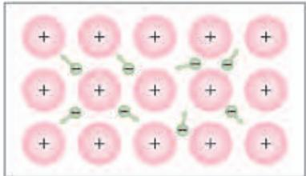  
图9.1-2 金属的微观结构模型

关于金属中原子核、电子所处的状态及其运动，这里的情景是一种简化描述，但它可以有效地解释与金属导电有关的现象，所以也是一个物理模型。

## 静电感应

摩擦可以使物体带电，那么，还有其他方法可以使物体带电吗？

## 实验

## 观察静电感应现象

取一对用绝缘柱支持的导体 A 和 B，使它们彼此接触。起初它们不带电，贴在下部的两片金属箔是闭合的（图 9.1-3）。

手握绝缘棒，把带正电荷的带电体 C 移近导体 A，金属箔有什么变化？

这时手持绝缘柱把导体 A 和 B 分开，然后移开 C，金属箔又有什么变化？

再让导体A和B接触，又会看到什么现象？

利用金属的微观结构模型，解释看到的现象。

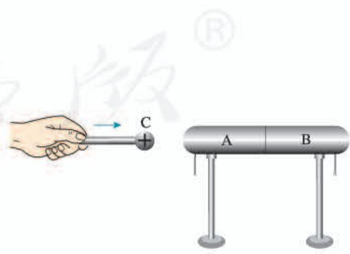  
图9.1-3 静电感应

当一个带电体靠近导体时，由于电荷间相互吸引或排斥，导体中的自由电荷便会趋向或远离带电体，使导体靠近带电体的一端带异种电荷，远离带电体的一端带同种电荷。这种现象叫作静电感应（electrostatic induction）。利用静电感应使金属导体带电的过程叫作感应起电。

## 做一做

## 验电器

从18世纪起，人们开始经常使用一种叫作验电器的简单装置来检测物体是否带电。玻璃瓶内有两片金属箔，用金属丝挂在一根导体棒的下端，棒的上端穿过绝缘的瓶塞从瓶口伸出（图9.1-4甲）。如果把金属箔换成指针，并用金属制作外壳，这样的验电器又叫作静电计（图9.1-4乙）。

制作一个验电器，并用验电器检测不同带电体所带电荷的种类和相对数量。

观察：当带电体靠近导体棒的上端时，金属箔片是否张开？

  
甲

  
乙  
图 9.1-4 验电器和静电计

## 电荷守恒定律

追寻守恒量是物理学研究物质世界的重要方法之一，它常使人们揭示出隐藏在物理现象背后的客观规律。电荷守恒定律是物理学中守恒思想的又一具体体现。

静电感应过程中导体中的自由电荷只是从导体的一部分转移到另一部分。也就是说，无论是摩擦起电还是感应起电都没有创造电荷，只是电荷的分布发生了变化。

大量实验事实表明，电荷既不会创生，也不会消灭，它只能从一个物体转移到另一个物体，或者从物体的一部分转移到另一部分；在转移过程中，电荷的总量保持不变。这个结论叫作电荷守恒定律（law of conservation of charge）。

近代物理实验发现，在一定条件下，带电粒子可以产生或湮没。例如，一个高能光子在一定条件下可以产生一个正电子 $^{①}$ 和一个负电子；一对正、负电子可以同时湮没，转化为光子。不过在这些情况下，带电粒子总是成对产生或湮没的，两个粒子带电数量相等但电性相反，而光子又不带电，所以电荷的代数和仍然不变。因此，电荷守恒定律更普遍的表述是：一个与外界没有电荷交换的系统，电荷的代数和保持不变。它是自然界重要的基本规律之一。

## 元电荷

迄今为止，实验发现的最小电荷量就是电子所带的电荷量。质子、正电子所带的电荷量与它相同，电性相反。人们把这个最小的电荷量叫作元电荷（elementary charge），用e表示。实验还发现，所有带电体的电荷量都是e的整数倍。这就是说，电荷量是不能连续变化的物理量。

元电荷e的数值，最早是由美国物理学家密立根测得的，他因此获得诺贝尔物理学奖。在密立根实验之后，人们又做了许多测量。现在公认的元电荷e的值为

$$
e = 1. 6 0 2 1 7 6 6 3 4 \times 1 0 ^ {- 1 9} \mathrm{C}
$$

在计算中，可取

$$
e = 1. 6 0 \times 1 0 ^ {- 1 9} \mathrm{C}
$$

电子的电荷量e与电子的质量 $m_{c}$ 之比，叫作电子的比荷（specific charge）。比荷也是一个重要的物理量。电子的质量 $m_{c}=9.11\times10^{-31}$ kg，所以电子的比荷为

$$
\frac {e}{m _ {\mathrm{e}}} = 1. 7 6 \times 1 0 ^ {1 1} \mathrm{C/kg}
$$

## 练习与应用

1. 在天气干燥的季节，脱掉外衣后再去摸金属门把手时，常常会被电一下。这是为什么？

2. 在图 9.1-3 所示的实验中，导体分开后，A 带上了 $-1.0 \times 10^{-8}$ C 的电荷。实验过程中，是电子由 A 转移到 B，还是由 B 转移到 A？A、B 得到或失去的电子数各是多少？

3. 如图 9.1-5，将带正电荷 Q 的导体球 C 靠近不带电的导体。若沿虚线 1 将导体分成

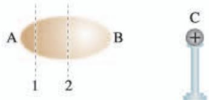  
图9.1-5

A、B两部分，这两部分所带电荷量分别为 $Q_{A}$ 、 $Q_{B}$ ；若沿虚线2将导体分成两部分，这两部分所带电荷量分别为 $Q_{A}'$ 和 $Q_{B}'$ 。

（1）请分别说出以上四个部分电荷量的正负，并简述理由。

(2) 请列出以上四个部分电荷量（绝对值）之间存在的一些等量关系，并简述理由。

4. 关于电荷，小明有以下认识：
A. 电荷量很小的电荷就是元电荷；
B. 物体所带的电荷量可以是任意的。
你认为他的看法正确吗？请简述你的理由。

## 2 库仑定律

## 问题

带正电的带电体C置于铁架台旁，把系在丝线上带正电的小球先后挂在 $P_{1}$ 、 $P_{2}$ 、 $P_{3}$ 等位置。带电体C与小球间的作用力会随距离的不同怎样改变呢？

在同一位置增大或减小小球所带的电荷量，作用力又会怎样变化？电荷之间作用力的大小与哪些因素有关？

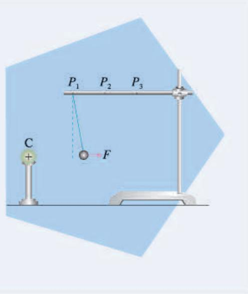

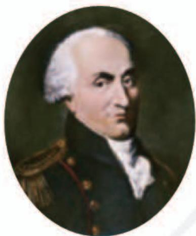  
库仑（Charles-Augustin Coulomb, 1736—1806）

通过上面的实验可以看到，电荷之间的作用力随着电荷量的增大而增大，随着距离的增大而减小。

类比在库仑定律的建立过程中发挥了重要作用。类比会引起人们的联想，产生创新。但是类比不是严格的推理，不一定正确，由类比而提出的猜想是否正确需要实践的检验。

## 电荷之间的作用力

电荷之间的作用力会不会与万有引力具有相似的形式呢？也就是说，电荷之间的相互作用力，会不会与它们电荷量的乘积成正比，与它们之间距离的二次方成反比？

事实上，电荷之间的作用力与万有引力是否相似的问题早已引起当年一些研究者的注意，英国科学家卡文迪什和普里斯特利等人都确信“平方反比”规律适用于电荷间的力。不过，最终解决这一问题的是法国科学家库仑。他设计了一个十分精妙的实验（扭秤实验），对电荷之间的作用力开展研究。最后确认：真空中两个静止点电荷之间的相互作用力，与它们的电荷量的乘积成正比，与它们的距离的二次方成反比，作用力的方向在它们的连线上。这个规律叫作库仑定律（Coulomb's law）。这种电荷之间的相互作用力叫作静电力（electrostatic force）或库仑力。

那么，什么是点电荷呢？

实验事实说明，两个实际的带电体间的相互作用力与它们自身的大小、形状以及电荷分布都有关系。任何带电体都有形状和大小。当带电体之间的距离比它们自身的大小大得多，以致带电体的形状、大小及电荷分布状况对它们之间的作用力的影响可以忽略时，这样的带电体可以看作带电的点，叫作点电荷（point charge）。

## 库仑的实验

库仑做实验用的装置叫作库仑扭秤。如图9.2-1，细银丝的下端悬挂一根绝缘棒，棒的一端是一个小球A，另一端通过物体B使绝缘棒平衡，悬丝处于自然状态。把另一个带电的金属小球C插入容器并使它接触A，从而使A与C带同种电荷。将C和A分开，再使C靠近A，A和C之间的作用力使A远离。扭转悬丝，使A回到初始位置并静止，通过悬丝扭转的角度可以比较力的大小。改变A和C之间的距离r，记录每次悬丝扭转的角度，就可以找到力F与距离r的关系，结果是力F与距离r的二次方成反比，即

$$
F \propto \frac {1}{r ^ {2}}
$$

在库仑那个年代，还不知道怎样测量物体所带的电荷量，甚至连电荷量的单位都没有。不过两个相同的金属小球，一个带电、一个不带电，互相接触后，它们对相隔同样距离的第三个带电小球的作用力相等，因此，可以断定这两个小球接触后所带的电荷量相等。这意味着，如果使一个带电金属小球与另一个不带电的完全相同的金属小球接触，前者的电荷量就会分给后者一半。多次重复，可以把带电小球的电荷量q分为

$$
\frac {q}{2}, \frac {q}{4}, \frac {q}{8}, \dots
$$

这样又可以得出电荷之间的作用力与电荷量的关系：力 $F$ 与 $q_{1}$ 和 $q_{2}$ 的乘积成正比，即

$$
F \propto q _ {1} q _ {2} ^ {(1)}
$$

综合上述实验结论，可以得到如下关系式

$$
F = k \frac {q _ {1} q _ {2}}{r ^ {2}}
$$

▶ 点电荷类似于力学中的质点，也是一种理想化模型。

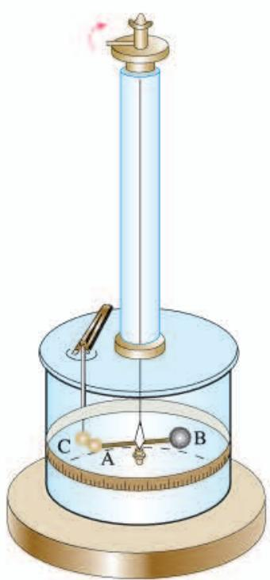  
图9.2-1 扭秤实验装置

式中的 k 是比例系数，叫作静电力常量。当两个点电荷所带的电荷量为同种时，它们之间的作用力为斥力；反之，为异种时，它们之间的作用力为引力。

在国际单位制中，电荷量的单位是库仑（C），力的单位是牛顿（N），距离的单位是米（m）。k 的数值是

$$
k = 9. 0 \times 1 0 ^ {9} \mathrm{N} \cdot \mathrm{m} ^ {2} / \mathrm{C} ^ {2}
$$

## 静电力计算

根据库仑定律，两个电荷量为 1 C 的点电荷在真空中相距 1 m 时，相互作用力是 $9.0 \times 10^{9}$ N。差不多相当于一百万吨的物体所受的重力！可见，库仑是一个非常大的电荷量单位，我们几乎不可能做到使相距 1 m 的两个物体都带 1 C 的电荷量。

通常，一把梳子和衣袖摩擦后所带的电荷量不到百万分之一库仑，但天空中发生闪电之前，巨大的云层中积累的电荷量可达几百库仑。

## 【例题1】

在氢原子内，氢原子核与电子之间的最短距离为 $5.3 \times 10^{-11} \mathrm{~m}$ 。试比较氢原子核与电子之间的静电力和万有引力。

分析 氢原子核与质子所带的电荷量相同，是 $1.6 \times 10^{-19} \mathrm{C}$ 。电子带负电，所带的电荷量也是 $1.6 \times 10^{-19} \mathrm{C}$ 。质子质量为 $1.67 \times 10^{-27} \mathrm{~kg}$ ，电子质量为 $9.1 \times 10^{-31} \mathrm{~kg}$ 。根据库仑定律和万有引力定律就可以求解。

解 根据库仑定律，它们之间的静电力

$$
\begin{array}{r l} F _ {\mathrm{库}} & = k \frac {q _ {1} q _ {2}}{r ^ {2}} \\ & = 9. 0 \times 1 0 ^ {9} \times \frac {(1 . 6 \times 1 0 ^ {- 1 9}) \times (1 . 6 \times 1 0 ^ {- 1 9})}{(5 . 3 \times 1 0 ^ {- 1 1}) ^ {2}} \mathrm{N} \\ & = 8. 2 \times 1 0 ^ {- 8} \mathrm{N} \end{array}
$$

根据万有引力定律，它们之间的万有引力

$$
\begin{array}{r l} F _ {\text {引}} & = G \frac {m _ {1} m _ {2}}{r ^ {2}} \\ & = 6. 7 \times 1 0 ^ {- 1 1} \times \frac {(1 . 6 7 \times 1 0 ^ {- 2 7}) \times (9 . 1 \times 1 0 ^ {- 3 1})}{(5 . 3 \times 1 0 ^ {- 1 1}) ^ {2}} \mathrm{N} \\ & = 3. 6 \times 1 0 ^ {- 4 7} \mathrm{N} \end{array}
$$

$$
\frac {F _ {\mathrm{库}}}{F _ {\mathrm{引}}} = 2. 3 \times 1 0 ^ {3 9}
$$

氢原子核与电子之间的静电力是万有引力的 $2.3 \times 10^{39}$ 倍。

可见，微观粒子间的万有引力远小于库仑力。因此，在研究微观带电粒子的相互作用时，可以把万有引力忽略。

库仑定律描述的是两个点电荷之间的作用力。如果存在两个以上点电荷，那么，每个点电荷都要受到其他所有点电荷对它的作用力。两个或两个以上点电荷对某一个点电荷的作用力，等于各点电荷单独对这个点电荷的作用力的矢量和。

实验表明，两个点电荷之间的作用力不因第三个点电荷的存在而改变。

库仑定律是电磁学的基本定律之一。库仑定律给出的虽然是点电荷之间的静电力，但是任何一个带电体都可以看成是由许多点电荷组成的。所以，如果知道带电体上的电荷分布，根据库仑定律就可以求出带电体之间的静电力的大小和方向。

## 【例题2】

真空中有三个带正电的点电荷，它们固定在边长为 $50 \, cm$ 的等边三角形的三个顶点上，每个点电荷的电荷量都是 $2.0 \times 10^{-6} \, C$ ，求它们各自所受的静电力。

分析 根据题意作图（图9.2-2）。每个点电荷都受到其他两个点电荷的斥力，因此，只要求出一个点电荷（例如 $q_{3}$ ）所受的力即可。

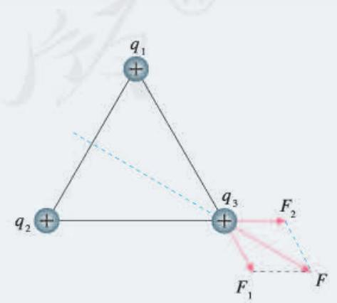  
图9.2-2 一个点电荷所受的静电力

解 根据库仑定律，点电荷 $q_{3}$ 共受到 $F_{1}$ 和 $F_{2}$ 两个力的作用。其中

$$
q _ {1} = q _ {2} = q _ {3} = q
$$

每两个点电荷之间的距离 $r$ 都相同，所以

$$
F _ {1} = F _ {2} = k \frac {q ^ {2}}{r ^ {2}} = \frac {9 . 0 \times 1 0 ^ {9} \times (2 . 0 \times 1 0 ^ {- 6}) ^ {2}}{0 . 5 ^ {2}} \mathrm{N} = 0. 1 4 4 \mathrm{N}
$$

根据平行四边形定则可得

$$
F = 2 F _ {1} \cos 3 0 ^ {\circ} = 0. 2 5 \mathrm{N}
$$

点电荷 $q_{3}$ 所受的合力 F 的方向为 $q_{1}$ 与 $q_{2}$ 连线的垂直平分线向外。

每个点电荷所受的静电力的大小相等，数值均为 0.25 N，方向均沿另外两个点电荷连线的垂直平分线向外。

## 练习与应用

1. 有三个完全相同的金属球，球 A 带的电荷量为 q，球 B 和球 C 均不带电。现要使球 B 带的电荷量为 $\frac{3q}{8}$ ，应该怎么操作？

2. 半径为 r 的两个金属球，其球心相距 3r，现使两球带上等量的同种电荷 Q，两球之间的静电力 $F = k \frac{Q^{2}}{9r^{2}}$ 吗？说明道理。

3. 真空中两个相同的带等量异种电荷的金属小球 A 和 B（均可看作点电荷），分别固定在两处，两球之间的静电力为 F。现用一个不带电的同样的金属小球 C 先与 A 接触，再与 B 接触，然后移开 C，此时 A、B 之间的静电力变为多少？若再使 A、B 之间距离增大为原来的 2 倍，则它们之间的静电力又为多少？

4. 在边长为 a 的正方形的每个顶点都放置一个电荷量为 q 的同种点电荷。如果保持它们的位置不变，每个电荷受到其他三个电荷的静电力的合力是多少？

5. 两个分别用长 $13 \mathrm{~cm}$ 的绝缘细线悬挂于同一点的相同小球（可看作质点），带有同种等量电荷。由于静电力 $F$ 的作用，它们之间的距离为 $10 \mathrm{~cm}$ （图9.2-3）。已测得每个小球的质量是 $0.6 \mathrm{~g}$ ，求它们各自所带的电荷量。 $g$ 取 $10 \mathrm{~m} / \mathrm{s}^{2}$ 。

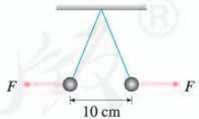  
图9.2-3

## ③ 电场 电场强度

## 问题

通过起电机使人体带电，人的头发会竖起散开。

为什么会出现这样的现象？你会解释产生这一现象的原因吗？

## 电场

19 世纪 30 年代，英国科学家法拉第提出一种观点，认为在电荷的周围存在着由它产生的电场 $^{①}$ （electric field）。电场是看不见、摸不着的，但人们却可以根据它所表现出来的性质来认识它，研究它。

处在电场中的其他电荷受到的作用力就是这个电场给予的。例如，电荷A对电荷B的作用力，就是电荷A的电场对电荷B的作用；电荷B对电荷A的作用力，就是电荷B的电场对电荷A的作用（图9.3-1）。

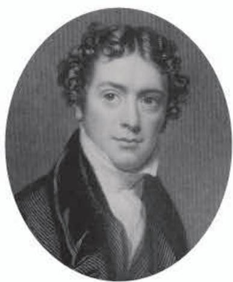

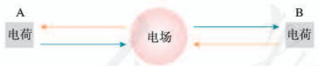  
法拉第（Michael Faraday，1791—1867）  
图9.3-1 电荷之间通过电场相互作用

物理学的理论和实验证实并发展了法拉第的观点。电场以及磁场已被证明是一种客观存在。场像分子、原子等实物粒子一样具有能量，因而场也是物质存在的一种形式。

应该指出，只有在研究运动的电荷，特别是运动状态迅速变化的电荷时，上述场的物质性才突显出来。本章只讨论静止电荷产生的电场，叫作静电场（electrostatic field）。

## 电场强度

电场是在与电荷的相互作用中表现出自己的特性的。因此，在研究电场的性质时，应该将电荷放入电场中，从电荷所受的静电力入手。

试探电荷是为了研究源电荷电场的性质而引入的，它的引入不改变源电荷的电场。

这个电荷应该是电荷量和体积都很小的点电荷。电荷量很小，是为了使它放入后不影响原来要研究的电场。体积很小，是为了便于用它来研究电场各点的性质。这样的电荷常常叫作试探电荷。激发电场的带电体所带的电荷叫作场源电荷，或源电荷。

## 思考与讨论

我们不能直接用试探电荷所受的静电力来表示电场的强弱，因为对于电荷量不同的试探电荷，即使在电场的同一点，所受的静电力也不相同。那么，用什么物理量能够描述电场的强弱呢？

如果把一个很小的电荷 $q_{1}$ 选为试探电荷，它在电场中某个位置受到的静电力是 $F_{1}$ ，另一个同样的电荷在同一位置受到的静电力一定也是 $F_{1}$ ；我们可以推测，假如有一个电荷量为 $2q_{1}$ 的电荷放在这里，它受到的静电力就是 $2F_{1}$ 。依此类推，电荷量为 $3q_{1}$ 的电荷放在这里，受到的静电力是 $3F_{1}$ ……也就是说，我们推测试探电荷在电场中某点受到的静电力 F 与试探电荷的电荷量 q 成正比。或者说，试探电荷在电场中某点受到的静电力 F 与试探电荷的电荷量 q 之比是一个常量。

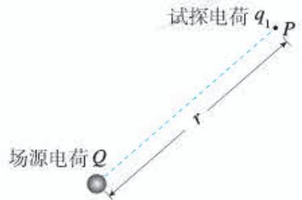  
图9.3-2 场源电荷和试探电荷

你认为这样的推测是否正确？这里的分析是一种猜想和假设，它的正确性有待进一步的检验。我们可以用点电荷的电场来进行分析。

如图9.3-2，在点电荷 $Q$ 的电场中的 $P$ 点，放一个试探电荷 $q_{1}$ ，它在电场中受到的静电力是 $F_{1}$ ，根据库仑定律，有

$$
F _ {1} = k \frac {Q q _ {1}}{r ^ {2}}\tag{1}
$$

同理，如果把试探电荷换成 $q_{2}$ ，它在电场中受到的静电力是 $F_{2}$ ，有

$$
F _ {2} = k \frac {Q q _ {2}}{r ^ {2}}\tag{2}
$$

由（1）（2）两式可以看出

$$
\frac {F _ {1}}{q _ {1}} = \frac {F _ {2}}{q _ {2}} = k \frac {Q}{r ^ {2}}
$$

放在P点的试探电荷受到的静电力与它的电荷量之比，跟该点的试探电荷的电荷量无关，而与产生电场的场源电荷的电荷量Q及P点与场源电荷之间的距离r有关。

实验表明，无论是点电荷的电场还是其他电场，在电场的不同位置，试探电荷所受的静电力与它的电荷量之比一般说来是不一样的。它反映了电场在各点的性质，叫作电场强度（electric field strength）。电场强度常用E来表示，根据分析可以知道

$$
E = \frac {F}{q}
$$

电场强度也是通过物理量之比定义的新物理量。

按照上式，电场强度的单位应是牛每库，符号为 N/C。如果 1 C 的电荷在电场中的某点受到的静电力是 1 N，那么该点的电场强度就是 1 N/C，即

$$
1 \mathrm{N/C} = \frac {1 \mathrm{N}}{1 \mathrm{C}}
$$

电场强度是矢量。物理学中规定，电场中某点的电场强度的方向与正电荷在该点所受的静电力的方向相同。按照这个规定，负电荷在电场中某点所受静电力的方向与该点电场强度的方向相反。

## 点电荷的电场 电场强度的叠加

点电荷是最简单的场源电荷，一个电荷量为 $Q$ 的点电荷，在与之相距 $r$ 处的电场强度

$$
E = k \frac {Q}{r ^ {2}}
$$

根据上式可知，如果以电荷量为 $Q$ 的点电荷为中心作一个球面，则球面上各点的电场强度大小相等。当 $Q$ 为正电荷时，电场强度E的方向沿半径向外（图9.3-3甲）；当Q为负电荷时，电场强度E的方向沿半径向内（图9.3-3乙）。

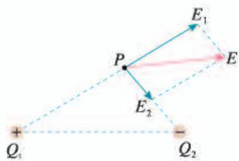  
图9.3-4 电场强度的叠加

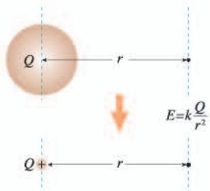  
图9.3-5 球形带电体与点电荷的等效

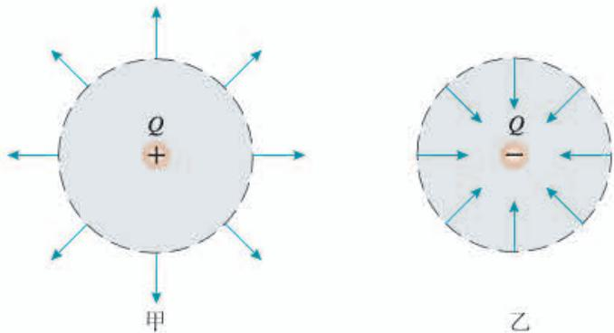  
图9.3-3 与点电荷相距 $r$ 的球面上各点的电场强度

我们知道，两个或两个以上的点电荷对某一个点电荷的静电力，等于各点电荷单独对这个点电荷的静电力的矢量和。由此可以推理，如果场源是多个点电荷，则电场中某点的电场强度等于各个点电荷单独在该点产生的电场强度的矢量和。例如，图9.3-4中 $P$ 点的电场强度 $E$ ，等于点电荷 $Q_{1}$ 在该点产生的电场强度 $E_{1}$ 与点电荷 $Q_{2}$ （为负电荷）在该点产生的电场强度 $E_{2}$ 的矢量和。

在一个比较大的带电体不能看作点电荷的情况下，当计算它的电场时，可以把它分成若干小块，只要每个小块足够小，就可以看成点电荷，然后用点电荷电场强度叠加的方法计算整个带电体的电场。可以证明，一个半径为R的均匀带电球体（或球壳）在球的外部产生的电场，与一个位于球心、电荷量相等的点电荷在同一点产生的电场相同（图9.3-5），即

$$
E = k \frac {Q}{r ^ {2}}
$$

式中的r是球心到该点的距离 $(r>R)$ ，Q为整个球体所带的电荷量。

## 电场线

除了用数学公式描述电场外，形象地了解和描述电场中各点电场强度的大小和方向也很重要。法拉第采用了一个简洁的方法来描述电场，那就是画电场线（electric field line）。

电场线是画在电场中的一条条有方向的曲线，曲线上每点的切线方向表示该点的电场强度方向（图9.3-6）。在同一幅图中，电场强度较大的地方电场线较密，电场强度较小的地方电场线较疏，因此在同一幅图中可以用电场线的疏密来比较各点电场强度的大小。从图9.3-7和图9.3-8可以看出，电场线有以下两个特点：

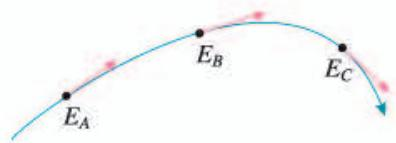  
图9.3-6 电场线上各点的切线方向与该点的电场强度方向一致

（1）电场线从正电荷或无限远出发，终止于无限远或负电荷；

（2）同一电场的电场线在电场中不相交，这是因为在电场中任意一点的电场强度不可能有两个方向。

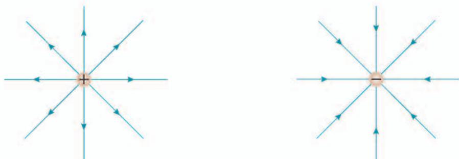  
图9.3-7 点电荷的电场线呈辐射状

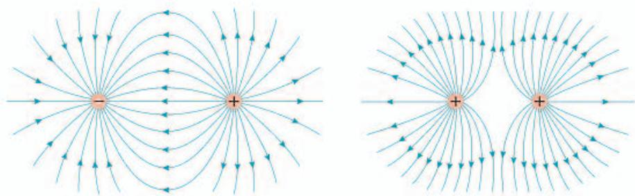  
图9.3-8 等量异种点电荷的电场线和等量同种点电荷的电场线

## 演示

## 模拟电场线

电场线的形状可以用实验来模拟。把头发碎屑悬浮在蓖麻油里，加上电场，碎屑就按电场强度的方向排列起来，显示出电场线的分布情况。图9.3-9是模拟正电荷电场线的照片。

电场线不是实际存在的线，而是为了形象地描述电场而假想的线。这个实验只是用来模拟电场线的分布。

  
图9.3-9 模拟电场线

## 匀强电场

  
图9.3-10 模拟平行金属板间电场线的分布  
如果电场中各点的电场强度的大小相等、方向相同，这个电场就叫作匀强电场。由于方向相同，匀强电场中的电场线应该是平行的；又由于电场强度大小相等，电场线的疏密程度应该是相同的。所以，匀强电场的电场线可以用间隔相等的平行线来表示。例如，相距很近的一对带等量异种电荷的平行金属板（图9.3-10），它们之间的电场除边缘外，可以看作匀强电场。

## 科学方法

## 用物理量之比定义新物理量

在物理学中，常常用物理量之比表示研究对象的某种性质。例如，用质量 m 与体积 V 之比定义密度 $\rho$ ，用位移 l 与时间 t 之比定义速度 v，用静电力 F 与电荷量 q 之比定义电场强度 E，等等。这样定义一个新的物理量的同时，也就确定了这个新的物理量与原有物理量之间的关系。

比值定义包含“比较”的思想。例如，在电场强度概念建立的过程中，比较的是相同电荷量的试探电荷受静电力的大小。

## 练习与应用

1. 关于电场强度，小明有以下认识：

A. 若在电场中的P点不放试探电荷，则P点的电场强度为0；

B. 点电荷的电场强度公式 $E = k \frac{Q}{r^2}$ 表明，点电荷周围某点电场强度的大小，与该点到场源电荷距离 $r$ 的二次方成反比，在 $r$ 减半的位置上，电场强度变为原来的4倍；

C. 电场强度公式 $E=\frac{F}{q}$ 表明，电场强度的大小与试探电荷的电荷量q成反比，若q减半，则该处的电场强度变为原来的2倍；

D. 匀强电场中电场强度处处相同，所以任何电荷在其中受力都相同。

你认为他的看法正确吗？请简述你的理由。

2. 把试探电荷 $q$ 放到电场中的 $A$ 点，测得它所受的静电力为 $F$ ；再把它放到 $B$ 点，测得它所受的静电力为 $nF$ 。 $A$ 点和 $B$ 点的电场强度之比 $\frac{E_A}{E_B}$ 是多少？再把另一个电荷量为 $nq$ 的试探电荷放到另一点 $C$ ，测得它所受的静电力也是 $F$ 。 $A$ 点和 $C$ 点的电场强度之比 $\frac{E_A}{E_C}$ 是多少？

3. 场是物理学中的重要概念，除了电场和磁场，还有重力场。地球附近的物体就处在地球产生的重力场中。仿照电场强度的定义，你认为应该怎样定义重力场强度的大小和方向？

4. 有同学说，电场线一定是带电粒子在电场中运动的轨迹。这种说法对吗？试举例说明。

5. 某一区域的电场线分布如图9.3-11所示。A、B、C是电场中的三个点。

（1）哪一点的电场强度最强？哪一点的电场强度最弱？

(2) 画出各点电场强度的方向。

（3）把负的点电荷分别放在这三个点，画出它所受静电力的方向。

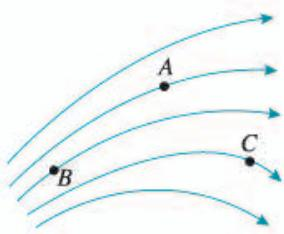  
图9.3-11

6. 用一条绝缘轻绳悬挂一个带正电小球，小球质量为 $1.0 \times 10^{-3} \mathrm{~kg}$ ，所带电荷量为 $2.0 \times 10^{-8} \mathrm{C}$ 。现加水平方向的匀强电场，平衡时绝缘绳与竖直方向夹角为 $30^{\circ}$ （图9.3-12）。求匀强电场的电场强度。

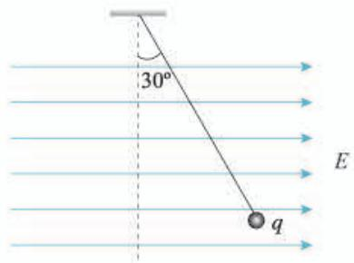  
图9.3-12

7. 如图9.3-13，真空中有两个点电荷， $Q_{1}$ 为 $4.0 \times 10^{-8}$ C、 $Q_{2}$ 为 $-1.0 \times 10^{-8}$ C，分别固定在 x 轴的坐标为 0 和 6 cm 的位置上。

(1) x 轴上哪个位置的电场强度为 0?

(2) x 轴上哪些位置的电场强度的方向是沿 x 轴的正方向的?

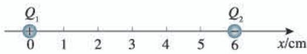  
图9.3-13

## 4 静电的防止与利用

## 问题

自然界到处都有静电。生产中的搅拌、挤压、切割等活动，生活中的穿衣、脱衣、运动等过程都可能产生静电。

在加油站给车加油前，为什么要触摸一下静电释放器？

## 静电平衡

如图9.4-1甲，把一个不带电的金属导体ABCD放到电场强度为 $E_{0}$ 的电场中。由于静电感应，在导体AB侧的平面上将感应出负电荷，在CD侧的平面上将感应出正电荷。

导体两侧出现的正、负电荷在导体内部产生与电场强度 $E_{0}$ 方向相反的电场，其电场强度为 $E'$ （图9.4-1乙）。这两个电场叠加，使导体内部的电场减弱。在叠加后的电场作用下，仍有自由电子不断运动，直到导体内部各点的电场强度E=0为止（图9.4-1丙），导体内的自由电子不再发生定向移动。这时我们说，导体达到静电平衡（electrostatic equilibrium）状态。处于静电平衡状态的导体，其内部的电场强度处处为0。

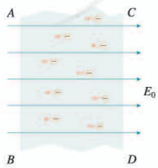  
甲

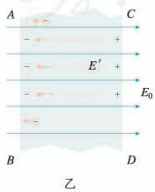  
图9.4-1 静电场中的导体

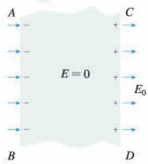  
丙

静电平衡时，导体内部没有净剩电荷，电荷只分布在导体的外表面。并且在导体外表面，越尖锐的位置，电荷的密度（单位面积的电荷量）越大，周围的电场强度越大。在一定条件下，导体尖端周围的强电场足以使空气中残留的带电粒子发生剧烈运动，并与空气分子碰撞从而使空气分子中的正负电荷分离。这个现象叫作空气的电离。中性的分子电离后变成带负电的自由电子和失去电子而带正电的离子。这些带电粒子在强电场的作用下加速，撞击空气中的分子，使它们进一步电离，产生更多的带电粒子。那些所带电荷与导体尖端的电荷符号相反的粒子，由于被吸引而奔向尖端，与尖端上的电荷中和，这相当于导体从尖端失去电荷（图9.4-2）。这种现象叫作尖端放电。

将尖锐的金属棒安装在建筑物的顶端，用粗导线与埋在地下的金属板连接，保持与大地的良好接触，就成为避雷针（图9.4-3）。当带电的雷雨云接近建筑物时，由于静电感应，金属棒出现与云层相反的电荷。通过尖端放电，这些电荷不断向大气释放，中和空气中的电荷，达到避免雷击的目的。尖端放电会导致高压设备上电能的损失，所以高压设备中导体的表面应该尽量光滑。夜间高压线周围有时会出现一层绿色光晕，俗称电晕，这是一种微弱的放电现象。

## 静电屏蔽

处于静电平衡状态的导体内部没有电荷，电荷只分布在导体的外表面。如果放入静电场中的是一个空腔导体，电荷分布又有什么特点呢？

我们讨论带空腔的导体（图9.4-4）。静电平衡时，内表面没有电荷，导体壳壁W内的电场强度为0，即电场线只能在空腔C之外，不会进入空腔之内。所以导体壳内空腔里的电场强度也处处为0。也就是说，无论导体外部电场是什么样的，导体内部都不会有电场。

导体壳的这种性质在技术上很有实用价值。把一个电学仪器放在封闭的金属壳里，即使壳外有电场，但由于壳内电场强度保持为0，外电场对壳内的仪器不会产生影响。金属壳的这种作用叫作静电屏蔽。

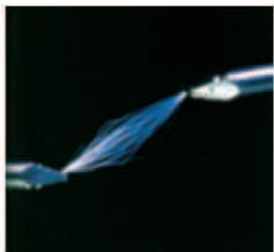  
图9.4-2 尖端放电

  
图9.4-3 避雷针

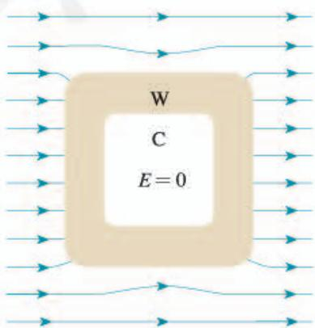  
图9.4-4 导体腔内的电场为0

## 演示

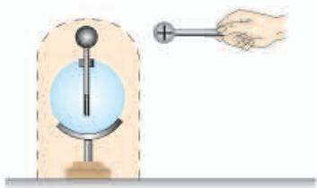  
图9.4-5 静电屏蔽

## 静电屏蔽

使带电的金属球靠近验电器，但不接触，箔片是否张开？解释看到的现象。用金属网把验电器罩起来，再使带电金属球靠近验电器，观察箔片是否张开（图9.4-5）。这个现象说明什么？

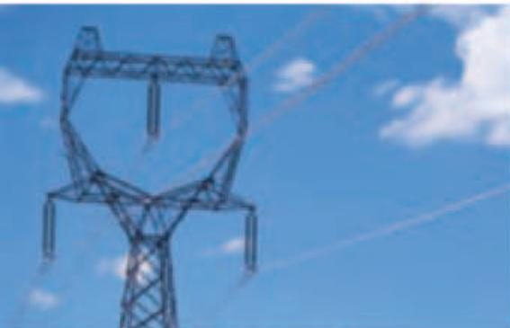  
图9.4-6 高压线屏蔽

实现静电屏蔽不一定要用密封的金属容器，金属网也能起到屏蔽作用。野外高压输电线受到雷击的可能性很大，所以在三条输电线上方还有两条导线，它们与大地相连，形成一个稀疏的金属“网”，把高压线屏蔽起来（图9.4-6），使其免遭雷击。

静电的危害可能随时发生。例如，医院手术台上，静电火花有可能引起麻醉剂爆炸；煤矿里，静电火花会引起瓦斯爆炸……因此，静电的危害必须引起人们的警惕。

## 科学漫步

## 雷火炼殿

武当山位于湖北省西北部，其主峰天柱峰屹立着一座光耀百里的金殿（图9.4-7），全部为铜铸鎏金。

雷雨交加时，金殿的屋顶常会出现盆大的火球，来回滚动。雨过天晴时，大殿金光灿灿，像被重新炼洗过一般，这就是人们所说的“雷火炼殿”奇观。

武当山重峦叠嶂，气候多变，云层常带大量电荷。金殿屹立峰巅，是一个庞大的优良导体。当带电的积雨云移来时，云层与金殿顶部之间形成巨大的电压，使空气电离，产生电弧，也就是闪电。强大的电弧使周围空气剧烈膨胀而爆炸，看似火球，并伴有雷鸣。

  
图9.4-7 武当山金殿

金殿顶部，除海马等屋脊上的装饰外，很少有带尖的结构，不易放电，所以能使电压升得比较高，保证“炼殿”之需。如此，金殿五百年灿烂地屹立在天柱峰之巅。

近些年来因为金殿周围的一些建筑物常遭雷击，金殿也安装了避雷设施。此后，雷火炼殿的奇观消失了。没有水火的炼洗，金殿的色泽暗淡了许多。

显影

静电虽然会有危害，但也可以利用。在电场中，带电粒子受到静电力的作用，向着电极运动，最后会被吸附在电极上。这一原理在生产技术上被广泛应用。

静电除尘 设法使空气中的尘埃带电，在静电力作用下，尘埃到达电极而被收集起来，这就是静电除尘。

如图9.4-8，静电除尘器由板状收集器A和线状电离器B组成。A接到几千伏高压电源的正极，B接到高压电源的负极，它们之间有很强的电场，而且距B越近，电场强度越大。B附近的空气中的气体分子更容易被电离，成为正离子和电子。正离子被吸到B上，得到电子，又成为分子。电子在向着正极A运动的过程中，遇到烟气中的粉尘，使粉尘带负电。粉尘被吸附到正极A上，最后在重力的作用下落入下面的漏斗中。静电除尘用于粉尘较多的各种场所，除去有害的微粒，或者回收物资，如回收水泥粉尘。

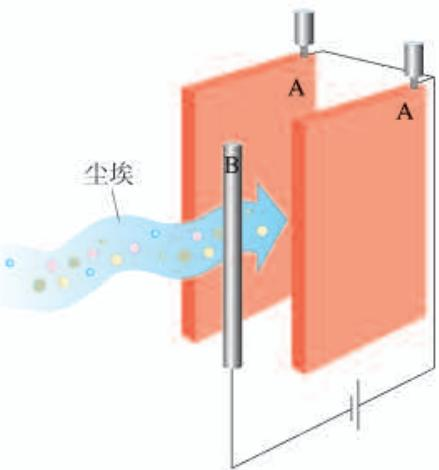  
图9.4-8 静电除尘原理

静电喷漆 接负高压的涂料雾化器喷出的油漆微粒带负电，在静电力作用下，这些微粒向着作为正极的工件运动，并沉积在工件的表面，完成喷漆工作。

静电复印 复印机也应用了静电吸附。复印机的核心部件是有机光导体鼓，它是一个金属圆柱，表面涂覆有机光导体（OPC） $^{①}$ 。没有光照时，OPC 是绝缘体，受到光照时变成导体。复印机复印的工作过程如图9.4-9所示。

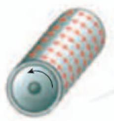  
充电

  
曝光

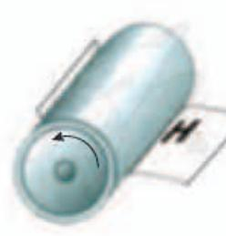  
转印

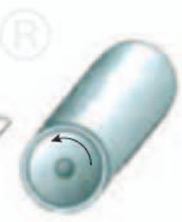  
放电  
图9.4-9 静电复印的工作流程

## 练习与应用

1. 静电给人们带来很多方便，但有时也带来很多麻烦，甚至造成危害。例如：印刷厂里，纸张之间摩擦带电，会使纸张吸附在一起，给印刷带来麻烦；印染厂里染织物上带静电，会吸附空气中的尘埃，使印染质量下降；制药生产中，由于静电吸引尘埃，使药品达不到预定纯度。

要采取措施防止以上事例中静电的影响，你会怎么做？

2. 在一次科学晚会上，一位老师表演了一个“魔术”：如图9.4-10，一个没有底的空塑料瓶上固定着一根铁锯条和一块易拉罐(金属)片，把它们分别跟静电起电机的两极相连。在塑料瓶里放一盘点燃的蚊香，很快就看见整个透明塑料瓶里烟雾缭绕。当把起电机一摇，顿时塑料瓶清澈透明，停止摇动，又是烟雾缭绕。

起电机摇动时，塑料瓶内哪里电场强度最大？是锯条附近还是金属片附近？若锯条接电源负极，金属片接正极，这些烟尘最终到哪里去了？

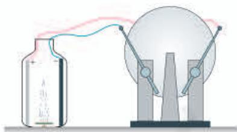  
图9.4-10

3. 超高压带电作业的工人穿戴的工作服（图9.4-11），为什么要用包含金属丝的织物制成？

4. 在燃气灶和燃气热水器中，常常安装电子点火器，接通电子线路时产生高电压，通过高压放电的电火花来点燃气体。点火器的放电电极是钉尖形（图9.4-12）。这是为什么？与此相反，验电器的金属杆上端却固定一个金属球而不做成针尖状，这又是为什么？

  
图9.4-11

5. 当我们使用有线话筒扩音时，有些由于周围环境中的静电现象或其他原因产生的电信号会通过话筒线混入功率放大器中进行放大，影响扩音的效果。因此，很多优质的话筒线在构造上都采取了防备措施。请观察图9.4-13的话筒线，你知道它采用了什么方法防止干扰信号从话筒线上侵入吗？

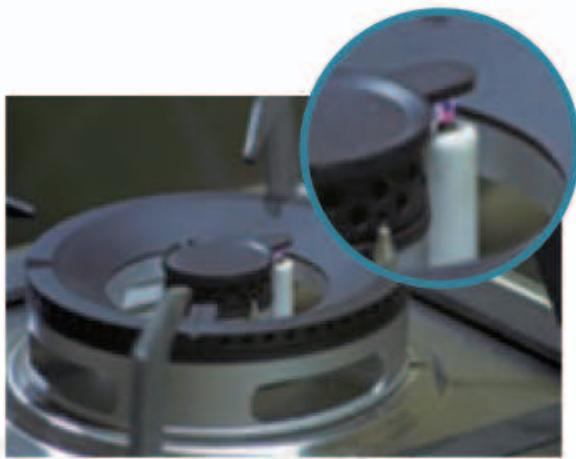  
图9.4-12

  
图9.4-13

## A组

1. 当验电器带电时，为什么两片金属箔会张开一个角度？为什么两片金属箔张开一定的角度后就不变了？

2. 如图9-1，在带电体C的右侧有两个相互接触的金属导体A和B，均放在绝缘支座上。若先将A、B分开，再移走C，试分析A、B的带电情况；若先将C移走，再把A、B分开，试分析A、B的带电情况。

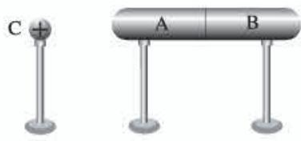  
图9-1

3. 如图9-2，用两根同样长的细绳把两个带同种电荷的小球悬挂在一点。两小球的质量相等，球A所带的电荷量大于球B所带的电荷量。两小球静止时，悬线与竖直方向的偏角分别为 $\alpha$ 和 $\beta$ ，请判断二者的关系并说明原因。

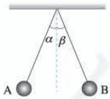  
图9-2

4.有两个带正电小球，电荷量分别为 $Q$ 和 $9Q$ ，在真空中相距 $0.4\mathrm{m}$ 。如果引进第三个带电小球，正好使三个小球仅在静电力的作用下处于平衡状态，那么第三个小球应放在什么地方？带的是哪种电荷？电荷量是 $Q$ 的几倍？

1. 如图9-5，在带电体C附近，把绝缘导体A、B相碰一下后分开，然后分别接触一个小电动机的两个接线柱。假设小电动机非常灵敏，它便会开始转动。当小电动机还没有停止时，又立刻把A、B在C附近相碰一下分开，再

5. 如图9-3，用 $2.0 \mathrm{~m}$ 长的绝缘线把一个质量为 $4.5 \times 10^{-3} \mathrm{~kg}$ 的带电小球悬挂在带等量异种电荷的竖直平行板之间。平衡时，小球偏离竖直位置 $2.0 \mathrm{~cm}$ 。如果两板间电场的电场强度是 $1.5 \times 10^{5} \mathrm{~N} / \mathrm{C}$ ，小球的电荷量是多少？

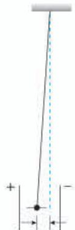  
2.0 cm

6. 长为 l 的导体棒原来不带电，现将一个带正电的点电荷 q

图9-3

放在棒的中心轴线上距离棒的左端R处，如图9-4所示。当棒达到静电平衡后，棒上感应电荷在棒的中点O处产生的电场强度大小和方向如何？

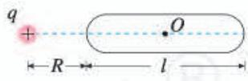  
图9-4

## B组

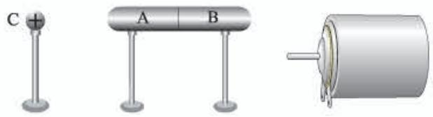  
图9-5

和小电动机两接线柱接触。如此下去，小电动机便能不停地转动。这不就成了永动机而违背能量守恒定律吗？说说你的看法。

2. 将电荷量 Q 分配给可视为点电荷的两个金属球，间距一定的情况下，怎样分配电荷量才能使它们之间的静电力最大？请进行论证。

3. 如图9-6，A、B、C、D是正方形的四个顶点，在A点和C点放有电荷量都为q的正电荷，在B点放了某个未知电荷 $q'$ 后，恰好D点的电场强度等于0。求放在B点的电荷电性和电荷量。

乙  
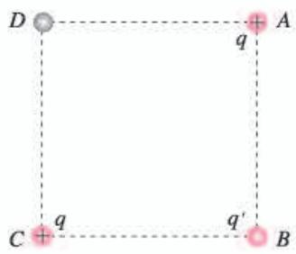  
图9-6

4. 如图9-7，电荷量为 $q$ 的点电荷与均匀带电薄板相距 $2d$ ，点电荷到带电薄板的垂线通过板的几何中心。若图中 $A$ 点的电场强度为0，求带电薄板产生的电场在图中 $B$ 点的电场强度。

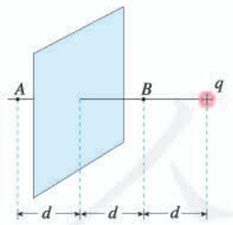  
图9-7

5. A、B 是两个电荷量都是 Q 的点电荷，相距 l，AB 连线中点为 O。现将另一个电荷量为 q 的点电荷放置在 AB 连线的中垂线上，距 O 为 x 的 C 处（图 9-8 甲）。

（1）若此时q所受的静电力为 $F_{1}$ ，试求 $F_{1}$ 的大小。

（2）若A的电荷量变为- Q，其他条件都不变（图9-8乙），此时q所受的静电力大小为 $F_{2}$ ，求 $F_{2}$ 的大小。

（3）为使 $F_{2}$ 大于 $F_{1}$ ，l和x的大小应满足什么关系？

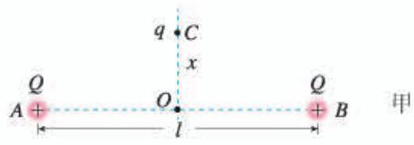

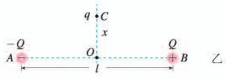  
图9-8

6. 在一个点电荷 $Q$ 的电场中, 让 $x$ 轴与它的一条电场线重合, 坐标轴上 $A 、 B$ 两点的坐标分别为 $0.3 \mathrm{~m}$ 和 $0.6 \mathrm{~m}$ (图9-9甲)。在 $A 、 B$ 两点分别放置试探电荷, 其受到的静电力跟试探电荷的电荷量的关系, 如图9-9乙中直线 $a 、 b$ 所示。

（1）求A点和B点的电场强度的大小和方向。

(2) 点电荷 Q 所在位置的坐标是多少?

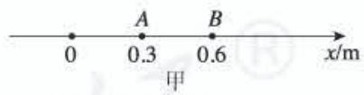

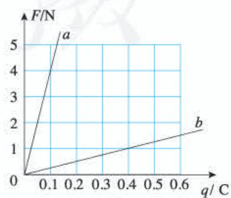  
图9-9

## 10

## 第十章 静电场中的能量

古代，人们用弩来加速箭，箭的速度能达到 $10^{2}$ m/s数量级；后来，人们又在枪膛中用火药加速子弹，子弹的速度能达到 $10^{3}$ m/s数量级；而现代，人们需要用高速的微观粒子轰击另一微观粒子来进行科学研究，其速度的数量级达到 $10^{7}$ m/s，那是怎样加速的呢？

## 1 电势能和电势

## 问题

一个正电荷在电场中只受到静电力 F 的作用，它在电场中由 A 点运动到 B 点时，静电力做了正功 $W_{AB}$ 。由动能定理可知，该电荷的动能增加了 $W_{AB}$ 。

从能量转化的角度思考，物体动能增加了，意味着有另外一种形式的能量减少了。这是一种什么形式的能量呢？

科学是可以解答的艺术。科学的前沿是介于可解与难解、已知与未知之间的全新疆域。致力于这个领域的科学家们竭尽全力将可解的边界朝难解方向推进，尽其所能揭示未知领域。

——梅达瓦 $^{①}$

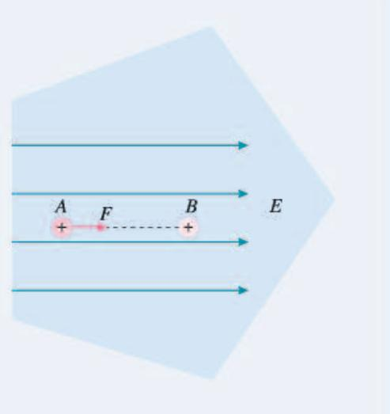

## 思考与讨论

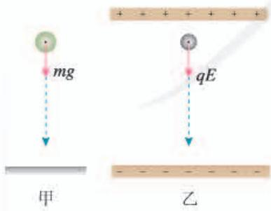  
图10.1-1

## 静电力做功的特点

一个质量为 $m$ 的物体在地面某位置所受的重力是一定的，不管它怎样运动，其所受重力的大小都等于 $mg$ 方向竖直向下（图10.1-1甲）；一个带正电的电荷量为 $q$ 的试探电荷在匀强电场中某位置所受的静电力也是一定的，不管它怎样运动，其所受静电力的大小都等于 $qE$ 方向跟电场强度 $E$ 的方向相同（图10.1-1乙）。

重力做功具有跟路径无关的特点，静电力做功是否也具有这一特点？

如图 10.1-2，在电场强度为 E 的匀强电场中任取 A、B 两点，把试探电荷 q 沿两条不同路径从 A 点移动到 B 点，计算这两种情况下静电力对电荷所做的功。

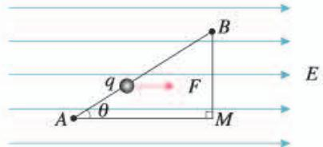

把 q 沿直线 AB 从 A 点移动到 B 点。在这个过程中，q 受到的静电力 F 与位移 AB 的夹角始终为 $\theta$ ，静电力对 q 所做的功为

图10.1-2

$$
W _ {A B} = F \cos \theta | A B | = q E \cos \theta | A B | = q E | A M |
$$

再把 q 沿折线 AMB 从 A 点移动到 B 点。在 q 沿 AM 移动过程中，静电力对 q 所做的功

$$
W _ {A M} = q E | A M |
$$

在 q 沿 MB 移动过程中，由于移动方向跟静电力方向垂直，静电力不做功， $W_{MB}=0$ 。

在整个移动过程中，静电力对 $q$ 所做的功

$$
W _ {A M B} = W _ {A M} + W _ {M B} = q E | A M |
$$

所以，以上两种不同路径中静电力对 q 所做的功是一样的。

另外，还可以使 $q$ 沿任意曲线 $ANB$ 从 $A$ 点移动到 $B$ 点（图10.1-3）。这时，我们把曲线分成无数小段，每一小段中，设想 $q$ 都从起点先沿电场方向、再沿垂直电场方向到达终点。各小段沿垂直电场方向运动时，静电力是不做功的，各小段沿电场方向移动的位移之和等于 $\left|AM\right|$ 。因此， $q$ 沿任意曲线从 $A$ 点移动到 $B$ 点静电力所做的功也是

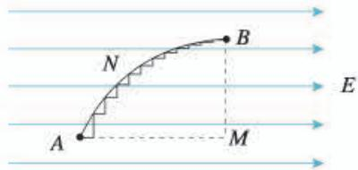  
图10.1-3

$$
W = q E | A M |
$$

可见，不论 q 经由什么路径从 A 点移动到 B 点，静电力所做的功都是一样的。因此，在匀强电场中移动电荷时，静电力所做的功与电荷的起始位置和终止位置有关，与电荷经过的路径无关。

这个结论虽然是从匀强电场中推导出来的，但是可以证明对非匀强电场也是适用的。

## 电势能

我们知道，功和能量的变化密切相关。例如，重力做功等于重力势能的减少量。节前“问题”中电荷所减少的能量，必定跟静电力做的功相关。静电力做功具有跟重力做功一样的特点，即静电力做功的多少与路径无关，只与电荷在电场中的始、末位置有关。电荷在电场中也具有势能，我们称这种形式的能为电势能（electric potential energy），用 $E_{p}$ 表示。

这里我们又用到了通过某种力做的功来研究与它相关的能量问题的方法。

多远是“无限远”？在研究静电场的问题中，如果离场源电荷已经很远，以至于试探电荷已经不能探测到电场了，这点就可以算是“无限远”。

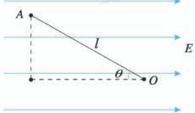  
图10.1-4

如果用 $W_{AB}$ 表示电荷由A点运动到B点静电力所做的功， $E_{pA}$ 和 $E_{pB}$ 分别表示电荷在A点和B点的电势能，它们之间的关系为

$$
W _ {A B} = E _ {\mathrm{pA}} - E _ {\mathrm{pB}}
$$

当 $W_{AB}$ 为正值时， $E_{pA} > E_{pB}$ ，表明静电力做正功，电势能减少。

当 $W_{AB}$ 为负值时， $E_{pA} < E_{pB}$ ，表明静电力做负功，电势能增加。

这跟重力做正功或负功时，重力势能的变化情况相似。

应该注意，静电力做的功只能决定电势能的变化量，而不能决定电荷在电场中某点电势能的数值。只有先把电场中某点的电势能规定为0，才能确定电荷在电场中其他点的电势能。

例如，若规定图10.1-2中的电荷在 $B$ 点的电势能为0，则电荷在 $A$ 点的电势能数值上等于 $W_{AB}$ 。也就是说，电荷在某点的电势能，等于把它从这点移动到零势能位置时静电力所做的功。

通常把电荷在离场源电荷无限远处的电势能规定为0，或把电荷在大地表面的电势能规定为0。

重力势能属于地球和物体组成的系统，是地球和物体相互作用产生的。同样，电势能是相互作用的电荷所共有的，或者说是电荷及对它作用的电场所共有的。我们说某个电荷的电势能，只是一种简略的说法。

## 电势

前面我们通过对静电力的研究，认识了电场强度。现在我们要通过对电势能的研究来认识另一个物理量——电势，它同样是表征电场性质的重要物理量。

有一个电场强度为E的匀强电场（图10.1-4），规定电荷在O点的电势能为0。A为电场中的任意一点，电荷q在A点的电势能为 $E_{pA}$ ，等于电荷q由A点移动到O点的过程中静电力所做的功，数值为 $W_{AO}$ 。

如果把一个电荷量为 $nq$ 的电荷也由 $A$ 点移动到 $O$ 点，由于移动过程中该电荷在任何一点所受的静电力始终是电荷量为 $q$ 的电荷的 $n$ 倍，它们的位移一样，因此，移动该电荷所做的功必定是 $nW_{AO}$ 。

## 思考与讨论

这个功与电荷的多少有关，显然不能用它来表示电场某点的性质，不过，以上分析会给我们一些启示。请你进一步分析，是否能找到反映电场某点性质的物理量。

由前面的分析可知，置于A点的电荷，如果它的电荷量变为原来的几倍，其电势能也变为原来的几倍，电势能与电荷量之比却是一定的，与放在A点的电荷量多少无关。它是由电场中该点的性质决定的，与试探电荷本身无关。

这个结论虽然是从匀强电场得出的，但可以证明对于其他电场同样适用。

电荷在电场中某一点的电势能与它的电荷量之比，叫作电场在这一点的电势（electric potential）。如果用 $\varphi$ 表示电势，用 $E_{p}$ 表示电荷 q 的电势能，则

$$
\varphi = \frac {E _ {\mathrm{p}}}{q}
$$

在国际单位制中，电势的单位是伏特（volt），符号是V。在电场中的某一点，如果电荷量为1C的电荷在这点的电势能是1J，这一点的电势就是1V，即

$$
1 \mathrm{V} = 1 \mathrm{J/C}
$$

在图10.1-4中，假如正的试探电荷沿着电场线从左向右移向 $O$ 点，它的电势能是逐渐减少的。可以说，沿着电场线方向电势逐渐降低。

与电势能的情况相似，应该先规定电场中某处的电势为0，然后才能确定电场中其他各点的电势。

在规定了零电势点之后，电场中各点的电势可以是正值，也可以是负值。

在物理学的理论研究中常取离场源电荷无限远处的电势为0，在实际应用中常取大地的电势为0。 $^{①}$

电势只有大小，没有方向，是个标量。

## 练习与应用

1. 如图 10.1-5，在电场强度为 60 N/C 的匀强电场中有 A、B、C 三个点，AB 为 5 cm，BC 为 12 cm，其中 AB 沿电场方向，BC 和电场方向的夹角为 $60^{\circ}$ 。将电荷量为 $4 \times 10^{-8} \mathrm{C}$ 的正电荷从 $A$ 点移到 $B$ 点，再从 $B$ 点移到 $C$ 点，静电力做了多少功？若将该电荷沿直线由 $A$ 点移到 $C$ 点，静电力做的功又是多少？

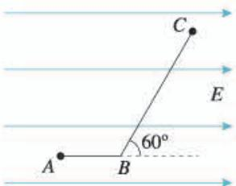  
图10.1-5

2. 电荷量 $q_{1}$ 为 $4 \times 10^{-9} \mathrm{C}$ 的试探电荷放在电场中的A点，具有 $6 \times 10^{-8} \mathrm{~J}$ 的电势能。A点的电势是多少？若把 $q_{2}$ 为 $-2 \times 10^{-10} \mathrm{C}$ 的试探电荷放在电场中的A点， $q_{2}$ 所具有的电势能是多少？

3. 回答下列题目后小结：如何根据试探电荷的电势能来判断电场中两点电势的高低？

(1) q 在 A 点的电势能比在 B 点的大，A、B 两点哪点电势高？

(2) - q 在 C 点的电势能比在 D 点的大，C、D 两点哪点电势高？

(3) q 在 E 点的电势能为负值，-q 在 F 点的电势能是负值，E、F 两点哪点电势高？

4. 根据图 10.1-6 解答以下题目，然后进行小结：如何根据匀强电场的电场线来判断两点电势的高低？

（1）M、N是匀强电场中同一条电场线上的两点，哪点电势高？

(2) M、P 是匀强电场中不在同一条电场线上的两点,AB是过M点与电场线垂直的直线,则M、P两点哪点电势高?

  
图10.1-6

5. 如图10.1-7，A、B是点电荷电场中同一条电场线上的两点，把电荷量 $q_{1}$ 为 $10^{-9}C$ 的试探电荷从无穷远移到A点，静电力做的功为 $4\times10^{-8}J$ ；把 $q_{2}$ 为 $-2\times10^{-9}C$ 的试探电荷从无穷远移到B点，静电力做的功为 $-6\times10^{-8}J$ 。请判断：场源电荷是正电荷还是负电荷？场源电荷的位置是在A、B的左边还是右边？

  
图10.1-7

6. 一个电场中有 A、B 两点，电荷量 $q_{1}$ 为 $2 \times 10^{-9} C$ 的试探电荷放在电场中的 A 点，具有 $-4 \times 10^{-8} J$ 的电势能； $q_{2}$ 为 $-3 \times 10^{-9} C$ 的试探电荷放在电场中的 B 点，具有 $9 \times 10^{-8} J$ 的电势能。现把 $q_{3}$ 为 $-5 \times 10^{-9} C$ 的试探电荷由 A 点移到 B 点，静电力做正功还是负功？数值是多少？

7. 如图 10.1-8，A、B 为一对等量同种电荷连线上的两点（其中 B 为中点），C 为连线中垂线上的一点。今将一个电荷量为 q 的负点电荷自 A 沿直线移到 B 再沿直线移到 C，请分析在此过程中该电荷的电势能的变化情况。

  
图10.1-8

## 2 电势差

## 问题

如果我们要从6楼走到8楼，影响我们做功多少的因素是这两层楼的高度差而不是楼的高度。

某个电荷在确定的电场中由A点移动到B点，影响静电力做功多少的因素可能是A点或B点的电势值呢？还是A、B两点之间电势的差值呢？

## 电势差

选择不同的位置作为零电势点，电场中某点电势的数值也会改变，但电场中某两点之间电势的差值却保持不变。

在电场中，两点之间电势的差值叫作电势差（electric potential difference），电势差也叫作电压（voltage）。设电场中A点的电势为 $\varphi_{A}$ ，B点的电势为 $\varphi_{B}$ ，则它们之间的电势差可以表示为

$$
U _ {A B} = \varphi_ {A} - \varphi_ {B}
$$

也可以表示为

$$
U _ {B A} = \varphi_ {B} - \varphi_ {A}
$$

显然

$$
U _ {A B} = - U _ {B A}
$$

电势差可以是正值，也可以是负值。例如，当A点电势比B点电势高时， $U_{AB}$ 为正值， $U_{BA}$ 则为负值。

电荷q 在电场中从A点移动到B点时，静电力做的功 $W_{AB}$ 等于电荷在A、B两点的电势能之差。由此可以导出静电力做的功与电势差的关系

$$
\begin{array}{r} W _ {A B} = E _ {\mathrm{pA}} - E _ {\mathrm{pB}} \\ W _ {A B} = q \varphi_ {A} - q \varphi_ {B} = q (\varphi_ {A} - \varphi_ {B}) = q U _ {A B} \end{array}
$$

即

$$
U _ {A B} = \frac {W _ {A B}}{q}
$$

因此，知道了电场中两点的电势差，就可以很方便地计算在这两点之间移动电荷时静电力做的功，而不必考虑静电力和电荷移动的路径。正是因为这个缘故，在物理学中，电势的差值往往比电势更重要。

## 【例题】

在匀强电场中把电荷量为 $2.0 \times 10^{-9} \mathrm{C}$ 的点电荷从 $A$ 点移动到 $B$ 点，静电力做的功为 $1.6 \times 10^{-7} \mathrm{~J}$ 。再把这个电荷从 $B$ 点移动到 $C$ 点，静电力做的功为 $-4.0 \times 10^{-7} \mathrm{~J}$ 。

(1) A、B、C三点中，哪点电势最高？哪点电势最低？

(2) A、B 间，B、C 间，A、C 间的电势差各是多大？

（3）把电荷量为 $-1.5 \times 10^{-9} \mathrm{C}$ 的点电荷从 $A$ 点移动到 $C$ 点，静电力做的功是多少？

（4）根据以上结果，定性地画出电场分布的示意图，标出A、B、C三点可能的位置。

解（1）电荷从 A 点移动到 B 点，静电力做正功，所以 A 点电势比 B 点电势高。电荷从 B 点移动到 C 点，静电力做负功，所以 C 点电势比 B 点电势高。但 C、B 之间电势差的绝对值比 A、B 之间电势差的绝对值大，所以 C 点电势最高，A 点电势次之，B 点电势最低。

(2) 根据静电力做的功与电势差的关系, $A 、 B$ 间的电势差

$$
U _ {A B} = \frac {W _ {A B}}{q} = \frac {1 . 6 \times 1 0 ^ {- 7}}{2 . 0 \times 1 0 ^ {- 9}} \mathrm{V} = 8 0 \mathrm{V}
$$

A 点电势比 B 点电势高 80 V。

同样，根据静电力做的功与电势差的关系，B、C间的电势差

$$
U _ {B C} = \frac {W _ {B C}}{q} = \frac {- 4 . 0 \times 1 0 ^ {- 7}}{2 . 0 \times 1 0 ^ {- 9}} \mathrm{V} = - 2 0 0 \mathrm{V}
$$

C 点电势比 B 点电势高 200 V。

A、C间的电势差

$$
U _ {A C} = U _ {A B} + U _ {B C} = 8 0 \mathrm{V} - 2 0 0 \mathrm{V} = - 1 2 0 \mathrm{V}
$$

(3) 电荷量 $q' = -1.5 \times 10^{-9} \mathrm{C}$ 的点电荷, 从 $A$ 点移动到 $C$ 点时, 静电力做的功为

  
图10.2-1

$$
\begin{array}{r l} W _ {A C} & = q ^ {\prime} U _ {A C} \\ & = (- 1. 5 \times 1 0 ^ {- 9}) \times (- 1 2 0) \mathrm{J} = 1. 8 \times 1 0 ^ {- 7} \mathrm{J} \end{array}
$$

即静电力做正功 $1.8 \times 10^{-7}$ J。

（4）电场分布示意图和 A、B、C 三点可能的位置如图 10.2-1 所示。

## 等势面

在地图中，常用等高线来表示地势的高低（图10.2-2）。与此相似，在电场的图示中，常用等势面来表示电势的高低。我们把在电场中电势相同的各点构成的面叫作等势面（equipotential surface）。与电场线的功能相似，等势面也是用来形象地描绘电场的。等势面与电场线有什么关系呢？

  
图10.2-2

在同一个等势面上，任何两点的电势都相等。所以，在同一个等势面上移动电荷时，静电力不做功。由此可知，等势面一定跟电场线垂直，即跟电场强度的方向垂直。这是因为，假如不垂直，电场强度就有一个沿着等势面的分量，在等势面上移动电荷时静电力就要做功，这与这个面是等势面矛盾。前面已经说过，沿着电场线的方向，电势越来越低。所以，概括起来就是：电场线跟等势面垂直，并且由电势高的等势面指向电势低的等势面。

这里讨论等势面与电场线的关系时用到了反证法。反证法是科学研究中重要的逻辑方法。

图 10.2-3 是几种电场的等势面和电场线。每幅图中，两个相邻的等势面间的电势差是相等的。

  
甲 点电荷

  
乙 带等量异种电荷的平行板  
图10.2-3

## 思考与讨论

电势的高低跟重力场中位置的高低的含义有相似之处。例如，某处位置的高低跟放在该处物体的质量无关，某点电势的高低跟放在该点的试探电荷的电荷量无关。

由于电荷有正负之分，这就造成了二者的含义有所不同。

请讨论，它们有哪些不同。例如，质量相等的物体，处于较高位置的重力势能较大，那么电荷量数值相等的正负电荷，处于电势较高位置的电势能一定较大吗？

## 练习与应用

1. 在某电场中，已知 $A 、 B$ 两点之间的电势差 $U_{AB}$ 为 $20 \mathrm{~V}, q$ 为 $-2 \times 10^{-9} \mathrm{C}$ 的电荷由 $A$ 点移动到 $B$ 点，静电力做的功是多少？电势能是增加还是减少，增加或者减少多少？

2. 在研究微观粒子时常用电子伏（eV）作为能量的单位。1 eV等于一个电子经过1 V电压加速后所增加的动能，那么，1 eV等于多少焦耳？

3. 如图 10.2-4，回答以下问题。

(1) A、B 哪点的电势比较高？负电荷在哪点的电势能比较大？

（2）负电荷由B点移动到A点时，静电力做正功还是负功？

（3）A、B两点的电势差 $U_{AB}$ 是正的还是负的？ $U_{BA}$ 呢？

  
图10.2-4

4. 电场中两个电势不同的等势面能不能相交？说明理由。

5. 某电场的等势面如图10.2-5所示，试画出电场线的大致分布。若单位正电荷沿任一路径从A点移到B点，静电力所做的功是多少？说明理由。正电荷从A点移到C点，跟从B点移到C点，静电力所做的功是否相等？说明理由。

  
图10.2-5

6. 如图10.2-6，在与纸面平行的匀强电场中有 $A$ 、 $B$ 、 $C$ 三个点，其电势分别为 $6\mathrm{V}$ 、 $2\mathrm{V}$ 和 $2\mathrm{V}$ 。试画出经过 $A$ 点的电场线。

  
图10.2-6

## 3 电势差与电场强度的关系

## 问题

如果只画出带电体空间分布的电场线和等势面的剖面图，等势面就成了等势线。图中每相邻两条等势线之间的电势差是相等的。电场线密的地方等势线也密，电场线稀疏的地方等势线也稀疏。这是为什么呢？

电场线是描述电场强度的，等势线是描述电势的，电场线和等势线的疏密存在对应关系，表明电场强度和电势之间存在一定的联系。下面以匀强电场为例讨论它们的关系。

如图10.3-1，匀强电场的电场强度为 $E$ ，电荷 $q$ 从 $A$ 点移动到 $B$ 点，静电力做的功 $W$ 与 $A$ 、 $B$ 两点的电势差 $U_{AB}$ 的关系为 $W = qU_{AB}$ 。我们也可以从 $q$ 所受的静电力来计算功，这个力是 $F = qE$ 。在匀强电场中，电荷 $q$ 所受的静电力 $F$ 是恒力，它所做的功为

  
图10.3-1 讨论匀强电场的电势差与电场强度的关系

$$
W = F d = q E d
$$

比较功的两个计算结果，得到

$$
U _ {A B} = E d
$$

即：匀强电场中两点间的电势差等于电场强度与这两点沿电场方向的距离的乘积。

## 思考与讨论

在上面的讨论中，如果 A、B 两点不在同一条电场线上（图 10.3-2），还能得出以上结论吗？请尝试进行论证。

  
图10.3-2 不在一条电场线上电势差与电场强度的关系

此关系式可以得到电场强度的单位是伏每米（V/m）。这个单位与前面学过的单位牛每库（N/C）是相同的。即

电场强度与电势差的关系也可以写作

$$
1 \mathrm{V} / \mathrm{m} = 1 \mathrm{N} / \mathrm{C}
$$

$$
E = \frac {U _ {A B}}{d}
$$

它的意义是：在匀强电场中，电场强度的大小等于两点之间的电势差与两点沿电场强度方向的距离之比。也就是说，电场强度在数值上等于沿电场方向单位距离上降低的电势。

上式表明，两相邻等势线之间的电势差 U 相同时，电场强度 E 越大的地方，两相邻等势线之间的距离 d 越小，这就是电场线较密的地方等势线也较密的原因。

【例题】

如图10.3-3，真空中平行金属板M、N之间的距离 $d$ 为 $0.04\mathrm{m}$ ，有一个 $2\times 10^{-15}\mathrm{kg}$ 的带电粒子位于M板旁，粒子的电荷量为 $8\times 10^{-15}\mathrm{C}$ ，给两金属板加 $200\mathrm{V}$ 直流电压。

(1) 求带电粒子所受的静电力的大小。

(2) 求带电粒子从M板由静止开始运动到达N板时的速度。

（3）如果两金属板距离增大为原来的2倍，其他条件不变，则上述问题（1）（2）的答案又如何？

  
图10.3-3

解（1）两金属板间的电场强度 $E=\frac{U}{d}$ ，带电粒子所受的静电力F=Eq，则有

$$
F = E q = \frac {U q}{d} = \frac {2 0 0 \times 8 \times 1 0 ^ {- 1 5}}{0 . 0 4} \mathrm{N} = 4 \times 1 0 ^ {- 1 1} \mathrm{N}
$$

(2) 静电力远大于重力 $2 \times 10^{-14}$ N，因此重力可忽略不计。

带电粒子运动的加速度 $a=\frac{F}{m}$ ，设带电粒子到达N板时速度为v。根据匀变速直线运动的速度与时间的关系有 $v^{2}=2ad$ ，则

$$
v = \sqrt {\frac {2 F d}{m}} = \sqrt {\frac {2 \times 4 \times 1 0 ^ {- 1 1} \times 0 . 0 4}{2 \times 1 0 ^ {- 1 5}}} \mathrm{m/s} = 4 0 \mathrm{m/s}
$$

（3）当 $d' = 2d$ 时， $E' = \frac{U}{d'} = \frac{E}{2}$ ， $F' = E'q = \frac{F}{2}$ ， $a' = \frac{F'}{m} = \frac{a}{2}$ ，则

$$
v ^ {\prime} = \sqrt {2 a ^ {\prime} d ^ {\prime}} = \sqrt {2 a d} = v = 4 0 \mathrm{m/s}
$$

带电粒子所受的静电力的大小是 $4 \times 10^{-11}$ N，到达N板时的速度是40 m/s；两金属板距离增大为原来的2倍时，静电力的大小是 $2 \times 10^{-11}$ N，速度仍然是40 m/s。

上述例题告诉我们，当 M、N 板间的距离增大时，只要它们之间的电势差没有变化，带电粒子到达 N 板的速度大小也不会变化。这很容易运用动能定理来解释，由静电力做的功等于带电粒子动能的变化，得

$$
q U = \frac {1}{2} m v ^ {2}
$$

▶ 只要加速电压U是一定的，带电粒子加速后所获得的动能就是一定的。

## 思考与讨论

上述例题中，M、N 是两块平行金属板，两板间的电场是匀强电场。如果 M、N 是其他形状，中间的电场不再均匀，例题中的三个问题还有确定答案吗？为什么？

## 练习与应用

1. 空气是不导电的。但是如果空气中的电场很强，使得气体分子中带正、负电荷的微粒所受的方向相反的静电力很大，以至于分子“破碎”，空气中出现可以自由移动的电荷，空气就变成了导体。这个现象叫作空气的“击穿”。

一次实验中，电压为 $4 \times 10^{4} \mathrm{~V}$ 的直流电源的两极连在一对平行金属板上，如果把两金属板的距离减小到 $1.3 \mathrm{~cm}$ ，两板之间就会放电。这次实验中空气被击穿时的电场强度是多少？

2. 带有等量异种电荷、相距 10 cm 的平行板 A 和 B 之间有匀强电场（图 10.3-4），电场强度 E 为 $2 \times 10^{4}$ V/m，方向向下。电场中 C 点距 B 板 3 cm，D 点距 A 板 2 cm。

(1) C、D 两点哪点电势高？两点的电势差 $U_{CD}$ 等于多少？

（2）如果把B板接地，则C点和D点的电势 $\varphi_{C}$ 和 $\varphi_{D}$ 各是多少？如果把A板接地，则 $\varphi_{C}$ 和 $\varphi_{D}$ 各是多少？在这两种情况中， $U_{CD}$ 相同吗？

（3）一个电子从 C 点移动到 D 点，静电力做多少功？如果使电子从 C 点先移到 P 点，再移到 D 点，静电力做的功是否会发生变化？

  
图10.3-4

3. 图 10.3-5 是某初中地理教科书中的等高线图（图中数字的单位是米）。小山坡的左边 a 和右边 b，哪一边的地势更陡些？如果把一个球分别从山坡左右两边滚下（把山坡的两边看成两个斜面，不考虑摩擦等阻碍），哪边的加速度更大？

现在把该图看成一个描述电势高低的等势线图，图中的单位是伏特，a 和 b 哪一边电势降落得快？哪一边的电场强度大？

  
图10.3-5

## 4 电容器的电容

## 问题

水可以用容器储存起来，电荷也可以用一个“容器”储存起来。图中的元件就是这样的“容器”——电容器。那么，它内部的构造是怎样的？它是怎样“装进”和“倒出”电荷的呢？

## 电容器

电容器（capacitor）是一种重要的电学元件。在两个相距很近的平行金属板中间夹上一层绝缘物质——电介质（空气也是一种电介质），就组成一个最简单的电容器，叫作平行板电容器。这两个金属板叫作电容器的极板。实际上，任何两个彼此绝缘又相距很近的导体，都可以看成一个电容器。

## 实验

  
图10.4-1 电容器的充、放电

## 观察电容器的充、放电现象

把直流电源、电阻、电容器、电流表、电压表以及单刀双掷开关组装成实验电路（图 10.4-1）。

把开关 S 接 1，此时电源给电容器充电。在充电过程中，可以看到电压表示数迅速增大，随后逐渐稳定在某一数值，表示电容器两极板具有一定的电势差。通过观察电流表可以知道，充电时电流由电源的正极流向电容器的正极板。同时，电流从电容器的负极板流向电源的负极。随着两极板之间电势差的增大，充电电流逐渐减小至 0，此时电容器两极板带有一定的等量异种电荷。即使断开电源，两极板上的电荷由于相互吸引而仍然被保存在电容器中。

把开关S接2，电容器对电阻R放电。观察电流表可以知道，放电电流由电容器的正极板经过电阻R流向电容器的负极板，正负电荷中和。此时两极板所带的电荷量减小，电势差减小，放电电流也减小，最后两极板电势差以及放电电流都等于0。

电容器充电的过程中，两极板的电荷量增加，极板间的电场强度增大，电源的能量不断储存在电容器中；放电的过程中，电容器把储存的能量通过电流做功转化为电路中其他形式的能量。

## 拓展学习

  
甲 观察电容器放电的电路图

  
图10.4-2 用传感器在计算机上观察电容器的放电

  
图10.4-3 一个电容器放电的 $I - t$ 图像

## 用传感器观察电容器的放电过程

电流传感器可以像电流表一样测量电流。不同的是，它的反应非常快，可以捕捉到瞬间的电流变化。此外，由于它与计算机相连，还能显示出电流随时间变化的 $I - t$ 图像。

按照图 10.4-2 甲连接电路。电源用直流 8V 左右，电容器可选几十微法的电解电容器。先使开关 S 与 1 端相连，电源向电容器充电，这个过程可在短时间内完成。然后把开关 S 掷向 2 端，电容器通过电阻 R 放电，传感器将电流信息传入计算机，屏幕上显示出电流随时间变化的 I-t 图像（图 10.4-2 乙）。

一位同学得到的 $I - t$ 图像如图10.4-3所示，电源电压是 $8\mathrm{V}$ 。

（1）在图中画一个竖立的狭长矩形（在图10.4-3的最左边），它的面积的物理意义是什么？

（2）怎样根据 $I - t$ 图像估算电容器在全部放电过程中释放的电荷量？试着算一算。

如果要测绘充电时的 I-t 图像，应该怎样连接电路？怎样进行测量？得到的 I-t 图像可能是什么形状的？

## 电容

## 演示

  
图 10.4-4 实验电路图

这里说的“电容器所带的电荷量Q”，是指一个极板所带电荷量的绝对值。

▶ 你觉得用 $\frac{Q}{U}$ 和 $\frac{U}{Q}$ 定义电容，哪个更好？

  
图10.4-5

在图 10.4-1 电容器充电的实验中，我们看到，电容器两极板之间的电势差增大时，电流表的示数不为 0，这表明电容器所带的电荷量也在增加。那么，电容器所带的电荷量跟两极板间的电势差是否存在某种定量关系？

## 电容器两极板间电势差跟所带电荷量的关系

实验电路图如图 10.4-4 所示。取一个电容器 A 和数字电压表相连，把开关 $S_{1}$ 接 1，用几节干电池串联后给 A 充电，可以看到 A 充电后两极板具有一定的电压。

把开关 $S_{1}$ 接 2，使另一个相同的但不带电的电容器 B 跟 A 并联（注意不要让手或其他导体跟电容器的两极板接触，以免所带电荷漏失），可以看到电压表示数变为原来的一半；断开开关 $S_{1}$ ，闭合开关 $S_{2}$ ，让 B 的两极板完全放电，随后再断开开关 $S_{2}$ ，把 B 和 A 并联，电压表示数再次减少一半。

还可以继续这样操作……

以上实验表明，电容器的电荷量变为原来的一半时，其两极板间的电势差也变为原来的一半。

精确的实验表明，一个电容器所带的电荷量 $Q$ 与两极板之间的电势差 $U$ 之比是不变的。不同的电容器，这个比一般是不同的，可见电荷量 $Q$ 与电势差 $U$ 之比表征了电容器储存电荷的特性。

电容器所带的电荷量 Q 与电容器两极板之间的电势差 U 之比，叫作电容器的电容（capacitance）。用 C 表示，则有

$$
C = \frac {Q}{U}
$$

上式表示，电容器的电容在数值上等于使两极板间的电势差为1 V时电容器需要带的电荷量，电荷量越多，表示电容器的电容越大。这类似于用不同的容器装水。如图10.4-5，要使容器中的水深都为1 cm，横截面积大的容器需要的水多。

在国际单位制中，电容的单位是法拉（farad），简称法，符号是 F。如果一个电容器两极板之间的电势差是 1 V 时，所带的电荷量是 1 C，这个电容器的电容就是 1 F。

实际中常用的单位还有微法（μF）和皮法（pF），它们与法拉的关系是

$$
\begin{array}{l} 1 \mu \mathrm{F} = 1 0 ^ {- 6} \mathrm{F} \\ 1 \mathrm{pF} = 1 0 ^ {- 1 2} \mathrm{F} \end{array}
$$

加在电容器两极板上的电压不能超过某一限度，超过这个限度，电介质将被击穿，电容器损坏。这个极限电压叫作击穿电压。电容器外壳上标的是工作电压，或称额定电压，这个数值比击穿电压低。

## 拓展学习

## 平行板电容器的电容

平行板电容器是最简单的，也是最基本的电容器。几乎所有电容器都是平行板电容器的变形。平行板电容器的电容是由哪些因素决定的呢？我们通过以下实验来研究。

如图 10.4-6，用静电计 $^{①}$ 测量已经充电的平行板电容器两极板之间的电势差 U。

1. 保持极板上的电荷量 Q 不变，两极板间的距离 d 也不变，改变两极板的正对面积 S，通过静电计指针的变化得到两极板之间电势差的变化。根据电容的定义式 $C = \frac{Q}{U}$ ，由电势差的变化判断电容的变化，从而得到正对面积 S 对电容 C 的影响（图 10.4-6 甲）。

2. 保持极板上的电荷量 Q 不变，两极板的正对面积 S 也不变，改变两极板间的距离 d，通过静电计指针的变化得到两极板之间电势差的变化。同上所述，由电势差的变化判断电容的变化，从而得到两极板之间的距离 d 对电容 C 的影响（图 10.4-6 乙）。

3. 保持 $Q$ 、 $S$ 、 $d$ 都不变，在两极板间插入电介质，例如有机玻璃板。通过静电计指针的变化得知两极板间电势差的变化。同上所述，由电势差的变化判断电容的变化，从而得到两极板之间电介质的存在对电容 C 的影响（图 10.4-6 丙）。

  
甲 正对面积 S 对电容 C 的影响

  
乙 两板间的距离 $d$ 对电容 $C$ 的影响

  
丙 电介质对电容 $C$ 的影响  
图10.4-6 研究影响平行板电容器电容大小的因素

通过实验可以得出如下结论：减小平行板电容器两极板的正对面积、增大两极板之间的距离都能减小平行板电容器的电容；而在两极板之间插入电介质，却能增大平行板电容器的电容。反之亦然。

理论分析表明，当平行板电容器的两极板之间是真空时，电容 C 与极板的正对面积 S、极板间的距离 d 的关系为

$$
C = \frac {S}{4 \pi k d}
$$

式中 k 为静电力常量。

当两极板之间充满同一种介质时，电容变大为真空时的 $\varepsilon_{\mathrm{r}}$ 倍，即

$$
C = \frac {\varepsilon_ {r} S}{4 \pi k d}
$$

$\varepsilon_{r}$ 是一个常数，与电介质的性质有关，叫作电介质的相对介电常数。

## 常用电容器

图10.4-7 固定电容器  
  
图 10.4-8 可变电容器

常用的电容器，从构造上看，可以分为固定电容器和可变电容器两类。固定电容器的电容是固定不变的。常用的有聚苯乙烯电容器和电解电容器。

以聚苯乙烯薄膜为电介质，把两层铝箔隔开，卷起来，就制成了聚苯乙烯电容器（图10.4-7甲）。改变铝箔的面积和薄膜的厚度，可以制成不同电容的聚苯乙烯电容器。以陶瓷为电介质的固定电容器也很多。

电解电容器（图10.4-7乙）是用铝箔作为一个极板，用铝箔上很薄的一层氧化膜为电介质，用浸过电解液的纸作为另一个极板（要靠另一片铝箔与外部引线连接）制成的。由于氧化膜很薄，所以电容较大。

可变电容器由两组铝片组成（图10.4-8），它的电容是可以改变的。固定的一组铝片叫作定片，可以转动的一组铝片叫作动片。转动动片，使两组铝片的正对面积发生变化，电容就随着改变。

超级电容器是20世纪70年代根据电化学原理研发的一种新型电容器，它的出现使电容器的容量得到了巨大的提升。超级电容器的充电时间短，储存电能多，放电功率大，使用寿命长。这些优点展现了它作为新型动力电源的广阔发展前景。

1. 用图 10.4-1 的电路给电容器充、放电。开关 S 接通 1，稳定后改接 2，稳定后又改接 1，如此往复。下表记录了充、放电过程中某两个时刻通过电流表的电流方向，试根据该信息，在表格内各空格处填上合理的答案。

2. 有人用图10.4-9描述某电容器充电时，其电荷量 $Q$ 、电压 $U$ 、电容 $C$ 之间的相互关系，请判断它们的正误，并说明理由。

图10.4-9  

3. 有一个已充电的电容器，两极板之间的电压为 $3 \mathrm{~V}$ ，所带电荷量为 $4.5 \times 10^{-4} \mathrm{C}$ ，此电容器的电容是多少？将电容器的电压降为 $2 \mathrm{~V}$ ，电容器的电容是多少？所带电荷量是多少？

4. 心室纤颤是一种可能危及生命的疾病。一种叫作心脏除颤器的设备，通过一个充电的电容器对心颤患者皮肤上的两个电极板放电，让一部分电荷通过心脏，使心脏完全停止跳动，再刺激心颤患者的心脏恢复正常跳动。

图10.4-10是一次心脏除颤器的模拟治疗，该心脏除颤器的电容器电容为 $15\mu \mathrm{F}$ ，如果充电后电容器的电压为 $4.0\mathrm{kV}$ ，电容器在一定时间内放电至两极板之间的电压为0，这次放电有多少电荷量通过人体组织？

  
图10.4-10

表 充、放电过程中某两个时刻的电路情况

<table><tr><td>时刻</td><td>在此时刻通过图中电流表的电流方向</td><td>电流表中的电流正在增大还是减小</td><td>开关S当前正在接通1还是接通2</td><td>电容器两端的电压正在增大还是减小</td><td>整个电路中的能量正在怎样转化</td><td>这个时候电容器是在充电还是在放电</td></tr><tr><td> $t_{1}$ </td><td>向左</td><td></td><td></td><td></td><td></td><td></td></tr><tr><td> $t_{2}$ </td><td>向右</td><td></td><td></td><td></td><td></td><td></td></tr></table>

## 5 带电粒子在电场中的运动

## 问题

电子被加速器加速后轰击重金属靶时，会产生射线，可用于放射治疗。图中展示了一台医用电子直线加速器。

电子在加速器中是受到什么力的作用而加速的呢？

## 带电粒子在电场中的加速

在现代科学实验和技术设备中，常常利用电场来改变或控制带电粒子的运动。利用电场使带电粒子加速，就是其中一种简单的情况。在这种情况中，带电粒子的速度方向与电场强度的方向相同或相反。

分析带电粒子加速的问题，常常有两种思路：一种是利用牛顿第二定律结合匀变速直线运动公式来分析；另一种是利用静电力做功结合动能定理来分析。

你能说一说本章第3节例题中运用了哪种解决思路吗？

当解决的问题属于匀强电场且涉及运动时间等描述运动过程的物理量时，适合运用前一种思路分析；当问题只涉及位移、速率等动能定理公式中的物理量或非匀强电场情景时，适合运用后一种思路分析。

## 【例题1】

如图 10.5-1 甲，某装置中，多个横截面积相同的金属圆筒依次排列，其中心轴线在同一直线上，圆筒的长度依照一定的规律依次增加。序号为奇数的圆筒和交变电源的一个极相连，序号为偶数的圆筒和该电源的另一个极相连。

交变电源两极间电势差的变化规律如图10.5-1乙所示。在 $t = 0$ 时，奇数圆筒相对偶数圆筒的电势差为正值，此时位于和偶数圆筒相连的金属圆板（序号为0）中央的一个电子，在圆板和圆筒1之间的电场中由静止开始加速，沿中心轴线冲进圆筒1。

为使电子运动到圆筒与圆筒之间各个间隙中都能恰好使静电力的方向跟运动方向相同而不断加速，圆筒长度的设计必须遵照一定的规律。若已知电子的质量为 $m$ 、电子电荷量为 $e$ 、电压的绝对值为 $u$ ，周期为 $T$ ，电子通过圆筒间隙的时间可以忽略不计。则金属圆筒的长度和它的序号之间有什么定量关系？第 $n$ 个金属圆筒的长度应该是多少？

  
乙  
图10.5-1

分析 如图 10.5-1，由于金属导体内部的电场强度等于 0，电子在各个金属圆筒内部都不受静电力的作用，它在圆筒内的运动是匀速直线运动，只是在相邻圆筒的间隙中才会被加速。

为使电子在所有相邻圆筒的间隙中都能受到向右的静电力，电子所到达间隙处的电场强度都必须向左。在同一间隙中，电场强度的方向是周期性变化的，每半个周期，电场强度的方向左右变化一次。如果电子匀速穿过每个圆筒运动的时间恰好等于交变电压的周期的一半，它就能踏准节奏，每到达一个间隙，恰好是该间隙的电场强度变为向左的时刻。

由于电子通过每一个间隙所增加的动能都等于 $eu$ ，由此可知电子在各个圆筒内的动能和速度，而各个圆筒的长度应该等于电子在该圆筒中的速度大小与交变电压的半个周期的乘积。

解 设电子进入第 $n$ 个圆筒后的速度为 $v$ ，根据动能定理有

$$
n e u = \frac {1}{2} m v ^ {2}
$$

得

$$
v = \sqrt {\frac {2 n e u}{m}}
$$

第 $n$ 个圆筒的长度为

$$
l = v t = \frac {v T}{2} = \frac {T}{2 m} \sqrt {2 n e u m}
$$

圆筒长度跟圆筒序号的平方根 $\sqrt{n}$ 成正比，第 n 个圆筒的长度是 $\frac{T}{2m}\sqrt{2neum}$ 。

带电粒子的初速度方向跟电场方向垂直时，静电力方向跟速度方向不在同一直线上，带电粒子的运动轨迹将发生偏转。

在匀强电场中，带电粒子的运动轨迹是一条抛物线，类似平抛运动的轨迹。对这种带电粒子运动的分析思路，跟分析平抛运动是一样的，不同的仅仅是平抛运动物体所受的是重力，而上述带电粒子所受的是静电力。

【例题2】

如图 10.5-2，两相同极板 A 与 B 的长度 l 为 6.0 cm，相距 d 为 2 cm，极板间的电压 U 为 200 V。一个电子沿平行于板面的方向射入电场中，射入时的速度 $v_{0}$ 为 $3.0 \times 10^{7}$ m/s。把两板间的电场看作匀强电场，求电子射出电场时沿垂直于板面方向偏移的距离 y 和偏转的角度 $\theta$ 。

  
图10.5-2

分析 电子在垂直于板面的方向受到静电力。由于电场不随时间改变，而且是匀强电场，所以整个运动中在垂直于板面的方向上加速度是不变的。

解 电子在电场中运动的加速度是

$$
a = \frac {F}{m} = \frac {e E}{m} = \frac {e U}{m d}\tag{1}
$$

电子射出电场时，在垂直于板面方向偏移的距离为

$$
y = \frac {1}{2} a t ^ {2}\tag{2}
$$

其中 t 为飞行时间。由于电子在平行于板面的方向不受力，所以在这个方向做匀速直线运动，由 $l = v_{0}t$ 可求得

$$
t = \frac {l}{v _ {0}}\tag{3}
$$

把（1）（3）式代入（2）式得到

$$
y = \frac {e U l ^ {2}}{2 m d v _ {0} ^ {2}}
$$

代入数值后，解得

$$
y = 0. 3 5 \mathrm{cm}
$$

即电子射出时沿垂直于板面的方向偏离 0.35 cm。

由于电子在平行于板面的方向不受力，它离开电场时，这个方向的分速度仍是 $v_{0}$ （图10.5-3），垂直于板面的分速度是

$$
v _ {\perp} = a t = \frac {e U l}{m d v _ {0}}
$$

则离开电场时的偏转角度 $\theta$ 可由下式确定

$$
\tan \theta = \frac {v _ {\perp}}{v _ {0}} = \frac {e U l}{m d v _ {0} ^ {2}}
$$

  
图10.5-3

代入数值后，解得

$$
\theta = 6. 7 ^ {\circ}
$$

电子射出电场时沿垂直于板面方向偏移的距离是0.35cm，偏转的角度是6.7°。

## 拓展学习

## 示波管的原理

有一种电子仪器叫作示波器，可以用来观察电信号随时间变化的情况。示波器的核心部件是示波管，图10.5-4是它的原理图。它由电子枪、偏转电极和荧光屏组成，管内抽成真空。电子枪的作用是产生高速飞行的一束电子，前面例题2实际上讲的就是示波管的原理。

如果在偏转电极 XX' 之间和偏转电极 YY' 之间都没有加电压，电子束从电子枪射出后沿直线运动，打在荧光屏中心，在那里产生一个亮斑。

示波管的YY'偏转电极上加的是待测的信号电压。XX'偏转电极通常接入仪器自身产生的锯齿形电压（图10.5-5），叫作扫描电压。如果信号电压是周期性的，并且扫描电压与信号电压的周期相同，那么，就可以在荧光屏上得到待测信号在一个周期内随时间变化的稳定图像了。

  
甲 示波管的结构

  
乙 荧光屏（从右向左看）  
图10.5-4 示波管原理图  
图10.5-5 扫描电压

## 范德格拉夫静电加速器

范德格拉夫静电加速器由两部分组成，一部分是产生高电压的装置，叫作范德格拉夫起电机；另一部分是利用高电压加速带电粒子的加速管。

图10.5-6是起电机部分的示意图。金属球壳固定在绝缘支柱顶端，绝缘材料制成的传送带套在两个转轮上，由电动机带动循环运转。E和F是两排金属针（叫作电刷）。

当电刷E与几万伏的直流高压电源的正极接通时，E与大地之间就有几万伏的电势差。由于尖端放电，正电荷被喷射到传送带上，并被传送带带着向上运动。当正电荷到达电刷F附近时，F上被感应出异号电荷。由于尖端放电，F上的负电荷与传送带上的正电荷中和，从而使传送带失去电荷，而F上剩下了正电荷。由于导体带电电荷只能存在于外表面，所以，F上的正电荷立即传到金属壳的外表面。这样，由于传送带的运送，正电荷不断从直流电源传到球壳的外表面，从而在金属壳与大地之间形成高电压。

由于电晕放电、局部尖端放电和漏电等现象，球壳与大地间的电压不能无限制提高。目前可达数百万伏。

带电粒子的加速是在加速管中进行的。加速管安装在起电机的绝缘支柱里面，管内抽成真空。管顶有离子发生装置，即粒子源，底部是

  
图 10.5-6 范德格拉夫起电机示意图

靶。粒子源产生的正离子在强电场的作用下，经过加速可以获得很大的动能。由于粒子加速运动的轨迹是直线，这类加速器是一种直线加速器。

在医院，用直线加速器产生的粒子束（射线）治疗某些癌症，称为放射治疗。与使用钴60等放射性物质的放射治疗相比，使用直线加速器不需要放射源，不开机时完全没有射线，更加安全，也便于管理。

1. 真空中有一对平行金属板，相距6.2 cm，两板电势差为90 V。二价的氧离子由静止开始加速，从一个极板到达另一个极板时，动能是多大？这个问题有几种解法？哪种解法比较简便？

2. 某种金属板M受到一束紫外线照射时会不停地发射电子，射出的电子具有不同的方向，速度大小也不相同。在M旁放置一个金属网N。如果用导线将M、N连起来，从M射出的电子落到N上便会沿导线返回M，从而形成电流。现在不把M、N直接相连，而按图10.5-7那样在M、N之间加电压U，发现当U>12.5V时电流表中就没有电流。

问：被这束紫外线照射出的电子，最大速度是多少？

  
图10.5-7

3. 先后让一束电子和一束氢核通过同一对平行板形成的偏转电场，进入时速度方向与电场方向垂直。在下列两种情况下，分别求出电子偏转角的正切与氢核偏转角的正切之比。

(1) 电子与氢核的初速度相同。

(2) 电子与氢核的初动能相同。

4. 让一价氢离子、一价氦离子和二价氦离子的混合物由静止开始经过同一加速电场加速，然后在同一偏转电场里偏转，它们是否会分离为三股粒子束？请通过计算说明。

5. 电子从静止出发被1000 V的电压加速，然后沿着与电场垂直的方向进入另一个电场强度为5000 N/C的匀强偏转电场。已知偏转电极长6 cm，求电子离开偏转电场时的速度及其与进入偏转电场时的速度方向之间的夹角。

6. 某些肿瘤可以用“质子疗法”进行治疗。在这种疗法中，质子先被加速到具有较高的能量，然后被引向轰击肿瘤，杀死细胞，如图10.5-8所示。若质子的加速长度为 $4.0 \mathrm{~m}$ ，要使质子由静止被加速到 $1.0 \times 10^{7} \mathrm{~m} / \mathrm{s}$ ，加速匀强电场的电场强度应是多少？

  
图10.5-8

## A组

1. 图 10-1 表示某电场等势面的分布情况。

（1）如果把电子从b等势面移动到e等势面，静电力做功是多少？

（2）在电场中的A、B两点放置电荷量相等的试探电荷，试比较它们所受静电力的大小和电势能的大小。

  
图10-1

2. 是否存在如图 10-2 所示的电场，电场线相互平行，但间距不相等？请说明理由。

  
图10-2

3. 如图10-3甲，A、B是某电场中一条电场线上的两点，一个负电荷从A点由静止释放，仅在静电力的作用下从A点运动到B点，其运动的v-t图像如图10-3乙所示。

（1）请比较该负电荷在A、B两点电势能的大小以及A、B两点电势的高低。

(2) 比较 A、B 两点电场强度的大小。

  
甲

  
乙  
图10-3

4. 如图10-4，三个同心圆是点电荷 $Q$ 周围的三个等势面， $A 、 B 、 C$ 分别是这三个等势面上的点。已知这三个圆的半径关系为 $r_{C} - r_{B} = r_{B} - r_{A}$ ，且这三点在同一条电场线上。现将一个电荷量 $q$ 为 $1.6 \times 10^{-6} \mathrm{C}$ 的电荷从 $A$ 点移到 $C$ 点，其电势能减少 $1.92 \times 10^{-5} \mathrm{J}$ ，若取 $C$ 点的电势为 0， $A$ 点的电势为多少？ $U_{AB}$ 和 $U_{BC}$ 是否相等？

  
图10-4

5. 有一个平行板电容器，电容是 $1.5 \times 10^{-4} \mu \mathrm{F}$ ，所带电荷量为 $6 \times 10^{-8} \mathrm{C}$ 。如果两板间的距离为 $1 \mathrm{~mm}$ ，电容器两极板间的电场强度是多少？

## B组

1. 如图10-5，将带负电的试探电荷沿着等量异种点电荷连线的中垂线从A点移动到B点，再沿连线从B点移动到C点。在此全过程中，试探电荷所受的静电力如何变化？所经过各点处的电势如何变化？试探电荷的电势能如何变化？

  
图10-5

2. 如图 10-6，两平行金属板相距为 $d$ ，电势差为 $U$ ，一个电子从 $O$ 点沿垂直于极板的方向射出，最远到达 $A$ 点，然后返回。已知 $O$ 、 $A$ 两点相距为 $h$ ，电子质量为 $m$ ，电子的电荷量为 $e$ ，试计算此电子在 $O$ 点射出时的速度。

  
图10-6

3. 如图 10-7，在匀强电场中，将电荷量为 $-6 \times 10^{-6} \mathrm{C}$ 的点电荷从电场中的 $A$ 点移到 $B$ 点，静电力做了 $-2.4 \times 10^{-5} \mathrm{~J}$ 的功，再从 $B$ 点移到 $C$ 点，静电力做了 $1.2 \times 10^{-5} \mathrm{~J}$ 的功。已知电场的方向与 $\triangle ABC$ 所在的平面平行。

(1) A、B 两点间的电势差 $U_{AB}$ 和 B、C 两点间的电势差 $U_{BC}$ 分别为多少?

（2）如果规定 B 点的电势为 0，则 A 点和 C 点的电势分别为多少？

（3）请在图中画出过 B 点的电场线方向，并说明理由。

  
图10-7

4. 如图10-8，单刀双掷开关S原来跟2相接，从 $t = 0$ 开始，开关改接1，得到流过电路中 $P$ 点的电流随时间变化的 $I - t$ 图像（图10-9甲），电容器两极板的电势差 $U_{\mathrm{AB}}$ 随时间变化的图像（图10-9乙）。 $t = 2\mathrm{s}$ 时，把开关改接2，请在 $I - t$ 图像和 $U_{\mathrm{AB}} - t$ 图像中画出之后 $2\mathrm{s}$ 时间内图像的大致形状。

  
图10-8

  
甲

  
乙  
图10-9

## 11

## 第十一章 电路及其应用

人类通过对静电场的研究不仅获得了许多关于电现象的知识，而且形成了若干重要的电学概念和研究方法，成为电学理论的重要基础。

但是，无论在自然界还是在生产和生活领域，更广泛存在着的是电荷流动所引起的效应。那么，电荷为什么会流动？电荷流动服从什么规律？产生哪些效应？这些效应对人类的生产、生活方式和社会进步又起着怎样的作用呢？

电学已经改变了我们的生活方式，并且产生了一个巨大的工程应用领域。

——塞格雷 $^{①}$

## 1 电源和电流

## 问题

电闪雷鸣时，强大的电流使天空不时发出耀眼的闪光，但它只能存在于一瞬间，而手电筒中的小灯泡却能持续发光，这是为什么？

## 电源

有 A、B 两个导体，分别带正、负电荷。从前两章的内容可以知道，它们的周围存在着电场。如果在它们之间连接一条导线 H（图 11.1-1），导线 H 中的自由电子在静电力的作用下沿导线做定向运动，形成电流。由于 B 失去电子，A 得到电子，A、B 之间的电势差很快消失，两导体成为一个等势体，达到静电平衡。这种情况下，导线 H 中的电流只是瞬间的。

  
图11.1-1 自由电子的定向运动使两个带电体成为等势体

自由电子的定向运动使两个带电体成为等势体，自由电子不能持续定向流动。如何才能使导线 H 中存在持续的电流呢？

  
图11.1-2 电源

由于在恒定电场中,任何位置的电荷分布和电场强度都不随时间变化,所以它的基本性质与静电场相同。在静电场中所讲的电势、电势差及其与电场强度的关系等,在恒定电场中同样适用。

我们把正电荷定向移动的方向规定为电流的方向。电子向某一方向定向移动等效于正电荷向相反方向定向移动。

倘若在 A、B 之间连接一个装置 P（图 11.1-2），它能在 B 失去电子的过程中，不断地从 A 取走电子，补充给 B，使 A、B 始终带一定数量的正、负电荷。这样，A、B 之间始终存在电势差，H 内就会存在持续的电流。能把电子从 A 搬运到 B 的装置 P 就是电源（power source），A 和 B 是电源的两个电极。

手电筒中的小灯泡能持续发光，是因为电路中有电源，使得电路中的电流能够持续存在。

## 恒定电流

详尽的分析表明，A、B 周围空间的电场是由电源、导线等电路元件所积累的电荷共同形成的。尽管这些电荷也在运动，但有的流走了，另外的又来补充，电荷的分布是稳定的，不随时间变化，电场的分布也不会随时间变化。这种由稳定分布的电荷所产生的稳定的电场，叫作恒定电场（steady electric field）。

在恒定电场的作用下，导体中的自由电荷做定向运动，在运动过程中与导体内不动的粒子不断碰撞，碰撞阻碍了自由电荷的定向运动，结果是大量自由电荷定向运动的平均速率不随时间变化。

如果我们在这个电路中串联一个电流表，电流表的示数将保持恒定。我们把大小、方向都不随时间变化的电流叫作恒定电流（steady current）。这一章我们研究恒定电流。

电流的强弱程度用电流（electric current）这个物理量表示。单位时间内通过导体横截面的电荷量越多，电流就越大。如果用 I 表示电流、q 表示在时间 t 内通过导体横截面的电荷量，则有

$$
I = \frac {q}{t}
$$

在国际单位制中，电流的单位是安培（ampere），简称安，符号是A。从上述公式可知

$$
1 \mathrm{C} = 1 \mathrm{A} \cdot \mathrm{s}
$$

常用的电流单位还有毫安（mA）和微安（ $\mu A$ ），它们与安培的关系是

$$
\begin{array}{r l} & 1 \mathrm{mA} = 1 0 ^ {- 3} \mathrm{A} \\ & 1 \mu \mathrm{A} = 1 0 ^ {- 6} \mathrm{A} \end{array}
$$

## 电流的微观解释

通常情况下，金属中的自由电子不断地做无规则的热运动，它们朝任何方向运动的机会都一样。从宏观上看，没有电荷（自由电子）的定向移动，因而也没有电流。如果导体两端有电势差，在导体内部就建立了电场，导体中的自由电子就要受到静电力的作用。这样，自由电子在导体中除了做无规则的热运动外，还要在静电力的作用下定向移动，从而形成电流。

金属导体中的电流跟自由电子的定向移动速率有关，它们之间的关系可用下述方法简单推导出来。

如图11.1-3，设导体的横截面积为 $S$ ，自由电子数密度（单位体积内的自由电子数）为 $n$ ，自由电子定向移动的平均速率为 $v$ 则时间 $t$ 内通过某一横截面的自由电子数为 $nSvt$ 。由于电子电荷量为 $e$ ，因此，时间 $t$ 内通过横截面的电荷量 $q = neSvt$ 。根据电流的公式 $I = \frac{q}{t}$ ，就可以得到电流和自由电子定向移动平均速率的关系

  
图11.1-3 导体左端的自由电子到达右端

$$
I = n e S v
$$

通常情况下，自由电子无规则热运动的速率约为 $10^{5} \mathrm{~m} / \mathrm{s}$ 。导体两端加上电压，自由电子定向移动的平均速率约为 $10^{-4} \mathrm{~m} / \mathrm{s}$ 。按这个定向移动平均速率计算，一个电子通过一条 $1 \mathrm{~m}$ 长的导体需要几个小时！这与我们平时开关电灯时的感觉似乎不符。实际上，闭合开关的瞬间，电路中的各个位置以光速迅速建立了电场。随着电场的建立，电路中各处的自由电子在静电力的作用下几乎同时开始做定向移动，整个电路也就几乎同时形成了电流。

## STSE

## 电动汽车中的电池

随着环境问题的日益严重以及电池技术的发展，零排放的纯电动汽车逐渐走入了我们的生活。

纯电动汽车使用的能源不是汽油，而是电能，提供电能的是锂离子电池。虽然电池的外形各异，但电动汽车和便携式计算机、移动电话等使用的电池在本质上是一样的。

锂离子电池以碳材料为负极，以含锂的化合物为正极。在充电的过程中，通过化学反应，电池的正极有锂离子生成，锂离子通过电解液运动到电池的负极。负极的碳材料有很多微孔，到达负极的锂离子就嵌在这些微孔中，嵌入的锂离子越多，电池中充入的电荷量也就越多。当汽车开动时，在负极的锂离子又会通过电解液返回正极，回到正极的锂离子越多，则放出的电荷量也就越大（图11.1-4）。

  
图11.1-4 锂离子电池原理

电池放电时能输出的总电荷量叫作电池的容量，通常以“安时”（A·h）或“毫安时”

  
图11.1-5 锂离子电池组

(mA·h) 作单位。单体锂离子电池的容量极为有限，为了满足需要，常用由若干单体锂离子电池构成的电池组（图 11.1-5）。

随着电池容量、可靠性、安全性与充电技术等的不断成熟，纯电动汽车正在迅速发展。纯电动汽车的发展将极大缓解燃油汽车带来的污染问题，有助于改善城市的空气质量。

## 练习与应用

1. 一条导线中的电流为 $50 \mu \mathrm{A}$ , 在 $3.2 \mathrm{~s}$ 内通过这条导线某一横截面的电荷量是多少库仑? 有多少个电子通过该横截面?

2. 手电筒中的干电池给小灯泡供电时，在某次接通开关的 10 s 内通过某一横截面的电荷量为 3 C，则电流是多少？

3. 某手机的说明书标明该手机电池容量为 $4000 \, mA \cdot h$ ，待机时间为 22 d，请估算该手机的待机电流有多大。说明书还标明，用该手机播放视频的时间是 17 h，请估算播放视频的电流大约是待机电流的几倍。

表 某手机说明书（节选）

<table><tr><td colspan="2">......</td></tr><tr><td>手机类型</td><td>智能手机、4G手机......</td></tr><tr><td>屏幕分辨率</td><td>1920×1080像素(FHD)</td></tr><tr><td>电池容量</td><td>4000mA·h</td></tr><tr><td>电池类型</td><td>不可拆卸式电池</td></tr><tr><td colspan="2">......</td></tr><tr><td>待机时间</td><td>22d</td></tr><tr><td colspan="2">......</td></tr></table>

## 2 导体的电阻

## 问题

为了减小输电线上电能的损耗，人们尽量把输电线做得粗一点，这是因为导体的电阻与导体的长度、横截面积有关。

那么，它们之间的定量关系是怎样的呢？

## 电阻

选取一个导体，研究导体两端的电压随导体中的电流的变化情况。

图11.2-1是根据某次实验结果作出的金属导体A、B的 $U - I$ 图像。从图中可以看出，同一个金属导体的 $U - I$ 图像是一条过原点的直线。同一个导体，不管电流、电压怎样变化，电压跟电流之比都是一个常量，这个结论可以写成

$$
R = \frac {U}{I}
$$

  
图11.2-1 导体A、B的 $U - I$ 图像

R 是一个只跟导体本身性质有关而与通过的电流无关的物理量。图中不同导体 U-I 图像的倾斜程度不同，表明不同导体的 R 值不同。

从上式可以看出，在电压 U 相同时，R 越大，导体中的电流 I 越小。看来 R 的值反映了导体对电流的阻碍作用，所以，物理学中就把它叫作导体的电阻（resistance）。

在导体的 U-I 图像中, 斜率反映了导体电阻的大小。

## 影响导体电阻的因素

导体的电阻到底与导体的哪些因素有关呢？我们可以通过实验来研究导体的电阻与导体的长度、横截面积、材料之间的关系。

# 研究导体电阻与长度、横截面积及材料的定量关系

你认为应该怎样研究导体电阻与长度、横截面积及不同材料之间的关系？说出你的实验方案。按照你的想法设计表格，进行实验，记录实验数据。分析数据，找出规律。

## 参考案例

如图 11.2-2, a、b、c、d 是四条不同的金属导体。在长度、横截面积和材料三个因素中，b、c、d 跟 a 相比，分别只有一个因素不同。

考虑到这个实验研究的是导体电阻与长度、横截面

  
图11.2-2 影响导体电阻的因素

积的关系，如果通过比例来表达这种关系，那么实验中就不必测出电阻大小的数值，只需测出电阻之比。图中四段导体是串联的，每段导体两端的电压与它们的电阻成正比，因此测量电阻之比就转化为相应的电压之比。

用电压表分别测量 a、b、c、d 两端的电压，就能知道它们的电阻之比。这样就可以得出长度、横截面积和材料这三个因素与导体电阻的关系。

导体电阻与长度的关系 b 与 a，长度不同，横截面积、材料相同。比较 a、b 的电阻之比与它们的长度之比。

导体电阻与横截面积的关系 c 与 a，横截面积不同，长度、材料相同。比较 a、c 的电阻之比与它们的横截面积之比。

导体电阻与材料的关系 d 与 a，材料不同，长度、横截面积相同。比较 a、d 的电阻是否相等。

改变滑动变阻器滑片的位置，获得多组实验数据。

这个实验得到的是电阻与导线长度、横截面积的比例关系，实验中不必计算电阻大小的数值。

通过上述实验我们发现，导体的电阻与长度、横截面积有定量关系，而且，当导体的长度和横截面积确定后，导体的电阻因材料不同而不同。

## 导体的电阻率

通过上述实验可知：同种材料的导体，其电阻 R 与它的长度 l 成正比，与它的横截面积 S 成反比；导体电阻还与构成它的材料有关。写成公式则是

$$
R = \rho \frac {l}{S}
$$

进一步实验会发现，同种材料的导体，式中的 $\rho$ 是不变的，不同种材料的导体 $\rho$ 一般不同。这说明 $\rho$ 表征了导体材料的某种特性。

从上述关系式可以看出，在长度、横截面积一定的条件下， $\rho$ 越大，导体的电阻越大。 $\rho$ 叫作这种材料的电阻率（resistivity）。

表 几种导体材料在 $20^{\circ}$ C 时的电阻率 $^{①}$

<table><tr><td>材料</td><td> $\rho /\left( {\Omega \cdot \mathrm{m}}\right)$ </td><td>材料</td><td> $\rho /\left( {\Omega \cdot \mathrm{m}}\right)$ </td></tr><tr><td>银</td><td> ${1.6} \times {10}^{-8}$ </td><td>铁</td><td> ${1.0} \times {10}^{-7}$ </td></tr><tr><td>铜</td><td> ${1.7} \times {10}^{-8}$ </td><td>锰铜合金</td><td> ${4.4} \times {10}^{-7}$ </td></tr><tr><td>铝</td><td> ${2.9} \times {10}^{-8}$ </td><td>镍铜合金</td><td> ${5.0} \times {10}^{-7}$ </td></tr><tr><td>钨</td><td> ${5.3} \times {10}^{-8}$ </td><td>镍铬合金</td><td> ${1.0} \times {10}^{-6}$ </td></tr></table>

表格在列出几种材料的电阻率时，标注了温度是 $20^{\circ} \mathrm{C}$ ，这可能说明了什么？

从表中可以看出，纯金属的电阻率较小，合金的电阻率较大。连接电路的导线一般用电阻率小的铜来制作，必要时可在导线表面镀银。由于用电器的电阻通常远大于导线的电阻，一般情况下，可以认为导线电阻为0。

有些合金，如锰铜合金和镍铜合金，电阻率几乎不受温度变化的影响，常用来制作标准电阻。但是，很多金属的电阻率往往随温度的变化而变化。

## 演示

## 电阻率与温度的关系

如图11.2-3，将灯泡的灯丝与小灯泡串联接入电路，使小灯泡发光。用酒精灯给灯丝加热，发现小灯泡变暗。这说明温度升高，灯丝的电阻率变大了。

  
图11.2-3 电阻率与温度的关系

金属的电阻率随温度的升高而增大。电阻温度计就是利用金属的电阻随温度变化的规律而制成的，用它可以测量很高的温度。精密的电阻温度计是用铂做的。已知铂丝的电阻随温度的变化情况，测出铂丝的电阻就可以知道温度。

  
赵忠贤（1941—）  
当温度降低时，导体的电阻率将会减小。1911年，科学家发现一些金属在温度特别低时电阻可以降到0，这种现象叫作超导现象。金属和合金出现超导现象的温度都很低，到1986年为止，人们发现的最高临界温度为23.2 K（-249.95 ℃）。1986年，人类在超导领域取得了重大突破，发现一些铜的氧化物材料可在44 K（-229.15 ℃）左右出现超导现象；1987年，华裔美国籍科学家朱经武以及中国科学家赵忠贤相继研制出钇—钡—铜—氧系材料，超导转变温度提高到90 K（-183.15 ℃）。若用超导材料形成回路，一旦回路中有了电流，电流就将无损耗地持续下去。根据这一特点，超导材料在发电、输电等方面都会有非常广泛的应用前景。因此科学家还在不断地研究，寻找能够在更高温度下实现超导的导体材料。

## 拓展学习

## 伏安特性曲线

在实际应用中，常用横坐标表示电压 $U$ ，纵坐标表示电流 $I$ ，这样画出的 $I - U$ 图像叫作导体的伏安特性曲线。对于金属导体，在温度没有显著变化时，电阻几乎是不变的（不随电流、电压改变），它的伏安特性曲线是一条过原点的直线，也就是电流 $I$ 与电压 $U$ 成正比（图11.2-4）。具有这种伏安特性的电学元件叫作线性元件。

实验表明，除金属外，欧姆定律对电解质溶液也适用，但对气态导体（如日光灯管、霓虹灯管中的气体）和半导体元件（图11.2-5）并不适用。也就是说，在这些情况下电流与电压不成正比，这类电学元件叫作非线性元件。

  
图11.2-4 导体A、B的伏安特性曲线

  
图11.2-5 某晶体二极管的伏安特性曲线

1. 某同学对四个电阻各进行了一次测量，把每个电阻两端的电压和通过它的电流在平面直角坐标系中描点，得到了图 11.2-6 中 A、B、C、D 四个点。请比较这四个电阻的大小。

  
图11.2-6

2. 在实验室用一段导线连接一个“3 V 0.25 A”的小灯泡做实验时，一般都不会考虑导线的电阻。如果导线的横截面积是 $1 \mathrm{~mm}^{2}$ ，请你估计导线的长度，计算它的电阻，然后说明可以不考虑导线电阻的理由。

3. 某人买了 100 m 规格为 $4 \, mm^{2}$ 的铜导线为 7 A 的空调供电使用。实际上恰好用去了一半导线。如果空调能够正常工作，制冷时在这段导线上损失的电压约是多少？

4. 一只鸟站在一条通过 500 A 电流的铜质裸导线上。鸟两爪间的距离是 4 cm，输电线的横截面积是 $120 \, mm^{2}$ 。求鸟两爪之间的电压。

5. 某同学想探究导电溶液的电阻随长度、横截面积的变化规律。他拿了一根细橡胶管，里面灌满了盐水，两端用粗铜丝塞住管口，形成一段封闭的盐水柱。他量得盐水柱的长度是 $30 \mathrm{~cm}$ ，并测出盐水柱的电阻等于 $R$ 。现握住橡胶管的两端把它拉长，使盐水柱的长度变为 $40 \mathrm{~cm}$ 。如果溶液的电阻随长度、横截面积的变化规律与金属导体相同，此时盐水柱的电阻应该等于多少？

6. 如图 11.2-7，一块均匀的长方体样品，长为 a，宽为 b，厚为 c。电流沿 AB 方向时测得样品的电阻为 R，则样品的电阻率是多少？电流沿 CD 方向时样品的电阻是多少？

7. 人体含水量约为 $70\%$ ，水中有钠离子、

  
图11.2-7

钾离子等离子存在，因此容易导电，脂肪则不容易导电。某脂肪测量仪（图11.2-8），其原理就是根据人体电阻的大小来判断人体脂肪所占比例。

（1）肥胖的人与消瘦的人电阻不同的主要原因是什么？

（2）激烈运动之后、沐浴之后测量数据会不准确，这可能是什么原因？

  
图11.2-8

## 3 实验: 导体电阻率的测量

电阻率是反映材料导电性能的物理量，这一节我们来测量导体的电阻率。如果根据导体的电阻、长度和截面积来求出电阻率，就需要测量电阻和长度等。下面我们分别来进行相关的实验。

## 实验 1 长度的测量及测量工具的选用

长度是物理学中基本的物理量，长度的测量是最基本的测量。常用的测量工具是刻度尺，初中我们已经学习了用刻度尺测量长度的方法和读数规则。现在我们进一步学习使用另外两种测量精度更高的工具。根据测量要求的不同，可以选用不同的测量工具。

## 游标卡尺

图 11.3-1 是游标卡尺的结构图。游标卡尺的主要部分是主尺 A 和一条可以沿着主尺滑动的游标尺 B。

  
图11.3-1 游标卡尺的结构

原理 游标卡尺是利用主尺的单位刻度（1 mm）与游标尺的单位刻度之间固定的微量差值来提高测量精度的。常用的游标卡尺有 10 分度、20 分度和 50 分度三种。

以 10 分度游标卡尺为例，如图 11.3-2，游标尺上有 10 个小的等分刻度，总长 9 mm，每一分度为 0.9 mm，与主尺上的最小分度相差 0.1 mm。量爪并拢时主尺和游标尺的零刻度线对齐，它们的第一条刻度线相差 0.1 mm，第二条刻度线相差 0.2 mm……当量爪间所测量物体的长度为 0.1 mm 时，游标尺向右应移动 0.1 mm，这时它的第一条刻度线恰好与主尺的 1 mm 刻度线对齐。同样当游标尺的第五条刻度线跟主尺的 5 mm 刻度线对齐时，说明两量爪之间有 0.5 mm 的宽度……这样就将没有游标尺时主尺读数需要估读的问题转化为比较主尺上的刻度线与游标尺上的哪条刻度线对齐的问题，提高了测量的精度。

  
图11.3-2 10分度游标卡尺

游标尺上的刻度线越多，游标尺单位刻度与1 mm的差距越小，测量的精确程度就越高。如20分度卡尺的游标尺零刻度线之后共有20条刻度线，其单位刻度与1 mm的差值为0.05 mm；50分度卡尺的游标尺零刻度线之后共有50条刻度线，其单位刻度与1 mm的差值仅为0.02 mm。

读数 读数时，先读主尺上的刻度，如图11.3-3，根据游标尺上零刻度线与主尺刻度线的相对位置，可知主尺读数是 $23\mathrm{mm}$ ；再读游标尺上的刻度，图11.3-3为10分度游标卡尺，游标尺上的第七条刻度线与主尺上的刻度线对齐，其读数为 $0.7\mathrm{mm}$ ；结合主尺及游标尺的读数得到被测长度为 $23.7\mathrm{mm}$ 。

  
图11.3-3

使用 当外（内）测量爪一侧的两个刃接触时，游标尺上的零刻度线与主尺上的零刻度线正好对齐。将被测物体夹（套）在这两个刃之间，把主尺读数和游标尺读数综合起来，就是被测物体的长度。

请练习使用游标卡尺测量以下物体的尺寸。

（1）用游标卡尺的外测量爪测量小钢球的直径、小圆管的外径、教科书的厚度等；

（2）用游标卡尺的内测量爪测量小圆管的内径、槽的宽度等。

## 螺旋测微器

图 11.3-4 是螺旋测微器的结构图。螺旋测微器的测砧 A 和固定刻度 B 是固定在尺架 C 上的；可动刻度 E、旋钮 D、微调旋钮 D' 是与测微螺杆 F 连在一起的，通过精密螺纹套在 B 上。

  
图11.3-4 螺旋测微器的结构

原理 正如汽车在盘山公路上绕圈的长度与上升的高度存在一定的放大关系一样，当旋钮 D 旋转一周，螺杆 F 便沿着旋转轴线方向前进或后退一个螺距的距离。螺旋测微器的固定刻度 B 的螺距是 0.5 mm，圆周上的可动刻度 E 有 50 个等分刻度，因此可动刻度每旋转一格，对应测微螺杆 F 前进或后退

  
图11.3-5 读数

$$
\frac {0 . 5}{5 0} \mathrm{mm} = 0. 0 1 \mathrm{mm}
$$

显然，用螺旋测微器测量可准确到 0.01 mm。

读数 读数时，先读固定刻度B上的刻度，如图11.3-5，观察到B上的半毫米刻度线已露出，故B上的读数为6.5 mm；再读E上的刻度，考虑到每一格对应0.01 mm，可

知E上的读数为

$$
2 2. 5 \times 0. 0 1 \mathrm{mm} = 0. 2 2 5 \mathrm{mm}
$$

综合 B 及 E 的读数得到被测长度为 6.725 mm。

使用 用螺旋测微器测量物体的微小尺寸时，先使F与A接触，E的左边缘与B的零刻度线对正；将被测物体夹在F与A之间（图11.3-6），旋转D，当F快靠近物体时，停止使用D，改用D'，听到“喀喀”声时停止；然后读数。

使用螺旋测微器测量以下物体的尺寸。

(1) 测量 A4 纸的厚度；

(2) 测量头发丝的直径。

  
图11.3-6 用螺旋测微器测量电阻丝的直径

## 实验 2 金属丝电阻率的测量

## 实验思路

你觉得应该怎样测量电阻率？需要测定哪些物理量？请你说出实验思路。

可以用图11.3-7的实验电路做此实验。取一段金属电阻丝连接到实验电路中，只要测出电阻丝的电阻 $R$ 、长度 $l$ 和直径 $d(S = \frac{\pi d^2}{4})$ ，就可以计算出该电阻丝所用材料的电阻率，即

$$
\rho = \frac {S R}{l} = \frac {\pi d ^ {2} R}{4 l}
$$

  
图11.3-7 测电阻的电路图

## 物理量的测量

需要测量金属电阻丝的电阻 R、长度 l 和直径 d 三个物理量。

电阻的测量 按实验电路图连接实物电路。改变滑动变阻器滑片的位置，读取多组电压、电流值，通过U-I图像求得电阻R。

电阻丝有效长度的测量 电阻丝长度的测量工具应选用刻度尺。需要注意，在测量电阻丝的长度时，测量的并不是电阻丝的总长度，而是接入电路的有效长度l。反复测量多次，得到有效长度的平均值。

测量工具的选择既要考虑使用的方便，也要考虑测量误差的大小。

电阻丝直径的测量 因为电阻丝比较细，所以直接用刻度尺测量就会产生比较大的误差。下面提供了几种测量直径的方案供大家选用。

## 参考案例 1

  
图11.3-8 测量电阻丝的直径

## 用刻度尺测量电阻丝的直径

用分度值为 $1\mathrm{mm}$ 的刻度尺直接测量电阻丝的直径 $d$ ，产生的误差太大。为了解决这个问题，我们可以采用累积的方法，即取一段新的电阻丝，在圆柱形物体上紧密缠绕（图11.3-8），用分度值为 $1\mathrm{mm}$ 的刻度尺测出总宽度，再除以圈数，这样便可以提高电阻丝直径的测量精度了。

## 参考案例2

## 用游标卡尺或螺旋测微器测量电阻丝的直径

用图11.3-9或图11.3-10所示的方式，可以直接测量电阻丝的直径。

在电阻丝的不同位置测量3次，求得直径的平均值。需要注意的是：用游标卡尺测量时，电阻丝应该置于外测量爪的平面处；用螺旋测微器测量时，当接近电阻丝时，须转动微调旋钮。

  
图11.3-9 用游标卡尺测电阻丝的直径

  
图11.3-10 用螺旋测微器测电阻丝的直径

## 数据分析

将三个测量值代入上述公式，计算得出导体的电阻率。如果你事先不知道电阻丝的材料，请通过查阅电阻率表，初步判断材料的类型；如果知道，请与该材料的电阻率进行比较，分析误差产生的原因。

## 练习与应用

1. 某同学用游标卡尺测量一个导体的长度。游标尺上有10等分刻度，测得的读数如图11.3-11所示，该导体的长度是多少？某同学用螺旋测微器测量一个圆柱导体的直径，测得读数如图11.3-12所示，则该圆柱导体的直径是多少？

  
图11.3-11

  
图11.3-12

2. 随着居民生活水平的提高，纯净水已经进入千家万户。某市对市场上出售的纯净水质量进行了抽测，结果发现有不少样品的电导率（电导率是电阻率的倒数，是检验纯净水是否合格的一项重要指标）不合格。

（1）你认为不合格的纯净水的电导率是偏大还是偏小？

（2）为了方便测量纯净水样品的电阻，将采集的水样装入绝缘性能良好的塑料圆柱形容器内，容器两端用金属圆片电极密封，如图11.3-13所示。请用笔画线表示导线，连接测量纯净水样品电阻的电路，注意合理选择电表的量程。

  
图11.3-13

3. 在用电压表和电流表测量某种金属丝的电阻率时，用刻度尺测得金属丝长度为60 cm，用螺旋测微器测得金属丝的直径为0.635 mm，两电表的示数分别如图11.3-14所示（电压表量程0～3 V，电流表量程0～0.6 A）。请计算，该金属丝的电阻率是多少。

  
图11.3-14

## 4 串联电路和并联电路

## 问题

如果把两个电阻 $R_{1}$ 、 $R_{2}$ 串联或并联后看成一个电阻，你认为这个电阻跟 $R_{1}$ 、 $R_{2}$ 应该是怎样的关系？

在初中，我们曾研究过串、并联电路中电流的规律和电压的规律，现在用高中物理知识作进一步分析。在此基础上，讨论串、并联电路中各部分电阻的关系。

## 串、并联电路中的电流

  
图11.4-1 串联电路

  
图11.4-2 并联电路

我们知道，恒定电流电路中各处电荷的分布是稳定的，任何位置的电荷都不可能越来越多或越来越少。在图11.4-1的串联电路中，既然电路中各处的电荷分布保持不变，相同时间内通过0、1、2、3各点的电荷量必然相等。因此，串联电路中的电流处处相等。

在图 11.4-2 的并联电路中，只有在相同时间内流过干路 0 点的电荷量等于进入各支路 1、2、3 各点的电荷量之和，才能保证电路各处的电荷量的分布保持不变。因此，并联电路的总电流等于各支路电流之和。

## 串、并联电路中的电压

在图11.4-1的串联电路中，如果以 $\varphi_0$ 、 $\varphi_{1}$ 、 $\varphi_{2}$ 、 $\varphi_{3}$ 分别表示电路中0、1、2、3各点的电势，以 $U_{01}$ 、 $U_{12}$ 、 $U_{23}$ 、 $U_{03}$ 分别表示0与1、1与2、2与3、0与3之间的电势差（电压），那么，由电势差跟电势的关系可知

$$
U _ {0 1} = \varphi_ {0} - \varphi_ {1}, U _ {1 2} = \varphi_ {1} - \varphi_ {2}, U _ {2 3} = \varphi_ {2} - \varphi_ {3}
$$

因此

$$
U _ {0 1} + U _ {1 2} + U _ {2 3} = \varphi_ {0} - \varphi_ {3} = U _ {0 3}
$$

即，串联电路两端的总电压等于各部分电路两端电压之和。

在图 11.4-2 的并联电路中，不考虑导线的电阻，0、1、2、3 各点之间没有电势差，它们具有相同的电势。同样，几个电阻右边的电势也相同。因此，并联电路的总电压与各支路电压相等。

## 串、并联电路中的电阻

两个电阻 $R_{1}$ 、 $R_{2}$ 串联起来接到电路里，作为一个整体，它相当于一个电阻 R（图 11.4-3）。这个电阻的大小与原来两个电阻的大小有什么关系？

由于 $R_{1}$ 与 $R_{2}$ 是串联的，它们两端的总电压 U 等于两个电阻两端电压 $U_{1}$ 、 $U_{2}$ 之和，即

  
图11.4-3 电阻的串联

$$
U = U _ {1} + U _ {2}
$$

由 $R = \frac{U}{I}$ ，通过这两个电阻的电流 $I$ 相同，上式两边都除以电流 $I$ ，即

可得

$$
\frac {U}{I} = \frac {U _ {1}}{I} + \frac {U _ {2}}{I}   R = R _ {1} + R _ {2}\tag{1}
$$

不难证明，如果 $n$ 个电阻串联，那么

$$
R = R _ {1} + R _ {2} + \dots + R _ {n}
$$

即，串联电路的总电阻等于各部分电路电阻之和。

如图 11.4-4，两个电阻 $R_1$ 、 $R_2$ 并联接到电路里，作为一个整体，它相当于一个电阻 $R$ ，通过它们的总电流 $I$ 等于通过两个电阻的电流 $I_1$ 、 $I_2$ 之和，即

$$
I = I _ {1} + I _ {2}
$$

由 $R=\frac{U}{I}$ ，两个电阻上的电压U相同，上式两边都除以电压U，得

  
图11.4-4 电阻的并联

可得

$$
\begin{array}{r l} & \frac {I}{U} = \frac {I _ {1}}{U} + \frac {I _ {2}}{U} \\ & \frac {1}{R} = \frac {1}{R _ {1}} + \frac {1}{R _ {2}} \end{array}\tag{2}
$$

不难证明，如果 $n$ 个电阻并联，那么

$$
\frac {1}{R} = \frac {1}{R _ {1}} + \frac {1}{R _ {2}} + \dots + \frac {1}{R _ {n}}
$$

即，并联电路总电阻的倒数等于各支路电阻的倒数之和。

  
图 11.4-5 把表头改装成电压表

常用的电压表和电流表都是由小量程的电流表（表头）改装而成的。表头的工作原理涉及磁场对通电导线的作用。

从电路的角度看，表头就是一个电阻，同样遵从欧姆定律。表头与其他电阻的不同在于，通过表头的电流是可以从刻度盘上读出来的。

表头的电阻 $R_{g}$ 叫作电流表的内阻。指针偏转到最大刻度时的电流 $I_{g}$ 叫作满偏电流。表头通过满偏电流时，加在它两端的电压 $U_{g}$ 叫作满偏电压。由欧姆定律可知

$$
U _ {\mathrm{g}} = I _ {\mathrm{g}} R _ {\mathrm{g}}
$$

  
图11.4-6 把表头改装成大量程电流表

表头的满偏电压 $U_{g}$ 和满偏电流 $I_{g}$ 一般都比较小。

测量较大的电压时，要串联一个电阻 R，把表头改装成电压表（图 11.4-5）。换句话说，电压表可以看作一个电压可读的“大电阻”。串联电阻 R 的作用是分担一部分电压，起这种作用的电阻常常被叫作分压电阻。

测量较大的电流时，则要并联一个电阻 R，把小量程的表头改装成大量程的电流表（图 11.4-6）。电流表可以看作一个电流可读的“小电阻”。并联电阻 R 的作用是分去一部分电流，起这种作用的电阻常常被叫作分流电阻。

## 【例题】

一个表头的内阻 $R_{g}$ 为 $30 \Omega$ ，满偏电流 $I_{g}$ 为 1 mA。要把它改装为量程 $0 \sim 0.6 A$ 的电流表，需要并联多大的电阻？改装后电流表的内阻是多少？

分析 电流表由表头和电阻 R 并联组成，如图 11.4-6 的虚线框所示。电流表量程为 0～0.6 A，是指通过电流表的电流为 0.6 A 时，表头的指针指在最大刻度，即通过表头的电流等于 $I_{g}$ 。

解 通过电阻 R 的电流

$$
I _ {R} = I - I _ {\mathrm{g}} = (0. 6 - 0. 0 0 1) \mathrm{A} = 0. 5 9 9 \mathrm{A}
$$

由欧姆定律可以求出分流电阻

$$
R = \frac {U}{I _ {R}} = \frac {I _ {\mathrm{g}} R _ {\mathrm{g}}}{I _ {R}} = \frac {1 \times 1 0 ^ {- 3} \times 3 0}{0 . 5 9 9} \Omega = 5. 0 \times 1 0 ^ {- 2} \Omega
$$

电流表内阻 $R_{\mathrm{A}}$ 等于 $R_{\mathrm{g}}$ 与 $R$ 的并联值，有

$$
R _ {\mathrm{A}} = \frac {R _ {\mathrm{g}} R}{R _ {\mathrm{g}} + R} = \frac {3 0 \times 0 . 0 5 0}{3 0 + 0 . 0 5 0} \Omega = 5. 0 \times 1 0 ^ {- 2} \Omega
$$

## 练习与应用

1. 在图 11.4-7 的电路中，A、B 之间的电压为 U，定值电阻的阻值为 R，滑动变阻器的最大阻值为 $R_{1}$ 。在滑动变阻器的滑动端移动过程中，R 两端电压 $U_{R}$ 的变化范围是多少？

  
图11.4-7

2.（1）如图11.4-8，电压之比 $\frac{U_1}{U}$ 与电阻 $R_{1},R_{2}$ 的值有什么关系？请推导出这个关系式。

（2）图11.4-9的电路常被叫作分压电路，当 $A$ 、 $B$ 之间的电压为 $U$ 时，利用它可以在 $C$ 、 $D$ 端获得0和 $U$ 之间的任意电压。试说明其中的道理。

  
图11.4-8

  
图11.4-9

3. 图 11.4-10 画出了用电压表、电流表测量导体电阻的两种电路图。图中电压表的内阻为 $1 \mathrm{k} \Omega$ ，电流表的内阻为 $0.1 \Omega$ ，被测导体 $R$ 的真实电阻为 $87.4 \Omega$ 。测量时，把电压表示数和电流表示数之比作为电阻的测量值。

如果不考虑实验操作中的偶然误差，按甲、乙两种电路进行实验，得到的电阻测量值各是多少？你能从中得出什么结论？

  
甲

  
乙  
图11.4-10

4. 图 11.4-11 是有两个量程的电压表，当使用 A、B 两个端点时，量程为 0～10 V；当使用 A、C 两个端点时，量程为 0～100 V。已知表头的内阻 $R_{g}$ 为 500 Ω，满偏电流 $I_{g}$ 为 1 mA，求电阻 $R_{1}$ 、 $R_{2}$ 的值。

  
图11.4-11

5. 图 11.4-12 是有两个量程的电流表，当使用 A、B 两个端点时，量程为 0～1 A，当使用 A、C 两个端点时，量程为 0～0.1 A。已知表头的内阻 $R_{g}$ 为 200 Ω，满偏电流 $I_{g}$ 为 2 mA，求电阻 $R_{1}$ 、 $R_{2}$ 的值。

  
图11.4-12

## 5 实验: 练习使用多用电表

多用电表是一种多功能仪表，简单的多用电表可用来测量直流电流、直流电压、交变电流、交变电压以及电阻。

## 认识多用电表

图11.5-1是一种多用电表的外形图。表的上半部分为表盘，下半部分是选择开关，开关周围标有测量功能的区域及量程。

  
图11.5-1 多用电表

  
图11.5-2 测量小灯泡的电压

## 使用多用电表

使用前应该调整指针定位螺丝，使指针指到零刻度。

使用时，应先将选择开关旋转到与被测物理量对应的位置上并选择合适的量程。

不使用的时候应该把选择开关旋转到 OFF 位置。

测量小灯泡的电压 如图 11.5-2，用直流电源给小灯泡正常供电。将多用电表的选择开关旋至直流电压挡，注意选择大于小灯泡两端电压估计值的量程。

用两支表笔分别接触灯泡两端的接线柱，注意红表笔接触点的电势应该比黑表笔高。根据表盘上相应量程的直流电压刻度进行读数，记录小灯泡两端的电压值。

测量通过小灯泡的电流 如图 11.5-3，在直流电源对小灯泡能正常供电的情况下，断开电路开关，把小灯泡的一个接线柱上的导线卸开。将多用电表的选择开关旋至直流电流挡，注意选择大于通过小灯泡电流估计值的量程。把多用电表从导线断开处串联在电路中，注意电流应该从红表笔流入多用电表。闭合开关，根据表盘上相应量程的直流电流刻度进行读数，记录通过小灯泡的电流值。

测量电阻 使用多用电表的欧姆挡测电阻时，如果指针偏转过大、过小，读数误差都会比较大。所以，假如事先知道电阻的大致数值，应该选择适当倍率的欧姆挡，使测量时表针落在刻度盘的中间区域。如果不能估计未知电阻的大小，可以先用中等倍率的某个欧姆挡试测，然后根据读数的大小选择合适的挡位再次测量，电阻值为读数乘倍率。

  
图11.5-3 测量通过小灯泡的电流

测量电阻之前应该先把两支表笔直接接触，调整欧姆调零旋钮，使指针指向“0”。改变不同倍率的欧姆挡后必须重复这项操作。

## 做一做

## 测量电阻

分别测量定值电阻、小灯泡、人体和二极管的电阻。测定人体电阻时表笔分别与两手接触；测定二极管电阻时，要变换表笔与二极管连接的方式（正向或反向）。

图11.5-4是某种数字式多用电表。数字式多用电表的测量值以数字形式直接显示，使用方便。数字式多用电表内都装有电子电路，除可测电压、电流和电阻外还可测量其他多种物理量。

  
图11.5-4 数字式多用电表

## 练习与应用

1. 下表是用图 11.5-5 的多用电表进行测量的四次记录，a、b 分别为测量时的指针位置。其中有的记录了量程（或倍率）但没有记录读数，有的记录了读数但没有记录量程（或倍率），请你填写表格中的各个空格。

表 用多用电表测量直流电压、直流电流、电阻  
  
图11.5-5

<table><tr><td>序号</td><td>所测物理量</td><td>量程或倍率</td><td>指针</td><td>读数</td></tr><tr><td>1</td><td>直流电压</td><td>50 V</td><td>a</td><td></td></tr><tr><td>2</td><td>直流电流</td><td></td><td>b</td><td>8.3 mA</td></tr><tr><td>3</td><td>电阻</td><td></td><td>a</td><td> $5.5 \times 10^{3} \Omega$ </td></tr><tr><td>4</td><td>电阻</td><td>×1</td><td>b</td><td></td></tr></table>

2. 用表盘为图11.5-1的多用电表正确测量了一个 $13.0\Omega$ 的电阻后，需要继续测量一个阻值大约是 $2\mathrm{k}\Omega$ 左右的电阻。在用红、黑表笔接触这个电阻两端之前，以下哪些操作步骤是必需的？请按操作顺序写出。

A. 用螺丝刀调节表盘下中间部位的指针定位螺丝，使表针指向 “0”；

B. 将红表笔和黑表笔接触；

C. 把选择开关旋转到“×1k”位置；

D. 把选择开关旋转到“×100”位置；

E. 调节欧姆调零旋钮使表针指向欧姆零点。

3. 请回答下列问题。

（1）用多用电表测量直流电流时，红表笔和黑表笔哪个电势较高？

(2) 用多用电表测量直流电压时, 红表笔和黑表笔哪个电势较高?

4. 如图 11.5-6，这个多用电表没有 OFF 挡。两位同学用过这个多用电表以后，分别把选择开关放在甲、乙所示的位置。你认为谁的做法符合规范？不规范的做法可能会有何种风险？

  
甲

  
乙  
图11.5-6

5. 如图 11.5-7，电池、开关和灯泡组成串联电路。当闭合开关时，发现灯泡不发光，有可能是以下原因造成的：

(1)电池没电了；

(2) 开关接触不良；

(3) 灯泡和灯泡座接触不良。

为了判断究竟是以上哪种原因造成的，在闭合开关且不拆开导线的情况下，用多用电表2.5 V直流电压挡进行检测。多用电表红、黑表笔应该分别接触何处？根据电压表读数怎样作出判断？

  
图11.5-7

A组

1. 如图 11-1, A、B 间的电压 U 为 10 V, 电阻 $R_{1}$ 为 1 kΩ, $R_{2}$ 为 5 Ω, $R_{3}$ 为 2 kΩ, $R_{4}$ 为 10 Ω。试估算干路中的电流 I 有多大。

  
图11-1

2. 如图11-2， $R_{0}$ 为定值电阻， $R_{1}$ 为滑动变阻器。闭合电路使L发光后，若将滑动片向右滑动，灯泡的亮度会如何变化？请用数学式进行讨论。

  
图11-2

3. 一根做电学实验用的铜导线，长度是60 cm，横截面积是0.5 mm²，它的电阻是多少？一根输电用的铝导线，长度是10 km，横截面积是1 cm²，它的电阻是多少？为什么做电学实验时可以不考虑导线的电阻，而输电线路导线的电阻则必须要考虑？

4. 试证明：在串、并联组合的电路中，任一个电阻增大而其余电阻不变时，整个电路的等效电阻都增大。

5. 在图11-3所示的电路中，电阻 $R_{1}$ 为 $10\Omega$ ， $R_{2}$ 为 $120\Omega$ ， $R_{3}$ 为 $40\Omega$ 。另有一个电压恒为 $100\mathrm{V}$ 的电源。

(1) 当 C、D 端短路时，A、B 之间的等效

电阻是多少？

（2）当A、B两端接通测试电源时，C、D两端的电压是多少？

  
图11-3

6. 用图11.5-1所示的多用电表测量一个阻值约为 $20\Omega$ 的电阻，测量步骤如下：

（1）调节指针定位螺丝，使多用电表指针指着\_\_\_\_。

(2) 将选择开关旋转到 “Ω” 挡的 \_\_\_\_ 位置。

（3）将红、黑表笔分别插入“+”“-”插孔，并将两表笔短接，调节欧姆调零旋钮，使电表指针对准\_\_\_\_。

（4）将红、黑表笔分别与待测电阻两端接触，若多用电表读数如图11-4所示，该电阻的阻值为\_\_\_\_Ω。

（5）测量完毕，将选择开关旋转到OFF位置。

  
图11-4

7. 图11-5的电路中有AB、CD、EF三根连接电路的导线，其中一根导线内部的铜丝是断的，另外两根导线和电源、电阻 $R_{1}$ 、 $R_{2}$ 都是完好的。电阻 $R_{1}$ 为50Ω， $R_{2}$ 为30Ω，电源电压为6V。为了查出断导线，某同学把多用电表的红表笔接在A点的电源正极接线柱上，将黑表笔分别接在其他点所示的接线柱上，根据多用电表的示数作出判断。

（1）如果选用的是直流10 V挡，请说明判断的方法。

(2)有同学建议用直流2.5 V挡、直流0.5 A挡、电阻“×1”挡来进行上述操作，请分别说明如此操作可能产生的后果。

  
图11-5

8. 已知某定值电阻的额定电流为 0.3 A，其标称的电阻值是 25 Ω。为测量该定值电阻在额定电流下电阻的实际值，某同学用电流表、电压表、滑动变阻器、直流电源等器材组成实验电路（图 11-6）。不考虑电表内阻对电路的影响，图中哪些器材的连接有错误？请说出错在哪里，并用彩色笔把它纠正。

  
图11-6

## B组

1. 如图 11-7，一根均匀带电的长直橡胶棒沿轴线方向做速度为 v 的匀速直线运动。若棒横截面积为 S，单位长度所带的电荷量为 -q，求由于棒的运动而形成的等效电流的大小和方向。

  
图11-7

2. 在测电阻的实验中，待测电阻 $R_x$ 约为 $200\Omega$ ，电压表的内阻约为 $2\mathrm{k}\Omega$ ，电流表的内阻约为 $10\Omega$ 。如图11-8，测量电路中电流表的连接方式有两种。计算结果由 $R_x = \frac{U}{I}$ 计算得出，式中 $U$ 与 $I$ 分别为电压表和电流表的读数。若将图甲和图乙中电路测得的电阻值分别记为

$R_{x甲}$ 和 $R_{x乙}$ ，则其中哪一个更接近真实值？这个值比真实值偏大还是偏小？请说明原因。

  
图11-8

3. 某同学想通过测绘小灯泡的 I-U 图像来研究小灯泡的电阻随电压变化的规律。所用器材如下：

待测小灯泡一只，额定电压为 2.5 V，电阻约为几欧；

电压表一个，量程 $0\sim 3\mathrm{V}$ ，内阻为 $3\mathrm{k}\Omega$ ；电流表一个，量程 $0\sim 0.6\mathrm{A}$ ，内阻为 $0.1\Omega$ 滑动变阻器一个，千电池两节，开关一个，

导线若干。

（1）请在图11-9甲中补全实验的电路图。

（2）图11-9甲中开关S闭合之前，应把滑动变阻器的滑片置于何处？

（3）该同学通过实验作出小灯泡的 $I - U$ 图像如图11-9乙所示，则小灯泡正常工作时的电阻为多少？

  
甲

  
图11-9  
乙

4. 如图11-10，黑箱面板上有三个接线柱1、2和3，黑箱内有一个由四个阻值相同的电阻构成的电路。用欧姆表测得1、2接线柱之间的电阻为 $1\Omega$ ，2、3接线柱之间的电阻为 $1.5\Omega$ 1、3接线柱之间的电阻为 $2.5\Omega$ 。在虚线框中画出黑箱中的电阻连接方式。

  
图11-10

5. 有一块小量程电流表，满偏电流为 $50 \mu A$ ，内阻为 $800 \Omega$ 。现要将它改装成 $0 \sim 1 mA$ 。

0～10 mA 的两量程电流表，某同学除了参考电路图 11-11 甲外，还设计了如图 11-11 乙所示电路。

（1）若采用图甲的电路，则 $I_{g}$ 、 $R_{g}$ 是多少，若采用图乙的电路，则 $I_{g}$ 、 $R_{g}$ 是多少？

(2) 请分析两种电路在实际使用时的特点。

  
甲

  
乙  
图11-11

6. 某同学按图 11-12 所示的电路图进行实验。连接电路元件后，闭合开关 S，发现两个灯都不亮。该同学用多用电表的直流电压挡来检测电路哪个位置发生了故障。他在闭合开关 S 的情况下把多用电表的一个表笔始终接在电路的 A 点上，用另一个表笔依次接触电路中的 B、C、D、E、F 等点，很快就找到了故障所在位置。

（1）应该用红表笔还是黑表笔始终接触A点？

（2）请说明：怎样根据多用电表的读数检查出故障所在的位置？

  
图11-12

## 第十二章电能 能量守恒定律

这章我们要研究的是电路中的能量是怎样转化的？用能量守恒定律推导出的闭合电路的规律是怎样的？自然界存在哪些能源？能源的利用与可持续发展有着怎样的关系？

人类的活动离不开能量。大量的事例说明，自发的能量转移或转化过程具有方向性。在能源的利用过程中，能量虽然是守恒的，但是可利用的品质降低了。为了人类的可持续发展，需要我们节约能源和保护环境。

## 1 电路中的能量转化

## 问题

现代生活中随处都可以见到用电设备和用电器，例如电灯、电视、电热水壶、电动汽车等。那么，你知道这些用电器中的能量是怎样转化的吗？

## 电功和电功率

初中我们就知道，电热水壶通电时，电能转化为内能；电动机通电时，电能转化为机械能；蓄电池充电时，电能转化为化学能。电能转化为其他形式的能，是通过电流做功来实现的。

电流做功的实质是，导体中的恒定电场对自由电荷的静电力在做功。自由电荷在静电力的作用下做定向移动，结果电荷的电势能减少，其他形式的能增加。

图 12.1-1 表示一段电路，电荷从左向右定向移动，它们经过这段电路所用的时间记为 t。根据已学的知识，在这段时间内通过这段电路任一截面的电荷量为

$$
q = I t
$$

  
图12.1-1 电路中电荷定向移动的示意图

如果这段电路两端的电势差是 $U$ ，静电力做的功就是

$$
W = U q = U I t
$$

上式表示电流在一段电路中所做的功，等于这段电路两端的电压 U、电路中的电流 I、通电时间 t 三者的乘积。

电功率也是用物理量之比定义的物理量。

电流在一段电路中所做的功与通电时间之比叫作电功率（electric power），用 P 表示，由 $P = \frac{W}{t}$ ，进而得到

$$
P = U I
$$

这个公式表示，电流在一段电路中做功的功率 P 等于这段电路两端的电压 U 与电流 I 的乘积。

其中，电流、电压和时间的单位分别是安培（A）、伏特（V）和秒（s），电功和电功率的单位分别是焦耳（J）和瓦特（W）。

## 焦耳定律

初中我们就学过，能量在相互转化或转移的过程中是守恒的，下面我们应用能量守恒定律分析电路中的能量转化问题。

电流做功，究竟电能会转化为哪种形式的能量，要看电路中具有哪种类型的用电器。

电流通过电热水器中的电热元件做功时，电能全部转化为导体的内能（图 12.1-2）。电流在这段电路中做的功 W 等于这段电路产生的热量 Q，即

$$
Q = W = U I t
$$

  
图 12.1-2 电热水器

由欧姆定律 $U = IR$ ，可以得到热量 $Q$ 的表达式

$$
Q = I ^ {2} R t
$$

即，电流通过导体产生的热量跟电流的二次方成正比，跟导体的电阻及通电时间成正比。这个关系式最初是由焦耳通过实验直接得到的，物理学中就把它叫作焦耳定律（Joule's law）。

由于 $W = Q$ ，所以此时电功率

$$
P = \frac {W}{t} = \frac {Q}{t}
$$

就是电流通过导体发热的功率

这说明不同的运动形式在相互转化的过程中有数量上的确定关系。

$$
P _ {\mathrm{热}} = I ^ {2} R
$$

在推导 P = UI 的过程中，没有对电路的性质作任何限制，其中的电功率 P 是指电流做功的功率。

在推导 $P_{\text{热}} = I^{2}R$ 的过程中，我们用到了 $W = Q$ 这个条件，它要求电流做的功“全部变成热”，其中的电功率 $P_{热}$ 是指电流通过导体发热的功率。

## 电路中的能量转化

焦耳定律讨论了电路中电能完全转化为内能的情况，但是实际中有些电路除含有电阻外还含有其他负载，如电动机。下面我们以电动机为例，讨论一下电路中的能量转化。

## 思考与讨论

如图12.1-3，当电动机接上电源后，会带动风扇转动，这里涉及哪些功率？功率间的关系又如何？

从能量转化与守恒的角度看，电动机从电源获得能量，一部分转化为机械能，还有一部分转化为内能。

设电动机消耗的功率为 $P_{电}$ ，电动机对外做功，输出的功率为 $P_{机}$ ，另外，电动机工作时自身也有能量损失，对应的功率为 $P_{损}$ ，它们之间满足

$$
P _ {\mathrm{电}} = P _ {\mathrm{机}} + P _ {\mathrm{损}}
$$

设电动机两端的电压为U，通过电动机线圈的电流为I，可知

$$
P _ {\mathrm{电}} = U I
$$

电动机刚停止工作时，我们发现外壳是热的，说明工作时有电能转化为内能。设电动机线圈的电阻为R，可知

$$
P _ {\mathrm{热}} = I ^ {2} R
$$

这说明，由于电动机线圈有电阻，所以电能除了转化为机械能之外，确实还有一部分转化为内能。电动机的转子与轴承均有摩擦，另外还有空气阻力。但若忽略这部分能量损失，只考虑线圈发热产生的能量损失，则有

$$
P _ {\mathrm{损}} = P _ {\mathrm{热}}
$$

同样，对于正在充电的电池，电能除了转化为化学能之外，还有一部分转化为内能。

## 【例题】

一台电动机，线圈的电阻是 $0.4 \Omega$ ，当它两端所加的电压为 $220 \mathrm{~V}$ 时，通过的电流是 $5 \mathrm{~A}$ 。这台电动机发热的功率与对外做功的功率各是多少？

分析 本题涉及三个不同的功率：电动机消耗的电功率 $P_{\text {电}}$ 、电动机发热的功率 $P_{\text {热}}$ 和对外做功转化为机械能的功率 $P_{\text {机}}$ 。三者之间遵从能量守恒定律，即

$$
P _ {\mathrm{电}} = P _ {\mathrm{机}} + P _ {\mathrm{热}}
$$

解 由焦耳定律可知，电动机发热的功率为

$$
P _ {\mathrm{热}} = I ^ {2} R = 5 ^ {2} \times 0. 4 \mathrm{W} = 1 0 \mathrm{W}
$$

电动机消耗的电功率为

$$
P _ {\mathrm{电}} = U I = 2 2 0 \times 5 \mathrm{W} = 1 1 0 0 \mathrm{W}
$$

根据能量守恒定律，电动机对外做功的功率为

$$
P _ {\mathrm{机}} = P _ {\mathrm{电}} - P _ {\mathrm{热}} = 1 1 0 0 \mathrm{W} - 1 0 \mathrm{W} = 1 0 9 0 \mathrm{W}
$$

这台电动机发热的功率为 10 W，对外做功的功率为 1090 W。

## 练习与应用

1. 试根据串、并联电路的电流、电压特点推导：串联电路和并联电路各导体消耗的电功率与它们的电阻有什么关系？

2. 电饭锅工作时有两种状态：一种是锅内的水烧干以前的加热状态，另一种是水烧干以后的保温状态。图12.1-4是电饭锅的电路图， $R_{1}$ 是电阻， $R_{2}$ 是加热用的电阻丝。

（1）自动开关S接通和断开时，电饭锅分别处于哪种状态？说明理由。

（2）要使电饭锅在保温状态下的功率是加热状态的一半， $R_{1}:R_{2}$ 应该是多少？

  
图12.1-4

3. 四个定值电阻连成图 12.1-5 所示的电路。 $R_{A}$ 、 $R_{C}$ 的规格为“10 V 4 W”， $R_{B}$ 、 $R_{D}$ 的规格为 “10 V 2 W”。请按消耗功率大小的顺序排列这四个定值电阻，并说明理由。

  
图12.1-5

4. 如图12.1-6，输电线路两端的电压 $U$ 为 $220 \mathrm{~V}$ ，每条输电线的电阻 $R$ 为 $5 \Omega$ ，电热水器A的电阻 $R_{\mathrm{A}}$ 为 $30 \Omega$ 。求电热水器A上的电压和它消耗的功率。如果再并联一个电阻 $R_{\mathrm{B}}$ 为 $40 \Omega$ 的电热水壶 B，则电热水器和电热水壶消耗的功率各是多少？

  
图12.1-6

## 2 闭合电路的欧姆定律

## 问题

图中小灯泡的规格都相同，两个电路中的电池也相同。多个并联的小灯泡的亮度明显比单独一个小灯泡暗。

如何解释这一现象呢？

如图 12.2-1，由导线、电源和用电器连成的电路叫作闭合电路（closed circuit）。用电器和导线组成外电路，电源内部是内电路。

## 电动势

在金属导体中，能够自由移动的电荷是自由电子。但电流的方向为正电荷移动的方向，下面按正电荷的移动进行讨论。

  
图 12.2-1 闭合电路

## 思考与讨论

在外电路中，正电荷由电源正极流向负极。如果电路中只存在静电力的作用，电源正极的正电荷与负极的负电荷很快就会中和，电路中不能维持稳定的电流。电源之所以能维持外电路中稳定的电流，是因为它有能力把负极的正电荷经过电源内部不断地搬运至正极。

那么，电源的这种能力是怎么来的呢？

在电源内部，存在着由正极指向负极的电场。在这个电场中，静电力阻碍正电荷向正极移动。因此，在电源内部要使正电荷向正极移动，就一定要有一种与静电力方向相反的力作用于电荷才行（图 12.2-2）。我们把这种力叫作非静电力。也就是说，电源把正电荷从负极搬运到正极的过程中，这种非静电力在做功，使电荷的电势能增加。

  
电源  
图12.2-2 电源的示意图

从能量转化的角度看，电源是通过非静电力做功把其他形式的能转化为电势能的装置。

## 思考与讨论

在化学电池中，非静电力是化学作用，它使化学能转化为电势能；在发电机中，非静电力是电磁作用，它使机械能转化为电势能……

想一想，不同电源把其他形式的能转化为电势能的本领相同吗？

在电源内部，电源移动电荷，增加电荷的电势能。在物理学中，我们用非静电力所做的功与所移动的电荷量之比来表示电源的这种特性，叫作电动势（electromotive force）。

按照国家标准,电动势也用字母E表示,使用时要注意与电场强度E的区别。

电动势在数值上等于非静电力把 1 C 的正电荷在电源内从负极移送到正极所做的功。如果移动电荷量 q 时非静电力所做的功为 W，那么，电动势 E 表示为

$$
E = \frac {W}{q}
$$

式中功 W 的单位是焦耳（J），电荷量 q 的单位是库仑（C），电动势 E 的单位与电势、电压的单位相同，是伏特（V）。电动势由电源中非静电力的特性决定，跟外电路无关。对于常用的干电池来说，电动势跟电池的体积无关。

## 闭合电路欧姆定律及其能量分析

导体中的电流 $I$ 跟导体两端的电压 $U$ 成正比，跟导体的电阻 $R$ 成反比。这是我们在初中学过的部分电路欧姆定律（Ohm's law），即

$$
I = \frac {U}{R}
$$

对于闭合电路而言，在外电路中，正电荷在恒定电场的作用下由正极移到负极；在电源内部，非静电力把正电

荷由负极移到正极。

正电荷在静电力的作用下从电势高的位置向电势低的位置移动，电路中正电荷的定向移动方向就是电流的方向，所以，在外电路中，沿电流方向电势降低。

通常在电源内部也存在电阻，内电路中的电阻叫内电阻，简称内阻。我们可以将电源看作一个没有电阻的理想电源与电阻的串联（图 12.2-3），这个电阻的电势也会沿电流方向降低。

  
图12.2-3 电源与内阻

## 思考与讨论

对于闭合电路来说，内、外电路都会出现电势降低，电势能减少。那么，电流 $I$ 跟电源的电动势 $E$ 及内阻 $r$ 、外电路的电阻 $R$ 之间会有怎样的关系呢？

我们知道，电流做功的过程就是电能转化为其他形式能的过程。用电流做功的多少可以量度电能转化为其他形式能的多少。有了电动势的概念，我们就能更加方便地分析闭合电路中能量的转化情况。

在图 12.2-4 中，A 为电源正极，B 为电源负极。设电源电动势为 E，电源内阻为 r，外电路电阻为 R，闭合电路的电流为 I。对于电源来说，因非静电力做功将其他形式的能转化为电能，转化的数值与非静电力做的功 W 相等。时间 t 内电源输出的电能为

$$
W = E q = E I t
$$

  
图12.2-4

电流通过电阻 R 时，电流做功，电能转化为内能。在时间 t 内，外电路转化的内能为

$$
Q _ {\mathrm{外}} = I ^ {2} R t
$$

同理，电流通过内阻 r 时，电流做功，电能转化为内能。在时间 t 内，内电路转化的内能为

$$
Q _ {\mathrm{内}} = I ^ {2} r t
$$

根据能量守恒定律，非静电力做的功应该等于内、外电路中电能转化为其他形式能的总和，即

$$
W = Q _ {\mathrm{外}} + Q _ {\mathrm{内}}
$$

将 $W$ 、 $Q_{\text{外}}$ 和 $Q_{\text{内}}$ 的表达式代入上述关系式有

$$
\begin{array}{r} E I t = I ^ {2} R t + I ^ {2} r t \\ E = I R + I r \end{array}
$$

也就是

$$
I = \frac {E}{R + r}\tag{1}
$$

上式表示：闭合电路的电流跟电源的电动势成正比，跟内、外电路的电阻之和成反比。这个结论叫作闭合电路的欧姆定律。

我们用 $U_{外}$ 表示 IR，它是外电路总的电势降落；用 $U_{内}$ 表示 Ir，它是内电路的电势降落。则闭合电路的欧姆定律也可以写为

$$
E = U _ {\mathrm{外}} + U _ {\mathrm{内}}
$$

这就是说，电源的电动势等于内、外电路电势降落之和。

## 路端电压与负载的关系

我们常常把外电路中的用电器叫作负载，把外电路的电势降落叫作路端电压。负载变化时，电路中的电流就会变化，路端电压也随之变化。

根据闭合电路的欧姆定律 $E = U_{外} + U_{内}$ ，若将 $U_{外}$ 记为路端电压 U，考虑到 $U_{内} = Ir$ ，则

$$
U = E - I r\tag{2}
$$

电池正常工作时, 其电动势可以看作不变。在较短的用电时间内, 电池内阻也可以看作不变。

对于确定的电源来说，电动势 E 和内阻 r 是一定的。当外电阻 R 减小时，由（1）式可知，电流 I 增大，因而内电路的电势降落 Ir 增大。由（2）式可知，这时路端电压 U 减小。这可以解释了节前“问题”栏目中的实验现象。

## 思考与讨论

（2）式表示的是 U 和 I 这两个变量之间的函数关系。把它改写为

$$
U = - r I + E
$$

然后和一次函数的标准形式

$$
y = k x + b
$$

对比就能知道它的 U-I 图像是一条直线（图 12.2-5）。

  
图12.2-5

根据 U-I 图像，当外电路断开时，路端电压是多少？当电源两端短路时，电流会是无穷大吗？

断路 当外电路断开时，电流 I 为 0, Ir 也为 0，由（2）式可知，U = E。这就是说，断路时的路端电压等于电源的电动势。我们常根据这个道理测量电源的电动势。

电源短路 当电源两端短路时，外电阻 R = 0 。由（1）式可知，此时电流

$$
I = \frac {E}{r}
$$

电源的内阻 r 一般都很小，例如，铅蓄电池的内阻只有 $0.005 \sim 0.1 \Omega$ ，干电池的内阻通常也不到 $1 \Omega$ ，所以短路时电流很大。电流过大，会导致温度过高，烧坏电源，甚至引起火灾。

▶ 绝对不允许将电源两端用导线直接连接在一起！

## 拓展学习

## 欧姆表的原理

欧姆表是在电流表的基础上改装而成的。为了使测量电阻时电流表指针能够偏转，表内应有电源。图 12.2-6 是一个简单的欧姆表电路。

设电源的电动势为 E，内阻为 r，电流表的电阻为 $R_{g}$ ，可调电阻为 $R_{1}$ ，电流表满偏电流为 $I_{g}$ ，欧姆表的总电阻为 $R_{\Omega}$ 。

当红、黑表笔直接接触时（相当于被测电阻为0），电流表指针指在最大值 $I_{g}$ 处，由闭合电路的欧姆定律可得

$$
I _ {\mathrm{g}} = \frac {E}{R _ {\mathrm{g}} + r + R _ {1}} = \frac {E}{R _ {\Omega}}
$$

图 12.2-6 欧姆表电路

若已知 $E$ 和 $I_{\mathrm{g}}$ 的值，就可以求得 $R_{\Omega}$

当红、黑表笔之间接有待测电阻 $R_{x}$ 时，电流表指针指在 $I_{x}$ 处，由闭合电路的欧姆定律可得

$$
I _ {x} = \frac {E}{R _ {\mathrm{g}} + r + R _ {1} + R _ {x}} = \frac {E}{R _ {\Omega} + R _ {x}}
$$

得

$$
R _ {x} = \frac {E}{I _ {x}} - R _ {\Omega}
$$

由上式可知，电阻与电流存在一一对应的关系。因此，只要将原来的电流刻度转换成对应的电阻刻度，指针就能够指示出被测电阻值， $R_{x}$ 与 $I_{x}$ 之间不是线性关系，所以刻度盘上电阻值的刻度不均匀。

1. 某个电动势为 E 的电源工作时，电流为 I，乘积 EI 的单位是什么？从电动势的意义来考虑，EI 表示什么？

2. 小张买了一只袖珍手电筒，里面有两节干电池。他取出手电筒中的小灯泡，看到上面标有“2.2 V 0.25 A”的字样。小张认为，产品设计人员的意图是使小灯泡在这两节干电池的供电下正常发光。由此，他推算出了每节干电池的内阻。如果小张的判断是正确的，那么内阻是多少？

提示：串联电池组的电动势等于各个电池的电动势之和，内阻等于各个电池的内阻之和。

3. 许多人造地球卫星都用太阳能电池供电（图12.2-7）。太阳能电池由许多片电池板组成。某电池板不接负载时的电压是 $600 \mu \mathrm{V}$ ，短路电流是 $30 \mu \mathrm{A}$ 。这块电池板的内阻是多少？

4. 电源的电动势为 $4.5 \mathrm{~V}$ 、外电阻为 $4.0 \Omega$ 时, 路端电压为 $4.0 \mathrm{~V}$ 。如果在外电路并联一个 $6.0 \Omega$ 的电阻, 路端电压是多少? 如果 $6.0 \Omega$ 的电阻串联在外电路中, 路端电压又是多少?

5. 现有电动势为 1.5 V、内阻为 1.0 Ω 的电池多节，准备用几节这样的电池串联起来对一个工作电压为 6.0 V、工作电流为 0.1 A 的用电器供电。

问：最少需要用几节这种电池？电路还需要一个定值电阻来分压，请计算这个电阻的阻值。

6. 图12.2-8是汽车蓄电池供电简化电路图。当汽车启动时，启动开关S闭合，电动机工作，车灯会变暗；当汽车启动之后，启动开关S断开，电动机停止工作，车灯恢复正常亮度。请分析以上现象发生的原因。

  
图12.2-8

7. 充电宝内部的主要部件是锂电池，充电宝中的锂电池在充电后，就是一个电源，可以给手机充电。充电宝的铭牌通常标注的是“mA·h”（毫安时）的数量，即锂电池充满电后全部放电的电荷量。机场规定：严禁携带额定能量超过160 W·h的充电宝搭乘飞机。某同学查看了自己的充电宝铭牌，上面写着“10 000 mA·h”和“3.7 V”，你认为能否把它带上飞机？

# 3 实验: 电池电动势和内阻的测量

## 实验思路

电动势和内阻都是电源的重要参数。根据闭合电路欧姆定律，有多种方法可以测定电池的电动势和内阻。请你思考并提出一两种实验设计方案。

如图 12.3-1，根据闭合电路的欧姆定律，电源电动势 E、内阻 r，与路端电压 U、电流 I 的关系可以写成

$$
E = U + I r
$$

如果能测出 U、I 的两组数据，就可以列出两个关于 E、r 的方程，从中解出 E 和 r。因此，用电压表、电流表加上一个滑动变阻器 R，就能测定电源的电动势 E 和内阻 r。这是测量电动势和内阻的一种方法。

  
图12.3-1

如果只有一个电流表没有电压表，你能设计出测量电源电动势和内阻的电路吗？还需要什么器材？如果只有一个电压表呢？

## 物理量的测量

实验中需要测量路端电压 U 和电流 I 两个物理量。然而，是否只需测量两组 U、I 数据，联立方程解得 E 和 r 就行呢？

只测量两组数据，通过联立方程解得 E 和 r，看起来比较简单，误差却可能较大。只有多次测量，并对数据进行处理，才能减小误差。所以，应该使用滑动变阻器改变外电路的电阻，进行多次测量。

▶ 采用其他方法也应该进行多次测量。

## 数据分析

为了减小误差，根据多次测量的结果，分别列出若干组联立方程，求出若干组 E 和 r，最后以 E 的平均值和 r 的平均值作为实验结果。这种方法的实验结果比只用两组

U、I 数据求得的结果误差小。

采用另外一种方法，也能减小误差，而且更简便、直观。

## (1) 式可以改写成

$$
U = - I r + E
$$

以 U 为纵坐标、I 为横坐标建立平面直角坐标系。根据几组 U、I 的测量数据，在坐标系中描点。某次实验的测量结果如图 12.3-2 所示，此时可以看到这些点大致呈直线分布，画出这条直线。

  
图12.3-2 某次实验结果的 $U - I$ 图像

这条直线与电压及电流坐标轴交点的物理意义是什么？怎样用这些数据得到电源电动势和内阻？

仔细观察你会发现，图 12.3-2 中测量数据集中在 U-I 图像的很小区域，这样不利于减小误差。如何调整坐标轴解决这个问题？调整后的直线与坐标轴的交点是否发生改变？

直线与 U 坐标轴的交点值表示断路时的路端电压，这时的电压 U 等于电源的电动势 E。根据这条直线可以推出 U = 0 时的短路电流。根据短路电流 $I_{短}$ 与电源内阻 r、电动势 E 的关系

$$
r = \frac {E}{I _ {\mathrm{短}}}
$$

可以求出电源的内阻 r。

另外，如果从直线方程 $U = -Ir + E$ 的角度理解，通过求解 $U - I$ 图像斜率的绝对值也可以求出电源的内阻 $r$ 即

$$
r = \left| \frac {\Delta U}{\Delta I} \right|
$$

## 测量干电池的电动势和内阻

如图 12.3-1，把滑动变阻器的阻值调到某一较大的数值，分别测出电路中的电压 U 和电流 I，并记录在预先绘制的表格中。不断减小电阻，得到多组电压 U 和电流 I。作出 U-I 图像，求得干电池的电动势 E 和内阻 r。

由于干电池的内阻较小，当电流 I 变化时，电压 U 的变化可能较小。为了得到更加精确的测量结果，作图时，电压轴的起点坐标一般不从 0 开始，应根据实验数据选择合适的起点坐标。

旧的干电池的内阻相对于新的干电池要大得多，容易测量。实验中可以选择旧的干电池进行实验。

## 参考案例2

## 测量水果电池的电动势和内阻

把铜片和锌片相隔约1 cm插入一个梨中，就制成一个水果电池（图12.3-3甲）。铜片和锌片相距越近、插入越深，电池的内阻就越小。铜片是电池的正极，锌片是负极。

把水果电池、电阻箱、电压表等按图12.3-3乙连接起来。根据 $E = U + Ir$ 可以写成

$$
E = U + \frac {U}{R} r
$$

  
甲 水果电池

  
乙 电路图  
图 12.3-3 测量水果电池的电动势和内阻

用电压表和电阻箱测出多组电压U和电阻R，并记录在预先绘制的表格中。求出水果电池的电动势E和内阻r。

水果电池的内阻较大，容易测量。但实验时，内阻会发生明显改变。测量应尽量迅速，在内阻发生较大变化之前结束测量。

1. 某同学按图 12.3-1 的电路测量蓄电池的电动势和内阻。他调整滑动变阻器共测得 5 组电流和电压的数据，如表 1。请作出蓄电池路端电压 U 随电流 I 变化的 U-I 图像，根据 U-I 图像得出蓄电池的电动势和内阻的测量值。

表 1 蓄电池路端电压、电流的各组数据

<table><tr><td>电流I/A</td><td>1.72</td><td>1.35</td><td>0.98</td><td>0.63</td><td>0.34</td></tr><tr><td>电压U/V</td><td>1.88</td><td>1.92</td><td>1.93</td><td>1.98</td><td>1.99</td></tr></table>

2. 某同学按图 12.3-1 的电路测定电池组的电动势和内阻。图 12.3-4 已将实验器材进行了部分连接。

（1）请根据实验原理，将图中的实物电路补充完整。

（2）实验时发现电流表坏了，于是移去电流表，同时用电阻箱替换滑动变阻器。重新连接电路，仍然通过 U-I 图像处理实验数据，获得所测电动势和内阻的值。请画出相应的电路图，并说明怎样得到 U-I 图像中电流 I 的数据。

  
图12.3-4

3. 某中学生课外科技活动小组利用铜片、锌片和家乡盛产的橙子制作了橙汁电池，他们用如图 12.3-5 所示的实验电路测量这种电池的电动势 E 和内阻 r。

  
图12.3-5

电流表的内阻为 $100 \Omega$ ，量程为 $0 \sim 300 \mu A$ ；
电阻箱阻值的变化范围为 $0 \sim 9999 \Omega$ 。

连接电路后，调节电阻箱 R 的阻值，得到的测量数据如表 2 所示。

表 2 电阻箱 R 和电流表 I 的各组数据

<table><tr><td>R/kΩ</td><td>9</td><td>8</td><td>7</td><td>6</td><td>5</td><td>4</td><td>3</td></tr><tr><td>I/μA</td><td>92</td><td>102</td><td>115</td><td>131</td><td>152</td><td>180</td><td>220</td></tr></table>

请作出本实验的 U-I 图像（U 为电阻箱两端的电压，I 为通过电阻箱的电流），根据 U-I 图像得出该橙汁电池的电动势和内阻。

## 4 能源与可持续发展

## 问题

我们知道，内能可以转化成电能，电能可以转化成光能、内能或机械能……既然能量是守恒的，不会凭空消失，为什么我们还要节约能源呢？

机械能守恒定律告诉我们，做机械运动的物体具有动能和势能，相互之间可以转化；在电路中，电源将其他形式的能转化为电能，负载又将电能转化为内能、光能和机械能……能量既不会凭空产生，也不会凭空消失，它只能从一种形式转化为其他形式，或者从一个物体转移到别的物体，在转化或转移的过程中，能量的总量保持不变。这个规律叫作能量守恒定律（law of energy conservation）。

## 能量转移或转化的方向性

## 思考与讨论

把刚煮好的热鸡蛋放在冷水中，过一会，鸡蛋的温度降低，水的温度升高，最后水和鸡蛋的温度相同。是否可能发生这样的现象：原来温度相同的水和鸡蛋，过一会儿水的温度自发地降低，而鸡蛋的温度上升？

这一现象并不违反能量守恒定律，但是这样的过程为什么不存在呢？科学家研究发现，一切与热现象有关的宏观自然过程都是不可逆的。例如，假设达到相同温度的鸡蛋和水能自发地变成原来的温度的热鸡蛋和冷水，那么原来的过程就是可逆的。但事实上这个现象是不可逆的。虽然能量是守恒的，但是，在自然界中，能量的转化过程有些是可以自然发生的，有些则不能。例如，燃料燃烧时一

受热的水部分蒸发到空中形成云，以雨雪的形式落下来，流入江河。太阳能转化为水能。

晒热的空气上升，流动的空气具有动能。太阳能转化为风能。

  
图12.4-1 太阳能的转化

旦把热量释放出去，就不会再次自动聚集起来供人类重新利用。又如，电池中的化学能转化为电能，电能又通过灯泡转化为内能和光能，热和光被其他物质吸收之后变成周围环境的内能，我们很难把这些内能收集起来重新利用。这种现象叫作能量的耗散。

能量的耗散表明，在能源的利用过程中，能量在数量上虽未减少，但在可利用的品质上降低了，从便于利用的能源变成不便于利用的能源。这是能源危机的深层次的含义，也是自然界的能量虽然守恒，但还是要节约能源的根本原因。

能量的耗散是从能量转化的角度反映出自然界中的宏

阳光照射太阳能电池。太阳能转化为电能。

\- 光合作用促进植物生长。太阳能转化为化学能。

观过程具有方向性。能源的利用受这种方向性的制约，所以，能源的利用是有条件的，也是有代价的。

## 能源的分类与应用

▶ 石油和煤炭是古代植物和动物的遗体在地层中经过一系列生物化学变化而生成的，与古生物化石有些相似，所以叫作化石能源。

煤炭、石油和天然气是目前人类生产、生活中使用的主要能源，这类能源又叫作化石能源。化石能源无法在短时间内再生，所以这类能源被叫作不可再生能源。

水能、风能、潮汐能等能源，归根结底来源于太阳能（图12.4-1）。这些能源在自然界可以再生，叫作可再生能源。

  
图12.4-2 核聚变示意图  
图 12.4-3 华龙一号压力容器

近年来，我国在能源开发方面取得了很大的成就。

太阳能发电 太阳能的利用对环境的影响很小。利用太阳能最有前途的领域是，通过太阳能电池将太阳能直接转化成电能。目前我国是最大的光伏 $^{①}$ 产品制造国。2015年年底，我国太阳能光伏发电累计并网容量达到 $4.158 \times 10^{7}$ kW。

水力发电 水能是可再生能源，水电站是利用水能的重要形式。水电对环境的影响比火电小，发电成本低。到2015年中国水电装机总量突破 $3 \times 10^{8}$ kW，约占全球水电装机总量的 $\frac{1}{4}$ ，居世界第一。

风能发电 为了增加风力发电的功率，通常把很多风车建在一起，成为“风车田”。我国风力资源丰富，尤其是西北、华北、华东、西南地区。随着新能源政策的引导及风力发电、并网等技术的发展，我国风力发电开发走在了世界前列，装机容量居全球第一。

核能发电 一些质量较大的原子核在裂变成较轻的原子核时，会释放出惊人的能量。同样质量的化学燃料与核燃料相比，如果都进行了完全反应，核燃料释放出的能量要远远大于化学燃料释放出的能量。可控制的裂变反应所释放出的能量，可以很好地被人们所利用。核电站就是利用可控核裂变来发电的。

有些质量较小的原子核聚合在一起发生聚变时，也会释放出能量（图 12.4-2）。它比裂变反应的产能效率高，产生的核废料也比裂变的少，所以，由聚变产生核能是一种很好的方式。人们预计 21 世纪中叶，核聚变会有重大的技术突破。

由于核电站一旦发生核泄漏事故，就可能发生严重的危害，同时核废料仍然具有放射性，因此科学家制定了严格的安全措施和安全标准。

我国具有完全自主知识产权的三代百万千瓦级核电技术电站——华龙一号（图 12.4-3），吸取日本福岛核事故教训，同时根据我国和全球最新安全要求，设置了完善的严重事故预防和缓解措施，其安全指标和技术性能已达到国际第三代核电技术水平。我国的核能发电技术已居于世界领先地位。

## 能源与社会发展

人类对能源的利用大致经历了三个时期，即柴薪时期、煤炭时期、石油时期。

火的使用是人类在能源使用上的第一个里程碑，它使人类脱离了茹毛饮血的时代。自工业革命以来，煤和石油成为人类的主要能源。18世纪末发明和逐步完善的蒸汽机，以对化石能源的大规模利用为特征，开始了人类文明的新纪元。内燃机的发展则强有力地推动了19世纪末、20世纪初开始的机械化与电气化进程。到了20世纪50年代，世界石油和天然气的消耗量超过了煤炭。20世纪中叶之后，随着核能的和平利用以及其他新能源技术的发展，人类对能源的利用，正从第三个时期向多能源结构时期过渡，但这一转换还远没有完成。能源科技的每一次突破，都带来了生产力的巨大飞跃和社会的进步。

能源是人类社会活动的物质基础。然而，煤炭和石油资源是有限的。大量煤炭和石油产品在燃烧时产生的气体改变了大气的成分（图12.4-4），甚至加剧了气候的变化。例如，石油和煤炭的燃烧增加了大气中二氧化碳的含量，由此加剧了温室效应，使得两极的冰雪融化，海平面上升……再如，石油和煤炭中常常含有硫，燃烧时形成的二氧化硫等物质使雨水的酸度升高，形成“酸雨”，腐蚀建筑物，酸化土壤。

内燃机工作时的高温使空气和燃料中的多种物质发生化学反应，产生氮的氧化物和碳氢化合物。这些化合物在大气中受到紫外线的照射，产生二次污染物质——光化学烟雾。这些物质有毒，会引起人的多种疾病。燃烧时产生的浮尘也是主要的污染物。

  
图 12.4-4 煤炭燃烧造成环境污染

随着人口迅速增长、经济快速发展以及工业化程度的提高，能源短缺和过度使用化石能源带来的环境恶化已经成为关系到人类社会能否持续发展的大问题。人类的生存与发展需要能源，能源的开发与使用又会对环境造成影响。可持续发展的核心是追求发展与资源、环境的平衡：既满足当代人的需求，又不损害子孙后代的需求。这就需要树立新的能源安全观，并转变能源的供需模式。一方面要大力提倡节能，另一方面要发展可再生能源以及天然气、清洁煤和核能等在生产及消费过程中对生态环境的污染程度低的清洁能源，推动形成人与自然和谐发展的生态文明。

## 汽车和能源

在发达国家，能源总量的40%左右消耗在交通运输业上，而各种汽车消耗的能量又占全部交通工具能耗总量的73%。在我国，汽车保有量迅速增加，汽车能源消耗、尾气污染随之大幅度增加。

一辆汽车以 $80 \, km/h$ 的速度行驶时，每 $10 \, km$ 耗油约 $1 \, L$ 。根据汽油的热值进行简单的计算可知，这时消耗的功率约为 $70 \, kW$ 。

图12.4-5是一辆小汽车行驶时功率分配的大致比例图。具体说来，在 $70\mathrm{kW}$ 中，约有 $1\mathrm{kW}$

由于汽油的蒸发而“消失”。这部分“消失”的汽油分散到大气中，其化学能无法利用，而且还成了化学污染源。剩下的69 kW进入发动机，大约只有17 kW用于做功，而其余的52 kW包括了排气管排出的废热和散热器的热量散失，两者约各占一半。这是最大的一笔能量损耗。

废气的主要成分是 $CO_{2}$ 和 $H_{2}O$ 。尽管这两种物质对人类没有毒性，但是 $CO_{2}$ 是导致全球气候变暖的罪魁祸首。废气中还有CO、NO、 $NO_{2}$ 以及未燃烧的碳氢化合物，这些则是有害的物质。

  
图12.4-5 汽车行驶时的功率分配比例图

用于做功的 $17\mathrm{kW}$ 也有不少损耗。约 $5\mathrm{kW}$ 用于发动机的水箱循环和空调，约 $3\mathrm{kW}$ 消耗于传动装置，最后只有 $9\mathrm{kW}$ 到达驱动轮，使得整辆汽车的总效率仅为 $13\%$ 左右。这 $9\mathrm{kW}$ 的功率推动汽车前进，其中约一半用于克服空气阻力，另外一半用于克服摩擦。随着车速改变，克服空气阻力与摩擦的功率分配也会发生变化。

汽车的发明促进了社会生产的发展，也给我们的生活带来了很大的便利。但汽车在大量消耗能源的同时，也给环境带来了污染。

为了减少汽车造成的环境污染，许多国家对汽车的节能、减排提出了新的要求。现在汽车企业主要通过以下三个方面进行节能、减排技术改进。

一是在使用传统动力（汽柴油发动机）的基础上，进行综合节能技术的改进；

二是使用混合动力（汽柴油发动机、电动机）技术；

三是使用纯电动动力技术。

我国把混合动力车（包括插电式混合动力车）、氢燃料电池电动车和电池电动车统称为新能源汽车。我国新能源汽车产业始于21世纪初，目前基本上与发达国家处在同一个发展阶段。

1. 有人说：“既然能量不会凭空产生，也不会凭空消灭，能量在转化和转移的过程中，其总量是保持不变的，那么，我们为什么还要节约能源？”请你用能量转化和转移的方向性来论述节约能源的必要性。

2. 生活中的许多用品都可以看作能量转化器，它们把能量从一种形式转化为另一种形式。请观察你家中的各种生活用品，分别指出它们工作时进行了哪些能量转化。

3. 图 12.4-6 是某工程师的轻轨车站设计方案，与站台前后连接的轨道都有一个小坡度，列车进站时要上坡，出站时要下坡。假设站台高度比途中轨道高出 2 m，列车在途中轨道进站前的速度为 29.2 km/h。

（1）此时切断电源，不考虑阻力，列车能否“冲”上站台？如果能，到达站台上的速度是多大？g取 $10\ m/s^{2}$ 。

(2)你认为工程师这样设计的意图是什么?

  
图12.4-6

4. 某地区的风速为 14 m/s，空气的密度为 $1.3 \, kg/m^{3}$ 。若使风力发电机转动的风通过的截面积为 $400 \, m^{2}$ ，且风能的 20% 可转化为电能，则发电功率是多少？

5. 图12.4-7是架在屋顶的太阳能热水器。已知单位时间内太阳垂直射到地面附近单位面积的能量 $E_{0}$ 为 $7 \times 10^{3} \mathrm{~J} / (\mathrm{m}^{2} \cdot \mathrm{s})$ 。一台热水器的聚热面积为 $2 \mathrm{~m}^{2}$ ，若每天相当于太阳直射热水器 $4 \mathrm{~h}$ ，太阳能的 $20 \%$ 可转化为水的内能，那么这个热水器一天内最多能利用的太阳能为多少？

  
图12.4-7

6. 三峡水力发电站是我国最大的水力发电站。三峡水库蓄水后，平均水位落差约为 $100\mathrm{m}$ ，用于发电的水流量约为 $1.0 \times 10^{4} \mathrm{~m}^{3} / \mathrm{s}$ 。如果通过水轮机以后水的动能忽略不计，水流减少的机械能有 $90\%$ 转化为电能， $g$ 取 $10\mathrm{m} / \mathrm{s}^{2}$ 。

（1）按照以上数据估算，三峡发电站的发电功率最大是多少？

（2）根据你对家庭生活用电的调查来估算，如果三峡电站全部用于城市生活用电，它可以满足多少个百万人口城市的生活用电？

## A组

1. 一块数码相机的锂电池电动势为 3.7 V，容量为 $1000 \, mA \cdot h$ 。电池充满后，关闭液晶屏时可拍摄照片 400 张左右，打开液晶屏时可拍摄照片 150 张左右。在关闭和打开液晶屏时每拍摄一张照片消耗的电能各是多少？

2. 使用功率为 2 kW 的电加热装置把 2 kg 的水从 $20^{\circ}$ C 加热到 $100^{\circ}$ C，用了 10 min。已知水的比热容为 $4.2 \times 10^{3} \, \text{J/(kg} \cdot {}^{\circ}\text{C)}$ ，那么这个装置的效率是多少？

3. LED 灯是一种半导体新型节能灯。已知某种型号的 LED 灯在一定电压范围内的工作电流是 20 mA，在不同电压下发出不同颜色的光：当两端电压为 1.8 V 时，发黄光；当两端电压为 1.4 V 时，发红光；当两端电压为 3.2 V 时，发蓝光。

（1）上述 LED 灯发黄光时消耗的电功率有多大？

（2）广告牌上LED灯数量为10 000个/ $m^{2}$ ，那么一块8 $m^{2}$ 的LED广告牌发红光时，需要供给的电功率大约有多少？

4. 在图 12-1 所示的 U-I 图像中，直线 a 为某电源的路端电压与电流的关系，直线 b 为某电阻 R 的电压与电流的关系。现用该电源直接与电阻 R 连接成闭合电路，求此时电源的输出功率和内、外电路消耗的电功率之比。

  
图12-1

5. 如图 12-2，电源电动势为 12 V，内阻为 1 Ω，电阻 $R_{1}$ 为 1 Ω， $R_{2}$ 为 6 Ω。开关闭合后，电动机恰好正常工作。已知电动机额定电压 U 为 6 V，线圈电阻 $R_{M}$ 为 0.5 Ω，问：电动机正常工作时产生的机械功率是多大？

  
图12-2

6. 如图 12-3，照明电路的电压为 $220 \mathrm{~V}$ ，并联了 20 盏电阻 $R$ 都是 $807 \Omega$ （正常发光时的电阻）的电灯，两条输电线的电阻 $r$ 都是 $1.0 \Omega$ 。只开 10 盏灯时，整个电路消耗的电功率、输电线上损失的电压和损失的电功率各是多大？20 盏灯都打开时，情况又怎样？

  
图12-3

7. 在图 12-4 甲的电路中， $R_{1}$ 是可调电阻， $R_{2}$ 是定值电阻，电源内阻不计。实验时调节 $R_{1}$ 的阻值，得到各组电压表和电流表数据，用这些数据在坐标纸上描点、拟合，作出的 U-I 图像如图 12-4 乙中 AB 所示。

(1) 图 12-4 乙中 a、b、AB 的斜率各等于多少?

（2）结合图12-4甲，说明 $a$ 、 $b$ 、 $AB$ 的斜率各表示什么物理量。

## B组

1. 在图 12-5 所示的并联电路中，保持通过干路的电流 I 不变，增大 $R_{1}$ 的阻值。

(1) $R_{1}$ 和 $R_{2}$ 两端的电压U怎样变化？增大还是减小？

（2）通过 $R_{1}$ 和 $R_{2}$ 的电流 $I_{1}$ 和 $I_{2}$ 各怎样变化？增大还是减小？

（3）并联电路上消耗的总功率怎样变化？增大还是减小？

图12-5  

甲  
图12-4  

2. 小明坐在汽车的副驾驶位上看到一个现象：当汽车的电动机启动时，汽车的车灯会瞬时变暗。汽车的电源、电流表、车灯、电动机连接的简化电路如图 12-6 所示，已知汽车电源电动势为 12.5 V，内阻为 0.05 Ω。车灯接通电动机未起动时，电流表示数为 10 A；电动机启动的瞬间，电流表示数达到 60 A。问：电动机启动时，车灯的功率减少了多少？

  
图12-6  
乙

3. 电鳗是一种放电能力很强的淡水鱼类，它能借助分布在身体两侧肌肉内的起电斑产生电流。某电鳗体中的起电斑并排成140行，每行串有5000个起电斑，沿着身体延伸分布。已知每个起电斑的内阻为 $0.25\Omega$ ，并能产生 $0.15\mathrm{V}$ 的电动势。该起电斑阵列一端在电鳗的头部而另一端接近其尾部，与电鳗周围的水形成回路。假设回路中水的等效电阻为 $800\Omega$ ，请计算：电鳗放电时，其首尾间的输出电压是多少？

提示：电鳗的诸多起电斑构成了一个串、并联电池组。已知 $n$ 个相同电池并联时，电池组的电动势等于一个支路的电动势，内阻等于一个支路内阻的 $n$ 分之一。

4. 如图 12-7，电源的电动势不变，内阻 r 为 $2 \Omega$ ，定值电阻 $R_{1}$ 为 $0.5 \Omega$ ，滑动变阻器 $R_{2}$ 的最大阻值为 $5 \Omega$ ，求：

（1）当滑动变阻器的阻值为多大时，电阻 $R_{1}$ 消耗的功率最大？

（2）当滑动变阻器的阻值为多大时，滑动变阻器 $R_{2}$ 消耗的功率最大？

  
图12-7

（3）当滑动变阻器的阻值为多大时，电源的输出功率最大？

5. 某实验小组用电阻箱和电压表（内阻可视为无穷大）按图 12.3-3 的电路测定一个水果电池的电动势和内阻。闭合开关 S 后，调节电阻箱得到各组实验数据如下表。

（1）由电阻箱的电阻和电阻箱两端的电压，计算通过电阻箱的电流，把每组电流的数据填在表中的空格处。

（2）根据表中电压和电流的数据，在图12-8中描点，作出 $U - I$ 图像。

（3）根据 U-I 图像，计算水果电池的电动势和内阻。

  
图12-8

表 电阻箱的电阻、电压及电流

<table><tr><td>数据序号</td><td>1</td><td>2</td><td>3</td><td>4</td><td>5</td><td>6</td></tr><tr><td>电阻箱的电阻 $R/(10^{3}\Omega)$ </td><td>0.1</td><td>0.2</td><td>0.4</td><td>0.8</td><td>1.6</td><td>4.0</td></tr><tr><td>电压 $U/V$ </td><td>0.09</td><td>0.16</td><td>0.27</td><td>0.40</td><td>0.60</td><td>0.67</td></tr><tr><td>电流 $I/(10^{-3}A)$ </td><td></td><td></td><td></td><td></td><td></td><td></td></tr></table>

## 13

# 第十三章 电磁感应与电磁波初步

利用电磁波，天文学家不仅可以用眼睛“看”宇宙，也可以用耳朵“听”宇宙。这个“耳朵”就是射电望远镜。从外观上看，大多数射电望远镜都有抛物面形状的金属天线，能把来自遥远天体的无线电波会聚到一点，从而捕捉来自太空的信息。

正是对电与磁的研究，发展成了电磁场与电磁波的理论。发电机、电动机、电视、移动电话等的出现，使人类进入了电气化、信息化时代。

自从牛顿奠定了理论物理学的基础以来，物理学的公理基础的最伟大变革，是由法拉第、麦克斯韦在电磁现象方面的工作所引起的。

——爱因斯坦

## 1 磁场 磁感线

## 问题

我国春秋战国时期的一些著作已有关于磁石的记载和描述。指南针是我国古代四大发明之一。12世纪初，我国已将指南针用于航海，宋俑持罗盘者就记录了这个科技史实。

你是否感受到，凡是用到电的地方，几乎都有磁现象相伴随？你知道电和磁有怎样的联系吗？

## 电和磁的联系

自然界中的磁体总存在着两个磁极，自然界中同样存在着两种电荷。不仅如此，磁极之间的相互作用，与电荷之间的相互作用具有相似的特征：同名磁极或同种电荷相互排斥，异名磁极或异种电荷相互吸引。但是，直到19世纪初，库仑、英国物理学家杨和法国物理学家安培等都认为电与磁是互不相关的两回事。

不过，在18世纪和19世纪之交，随着对摩擦生热及热机做功等现象认识的深化，自然界各种运动形式之间存在着相互联系并相互转化的思想，在哲学界和科学界逐渐形成。丹麦物理学家奥斯特相信，电和磁之间应该存在某种联系，并开始了不懈的探索。当时人们见到的力都沿着物体连线的方向。受这个观念的局限，奥斯特在寻找电和磁的联系时，总是把磁针放在通电导线的延长线上，结果实验均以失败告终。

1820年4月，在一次讲课中，他偶然地把导线放置在一个指南针的上方，通电时磁针转动了（图13.1-1）。这个现象虽然没有引起听众的注意，但却是奥斯特盼望已久的。他连续进行了大量研究，同年7月发表论文，宣布发现了电流的磁效应，首次揭示了电与磁的联系。为此，安培写道：“奥斯特先生……已经永远把他的名字和一个新纪元联系在一起了。”

  
图 13.1-1 通电导线使小磁针偏转

## 磁场

自奥斯特实验之后，安培等人又做了很多实验研究。他们发现，不仅通电导线对磁体有作用力，磁体对通电导线也有作用力。例如，把一段直导线悬挂在蹄形磁体的两极间，通以电流，导线就会移动（图13.1-2）。他们还发现，任意两条通电导线之间也有作用力（图13.1-3）。

  
图 13.1-2 磁体对通电导线产生作用力

  
图13.1-3 两条通电导线之间发生相互作用

那么，这些相互作用是怎样发生的？其实，正像电荷的相互作用是通过电场发生的，磁体与磁体之间、磁体与通电导体之间，以及通电导体与通电导体之间的相互作用，是通过磁场（magnetic field）发生的。

磁场尽管看不见，摸不着，但它与电场类似，都是不依赖于我们的感觉而客观存在的物质，并且也都是在跟别的物体发生相互作用时表现出自己的特性。那么，我们如何来形象地描述磁场呢？

## 磁感线

小磁针有两个磁极，它在磁场中静止后就会显示出这一点的磁场对小磁针N极和S极作用力的方向。物理学中把小磁针静止时N极所指的方向规定为该点磁场的方向。实验中我们常用铁屑的分布来反映磁场的分布。

## 演示

## 观察常见磁场的分布

在条形磁体上方放置一块玻璃板，在玻璃板上均匀地撒一层细铁屑，细铁屑就在磁场里磁化成了“小磁针”。轻敲玻璃板，细铁屑就会有规则地排列起来。

再将通电直导线穿过另一块玻璃板。重复以上操作。

观察条形磁体和通电直导线(图 13.1-4)周围细铁屑的分布情况。

  
图13.1-4 通电直导线周围磁场中细铁屑的分布

沿磁场中的细铁屑画出一些曲线，使曲线上每一点的切线方向都跟这点磁场的方向一致，这样的曲线就叫作磁感线（magnetic induction line）。正像在电场中可以用电场线来描述电场一样，利用磁感线可以形象地描述磁场。

图13.1-5 条形磁体的磁感线  
如图 13.1-5，从条形磁体的磁感线可以看出，在磁体的两极，磁感线较密，表示磁场较强。  

  
图13.1-6 直线电流的磁感线分布

## 安培定则

图 13.1-6 表示的是直线电流的磁感线分布。直线电流的磁感线是一圈圈的同心圆，这些同心圆都在跟导线垂直的平面上。实验表明，改变电流的方向，各点的磁场方向都变成相反的方向。直线电流的方向跟它的磁感线方向之间的关系可以用安培定则（Ampère rule，也叫右手螺旋定则）来判断：用右手握住导线，让伸直的拇指所指的方向与电流方向一致，弯曲的四指所指的方向就是磁感线环绕的方向（图 13.1-7）。

在初中，我们已经学会了判断通电螺线管的磁场方向（图13.1-8）。通电螺线管可以看作许多匝环形电流串联而成。图13.1-9是环形电流的磁场，它和螺线管的磁场都可以用另一种形式的安培定则判定：让右手弯曲的四指与环形（或螺线管）电流的方向一致，伸直的拇指所指的方向就是环形导线（或螺线管）轴线上磁场的方向（图13.1-10）。

  
图13.1-7 直线电流的安培定则

  
图 13.1-8 通电螺线管的磁场

  
图 13.1-9 环形电流的磁感线分布

  
图13.1-10 环形电流的安培定则

与天然磁体的磁场相比，电流磁场的强弱容易控制，因而在实际中有很多重要的应用。电磁起重机、电动机、发电机，以及在自动控制中普遍应用的电磁继电器等，都离不开电流的磁场。

近些年来，随着超导、新材料等技术的运用，人们可以较方便地获得大电流和强磁场。利用磁场与电流之间的相互作用，人们发明了磁浮列车、电磁弹射装置等。

## 科学漫步

## 安培分子电流假说

磁体和电流都能产生磁场。它们的磁场是否有联系？我们知道，通电螺线管外部的磁场与条形磁体的磁场十分相似。安培由此受到启发，提出了“分子电流”假说。他认为，在物质内部，存在着一种环形电流——分子电流，分子电流使每个物质微粒都成为微小的磁体，它的两侧相当于两个磁极（图13.1-11）。

  
图13.1-11

安培的假说能够解释一些磁现象。一根铁棒未被磁化的时候，内部分子电流的取向是杂乱无章的，它们的磁场互相抵消，对外不显磁性（图13.1-12甲）。当铁棒受到外界磁场的作用时，

  
甲

  
图13.1-12  
乙

## 练习与应用

1. 音箱中的扬声器、电话、磁盘、磁卡等生活中的许多器具都利用了磁体的磁性。请选择一个你最熟悉的器具，简述它是怎样利用磁体的磁性来工作的。

2. 日常生活中，磁的应用给我们带来方便。例如：在柜门上安装“门吸”能方便地把柜门关紧；把螺丝刀做成磁性刀头，可以像手一样抓住需要安装的铁螺钉，还能把掉在狭缝中的铁螺钉取出来。请你关注自己的生活，看看还有哪些地方如果应用磁性可以带来方便。写出你的创意，并画出你设计的示意图。

3. 磁的应用非常广泛，不同的人对磁应用的分类也许有不同的方法。请你对磁的应用分类，并每类举一个例子。

4. 通电直导线附近的小磁针如图 13.1-13 所示，标出导线中的电流方向。

  
图13.1-15

各分子电流的取向变得大致相同，铁棒被磁化，两端对外界显示出较强的磁性，形成磁极（图13.1-12乙）。磁体受到高温或猛烈撞击时会失去磁性，这是因为激烈的热运动或震动使分子电流的取向又变得杂乱无章了。

在安培所处的时代，人们不知道物质内部为什么会有分子电流。20世纪后，人们认识到，原子内部带电粒子在不停地运动，这种运动对应于安培所说的分子电流。

  
图13.1-13

  
图13.1-14

5. 如图 13.1-14，当导线环中沿逆时针方向通过电流时，说出小磁针最后静止时 N 极的指向。

6. 通电螺线管内部与管口外相比，哪里的磁场比较强？你是根据什么判断的？

7. 为解释地球的磁性，19世纪安培假设：地球的磁场是由绕过地心的轴的环形电流 $I$ 引起的。在图13.1-15中，正确表示安培假设中环形电流方向的是哪一个？请简述理由。

## 2 磁感应强度 磁通量

## 问题

巨大的电磁铁能吸起成吨的钢铁，小磁体却只能吸起几枚铁钉。磁场有强弱之分，那么我们怎样定量地描述磁场的强弱呢？

在研究电场时，我们通过分析检验电荷在电场中的受力情况引入了电场强度这个物理量，用它来描述电场的强弱和方向。我们可以用类似的方法，找出表示磁场强弱和方向的物理量。

## 磁感应强度

用小磁针可以判断空间某点磁场的方向，但很难对它进行进一步的定量分析。若以通电导线作为磁场的检验物体，则既可以知道导线中电流的大小，又能测量导线的长度，从而可以进行定量的研究。

为研究空间某点的磁场，可以考虑在该处放一段很短的通电导线，分析它受到的力。在物理学中，把很短一段通电导线中的电流 I 与导线长度 l 的乘积 Il 叫作电流元。但要使导线中有电流，就要把它接到电源上，所以孤立的电流元是不存在的。如果要研究的那部分磁场的强弱、方向都是一样的，我们也可以用比较长的通电导线进行实验，从结果中推知电流元的受力情况。

## 演示

## 探究影响通电导线受力的因素

如图13.2-1，三块相同的蹄形磁体并排放在桌面上，可以认为磁极间的磁场是均匀的，其强弱与磁体的数目无关。将一根直导线水平悬挂在磁体的两极间，导线的方向与磁场的

  
图13.2-1 在匀强磁场中探究影响通电导线受力的因素

方向（由下向上）垂直。

有电流通过时，导线将摆动一定角度，通过摆动角度的大小可以比较导线受力的大小。电流的大小可以由外部电路控制，用电流表测量。分别接通“2、3”和“1、4”，可以改变导线通电部分的长度。

分析了很多实验事实后人们认识到，通电导线与磁场方向垂直时，它受力的大小既与导线的长度 $l$ 成正比，又与导线中的电流 $I$ 成正比，即与 $I$ 和 $l$ 的乘积 $II$ 成正比，用公式表示就是

$$
F = I l B
$$

式中 B 与导线的长度和电流的大小都没有关系。但是，在不同情况下，B 的值是不同的：即使是同样的 I、l，在不同的磁场中，或在非均匀磁场的不同位置，一般说来，导线受的力也是不一样的。看来，B 正是我们要寻找的表征磁场强弱的物理量——磁感应强度（magnetic induction）。由此，在导线与磁场垂直的最简单的情况下（图 13.2-1），有关系式

$$
B = \frac {F}{I l}
$$

磁感应强度 B 的单位由 F、I 和 l 的单位决定。在国际单位制中，磁感应强度的单位是特斯拉（tesla），简称特，符号是 T，即

$$
1 \mathrm{T} = 1 \frac {\mathrm{N}}{\mathrm{A} \cdot \mathrm{m}}
$$

表 一些磁场的磁感应强度 / T

<table><tr><td>人体器官内的磁场</td><td> $10^{-13} \sim 10^{-9}$ </td></tr><tr><td>地磁场在地面附近的平均值</td><td> $5 \times 10^{-5}$ </td></tr><tr><td>我国研制的作为α磁谱仪核心部件的大型永磁体中心的磁场</td><td>0.1346</td></tr><tr><td>电动机或变压器铁芯中的磁场</td><td>0.8~1.7</td></tr><tr><td>核磁共振的磁场</td><td>3</td></tr><tr><td>中子星表面的磁场</td><td> $10^{6} \sim 10^{8}$ </td></tr><tr><td>原子核表面的磁场</td><td>约 $10^{12}$ </td></tr></table>

磁感应强度是矢量，它的方向就是该处小磁针静止时N极所指的方向。

## 匀强磁场

如果磁场中各点的磁感应强度的大小相等、方向相同，这个磁场叫作匀强磁场。距离很近的两个平行异名磁极之间的磁场（图 13.2-2），除边缘部分外，可以认为是匀强磁场。

匀强磁场的磁感线用一些间隔相等的平行直线表示。两个平行放置较近的线圈通电时，其中间区域的磁场近似为匀强磁场（图 13.2-3）。这种装置在电子仪器中常常用到。

## 磁通量

磁感线的疏密程度表示了磁场的强弱。在图13.2-4中， $S_{1}$ 和 $S_{2}$ 两处磁感线的疏密不同，这种不同是如何体现的呢？如果在 $S_{1}$ 和 $S_{2}$ 处，在垂直于纸面方向取同样的面积，穿过相同面积磁感线条数多的就密，磁感应强度就大。

设在磁感应强度为 B 的匀强磁场中，有一个与磁场方向垂直的平面，面积为 S（图 13.2-5），我们把 B 与 S 的乘积叫作穿过这个面积的磁通量（magnetic flux），简称磁通。用字母 $\Phi$ 表示磁通量，则

$$
\Phi = B S
$$

如果磁感应强度 B 不与我们研究的平面垂直，例如图 13.2-6 中的 S，那么我们用这个面在垂直于磁感应强度 B 的方向的投影面积 $S'$ 与 B 的乘积表示磁通量。

图13.2-5 磁通量  
  
图13.2-6 平面与 $B$ 不垂直时的磁通量

在国际单位制中，磁通量的单位是韦伯（weber），简称韦，符号是 Wb。

  
图13.2-2 两个平行放置的异名永磁体磁极间的匀强磁场

图13.2-4 两个线圈的面积相同，但穿过它们的磁通量不同  

图13.2-3 两个平行放置的通电线圈之间的匀强磁场  

$$
1 \mathrm{Wb} = 1 \mathrm{T} \cdot \mathrm{m} ^ {2}
$$

从 $\Phi = BS$ 可以得出 $B = \frac{\Phi}{S}$ ，这表示磁感应强度的大小等于穿过垂直磁场方向的单位面积的磁通量。

## 思考与讨论

磁通量在今后的学习中有着重要应用。在图13.2-4中，如果 $S_{2}$ 的面积增大，使穿过 $S_{1}$ 的磁感线都穿过 $S_{2}$ ，试着在图中画出来，穿过它们的磁通量有什么关系？

## 指南针与郑和下西洋

磁针能够指向南北，是因为地磁场的存在。指南针的广泛使用，促进了人们对地球磁场的认识。地球的地理两极与地磁两极并不重合（图13.2-7），因此，磁针并非准确地指南或指北，其间有一个交角，这就是地磁偏角。地磁偏角的数值在地球上的不同地点是不同的。不仅如此，由于地球磁极的缓慢移动，地磁偏角也在缓慢变化。在使用指南针确定南北方向时，只有将地磁偏角考虑在内，才能得出准确的结果。地磁偏角的发现，对于科学的发展和指南针在航海中的应用都很重要。

我国是最早在航海中使用指南针的国家。郑和下西洋的船队已经装备了罗盘，导航时兼用罗盘和观星，二者互相补充、互相修正。他

  
图 13.2-7 地理两极与地磁两极不重合

的航海图叫作“针图”，图中的航线叫作“针路”。明清时期，我国海道针经一类书籍相当丰富。

从1405年到1433年，郑和先后7次下西洋，向南到达爪哇，向西到达波斯湾和红海的麦加，最远到达赤道以南的非洲东海岸。郑和下西洋产生的影响是多方面的。它开拓了我国在南洋群岛、印度洋沿岸国家的海外市场，刺激了我国的商品生产，对当时我国资本主义因素的增长有一定的推动作用。它还开辟了从中国到红海、非洲东海岸的航道，绘制了航海地图，总结了当时的航海技术和航海地理知识，对沟通东西方海路交通作出了重大贡献。郑和的航海图连同船队其他人的著作，介绍了他们经过的国家的山川地貌和风土人情，大大开阔了中国人的地理视野。郑和的航海活动不但是中国海上探险事业的巨大成就，也是世界地理发展史上的光辉记录。

1. 有人根据 $B = \frac{F}{Il}$ 提出：磁场中某点的磁感应强度 $B$ 与通电导线在磁场中所受的磁场力 $F$ 成正比，与电流 $I$ 和导线长度 $l$ 的乘积成反比。这种说法有什么问题？

2. 在匀强磁场中，一根长 $0.4 \, m$ 的通电导线中的电流为 $20 \, A$ ，这条导线与磁场方向垂直时，所受的磁场力为 $0.015 \, N$ ，求磁感应强度的大小。

3. 如图13.2-8，匀强磁场的磁感应强度B为0.2 T，方向沿x轴的正方向，且线段MN、DC相等，长度为0.4 m，线段NC、EF、MD、NE、CF相等，长度为0.3 m，通过面积 $S_{MNCD}$ 、 $S_{NEFC}$ 、 $S_{MEFD}$ 的磁通量 $\Phi_{1}$ 、 $\Phi_{2}$ 、 $\Phi_{3}$ 各是多少？

  
图13.2-8

4. 在磁场中放置一条直导线，导线的方向与磁场方向垂直。先后在导线中通入不同的电流，导线所受的力也不一样。图13.2-9中的图像表现的是导线受力的大小F与通过导线的电流I的关系。A、B各代表一组F、I的数据。在甲、乙、丙、丁四幅图中，正确的是哪一幅或哪几幅？说明道理。

  
甲

  
乙

  
丙

  
丁  
图13.2-9

## 3 电磁感应现象及应用

## 问题

我们知道，闭合电路的一部分导体在磁场中做切割磁感线的运动时，导体中就会产生感应电流。那么，切割磁感线是产生感应电流的唯一方法吗？还有其他方法吗？这些方法有什么内在联系？

## 划时代的发现

奥斯特发现的电流的磁效应，震动了整个科学界，它证实电现象与磁现象是有联系的。有关电与磁关系的崭新研究领域洞开在人们面前，激发了科学家们的探索热情。人们从电流磁效应的对称性角度，开始思考如下的问题：既然电流能够引起磁针的运动，那么，为什么不能用磁体使导线中产生电流呢？

▶ 法拉第对科学的热爱以及对科学研究持之以恒、坚韧不拔的态度是他获得巨大成就的重要原因之一。

  
图13.3-1 法拉第用过的线圈

人们早就认识了磁化现象，知道磁体能使附近的铁棒产生磁性，带电体能在导体上感应出电荷。联系到电流的磁效应，法拉第敏锐地觉察到，磁与电之间也应该有这种“感应”。他在1822年的日记中写下了“由磁产生电”的设想，并为此进行了长达10年的探索。最初，法拉第认为，很强的磁体或很强的电流可能会在邻近的闭合导线中感应出电流。他进行了很多次尝试，经历了一次次失败，都没有得到预想的结果。1831年，法拉第把两个线圈绕在一个铁环上（图13.3-1），一个线圈接电源，另一个线圈接“电流表”。当给一个线圈通电或断电的瞬间，在另一个线圈上出现了电流。他在1831年8月29日的日记中写下了首次成功的记录。

法拉第从中领悟到，“磁生电”是一种在变化、运动的过程中才能出现的效应。于是，他又设计并动手做了几十个实验，使深藏不露的各种“磁生电”的现象显现而出。

他把这些现象定名为电磁感应（electromagnetic induction），产生的电流叫作感应电流（induction current）。

电磁感应的发现使人们对电与磁内在联系的认识更加深入，宣告了电磁学作为一门统一学科的诞生。当初奥斯特发现电流的磁效应时，法拉第曾赞扬道：“它突然打开了科学中一个黑暗领域的大门，使其充满光明。”公正地说，法拉第与奥斯特应该共享这样的荣誉。

## 产生感应电流的条件

## 思考与讨论

为了便于分析产生感应电流的条件，我们把“问题”栏目中的实验装置图画成如图13.3-2所示的示意图。

金属棒 AB 静止时，电路中没有感应电流产生；AB 沿着磁感线运动时，电路中也没有感应电流；只有 AB 切割磁感线时才产生感应电流。AB 切割磁感线时，磁场没有变化，变化的只有电路 ABCD 的面积。那么，与磁场相关的哪个物理量发生了变化呢？

  
图13.3-2 装置示意图

闭合电路 ABCD 的面积发生了变化，也就是说，穿过电路 ABCD 的磁通量发生了变化。感应电流的产生是否与磁通量的变化有关呢？下面我们通过实验来研究这个问题。

## 实验

## 探究感应电流产生的条件

如图 13.3-3，线圈A通过变阻器和开关连接到电源上，线圈B的两端连接到电流表上，把线圈A装在线圈B的里面。观察下面几种情况下线圈B中是否有电流产生。

请你根据实验现象总结，什么情况下闭合导体回路中产生感应电流。

  
图13.3-3 实验装置

<table><tr><td>开关和变阻器的状态</td><td>线圈B中是否有电流</td></tr><tr><td>开关闭合瞬间</td><td></td></tr><tr><td>开关断开瞬间</td><td></td></tr><tr><td>开关闭合时,滑动变阻器不动</td><td></td></tr><tr><td>开关闭合时,迅速移动滑动变阻器的滑片</td><td></td></tr></table>

  
图13.3-4 线圈A中电流产生的磁场

在上面的实验中，由于迅速移动滑动变阻器的滑片（或由于开关的闭合、断开），线圈A中的电流迅速变化，产生的磁场的强弱也在迅速变化（图13.3-4），又由于两个线圈套在一起，所以线圈B内的磁场强弱也在迅速变化。这种情况下，穿过线圈B的磁通量也发生了变化，线圈B中有感应电流。

以上实验及其他事实表明：当穿过闭合导体回路的磁通量发生变化时，闭合导体回路中就产生感应电流。这就是产生感应电流的条件。

  
图13.3-5 法拉第的圆盘发电机

## 电磁感应现象的应用

1831年圣诞节前夕，一次科学报告会上，法拉第当众表演了一个实验。一个铜盘的轴和铜盘的边缘分别连在“电流表”的两端。法拉第摇动手柄使铜盘在磁极之间旋转，“电流表”的指针随之摆动。这是最早的发电机（图13.3-5）。当时在场的一位贵妇人取笑地问：“先生，您发明的这个东西有什么用呢？”法拉第平静地反问：“夫人，新生的婴儿又有什么用呢？”

后来，根据电磁感应现象制造的最早的发电机这个新生的“婴儿”，果然成长为电厂里巨大的发电机这一改变世界面貌的“巨人”（图13.3-6），它开辟了人类社会的电气化时代。

生产、生活中广泛使用的变压器、电磁炉等也是根据电磁感应制造的。

## 法拉第与电气化时代

法拉第出生于英国的一个铁匠家庭，曾经在一家书店当过学徒。他利用这个条件，读了很多科学书籍，从中获得了丰富的知识。他喜欢做实验，还积极参加科学报告会。1813年，22岁的法拉第毛遂自荐，成了著名化学家戴维的助理实验员。

法拉第生活的时代，正值第一次产业革命完成。蒸汽机的普遍应用催生了资本主义大工业，人类进入了工业文明时期，而电力应用的前景已初见端倪。这是一个需要巨人并产生巨人的时代，法拉第生逢其时。当时的英国走在科学技术和工业发展的前列。法拉第看到，伏打电池昂贵、产生的电流小，而自然界中有不少天然磁石。如果可以由磁产生电流，就能获得廉价的电力。他说：“我因为对当时产生电的方法感到不满意，因此急于发现磁与感应电流的关系，觉得电学在这条路上一定可以充分发展。”

在10年的探索中，法拉第遭遇了多次失败。在他当年的日记中不时出现“未显示作用”“毫无反应”“不行”等词语，记录着艰苦的探索历程。法拉第在晚年曾感叹：“世人何尝知道，在那些流过科学家头脑的思想和理论中，有多少被他们自己严格的批判和无情的质疑消灭了。就是最有成就的科学家，得以实现的建议、猜想、愿望和初步判断，也不到十分之一。”

法拉第发现电磁感应现象，与他坚信各种自然现象是相互关联的，各种自然力是统一的、可以互相转化的思想相关。他还认为电磁相互作用是通过介质来传递的，并把这种介质叫作“场”，他还以惊人的想象力创造性地用“力线”（即现代物理学中的“磁感线”）形象地描述“场”的物理图景。

法拉第鄙视金钱、地位和权势。他谦虚、朴实、安于清贫，谢绝了皇家学会会长、皇家研究院院长、伦敦大学教授等职位和头衔，也不肯接受贵族爵位。

1867年8月25日，法拉第坐在书房的椅子上平静地离开了人世。法拉第把一生献给了科学事业。生活在电气化时代的我们，应该永远缅怀法拉第。

## 练习与应用

1. 图 13.3-7 所示的匀强磁场中有一个矩形闭合导线框。在下列几种情况下，线框中是否产生感应电流？

（1）保持线框平面始终与磁感线垂直，线框在磁场中上下运动（图 13.3-7 甲）。

（2）保持线框平面始终与磁感线垂直，线框在磁场中左右运动（图13.3-7乙）。

（3）线框绕轴线转动（图13.3-7丙）。

  
甲

  
乙

  
丙  
图13.3-7

2. 磁场中有一个闭合的弹簧线圈。先把线圈撑开（图 13.3-8 甲），然后放手，让线圈收缩（图13.3-8乙）。线圈收缩时，其中是否有感应电流？为什么？

  
甲

  
图13.3-8  
乙

3. 如图 13.3-9，垂直于纸面的匀强磁场局限在虚线框内，闭合线圈由位置 1 穿过虚线框运动到位置 2。线圈在运动过程中什么时候有感应电流，什么时候没有感应电流？为什么？

  
图13.3-9

4. 矩形线圈 ABCD 位于通电长直导线附近（图 13.3-10），线圈与导线在同一平面内，线圈的两个边与导线平行。在这个平面内，线圈远离导线移动时，线圈中有没有感应电流？线圈和导线都不动，当导线中的电流 I 逐渐增大或减小时，线圈中有没有感应电流？为什么？

注意：长直导线中电流越大，它产生的磁场越强；离长直导线越远，它的磁场越弱。

  
图13.3-10  
图13.3-11

5. 把一个铜环放在匀强磁场中，使铜环的平面跟磁场方向垂直（图 13.3-11 甲）。如果使铜环沿着磁场的方向移动，其中是否有感应电流？为什么？如果磁场是不均匀的（图 13.3-11 乙），是否有感应电流？为什么？

6. 某实验装置如图 13.3-12 所示，在铁芯 P 上绕着两个线圈 A 和 B。如果线圈 A 中电流 i 与时间 t 的关系有图 13.3-13 所示的甲、乙、丙、丁四种情况，那么在 $t_{1} \sim t_{2}$ 这段时间内，哪种情况可以观察到线圈 B 中有感应电流？

图13.3-12  
  
甲

  
丙  
图13.3-13

乙  
  
丁

## 4 电磁波的发现及应用

## 问题

电磁波为信息的传递插上了翅膀。广播、电视、移动通信等通信方式，使古代人“顺风耳、千里眼”的梦想变成了现实。

那么，电磁波是怎样发现的呢？

## 电磁场

英国物理学家麦克斯韦系统地总结了人类直至19世纪中叶对电磁规律的研究成果，其中有库仑、安培、奥斯特、法拉第等人的奠基之功，更有他本人的创造性工作。在此基础上，他最终建立了经典电磁场理论。

下面我们定性地介绍麦克斯韦关于电磁场的一些观点。

在变化的磁场中放入一个闭合电路，电路里会产生感应电流。这是法拉第发现的电磁感应现象。麦克斯韦进一步想到：既然产生了感应电流，一定是有了电场，它促使导体中的自由电荷做定向运动；即使在变化的磁场中没有闭合电路，同样会在空间产生电场。因此，麦克斯韦认为：这个现象的实质是变化的磁场产生了电场。

既然变化的磁场能够产生电场，那么，变化的电场能产生磁场吗？麦克斯韦确信自然规律的统一性与和谐性，相信电场与磁场的对称之美。他大胆地假设：变化的电场就像导线中的电流一样，会在空间产生磁场，即变化的电场产生磁场。

按照这个理论，变化的电场和磁场总是相互联系的，形成一个不可分割的统一的电磁场（electromagnetic field）。

## 电磁波

麦克斯韦推断：如果在空间某区域中有周期性变化的电场，那么它就在空间引起周期性变化的磁场；这个变化的磁场又引起新的变化的电场（图13.4-1）。于是，变化的电场和变化的磁场交替产生，由近及远地向周围传播。一个伟大的预言诞生了——空间可能存在电磁波（electromagnetic wave）。

  
图 13.4-1 电磁波的产生与传播示意图

我们熟悉声波和水波，耳朵能够听到声波是因为耳朵和声源之间有空气，水波的传播则需要水。空气、水是声波和水波传播的介质。水波和声波的传播都离不开介质。与这些波不同，电磁波可以在真空中传播，这是因为电磁波的传播靠的是电场和磁场的相互“激发”。

那么，电磁波以多大的速度传播？麦克斯韦推算出一个出人意料的答案：电磁波的速度等于光速！他还由此提出了光的电磁理论：光是以波动形式传播的一种电磁振动。

遗憾的是，麦克斯韦英年早逝，没有看到科学实验对电磁场理论的证实。把天才的预言变成世人公认的真理的人，是德国科学家赫兹。

1886年，赫兹通过实验捕捉到了电磁波，证实了麦克斯韦的电磁场理论，为无线电技术的发展开拓了道路。

## 做一做

## 捕捉电磁波

如图 13.4-2，高压发生器 G 上安装两根长约 1 m、带有放电电极的铜管 A、B，两极的间隙约 0.5 cm，铜管构成发射天线。绝缘架上固定同样的两根铜管 C、D 作为接收天线，两管成一直线，中间连接一个电流表。

闭合高压发生器 G 的电源，在两个电极间产生放电火花。让接收天线与发射天线平行，改变两个天线的距离，观察电流表示数的变化。

  
图13.4-2 演示电磁波发射与接收的装置

## 电磁波谱

在一列水波中，凸起的最高处叫作波峰；凹下的最低处叫作波谷。邻近的两个波峰（或波谷）的距离叫作波长（图13.4-3）。在1 s内有多少次波峰（或波谷）通过，波的频率就是多少。水波不停地向远方传播，用来描述波传播快慢的物理量叫作波速。波速、波长、频率三者之间的关系是

  
图13.4-3 波长

$$
\mathrm{波速} = \mathrm{波长} \times \mathrm{频率}
$$

对于电磁波，有同样的关系。如果用 $\lambda$ 表示电磁波的波长， $f$ 表示它的频率，那么，电磁波的波速 $c$ 与 $\lambda, f$ 的关系是

$$
c = \lambda f
$$

电磁波在真空中的速度

$$
c = 3 \times 1 0 ^ {8} \mathrm{m/s}
$$

电磁波的频率范围很广。无线电波、红外线、可见光、紫外线、X射线、γ射线，都是电磁波。可见光只是电磁波中的一小部分。按电磁波的波长或频率大小的顺序把它们排列起来，就是电磁波谱。不同电磁波由于具有不同的波长（或频率），因此具有不同的特性。利用这些特性，电磁波在生产、生活中有广泛的应用。例如，无线电波中的长波、中波、短波可以用于广播及其他信号的传输，微波可以用于卫星通信、电视等的信号传输。红外线可以用来加热理疗，可见光让我们看见这个世界，也可以用于通信。紫外线可以消毒，X射线片可以用于诊断病情，γ射线可以摧毁病变的细胞（图13.4-4）。

  
图 13.4-4 电磁波谱及其应用

实物粒子是物质存在的一种形式，场是物质存在的另一种形式，它们都是客观存在的。场具有能量。

  
图13.4-5 微波炉

## 电磁波的能量

法拉第用“力线”形象地描述了电磁场，麦克斯韦用数学语言表述了电磁场。但在当时，人们只把电磁场看作研究电磁现象的一种方法。赫兹通过实验证实了电磁波的存在，这意味着，电磁场不仅仅是一种描述方式，而且是真正的物质存在。

生活中常用微波炉来加热食物（图13.4-5）。食物中的水分子在微波的作用下热运动加剧，内能增加，温度升高。食物增加的能量是微波给它的。可见，电磁波具有能量。例如，光是一种电磁波——传播着的电磁场，光具有能量。

除了可见光外，虽然我们看不到其他电磁波，却能通过它们的能量而感觉到它们。播音员的声音为什么能从电台到达我们的收音机？因为电台发射的电磁波在收音机的天线里感应出了电流，有电流就有能量。

我们有各种各样的仪器，能够探测到各种电磁波。所有这些都表明电磁波具有能量，电磁波是一种物质。

## 电磁波通信

随着计算机网络的发展和智能手机的出现，负责通话的电信网、广播电视网和互联网相互渗透、相互兼容，逐步整合成为统一的信息通信网络。移动电话的主要业务也已经发展成为以互联网为基础的信息服务。人们可以通过接入互联网的手机看电影、聊天、购物、查阅资料、视频通话。这些信息都是通过电磁波来传递的（图13.4-6）。

电磁波携带的信息，既可以有线传播，也可以无线传播。构建卫星宽带通信网络，可以使人们无论身处万米高空的飞机，还是茫茫大海的轮船，甚至没有人烟的荒漠、深山、海岛，都能高速浏览网页，与家人视频通话等。

图13.4-6 移动通信基站  

1. 家用微波炉的微波频率为 2450 MHz, 它的波长是多少?

2. 变化的磁场和变化的电场形成不可分割的统一体——电磁场，它会由近及远地向外传播，它的传播需要介质吗？它传播的速度是多少？

3. 中国航天员在天宫一号上成功进行了太空授课（图13.4-7）。已知天宫一号空间实验室轨道半径为 $6740\mathrm{km}$ ，地球半径为 $6400\mathrm{km}$ ，试计算航天员讲课的实时画面从天宫一号空间实验室发至地面接收站，最少需要多少时间？

  
图13.4-7

4. 电焊作业时，会产生对人体有害的电焊弧光。焊接电弧温度在 $3000^{\circ}\mathrm{C}$ 时，辐射出大量频率为 $1.0 \times 10^{15} \mathrm{~Hz}$ 的电磁波。根据波长判断，它属于哪种电磁波？电焊工人作业时，需要佩戴专业的防护头盔（图13.4-8），这是为什么？

  
图13.4-8

## 5 能量量子化

## 问题

把铁块投进火炉中，刚开始铁块只是发热，并不发光。随着温度的升高，铁块会慢慢变红，开始发光。铁块依次呈现暗红、赤红、橘红等颜色，直至成为黄白色。为什么会有这样的变化呢？

## 热辐射

我们周围的一切物体都在辐射电磁波，这种辐射与物体的温度有关，所以叫作热辐射。物体在室温时，热辐射的主要成分是波长较长的电磁波，不能引起人的视觉。当温度升高时，热辐射中波长较短的成分越来越强。例如，随着温度的升高，铁块从发热，再到发光，铁块的颜色也不断发生变化（图 13.5-1）。

大量实验结果表明，辐射强度按波长的分布情况随物体的温度而有所不同。

除了热辐射外，物体表面还会吸收和反射外界射来的电磁波。常温下我们看到的不发光物体的颜色就是反射光所致。如果某种物体

  
图 13.5-1 铁块从发热到发光的颜色变化

能够完全吸收入射的各种波长的电磁波而不发生反射，这种物体就叫作黑体。黑体虽然不反射电磁波，但是却可以向外辐射电磁波。因为黑体辐射电磁波的强度按波长的分布只与它的温度有关，所以，在研究热辐射的规律时，人们特别注意对黑体辐射的研究。

物体中存在着不停运动的带电微粒，带电微粒的振动会产生变化的电磁场，从而产生电磁辐射。于是，人们很自然地要依据热学和电磁学的知识寻求黑体辐射的理论解释。但是，用经典的电磁理论解释黑体辐射的实验规律时遇到了严重的困难。

## 能量子

为了得出同实验相符的黑体辐射公式，德国物理学家普朗克进行了多种尝试，进行了激烈的思想斗争。最后他不得不承认：微观世界的某些规律在我们宏观世界看来可能非常奇怪。

1900 年底，普朗克作出了这样的大胆假设：振动着的带电微粒的能量只能是某一最小能量值 $\varepsilon$ 的整数倍。例如，可能是 $\varepsilon$ 或 $2\varepsilon$ 、 $3\varepsilon$ ……这个不可再分的最小能量值 $\varepsilon$ 叫作能量子（energy quantum），它的大小为

$$
\varepsilon = h \nu
$$

$\nu$ 是电磁波的频率，h 是一个常量，后人称之为普朗克常量（Planck constant），其值为

$$
h = 6. 6 2 6 0 7 0 1 5 \times 1 0 ^ {- 3 4} \mathrm{J} \cdot \mathrm{s}
$$

借助于能量子的假说，普朗克得出了黑体辐射的强度按波长分布的公式，与实验符合得非常好。

能量子的观点与宏观世界中我们对能量的认识有很大不同。例如，一个宏观的单摆，小球在摆动的过程中，受到摩擦阻力的作用，能量不断减小，能量的变化是连续的。而普朗克的假设则认为微观粒子的能量是量子化的，或者说微观粒子的能量是不连续（分立）的。

普朗克的能量子假设是对经典物理学思想与观念的一次突破，连普朗克本人都很犹豫，当时的多数物理学家自然更难接受。

在电工学和电子技术中，频率常用f表示，而在研究微观世界的物理学中，频率常用希腊字母v表示。

年轻的爱因斯坦认识到了普朗克能量子假设的意义，他把能量子假设进行了推广，认为电磁场本身就是不连续的。也就是说，光本身就是由一个个不可分割的能量子组成的，频率为 $\nu$ 的光的能量子为 $h\nu$ ，h 为普朗克常量。这些能量子后来被叫作光子（photon）。

## 能级

微观世界中能量取分立值的观念也适用于原子系统，原子的能量是量子化的。这些量子化的能量值叫作能级（energy level）。通常情况下，原子处于能量最低的状态，这是最稳定的。气体放电管中的原子受到高速运动的电子的撞击，有可能跃迁到较高的能量状态。这些状态的原子是不稳定的，会自发地向能量较低的能级跃迁，放出光子。

原子从高能态向低能态跃迁时放出的光子的能量，等于前后两个能级之差。由于原子的能级是分立的，所以放出的光子的能量也是分立的，因此原子的发射光谱只有一些分立的亮线（图 13.5-2）。

  
图 13.5-2 氦原子光谱

19 世纪末和 20 世纪初，物理学研究深入到微观世界，发现了电子、质子、中子等微观粒子，而且发现它们的运动规律在很多情况下不能用经典力学来说明。20 世纪 20 年代，量子力学建立了，它能够很好地描述微观粒子运动的规律，并在现代科学技术中发挥了重要作用。核能的利用，计算机和智能手机的制造，激光技术等的应用都离不开量子力学。是量子力学引领我们迈入了现代社会，让我们享受到丰富多彩的现代生活。

## 科学漫步

## “聆听”宇宙

宇宙浩瀚无垠，神秘莫测。古人通过肉眼观察星空，绘制星图。望远镜的发明拓展了人类的视野，使人们对天体的了解更加清楚。

通过可见光波段观测宇宙是有局限的。实际上，天体的辐射覆盖了整个电磁波段。例如，宇宙微波背景辐射是一种充满整个宇宙的热辐射，特征和温度与 $2.725\mathrm{K}$ 的黑体辐射相同，频率属于微波范围；宇宙中到处存在的中性氢可以产生波长为 $21\mathrm{cm}$ 的谱线，这一谱线书写了宇宙的故事；脉冲星（一种高速旋转的中子星）会发出周期性的电磁脉冲信号。

射电望远镜是在无线电波段观测天体的。由于无线电波可穿透宇宙中大量存在而光波又无法通过的星际尘埃，因而射电望远镜可以观测更遥远的未知宇宙。实际上，宇宙微波背景辐射、星际有机分子、脉冲星等重要天文发现都与射电望远镜有关。

射电望远镜与光学望远镜不同，它既没有望远镜镜筒，也没有物镜、目镜，它由天线和接收系统两大部分组成。望远镜的直径越大，会聚的无线电波越多。来自太空天体的无线电信号极其微弱，阅读宇宙边缘的信息需要大口径射电望远镜。

本章的章首图是我国于2016年9月25日在贵州落成启用的世界最大的 $500\mathrm{m}$ 口径球面射电望远镜（简称FAST），被誉为“中国天眼”，其接收面积达到30个标准足球场。与号称“地面最大的机器”的德国波恩 $100\mathrm{m}$ 望远镜相比，FAST灵敏度提高约10倍；与被评为人类20世纪十大工程之首的美国Arcibo $300\mathrm{m}$ 望远镜相比，其综合性能提高约10倍。FAST像一只庞大而灵敏的耳朵，捕捉来自遥远星尘最细微的“声音”，洞察隐藏在宇宙深处的秘密。

FAST 作为一个多学科基础研究平台，有能力将中性氢观测延伸至宇宙边缘，通过观测中性氢的分布来研究宇宙膨胀速度，并推算暗能量的性质。FAST 能观测和发现更多的脉冲星，可以利用脉冲星探测引力波、为太空飞船导航；FAST 能使深空通信数据下行速率提高数十倍，同时填补美国、西班牙和澳大利亚三个深层空间跟踪站在经度分布上的空白；FAST 还能搜寻、识别

星际通信信号，开展对地外文明的搜索。

FAST工程是我国科学工作者奋发图强、立志创新的具体实践，其中被人们誉为“天眼之父”的南仁东则是这个群体的杰出代表。他的诗句“感官安宁，万籁无声。美丽的宇宙太空以它的神秘和绚丽，召唤我们踏过平庸，进入它无垠的广袤”体现了一位科学家的追求与胸怀。

  
南仁东（1945—2017）

## 练习与应用

1. 对应于 $7.4 \times 10^{-19}$ J 的能量子，其电磁辐射的频率和波长各是多少？

2. 氦氖激光器发射波长为 $632.8 \, nm$ 的单色光，这种光的一个光子的能量为多少？若该激光器的发光功率为 $18 \, mW$ ，则每秒发射多少个光子？

3. 晴朗的夜空繁星闪烁（图 13.5-3），有的恒星颜色偏红，有的恒星颜色偏蓝。对于“红星”和“蓝星”，你能判断出哪种恒星的表面温度更高么？说出你的道理。

  
图13.5-3

## A组

1. 奥斯特发现电流磁效应的实验示意图如图 13-1 所示。他将导线沿南北方向放置在小磁针的上方时，磁针转动了。请简述磁针能够转动的原因。

  
图13-1

2. 一个电子在平行于纸面的平面内沿逆时针方向做匀速圆周运动，在垂直于圆轨道所在平面并穿过圆心的直线上有一点 A，试确定并绘图表示 A 点的磁感应强度的方向。

3. 图 13-2 是三根平行直导线的截面图，若它们的电流大小都相同，方向垂直纸面向里。如果 AB = AC = AD，则 A 点的磁感应强度的方向怎样？

  
图13-2

4. 下列有关磁感应强度的说法错在哪里？

（1）磁感应强度是用来表示磁场强弱的物理量；

（2）若有一小段通电导体在某点不受磁场力的作用，则该点的磁感应强度一定为0；

（3）若有一小段长为 l、通以电流为 I 的导体，在磁场中某处受到的磁场力为 F，则该处磁感应强度的大小一定是 $B = \frac{F}{II}$ 。

5. 匀强磁场中放一根与磁场方向垂直的通电导线，它的电流是 2.5 A，导线长 1 cm，它受到的磁场力为 $5.0 \times 10^{-2}$ N。

(1) 求这个位置的磁感应强度；

(2) 把通电导线中的电流增大到 5A 时, 这一位置的磁感应强度会发生变化吗?

6. 如图 13-3，线圈面积为 S，线圈平面与磁感应强度为 B 的匀强磁场方向垂直，则穿过线圈的磁通量是多少？若线圈绕 $OO'$ 转过 $60^{\circ}$ 角，则穿过线圈的磁通量是多少？若从初始位置转过 $90^{\circ}$ 角，则穿过线圈的磁通量是多少？

  
图13-3

7. 如图 13-4，边长为 $l$ 的 $n$ 匝正方形线框内部有一边长为 $\frac{l}{2}$ 的正方形区域的匀强磁场，磁场的磁感应强度为 $B$ ，则穿过线框的磁通量是多少？

  
图13-4

## B组

1. 图 13-5 是一种利用电磁原理制作的充气泵的结构示意图。当电磁铁通入电流时，可吸引或排斥上部的小磁体，从而带动弹性金属片对橡皮碗下面的气室施加力的作用，达到充气的目的。请回答以下问题：

  
图13-5

(1) 当电流从电磁铁的接线柱 A 流入时, 发现吸引小磁体向下运动, 则电磁铁的上端为 \_\_\_\_ 极, 小磁体的下端为 \_\_\_\_ 极。

（2）电磁铁用的铁芯可分为硬磁性材料和软磁性材料。硬磁性材料在磁场撤去后还会有很强的磁性，而软磁性材料在磁场撤去后就没有明显的磁性了。你认为这种铁芯应该用哪种材料制作？

2. 如图 13-6，条形磁体竖直放置，一个水平圆环从条形磁体上方位置 M 向下运动，先到达磁体上端位置 N，然后到达磁体中部 P，再到达磁体下端位置 Q，最后到达下方 L。在运动过程中，穿过圆环的磁通量如何变化？

  
图13-6

3. 如图 13-7，线圈 M 和线圈 P 绕在同一个铁芯上。

（1）当合上开关 S 的一瞬间，线圈 P 里是否有感应电流？

（2）当断开开关 S 的一瞬间，线圈 P 里是否有感应电流？

  
图13-7

4. 铁环上绕有对称的绝缘通电导线，电流方向如图 13-8 所示，则铁环中心 O 点的磁场是怎样的？

  
图13-8

5. 如图 13-9，固定于水平面上的金属架 CDEF 处在竖直向下的匀强磁场中，金属棒 MN 沿框架以速度 v 向右做匀速运动。t = 0 时，磁感应强度为 $B_{0}$ ，此时 MN 到达的位置恰好使 MDEN 构成一个边长为 l 的正方形。为使 MN 棒中不产生感应电流，从 t = 0 开始，磁感应强度 B 应该怎样随时间 t 变化？请推导出 B 与 t 的关系式。

  
图13-9

# 课题研究

面对一个真实的情境，通过与已有认知的联系和分析，提出并表述可以进行探究的物理问题。科学探究的问题，常常是这样提出的。

  
图研-1

## 研究样例

## 充电宝不同电量时的电动势和内阻研究

## 问题的提出

随着智能手机耗电的增加，充电宝成了手机及时充电的一种重要选择。在人们心目中，充电宝就是跟蓄电池和干电池一样的可移动直流电源。

充电宝真的跟蓄电池和干电池一样，是一个有一定电动势和内阻的直流电源吗？电池的电动势会随着电池的不断供电而有所减小，内阻会随之增大，充电宝是否也是如此？如果是这样，充电宝所显示的电量百分比 $^{①}$ （图研-1）达到多少时，它的电动势就会减小到低于额定值而不能正常工作呢？这是一个很有实际意义的问题。

## 实验原理

通常锂电池的输出电压是 3.7 V，但充电宝的输出电压达到 5 V，这是由于在充电宝中有相应的升压和稳压电路，充电宝并不是一个纯粹的锂电池。因此，它有没有一定的电动势和内阻，这是一个需要研究的问题。

这里所说充电宝的电动势，并不是从能量转化的本质特征上来判断的，而是从充电宝的电路特性来判断的。因为使用充电宝时，我们关心的是充电宝作为一个电源所表现的电路特性。为此，我们把充电宝作为一个电源，看一看它对负载供电时，其路端电压 U 和电流 I 的关系是不是跟通常电池一样，其 U-I 图像是否为一条直线。如果是一条直线，表明其电路特性跟普通电池一样，具有一定电动势和内阻。

## 实验器材

实验电路图如图研-2所示。两只数字多用表分别作为电压表和电流表；滑动变阻器 $R$ 用于改变电路中的电流； $R_0$ 作为保护电阻，以防止滑动变阻器调节过度导致短路；电路中的电源为充电宝，通过充电宝的连接线接入电路。剥开充电宝连接线的外绝缘层，里面有四根导线，红导线为充电宝的正极，黑导线为负极，其余两根导线空置不用。

## 实验操作

1. 记录被测充电宝实验时的电量百分比（开始时的电量百分比为 100%）。

2. 按电路图连接实物电路(图研-3)。将滑动变阻器电阻调至最大。

3. 闭合开关，依次减小滑动变阻器的阻值，记录每次操作的电流表和电压表的示数，将示数记录在表1中。

  
图研-2

表 1 电量 100% 时电流表和电压表的示数

<table><tr><td rowspan="3">电量(100%)</td><td>次数</td><td>1</td><td>2</td><td>3</td><td>4</td><td>5</td><td>6</td><td>7</td><td>8</td></tr><tr><td>电流I/A</td><td>0.169</td><td>0.313</td><td>0.665</td><td>0.933</td><td>1.179</td><td>1.373</td><td>1.627</td><td>1.887</td></tr><tr><td>电压U/V</td><td>5.050</td><td>5.033</td><td>5.005</td><td>4.967</td><td>4.938</td><td>4.929</td><td>4.898</td><td>4.865</td></tr></table>

4. 根据以上数据作出 U-I 图像，从中可以看到这些点在同一条直线上（图研 -4）。这与通常电池的 U-I 图像形状一样，说明充电宝在电量 100% 时，跟通常电池的电路特性相同，具有一定的电动势和内阻。由直线与坐标轴的交点可以得到被测充电宝在电量 100% 时，电动势为 5.07 V，内阻为 0.11 Ω。

5. 当充电宝电量为 80%、60%、40%、20%、5% 时，重复上述实验操作，得到不同电量下各组 U、I 的实验数据，把这些数据填在表 2 中。

表 2 各种电量下的电流表和电压表的示数

<table><tr><td rowspan="2">电量(80%)</td><td>电流I/A</td><td>0.051</td><td>0.072</td><td>0.111</td><td>0.272</td><td>0.344</td><td>0.415</td><td>0.533</td><td>0.731</td></tr><tr><td>电压U/V</td><td>3.829</td><td>3.780</td><td>3.675</td><td>3.240</td><td>3.038</td><td>2.842</td><td>2.531</td><td>1.985</td></tr><tr><td rowspan="2">电量(60%)</td><td>电流I/A</td><td>0.051</td><td>0.070</td><td>0.111</td><td>0.265</td><td>0.307</td><td>0.369</td><td>0.440</td><td>0.603</td></tr><tr><td>电压U/V</td><td>3.751</td><td>3.707</td><td>3.599</td><td>3.203</td><td>3.072</td><td>2.943</td><td>2.596</td><td>2.329</td></tr><tr><td>...</td><td></td><td></td><td></td><td></td><td></td><td></td><td></td><td></td><td></td></tr></table>

根据 U-I 图像，得到各种电量下的电动势 E 和内阻 r 的值，把它们填在表 3 和表 4 中，以便跟锂电池的相关性能进行对比。

## 数据分析和结论

1. 充电宝可以视为跟电池一样的直流电源。根据充电宝在不同电量时的输出电压 $U$ 与电流 $I$ 的关系，分别作出 $U - I$ 图像，得到的都是一条直线，都跟上述电量 $100\%$ 时的情况相同。这表明，充电宝在各种电量下放电时，都具有跟电池一样的电源特性。因此，可以把充电宝看作一个跟电池一样有一定电动势和内阻的直流电源。

2. 在研究充电宝电动势的特点时，我们把可拆卸的手机锂电池，用以上同样的方法，测量它们在不同电量下的电动势和内阻，跟被测充电宝的数据一起，填在表3和表4中，以比较其性能的异同。下面先比较它们电动势的不同特点。

表 3 充电宝在各种电量下的电动势跟锂电池对比

<table><tr><td>电量/%</td><td>100</td><td>80</td><td>60</td><td>40</td><td>20</td><td>5</td></tr><tr><td>充电宝电动势/V</td><td>5.07</td><td>5.04</td><td>5.04</td><td>5.00</td><td>5.14</td><td>5.08</td></tr><tr><td>锂电池电动势/V</td><td>4.16</td><td>3.96</td><td>3.85</td><td>3.80</td><td>3.75</td><td>3.64</td></tr></table>

表 4 充电宝在各种电量下的内阻跟锂电池对比

<table><tr><td>电量/%</td><td>100</td><td>80</td><td>60</td><td>40</td><td>20</td><td>5</td></tr><tr><td>充电宝内阻/Ω</td><td>0.11</td><td>0.21</td><td>0.20</td><td>0.21</td><td>0.25</td><td>0.15</td></tr><tr><td>锂电池内阻/Ω</td><td>0.25</td><td>0.23</td><td>0.23</td><td>0.24</td><td>0.26</td><td>0.25</td></tr></table>

根据充电宝和锂电池在不同电量下的电动势数据绘成图研-5，可以看到：锂电池的电动势随着储电量的下降逐步减小，储电量由 $100\%$ 下降到 $5\%$ 的过程中，锂电池电动势的减小量超过 $0.5\mathrm{V}$ ，占原电动势数值的 $8\%$ 。而充电宝的电动势非常稳定，几乎跟所储存电量的多少没有关系，电量在已充满和快用完之间，被测充电宝的电动势始终是 $5.1\mathrm{V}$ 左右。

  
图研-5

3. 在研究充电宝内阻的特点时，我们根据表4中充电宝和锂电池在不同电量下的内阻数据绘成图研-6，可以看到：充电宝和锂电池的内阻都非常小，所测得的最大值都不超过 $0.3\Omega$ ，其中充电宝的内阻更小一些。不管是充电宝还是锂电池，其内阻跟储电量没有明显的相关。虽然充电宝在不同电量下测得的内阻数值有所不同，但它们离平均值的差异都小于 $0.1 \Omega$ 。可以认为，这是由测量时的偶然误差引起的，其数量级跟实验用的导线电阻相当。

  
图研-6

4. 本实验结论具有一定的现实意义。手机锂电池随着储电量的减少，电动势逐步降低，其电源性能的变化主要是电动势的变化。特别是电量下降到 10% 以下时，其电动势已下降到 3.7 V 以下，低于锂电池的标称电压，这提示我们，此时应该对手机电池充电了。

充电宝跟锂电池不同，其电动势跟储电量没有关系，它在不同电量下作为电源的供电性能是一样的，即使储电量减少到5%甚至更低，其供电效果跟充满电时完全相同。

充电宝的内阻很小，包括电路中被测量的导线在内，其阻值总计也只有0.2Ω左右，因此，充电宝的内电路对输出电压的影响是非常小的。例如，充电宝用1A电流和2A电流对手机电池充电时，理论上2A充电比1A充电的输出电压要小，但对0.2Ω内阻来说，电流增大1A所造成的内电路电压只变化了0.2V，其供电效果不会发生明显的变化。

研究表明，如果使用所测试的充电宝供电，不必考虑充电宝的电量百分比以及电流大小对输出电压的影响。

## 参考选题

## 手机耗电因素的研究

研究内容：智能手机功能强大，带来方便的同时，耗电太快已经成为大众普遍关注的问题。屏幕亮度、音量等功能的设置，上网浏览、微信聊天、主叫电话、视频播放、录音重放、网络游戏等功能的应用，都是影响手机耗电的因素。那么，哪些因素对耗电的影响大一些呢？请你设计方案，开展研究。

## 索引

（名词后面的数字是该名词中、英文第一次出现的页码）

## A

安培定则 106

## B

比荷 5  
闭合电路 83

## C

磁场 105  
磁感线 106  
磁感应强度 110  
磁通量 111

## D

等势面 33  
点电荷 7  
电场 11  
电场强度 13  
电场线 14  
电磁波 120  
电磁场 119  
电磁感应 115  
电动势 84  
电功率 80  
电荷 2  
电荷量 2  
电荷守恒定律 4  
电流 54  
电容 40  
电容器 38  
电势 29电势差 31  
电势能 27  
电压 31  
电源 54  
电阻 57  
电阻率 59  
F  
负电荷 2  
G  
感应电流 115  
光子 125  
H  
恒定电场 54  
恒定电流 54  
J  
焦耳定律 80  
静电场 12  
静电感应 4  
静电力 6  
静电平衡 18  
K  
库仑定律 6  
L  
离子 3

M
摩擦起电 2
N
能级 126
能量守恒定律 93
能量子 125
O
欧姆定律 84
P
普朗克常量 125
Y
元电荷 5
Z
正电荷 2
自由电子 3

## 后记

本册教科书是人民教育出版社课程教材研究所物理课程教材研究开发中心依据教育部《普通高中物理课程标准（2017年版）》编写的，经国家教材委员会2019年审查通过。

本册教科书的编写，集中反映了我国十余年来普通高中课程改革的成果，吸取了2004年版《普通高中课程标准实验教科书物理》的编写经验，凝聚了参与课改实验的教育专家、学科专家、教材编写专家、教研人员和一线教师，以及教材设计装帧专家的集体智慧。孙昌璞院士为本书的编写提出了指导性意见。本册教科书的执笔者还有邢红军、伏森泉、李友安。为本书进行整体设计的有新思维设计、吕旻、王艾，为本书绘制插图的是张傲冰，为本书摄影或提供照片的有朱京、东方IC和中国新闻图片网等。

北京市、浙江省、武汉市、昆明市、大连市的部分师生参与了编写研讨或试教。

我们感谢所有对教科书的编写、出版、试教等提供过帮助与支持的同人和社会各界朋友。

本册教科书出版之前，我们通过多种渠道与教科书选用作品（包括照片、画作）的作者进行了联系，得到了他们的大力支持。对此，我们表示衷心的感谢！

我们真诚地希望广大教师、学生及家长在使用本册教科书的过程中提出宝贵意见。我们将集思广益，不断修订，使教科书趋于完善。

联系方式

电话：010-58758866

电子邮箱：jcfk@pep.com.cn

人民教育出版社 课程教材研究所

物理课程教材研究开发中心

2019年4月