# 物理

普通高中教科书

# 选择性必修

第一册

人民教育出版社 课程教材研究所

编著

物理课程教材研究开发中心

·北京·

总主编：彭前程 黄恕伯

本册主编：张颖 梁旭

编写人员：（以姓氏笔画为序）

方贵荣 付荣兴 孙新 张芃 秦建云

责任编辑：谷雅慧 魏昕

美术编辑：王艾

普通高中教科书 物理 选择性必修 第一册

人民教育出版社 课程教材研究所

物理课程教材研究开发中心

出版 人民教育出版社

（北京市海淀区中关村南大街17号院1号楼 邮编：100081）

网址 http://www.pep.com.cn

重印×××出版社

发行 ××× 新华书店

印刷 ××× 印刷厂

版次 2020年5月第1版

印 次 年 月第 次印刷

开 本 890 毫米 × 1240 毫米 1/16

印 张 7.5

字 数 152 千字

印 数 册

书号 ISBN 978-7-107-34591-3

定价元

定价批号：××号

版权所有·未经许可不得采用任何方式擅自复制或使用本产品任何部分·违者必究

如发现内容质量问题，请登录中小学教材意见反馈平台：jcyjfk.pep.com.cn

如发现印、装质量问题，影响阅读，请与×××联系调换。电话：xxx-xxxxxx

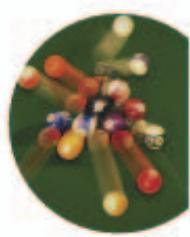

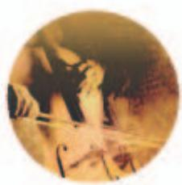

## 目录

第一章 动量守恒定律 1  
1. 动量 2  
2. 动量定理 6  
3. 动量守恒定律 11  
4. 实验：验证动量守恒定律 16  
5. 弹性碰撞和非弹性碰撞 20  
6. 反冲现象 火箭 24  

第二章 机械振动 30  
1. 简谐运动 31  
2. 简谐运动的描述 35  
3. 简谐运动的回复力和能量 41  
4. 单摆 44  
5. 实验：用单摆测量重力加速度 48  
6. 受迫振动 共振 50  

第三章 机械波 57  
1. 波的形成 58  
2. 波的描述 62  
3. 波的反射、折射和衍射 66  
4. 波的干涉 69  
5. 多普勒效应 74  

第四章 光 79  
1. 光的折射 80  
2. 全反射 85  
3. 光的干涉 90  
4. 实验：用双缝干涉测量光的波长 95  
5. 光的衍射 98  
6. 光的偏振 激光 102  

课题研究 110  
索引 114

人教版®

## 第一章动量守恒定律

台球的碰撞、微观粒子的散射，这些运动似乎有天壤之别。然而，物理学的研究表明，它们遵从相同的科学规律——动量守恒定律。动量守恒定律是自然界中最普遍的规律之一，无论是设计火箭还是研究微观粒子，都离不开它。

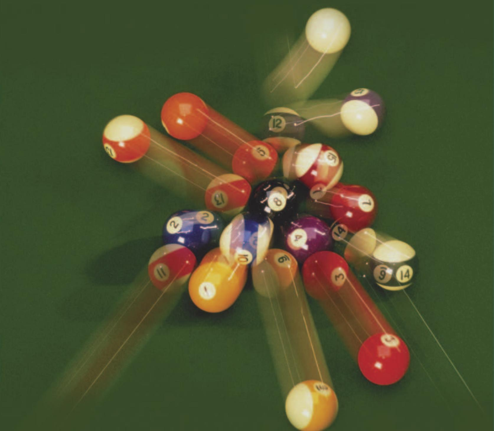

## 1 动量

从历史上看，一般说来，这（引入新的概念）永远是走向科学进步的最有力的方法之一。

——霍耳顿 $^{①}$

## 问题

用两根长度相同的线绳，分别悬挂两个完全相同的钢球A、B，且两球并排放置。拉起A球，然后放开，该球与静止的B球发生碰撞。可以看到，碰撞后A球停止运动而静止，B球开始运动，最终摆到和A球被拉起时同样的高度。为什么会发生这样的现象呢？

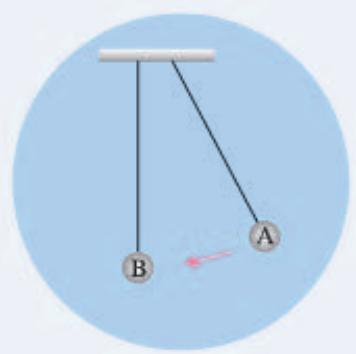

从实验的现象似乎可以得出：碰撞后，A球的速度大小不变地“传给”了B球。这意味着，碰撞前后，两球速度之和是不变的。那么所有的碰撞都有这样的规律吗？

## 寻求碰撞中的不变量

## 演示

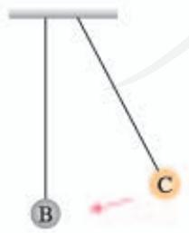  
图1.1-1 质量不同小球的碰撞

## 质量不同小球的碰撞

如图1.1-1，将上面实验中的A球换成大小相同的C球，使C球质量大于B球质量，用手拉起C球至某一高度后放开，撞击静止的B球。我们可以看到，碰撞后B球获得较大的速度，摆起的最大高度大于C球被拉起时的高度。

从实验可以看出，质量大的C球与质量小的B球碰撞后，B球得到的速度比C球碰撞前的速度大，两球碰撞前后的速度之和并不相等。

本书所说的“碰撞前”是指即将发生碰撞的那一时刻，“碰撞后”是指碰撞刚结束的那一时刻。

仔细观察你会发现，两球碰撞前后的速度变化跟它们的质量有关系。质量大、速度较小的C球，使质量小的B球获得了较大的速度。对于图1.1-1所示实验的现象，可能有的同学会猜想，两个物体碰撞前后动能之和不变，所以质量小的球速度大；也有的同学会猜想，两个物体碰撞前后速度与质量的乘积之和可能是不变的……

那么，对于所有的碰撞，碰撞前后到底什么量会是不变的呢？

下面我们通过分析实验数据来研究上述问题。

实验如图 1.1-2，两辆小车都放在滑轨上，用一辆运动的小车碰撞一辆静止的小车，碰撞后两辆小车粘在一起运动。小车的速度用滑轨上的数字计时器测量。下表中的数据是某次实验时采集的。其中， $m_{1}$ 是运动小车的质量， $m_{2}$ 是静止小车的质量；v 是运动小车碰撞前的速度， $v'$ 是碰撞后两辆小车的共同速度。

表 两辆小车的质量和碰撞前后的速度

<table><tr><td>次数</td><td> $m_1$ /kg</td><td> $m_2$ /kg</td><td> $v/(m·s^{-1})$ </td><td> $v'(m·s^{-1})$ </td></tr><tr><td>1</td><td>0.519</td><td>0.519</td><td>0.628</td><td>0.307</td></tr><tr><td>2</td><td>0.519</td><td>0.718</td><td>0.656</td><td>0.265</td></tr><tr><td>3</td><td>0.718</td><td>0.519</td><td>0.572</td><td>0.321</td></tr></table>

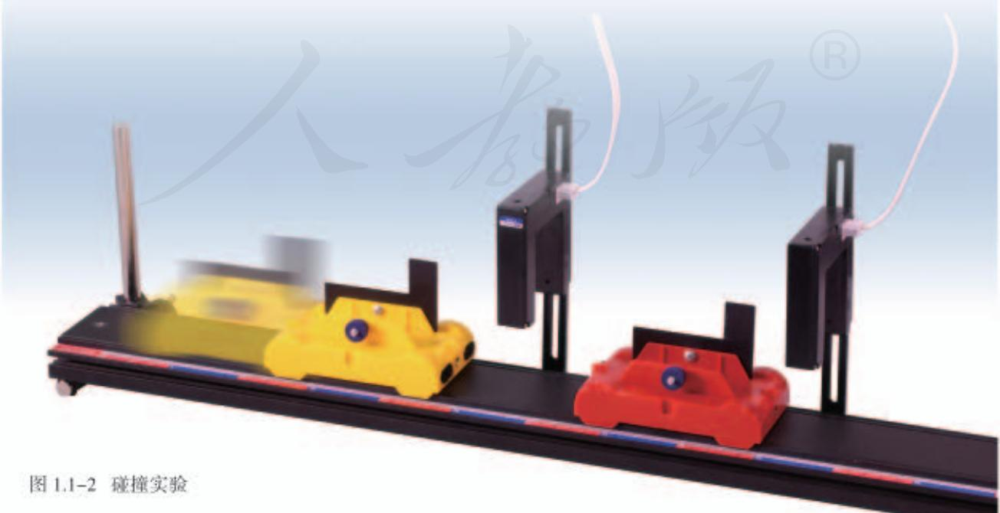

请你根据表中的数据，计算两辆小车碰撞前后的动能，比较此实验中两辆小车碰撞前后动能之和是否不变。再计算两辆小车碰撞前后质量与速度的乘积，比较两辆小车碰撞前后质量与速度的乘积之和是否不变。

从实验的数据可以看出，此实验中两辆小车碰撞前后，动能之和并不相等，但是质量与速度的乘积之和却基本不变。

## 动量

物理学家始终在寻求自然界万物运动的规律，其中包括在多变的世界里找出某些不变量。

上面的实验提示我们，对于发生碰撞的两个物体来说，它们的 $mv$ 之和在碰撞前后可能是不变的。这使我们意识到， $mv$ 这个物理量具有特别的意义。

物理学中把质量和速度的乘积 mv 定义为物体的动量（momentum），用字母 p 表示

$$
p = m v
$$

动量的单位是由质量的单位与速度的单位构成的，是千克米每秒，符号是 $kg \cdot m/s$ 。动量是矢量，动量的方向与速度的方向相同。

## 【例题】

一个质量为 0.1 kg 的钢球，以 6 m/s 的速度水平向右运动，碰到坚硬的墙壁后弹回，沿着同一直线以 6 m/s 的速度水平向左运动（图 1.1-3）。碰撞前后钢球的动量变化了多少？

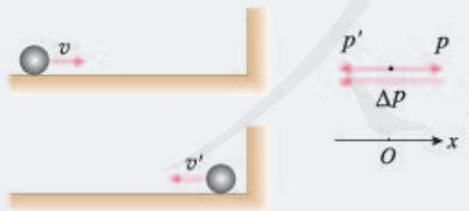  
图1.1-3

分析 动量是矢量，虽然碰撞前后钢球速度的大小没有变化，但速度的方向变化了，所以动量的方向也发生了变化。为了求得钢球动量的变化量，需要先选定坐标轴的方向，确定碰撞前后钢球的动量，然后用碰撞后的动量减去碰撞前的动量求得动量的变化量。

解 取水平向右为坐标轴的方向。碰撞前钢球的速度为 $6 \, m/s$ ，碰撞前钢球的动量为

$$
p = m v = 0. 1 \times 6 \mathrm{kg} \cdot \mathrm{m/s} = 0. 6 \mathrm{kg} \cdot \mathrm{m/s}
$$

如果物体沿直线运动，即动量始终保持在同一条直线上，在选定坐标轴的方向之后，动量的运算就可以简化成代数运算。

碰撞后钢球的速度 $v' = -6 \, m/s$ ，碰撞后钢球的动量为

$$
p ^ {\prime} = m v ^ {\prime} = - 0. 1 \times 6 \mathrm{kg} \cdot \mathrm{m/s} = - 0. 6 \mathrm{kg} \cdot \mathrm{m/s}
$$

碰撞前后钢球动量的变化量为

$$
\begin{array}{r l} \Delta p = p ^ {\prime} - p & = (- 0. 6 - 0. 6) \mathrm{kg} \cdot \mathrm{m/s} \\ & = - 1. 2 \mathrm{kg} \cdot \mathrm{m/s} \end{array}
$$

动量的变化量是矢量，求得的数值为负值，表示它的方向与坐标轴的方向相反，即 $\Delta p$ 的方向水平向左。

## 做一做

让一位同学把一个充气到直径1 m左右的大乳胶气球，以某一速度水平投向你，请你接住（图1.1-4）。把气放掉后气球变得很小，再把气球以相同的速度投向你。两种情况下，你的体验有什么不同？这是为什么呢？

图1.1-4 投接气球  

## 练习与应用

1. 解答以下三个问题，总结动量与动能概念的不同。

（1）质量为 2 kg 的物体，速度由 3 m/s 增大为 6 m/s，它的动量和动能各增大为原来的几倍？

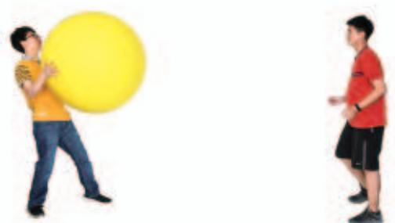

（2）质量为 $2 \mathrm{~kg}$ 的物体，速度由向东的 $3 \mathrm{~m} / \mathrm{s}$ 变为向西的 $3 \mathrm{~m} / \mathrm{s}$ ，它的动量和动能是否发生变化？如果发生变化，变化量各是多少？

(3) A 物体质量是 2 kg，速度是 3 m/s，方向向东；B 物体质量是 3 kg，速度是 4 m/s，方向向西。它们动量的矢量和是多少？它们的动能之和是多少？

2. 一个质量为 2 kg 的物体在合力 F 的作用下从静止开始沿直线运动。F 随时间 t 变化的图像如图 1.1-5 所示。

(1) t = 2 s 时物体的动量大小是多少?

(2) $t = 3\mathrm{s}$ 时物体的动量大小是多少？

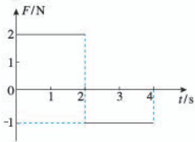  
图1.1-5

## 2 动量定理

## 问题

有些船和码头常悬挂一些老旧轮胎，主要的用途是减轻船舶靠岸时码头与船体的撞击。其中有怎样的道理呢？

两个物体碰撞时，彼此间会受到力的作用，那么一个物体动量的变化和它所受的力有怎样的关系呢？

## 动量定理

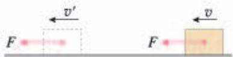  
图1.2-1 力改变物体的动量

为了分析问题的方便，我们先讨论物体受恒力的情况。如图1.2-1，假定一个质量为 $m$ 的物体在光滑的水平面上受到恒力 $F$ 的作用，做匀变速直线运动。在初始时刻，物体的速度为 $v$ ，经过一段时间 $\Delta t$ ，它的速度为 $v^{\prime}$ ，那么，这个物体在这段时间的加速度就是

由于 $\Delta p=p'-p$ ，
所以（1）式也可以写成 $F=\frac{\Delta p}{\Delta t}$ ，它表示：物体
动量的变化率等于它所受
的力。

$$
a = \frac {\Delta v}{\Delta t} = \frac {v ^ {\prime} - v}{\Delta t}
$$

根据牛顿第二定律 $F = ma$ ，则有

$$
F = m \frac {v ^ {\prime} - v}{\Delta t} = \frac {m v ^ {\prime} - m v}{\Delta t} = \frac {p ^ {\prime} - p}{\Delta t}
$$

即

$$
F \Delta t = p ^ {\prime} - p\tag{1}
$$

（1）式的右边是物体在 $\Delta t$ 这段时间内动量的变化量，左边既与力的大小、方向有关，又与力的作用时间有关。 $F\Delta t$ 这个物理量反映了力的作用对时间的累积效应。物理学中把力与力的作用时间的乘积叫作力的冲量（impulse），用字母I表示冲量，则

$$
I = F \Delta t
$$

冲量的单位是牛秒，符号是 $\mathrm{N} \cdot \mathrm{S}$ 。有了冲量的概念，

(1) 式就可以写成

$$
I = p ^ {\prime} - p\tag{2}
$$

(1) 式也可以写作

$$
F \left(t ^ {\prime} - t\right) = m v ^ {\prime} - m v\tag{3}
$$

(2) 式或 (3) 式表明: 物体在一个过程中所受力的冲量等于它在这个过程始末的动量变化量。这个关系叫作动量定理 (theorem of momentum)。

实际上，物体在碰撞过程中受到的作用力往往不是恒力，物体不做匀变速运动。在类似的情况下，动量定理还成立吗？

这里说的“力的冲量”指的是合力的冲量，或者是各个力的冲量的矢量和。

我们可以把实际过程细分为很多短暂过程（图1.2-2），每个短暂过程中物体所受的力没有很大的变化，这样对于每个短暂过程就能够应用（1）式了。把应用于每个短暂过程的关系式相加，就得到整个过程的动量定理。在应用（1）式处理变力问题时，式中的 $F$ 应该理解为变力在作用时间内的平均值。

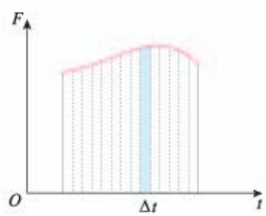  
图1.2-2 变力的冲量

## 动量定理的应用

根据动量定理，我们知道：如果物体的动量发生的变化是一定的，那么作用的时间短，物体受的力就大；作用的时间长，物体受的力就小。例如，玻璃杯落在坚硬的地面上会破碎，落在地毯上不会破碎，用动量定理可以很好地解释此现象。从同样的高度落到地面或地毯时，在与地面或地毯的相互作用中，两种情况下动量的变化量相等，地面或地毯对杯子的力的冲量也相等。但是坚硬的地面与杯子的作用时间短，作用力会大些，杯子易破碎；柔软的地毯与杯子的作用时间较长，作用力会小些，玻璃杯不易破碎。易碎物品运输时要用柔软材料包装，跳高时运动员要落在软垫上（图1.2-3），就是这个道理。

在本节“问题”栏目中，船靠岸如果撞到坚硬的物体，相互作用时间很短，作用力就会很大，很危险。如果在船舷和码头悬挂一些具有弹性的物体（如旧轮胎），就可以延长作用时间，以减小船和码头间的作用力。

图1.2-3 跳高运动

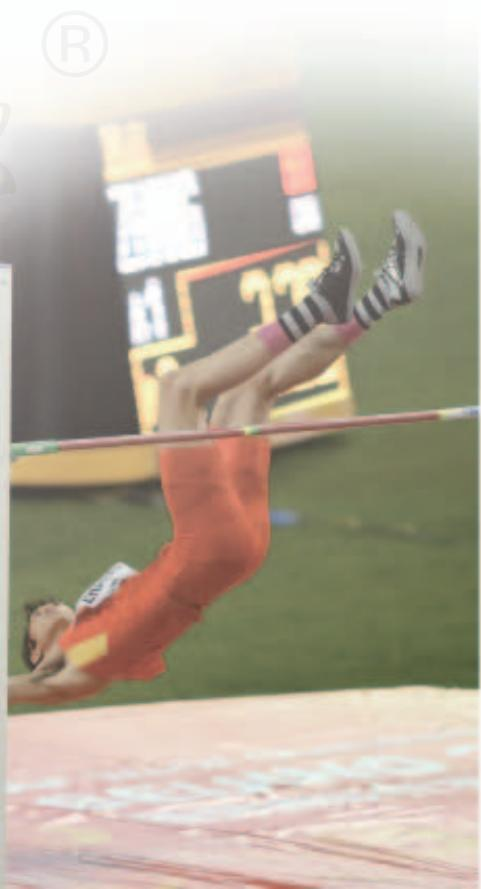

  
图1.2-4

一个质量为 0.18 kg 的垒球，以 25 m/s 的水平速度飞向球棒，被球棒击打后，反向水平飞回，速度的大小为 45 m/s（图 1.2-4）。若球棒与垒球的作用时间为 0.002 s，球棒对垒球的平均作用力是多大？

分析 球棒对垒球的作用力是变力，力的作用时间很短。在这个短时间内，力先是急剧地增大，然后又急剧地减小为0。在冲击、碰撞这类问题中，相互作用的时

间很短，力的变化都具有这个特点。动量定理适用于变力作用的过程，因此，可以用动量定理计算球棒对垒球的平均作用力。

解 沿垒球飞向球棒时的方向建立坐标轴，垒球的初动量为

$$
p = m v = 0. 1 8 \times 2 5 \mathrm{kg} \cdot \mathrm{m/s} = 4. 5 \mathrm{kg} \cdot \mathrm{m/s}
$$

垒球的末动量为

$$
p ^ {\prime} = m v ^ {\prime} = - 0. 1 8 \times 4 5 \mathrm{kg} \cdot \mathrm{m/s} = - 8. 1 \mathrm{kg} \cdot \mathrm{m/s}
$$

由动量定理知垒球所受的平均作用力为

$$
F = \frac {p ^ {\prime} - p}{\Delta t} = \frac {- 8 . 1 - 4 . 5}{0 . 0 0 2} \mathrm{N} = - 6 3 0 0 \mathrm{N}
$$

垒球所受的平均作用力的大小为 $6300\mathrm{N}$ ，负号表示力的方向与坐标轴的方向相反，即力的方向与垒球飞来的方向相反。

## 科学漫步

## 历史上关于运动量度的争论

历史上，一种观点认为应该用物理量 $mv$ 来量度运动的“强弱”；另一种观点认为应该用物理量 $mv^2$ 来量度运动的“强弱”。主张以 $mv$ 量度运动的代表人物是笛卡儿。他认为：“在物质中存在一定量的运动，它的总和在世界上永远不会增加也不会消失。”这实际上是后来所说的动量守恒定律的雏形。主张以 $mv^2$ 量度运动的代表人物是莱布尼兹。他认为守恒的应该是 $mv^2$ 而不是 $mv$ 。经过半个多世纪的争论，法国科学家达兰贝尔用他的研究指出，双方实际是从不同的角度量度运动。

用现在的科学术语说，就是：“力”既可以通过动量来表示

$$
F = \frac {\Delta p}{\Delta t}
$$

又可以通过动能来表示

$$
F = \frac {\Delta E _ {k}}{\Delta x}
$$

动量决定了物体在力 $F$ 的阻碍下能够运动多长时间，动能则决定了物体在力 $F$ 的阻碍下能够运动多长距离。也就是说，动量定理反映了力对时间的累积效应，动能定理反映了力对空间的累积效应。

这场争论一方面促进了机械能概念及整个能量概念的形成，并使人们对多种运动形式及其相互转变的认识更加深入；另一方面，动量与动量守恒定律也在争论中显示出了它们的重要性。

## 汽车碰撞试验

汽车安全性能是当今衡量汽车品质的重要指标。实车碰撞试验是综合评价汽车安全性能最有效的方法，也是各国政府检验汽车安全性能的强制手段之一。

1998年6月18日，国产轿车在清华大学汽车工程研究所进行的整车安全性碰撞试验取得成功，被誉为“中国轿车第一撞”。从此，我国汽车的整车安全性碰撞试验开始与国际接轨。

当汽车以50 km/h左右的速度撞向刚性壁障时，撞击使汽车的动量瞬间变到0，产生了极大的冲击力（图1.2-5）。“轰”的一声巨响之后，载着模拟乘员的崭新轿车眨眼间被撞得短了一大截。技术人员马上查看车辆受损情况：安全气囊是否爆开？安全带是否发挥了作用？前挡风玻璃是否破碎？“乘员”是否完好无损？车门是否能够正常开启？……还要取出各种传感器，作进一步处理，通过计算机得到碰撞试验的各项数据。

汽车碰撞时产生的冲击力不仅很大，而且很复杂。在碰撞瞬间冲击力与碰撞的速度、相撞双方的质量分布、接触位置的形状、材料、变形等因素相关。利用“乘员”身上的传感器采集的数据，研究人员可以评估人体相应部位所受冲击力的大小。根据这些结果，汽车厂家可以改进车辆的结构设计，增加乘员保护装置，使我们乘坐的汽车越来越安全。

  
图1.2-5 汽车碰撞试验

1. 如图 1.2-6，一物体静止在水平地面上，受到与水平方向成 $\theta$ 角的恒定拉力 F 作用时间 t 后，物体仍保持静止。现有以下看法：
A. 物体所受拉力 F 的冲量方向水平向右
B. 物体所受拉力 F 的冲量大小是 $Ft\cos\theta$ C. 物体所受摩擦力的冲量大小为 0
D. 物体所受合力的冲量大小为 0
你认为这些看法正确吗？请简述你的理由。

  
图1.2-6

2. 体操运动员在落地时总要屈腿（图1.2-7），这是为什么？

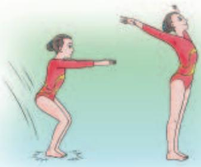  
图1.2-7

3. 如图 1.2-8，用 $0.5 \mathrm{~kg}$ 的铁锤钉钉子。打击前铁锤的速度为 $4 \mathrm{~m} / \mathrm{s}$ ，打击后铁锤的速度变为 0，设打击时间为 $0.01 \mathrm{~s}, g$ 取 $10 \mathrm{~m} / \mathrm{s}^{2}$ 。

（1）不计铁锤所受的重力，铁锤钉钉子的平均作用力是多大？

（2）考虑铁锤所受的重力，铁锤钉钉子的平均作用力是多大？

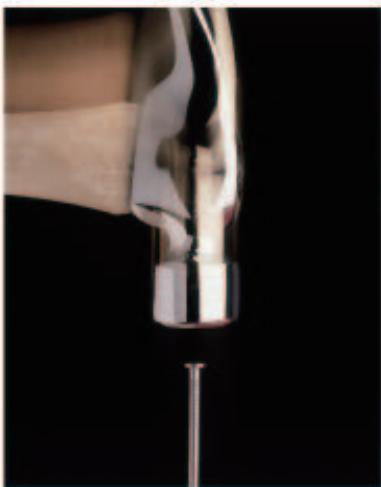  
图1.2-8

（3）你分析一下，在计算铁锤钉钉子的平均作用力时，在什么情况下可以不计铁锤所受的重力。

4. 一个质量为 $10 \mathrm{~kg}$ 的物体, 以 $10 \mathrm{~m} / \mathrm{s}$ 的速度做直线运动, 受到一个反向的作用力 $F$ , 经过 $4 \mathrm{~s}$ , 速度变为反向 $2 \mathrm{~m} / \mathrm{s}$ 。这个力是多大?

5. 一个质量为 $60 \mathrm{~kg}$ 的蹦床运动员，从离水平网面 $3.2 \mathrm{~m}$ 高处自由下落，着网后沿竖直方向蹦回到离水平网面 $5.0 \mathrm{~m}$ 高处。已知运动员与网接触的时间为 $0.8 \mathrm{~s}, g$ 取 $10 \mathrm{~m} / \mathrm{s}^{2}$ 。

（1）求运动员与网接触的这段时间内动量的变化量。

(2) 求网对运动员的平均作用力大小。

（3）求从自由下落开始到蹦回离水平网面 $5.0\mathrm{m}$ 高处这一过程中运动员所受重力的冲量、弹力的冲量。

6. 曾经有一则新闻报道，一名4岁儿童从3层高的楼房掉下来，被一名见义勇为的青年接住。请你估算一下，儿童受到的合力的冲量是多大？设儿童与青年之间的相互作用时间为0.1s，则儿童受到的合力的平均值有多大？

## 3 动量守恒定律

## 问题

第一节中我们通过分析一辆运动的小车碰撞一辆静止的小车，得出碰撞前后两辆小车的动量之和不变的结论。对于冰壶等物体的碰撞也是这样的吗？怎样证明这一结论呢？这是一个普遍的规律吗？

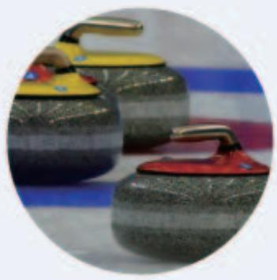

动量定理给出了单个物体在一个过程中所受力的冲量与它在这个过程始末的动量变化量的关系，即 $F\Delta t = p' - p$ 。如果我们用动量定理分别研究两个相互作用的物体，会有新的收获吗？

## 相互作用的两个物体的动量改变

如图1.3-1，在光滑水平桌面上做匀速运动的两个物体A、B，质量分别是 $m_{1}$ 和 $m_{2}$ ，沿同一直线向同一方向运动，速度分别是 $v_{1}$ 和 $v_{2}, v_{2} > v_{1}$ 。当B追上A时发生碰撞。碰撞后A、B的速度分别是 $v_{1}'$ 和 $v_{2}'$ 。碰撞过程中A所受B对它的作用力是 $F_{1}$ ，B所受A对它的作用力是 $F_{2}$ 。碰撞时，两物体之间力的作用时间很短，用 $\Delta t$ 表示。

  
图1.3-1 用牛顿运动定律分析碰撞过程

根据动量定理，物体 A 动量的变化量等于它所受作用力 $F_{1}$ 的冲量，即

$$
F _ {1} \Delta t = m _ {1} v _ {1} ^ {\prime} - m _ {1} v _ {1}
$$

物体 B 动量的变化量等于它所受作用力 $F_{2}$ 的冲量，即

$$
F _ {2} \Delta t = m _ {2} v _ {2} ^ {\prime} - m _ {2} v _ {2}
$$

根据牛顿第三定律 $F_{1} = -F_{2}$ ，两个物体碰撞过程中的每个时刻相互作用力 $F_{1}$ 与 $F_{2}$ 大小相等、方向相反，故有

$$
\begin{array}{r} m _ {1} v _ {1} ^ {\prime} - m _ {1} v _ {1} = - (m _ {2} v _ {2} ^ {\prime} - m _ {2} v _ {2}) \\ m _ {1} v _ {1} ^ {\prime} + m _ {2} v _ {2} ^ {\prime} = m _ {1} v _ {1} + m _ {2} v _ {2} \end{array}\tag{1}
$$

这说明，两个物体碰撞后的动量之和等于碰撞前的动

量之和，并且该关系式对过程中的任意两时刻的状态都适用。

那么，碰撞前后满足动量之和不变的两个物体的受力情况是怎样的呢？两个物体各自既受到对方的作用力，同时又受到重力和桌面的支持力，重力和支持力是一对平衡力。两个碰撞的物体在所受外部对它们的作用力的矢量和为0的情况下动量守恒。

## 动量守恒定律

一般而言，碰撞、爆炸等现象的研究对象是两个（或多个）物体。我们把由两个（或多个）相互作用的物体构成的整体叫作一个力学系统，简称系统（system）。例如，研究炸弹的爆炸时，它的所有碎片及产生的燃气构成的整个系统是研究对象。

系统中物体间的作用力，叫作内力（internal force）。系统以外的物体施加给系统内物体的力，叫作外力（external force）。

理论和实验都表明：如果一个系统不受外力，或者所受外力的矢量和为0，这个系统的总动量保持不变。这就是动量守恒定律（law of conservation of momentum）。

## 思考与讨论

如图1.3-2，静止的两辆小车用细线相连，中间有一个压缩了的轻质弹簧。烧断细线后，由于弹力的作用，两辆小车分别向左、右运动，它们都获得了动量，它们的总动量是否增加了？

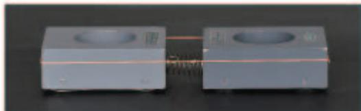  
图1.3-2 弹簧使静止小车分开

## 【例题1】

如图1.3-3，在列车编组站里，一辆质量为 $1.8 \times 10^{4} \mathrm{~kg}$ 的货车在平直轨道上以 $2 \mathrm{~m} / \mathrm{s}$ 的速度运动，碰上一辆质量为 $2.2 \times 10^{4} \mathrm{~kg}$ 的静止的货车，它们碰撞后结合在一起

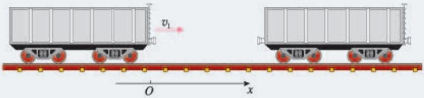  
图1.3-3

继续运动。求货车碰撞后运动的速度。

分析 两辆货车在碰撞过程中发生相互作用，将它们看成一个系统，这个系统是我们的研究对象。系统所受的外力有：重力、地面支持力和摩擦力。重力与支持力之和等于0，摩擦力远小于系统的内力，可以忽略。因此，可以认为碰撞过程中系统所受外力的矢量和为0，动量守恒。

为了应用动量守恒定律解决这个问题，需要确定碰撞前后的动量。

解 已知 $m_{1} = 1.8 \times 10^{4} \mathrm{~kg}$ , $m_{2} = 2.2 \times 10^{4} \mathrm{~kg}$ 。沿碰撞前货车运动的方向建立坐标轴（图1.3-3），有 $v_{1} = 2 \mathrm{~m} / \mathrm{s}$ 。设两车结合后的速度为 $v$ 。两车碰撞前的总动量为

$$
p = m _ {1} v _ {1}
$$

碰撞后的总动量为

$$
p ^ {\prime} = (m _ {1} + m _ {2}) v
$$

根据动量守恒定律可得

$$
(m _ {1} + m _ {2}) v = m _ {1} v _ {1}
$$

解出

$$
\begin{array}{r l} v & = \frac {m _ {1} v _ {1}}{m _ {1} + m _ {2}} \\ & = \frac {1 . 8 \times 1 0 ^ {4} \times 2}{1 . 8 \times 1 0 ^ {4} + 2 . 2 \times 1 0 ^ {4}} \mathrm{m/s} \\ & = 0. 9 \mathrm{m/s} \end{array}
$$

两车结合后速度的大小是0.9 m/s；v是正值，表示两车结合后仍然沿坐标轴的方向运动，即仍然向右运动。

## 【例题2】

一枚在空中飞行的火箭质量为 $m$ ，在某时刻的速度为 $v$ ，方向水平，燃料即将耗尽。此时，火箭突然炸裂成两块（图1.3-4），其中质量为 $m_{1}$ 的一块沿着与 $v$ 相反的方向飞去，速度为 $v_{1}$ 。求炸裂后另一块的速度 $v_{2}$ 。

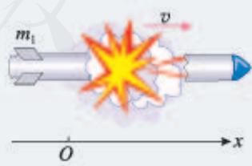  
图1.3-4

分析 炸裂前, 可以认为火箭是由质量为 $m_{1}$ 和 $(m - m_{1})$ 的两部分组成。考虑到燃料几乎用完, 火箭的炸裂

过程可以看作炸裂的两部分相互作用的过程。这两部分组成的系统是我们的研究对象。

在炸裂过程中，火箭受到重力的作用，所受外力的矢量和不为0，但是所受的重

力远小于爆炸时的作用力，所以可以认为系统满足动量守恒定律的条件。

解 火箭炸裂前的总动量为

$$
p = m v
$$

炸裂后的总动量为

$$
p ^ {\prime} = m _ {1} v _ {1} + (m - m _ {1}) v _ {2}
$$

物体炸裂时一般不会正好分成两块，也不会正好沿水平方向飞行，这里对问题进行了简化处理。

根据动量守恒定律可得

$$
m _ {1} v _ {1} + (m - m _ {1}) v _ {2} = m v
$$

解出

$$
v _ {2} = \frac {m v - m _ {1} v _ {1}}{m - m _ {1}}
$$

解题时涉及的速度，都是相对于地面的速度。

若沿炸裂前速度 $v$ 的方向建立坐标轴， $v$ 为正值； $v_{1}$ 与 $v$ 的方向相反， $v_{1}$ 为负值。此外，一定有 $m - m_{1} > 0$ 。于是，由上式可知， $v_{2}$ 应为正值。这表示质量为 $(m - m_{1})$ 的那部分沿着与坐标轴相同的方向，即沿着原来的方向飞去。这个结论容易理解。炸裂的一部分沿着与原来速度相反的方向飞去，另一部分不会也沿着这个方向飞去，否则，炸裂后的总动量将与炸裂前的总动量方向相反，动量就不可能守恒了。

## 动量守恒定律的普适性

既然许多问题可以通过牛顿运动定律解决，为什么还要研究动量守恒定律？

用牛顿运动定律解决问题要涉及整个过程中的力。在实际过程中，往往涉及多个力，力随时间变化的规律也可能很复杂，使得问题难以求解。但是，动量守恒定律只涉及过程始末两个状态，与过程中力的细节无关。这样，问题往往能大大简化。

事实上，动量守恒定律的适用范围非常广泛。近代物理的研究对象已经扩展到我们直接经验所不熟悉的高速（接近光速）、微观（小到分子、原子的尺度）领域。研究表明，在这些领域，牛顿运动定律不再适用，而动量守恒定律仍然正确。

1. 甲、乙两人静止在光滑的冰面上，甲推乙后，两人向相反方向滑去（图1.3-5）。在甲推乙之前，两人的总动量为0；甲推乙后，两人都有了动量，总动量还等于0吗？已知甲的质量为45kg，乙的质量为50kg，求甲的速度与乙的速度大小之比。

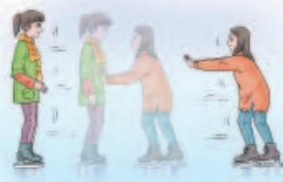  
图1.3-5

2. 在光滑水平面上，A、B 两个物体在同一直线上沿同一方向运动，A 的质量是 5 kg，速度是 9 m/s，B 的质量是 2 kg，速度是 6 m/s。A 从后面追上 B，它们相互作用一段时间后，B 的速度增大为 10 m/s，方向不变，这时 A 的速度是多大？方向如何？

3. 质量是 $10 \mathrm{~g}$ 的子弹，以 $300 \mathrm{~m} / \mathrm{s}$ 的速度射

入质量是 $24\mathrm{g}$ 、静止在光滑水平桌面上的木块。

（1）如果子弹留在木块中，木块运动的速度是多大？

（2）如果子弹把木块打穿，子弹穿过后的速度为 $100 \, m/s$ ，这时木块的速度又是多大？

4. 某机车以 0.4 m/s 的速度驶向停在铁轨上的 7 节车厢，与它们对接。机车与第一节车厢相碰后，它们连在一起具有一个共同的速度，紧接着又与第二节车厢相碰，就这样，直至碰上最后一节车厢。设机车和车厢的质量都相等，求与最后一节车厢碰撞后列车的速度。列车与铁轨的摩擦忽略不计。

5. 甲、乙两个物体沿同一直线相向运动，甲物体的速度是 $6 \mathrm{~m} / \mathrm{s}$ ，乙物体的速度是 $2 \mathrm{~m} / \mathrm{s}$ 。碰撞后两物体都沿各自原方向的反方向运动，速度都是 $4 \mathrm{~m} / \mathrm{s}$ 。求甲、乙两物体的质量之比。

6. 细线下吊着一个质量为 $m_{1}$ 的静止沙袋，沙袋到细线上端悬挂点的距离为 l。一颗质量为 m 的子弹水平射入沙袋并留在沙袋中，随沙袋一起摆动。已知沙袋摆动时摆线的最大偏角是 $\theta$ ，求子弹射入沙袋前的速度。

## 4 实验：验证动量守恒定律

本节课我们通过实验验证动量守恒定律。

## 实验思路

动量守恒定律的适用条件是系统不受外力，或者所受外力的矢量和为0。我们生活中的物体受到各种力的作用，难以满足这种理想化的条件。但是，在某些情况下，可以近似满足动量守恒的条件。

想一想，满足上述条件的过程有哪些？

我们可以考虑物体发生碰撞的情况。两个物体在发生碰撞时，作用时间很短。根据动量定理，它们的相互作用力很大。如果把这两个物体看作一个系统，那么，虽然系统还受到重力、支持力、摩擦力、空气阻力等外力的作用，但是其中有些力的矢量和为0，有些力与系统内两物体的相互作用力相比很小。因此，可以近似认为碰撞满足动量守恒定律的条件。

你也可以考虑其他符合动量守恒条件的情形来验证动量守恒定律。在设计实验时应着重考虑如下问题。

·实验中哪些物体组成了要研究的系统？

\- 如何创造实验条件，使系统所受外力的矢量和近似为0？

\- 需要测量哪些物理量？

## 物理量的测量

研究对象确定后，还需要明确所需测量的物理量和实验器材。根据动量的定义，很自然地想到，需要测量物体的质量，以及两个物体发生碰撞前后各自的速度。

## 思考与讨论

物体的质量可用天平直接测量。想一想，有哪些方式可以测量速度？你在设计实验方案时会选择哪种？为什么？

## 数据分析

根据选定的实验方案设计实验数据记录表格。选取质量不同的两个物体进行碰撞，测出物体的质量 $(m_{1}, m_{2})$ 和碰撞前后的速度 $(v_{1}, v_{1}^{\prime}, v_{2}, v_{2}^{\prime})$ ，分别计算出两物体碰撞前后的总动量，并检验碰撞前后总动量的关系是否满足动量守恒定律，即

$$
m _ {1} v _ {1} ^ {\prime} + m _ {2} v _ {2} ^ {\prime} = m _ {1} v _ {1} + m _ {2} v _ {2}
$$

## 参考案例1

## 研究气垫导轨上滑块碰撞时的动量守恒

本案例中，我们利用气垫导轨来减小摩擦力，利用数字计时器测量滑块碰撞前后的速度。实验装置如图1.4-1所示。可以通过在滑块上添加已知质量的物块来改变碰撞物体的质量。

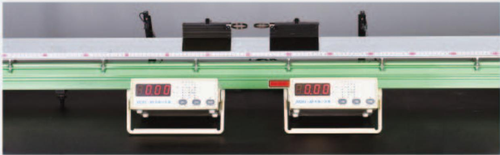  
图1.4-1 参考案例1的实验装置

本实验可以研究以下几种情况。

1. 选取两个质量不同的滑块，在两个滑块相互碰撞的端面装上弹性碰撞架（图 1.4-2），滑块碰撞后随即分开。

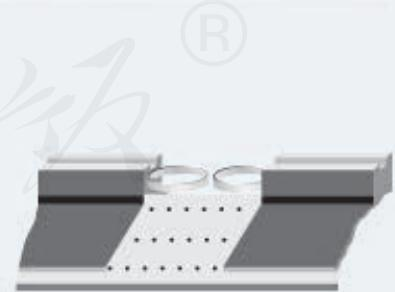

2. 在两个滑块的碰撞端分别装上撞针和橡皮泥（图1.4-3），碰撞时撞针插入橡皮泥中，使两个滑块连成一体运动。如果在两个滑块的碰撞端分别贴上尼龙搭扣，碰撞时它们也会连成一体。

3. 原来连在一起的两个物体，由于相互之间具有排斥的力而分开，这也可视为一种碰撞。这种情况可以通

图1.4-2 滑块碰撞后分开  
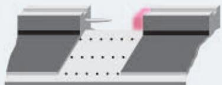  
图1.4-3 滑块碰撞后粘连

过下面的方式实现。

在两个滑块间放置轻质弹簧，挤压两个滑块使弹簧压缩，并用一根细线将两个滑块固定。烧断细线，弹簧弹开后落下，两个滑块由静止向相反方向运动（图1.4-4）。

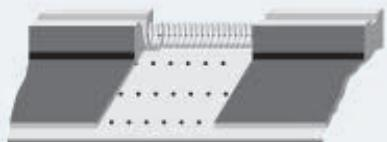  
图1.4-4 弹簧使静止滑块分开

实验前请思考：

1. 气垫导轨是否需要调成水平？如果需要，你能想出哪些办法？

2. 如果物体碰撞后的速度方向与原来的方向相反，应该怎样记录？

## 参考案例2

## 研究斜槽末端小球碰撞时的动量守恒

本案例中，我们研究两个小球在斜槽末端发生碰撞的情况。

实验装置如图 1.4-5 所示。将斜槽固定在铁架台上，使槽的末端水平。让一个质量较大的小球（入射小球）从斜槽上滚下，跟放在斜槽末端的另一个大小相同、质量较小的小球（被碰小球）发生正碰。

使入射小球从斜槽不同高度处滚下，测出两球的质量以及它们每次碰撞前后的速度，就可以验证动量守恒定律。

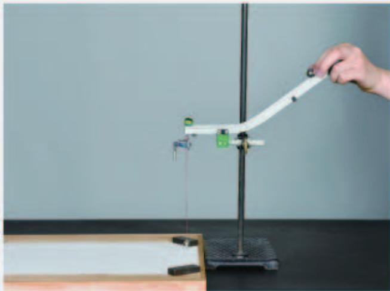  
图1.4-5 参考案例2的实验装置

小球的质量可以用天平来测量。怎

样测量两球碰撞前后瞬间的速度呢？两个小球碰撞前后瞬间的速度方向都是水平的，因此，两球碰撞前后的速度，可以利用平抛运动的知识求出。

在这个实验中也可以不测量速度的具体数值。做平抛运动的小球落到地面，它们的下落高度相同，飞行时间也就相同。因此，小球碰撞后的速度之比就等于它们落地时飞行的水平距离之比。根据这一思路，也可以验证动量守恒定律。

实验前请思考以下问题：

1. 实验装置中的铅垂线起什么作用？

2. 如何记录并测量小球飞出的水平距离？

1. 如图1.4-6甲，长木板的一端垫有小木块，可以微调木板的倾斜程度，以平衡摩擦力，使小车能在木板上做匀速直线运动。小车A前端贴有橡皮泥，后端连一打点计时器纸带，接通打点计时器电源后，让小车A以某速度做匀速直线运动，与置于木板上静止的小车B相碰并粘在一起，继续做匀速直线运动。打点计时器电源频率为 $50\mathrm{Hz}$ ，得到的纸带如图1.4-6乙所示，已将各计数点之间的距离标在图上。

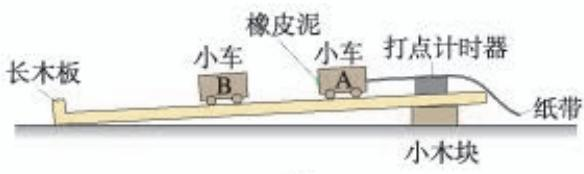  
甲

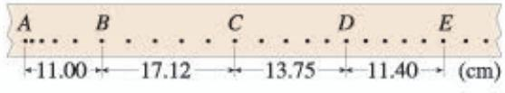  
乙  
图1.4-6

（1）图中的数据有AB、BC、CD、DE四段，计算小车A碰撞前的速度大小应选哪段？计算两车碰撞后的速度大小应选哪段？为什么？

(2) 若小车A的质量为0.4kg，小车B的质量为 $0.2 \mathrm{~kg}$ , 根据纸带数据, 碰前两小车的总动量是多少? 碰后两小车的总动量是多少?

2. 某同学用图1.4-5所示的实验装置和实验步骤来验证动量守恒定律。小球1的质量为 $m_{1}$ ，它从斜槽上某点滚下，离开斜槽末端时的速度记为 $v_{1}$ （称为第一次操作）；小球2的质量为 $m_{2}$ ，小球1第二次从斜槽上原位置滚下，跟小球2碰撞后离开斜槽末端的速度分别记为 $v_{1}^{\prime}$ 和 $v_{2}^{\prime}$ （称为第二次操作）。实验所验证的计算式为

$$
m _ {1} v _ {1} = m _ {1} v _ {1} ^ {\prime} + m _ {2} v _ {2} ^ {\prime}
$$

（1）如果第二次操作时，小球1从斜槽上开始滚下时位置比原先低一些，这将会影响计算式中哪个或哪几个物理量？如果其他的操作都正确，实验将会得到怎样的结果？说明道理。

（2）如果在第二次操作时，发现在第一次操作中，槽的末端是不水平的，有些向上倾斜，于是把它调为水平，调整后的斜槽末端离地面高度跟原来相同。然后让小球在斜槽上原标记位置滚下进行第二次操作，分析时仍然和第一次操作的数据进行比较，其他实验操作都正确，且调节斜槽引起小球在空中运动时间的变化可忽略不计。该实验可能会得到怎样的结果，说明道理。

## 5 弹性碰撞和非弹性碰撞

## 问题

碰撞是自然界中常见的现象。陨石撞击地球而对地表产生破坏，网球受球拍撞击而改变运动状态……

物体碰撞中动量的变化情况，前面已进行了研究。那么，在各种碰撞中能量又是如何变化的？

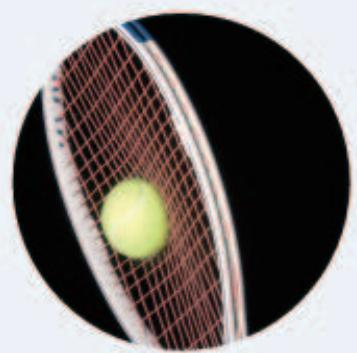

根据上节课的分析，物体碰撞时系统的动量守恒。这节课我们从能量的角度研究碰撞前后物体动能的变化情况，进而对碰撞进行分类。

## 弹性碰撞和非弹性碰撞

## 实验

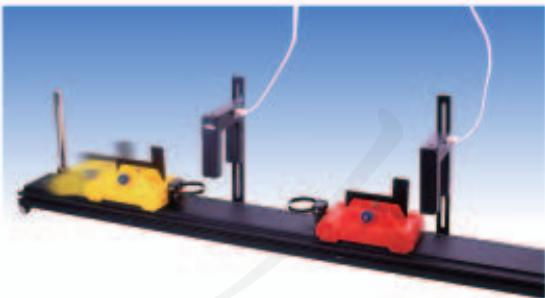  
图1.5-1 研究小车碰撞前后动能的变化

## 研究小车碰撞前后动能的变化

在本章第一节图1.1-2所示的实验中，经过计算我们知道，如果碰撞后两辆小车粘在一起，则总动能减少。这种情况普遍吗？是否有碰撞前后总动能不变的情况呢？

我们通过实验来研究这个问题。思考下面的问题也许有助于你设计实验。

·仔细观察图1.1-2的实验装置，想一想，总动能减少的原因是什么？

\- 为了尽量减少总动能的损失，可以对图1.1-2的实验装置怎样进行改进？

\- 需要测量哪些实验数据？如何测量？

在图1.5-1所示的实验装置中，分别为两辆小车安装了弹性碰撞架来减少动能的损失。你还有其他办法吗？

如果系统在碰撞前后动能不变，这类碰撞叫作弹性碰撞（elastic collision）。如果系统在碰撞后动能减少，这类碰撞叫作非弹性碰撞（inelastic collision）。

钢球、玻璃球碰撞时，动能损失很小，它们的碰撞可以看作弹性碰撞；橡皮泥球之间的碰撞是非弹性碰撞。

在第4节实验的“参考案例1”中，第1、3两种情况是弹性碰撞，第2种是非弹性碰撞。

## 【例题】

如图1.5-2，在光滑水平面上，两个物体的质量都是 $m$ ，碰撞前一个物体静止，另一个以速度 $v$ 向它撞去。碰撞后两个物体粘在一起，成为一个质量为 $2m$ 的物体，以一定速度继续前进。碰撞后该系统的总动能是否会有损失？

分析 可以先根据动量守恒定律求出碰撞后的共同速度 $v'$ ，然后分别计算碰撞前后的总动能进行比较。

解 根据动量守恒定律， $2mv^{\prime} = mv$ ，则

$$
v ^ {\prime} = \frac {1}{2} v
$$

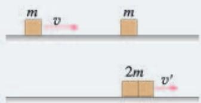

碰撞前的总动能 $E_{\mathrm{k}} = \frac{1}{2} mv^{2}$

图1.5-2

碰撞后的总动能 $E_{\mathrm{k}}^{\prime} = \frac{1}{2}(2m)v^{\prime 2} = \frac{1}{2} E_{\mathrm{k}}$

可见，碰撞后系统的总动能小于碰撞前系统的总动能。

## 弹性碰撞的实例分析

如图 1.5-3，两个小球相碰，碰撞之前球的运动速度与两球心的连线在同一条直线上，碰撞之后两球的速度仍会沿着这条直线。这种碰撞称为正碰，也叫作对心碰撞或一维碰撞。

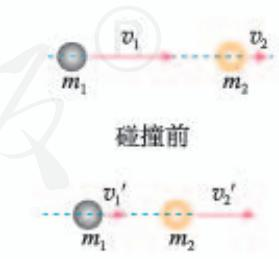  
碰撞后  
图1.5-3 对心碰撞

下面我们分析一下，发生弹性碰撞的两个物体，由于质量不同，碰撞后的速度将有哪些特点。

为使研究问题简单，我们假设物体 $m_{1}$ 以速度 $v_{1}$ 与原来静止的物体 $m_{2}$ 发生正碰，如图 1.5-4 所示。碰撞后它们的速度分别为 $v_{1}'$ 和 $v_{2}'$ 。

  
图1.5-4 运动物体与静止物体碰撞

碰撞过程遵从动量守恒定律，据此可以列出包含上述

分析的方法之一是选取简单特例进行分析。如果所得的结论与实际情况一致，那么理论分析可能是正确的，否则一定出了问题。

图1.5-5 保龄球击打球瓶

各已知量和未知量的方程

$$
m _ {1} v _ {1} = m _ {1} v _ {1} ^ {\prime} + m _ {2} v _ {2} ^ {\prime}\tag{1}
$$

弹性碰撞中没有动能损失，于是可以列出另一个方程

$$
\frac {1}{2} m _ {1} v _ {1} ^ {2} = \frac {1}{2} m _ {1} v _ {1} ^ {\prime 2} + \frac {1}{2} m _ {2} v _ {2} ^ {\prime 2}\tag{2}
$$

从方程（1）（2）可以解出两个物体碰撞后的速度分别为

$$
v _ {1} ^ {\prime} = \frac {m _ {1} - m _ {2}}{m _ {1} + m _ {2}} v _ {1}\tag{3}
$$

$$
v _ {2} ^ {\prime} = \frac {2 m _ {1}}{m _ {1} + m _ {2}} v _ {1}\tag{4}
$$

我们对几种情况下（3）（4）的结果作一些分析。

若 $m_{1} = m_{2}$ ，这时有

$m_{1} - m_{2} = 0$ ， $m_{1} + m_{2} = 2m_{1}$ 根据（3）（4）两式，得

$$
\begin{array}{l} v _ {1} ^ {\prime} = 0 \\ v _ {2} ^ {\prime} = v _ {1} \end{array}
$$

这表示第一个物体的速度由 $v_{1}$ 变为 0，而第二个物体由静止开始运动，运动的速度等于第一个物体原来的速度。

第 3 节 “问题” 中提到的冰壶的碰撞就属于这类情况。

\- 若 $m_{1} >> m_{2}$ ，这时有

$m_{1} - m_{2}\approx m_{1},m_{1} + m_{2}\approx m_{1}$ 。根据（3）（4）两式，得

$$
\begin{array}{l} v _ {1} ^ {\prime} = v _ {1} \\ v _ {2} ^ {\prime} = 2 v _ {1} \end{array}
$$

这表示碰撞后，第一个物体的速度几乎没有改变，而第二个物体以 $2v_{1}$ 的速度被撞出去。

保龄球比赛中，用大号保龄球击打球瓶时，球与瓶的碰撞就类似这种情况（图1.5-5）。

若 $m_{1} < m_{2}$ ，这时有

$m_{1} - m_{2}\approx -m_{2},\frac{2m_{1}}{m_{1} + m_{2}}\approx 0$ 。根据（3）（4）两式，

得

$$
\begin{array}{l} v _ {1} ^ {\prime} = - v _ {1} \\ v _ {2} ^ {\prime} = 0 \end{array}
$$

这表示碰撞以后，第一个物体被弹了回去，以原来的速率向反方向运动，而第二个物体仍然静止。

如果用乒乓球撞击保龄球，那么就会出现这种现象：保龄球保持静止，而乒乓球以大致相同的速率被弹回。

## 科学方法

## 抽象与概括

物理概念是运用抽象、概括等方法进行思维加工的产物。

为了揭示事物的本质和规律，往往需要根据研究对象和问题的特点，从研究的目的出发，忽略个别的、非本质的属性，抽取共同的、本质的属性进行研究，这是一种抽象的思维方法。把事物共同的、本质的属性提炼出来，从而推广到同类事物上去，找到事物的共同属性，这是一种概括的思维方法。

在动量概念的建立过程中，物理学家研究了各种各样的碰撞现象，寻找物理量来揭示运动的本质，发现：“每个物体所具有的‘动量’在碰撞后可以增多或减少，但是在碰撞前后系统的这一量值却保持不变。”科学前辈就是在追寻不变量的努力中，通过抽象、概括等方法提出了动量的概念，并通过动量守恒定律建立了自然界的相互联系。

## 练习与应用

1. 在气垫导轨上，一个质量为 $400 \, g$ 的滑块以 $15 \, cm/s$ 的速度与另一质量为 $200 \, g$ 、速度为 $10 \, cm/s$ 并沿相反方向运动的滑块迎面相撞，碰撞后两个滑块粘在一起。

(1) 求碰撞后滑块速度的大小和方向。

(2) 这次碰撞,两滑块共损失了多少机械能?

2. 速度为 $10 \, m/s$ 的塑料球与静止的钢球发生正碰，钢球的质量是塑料球的 4 倍，碰撞是弹性的，求碰撞后两球的速度。

3. 有些核反应堆里要让中子与原子核碰撞，以便把中子的速度降下来。为此，应该选用质量较大的还是质量较小的原子核？为什么？

4. 一种未知粒子跟静止的氢原子核正碰，测出碰撞后氢原子核的速度是 $3.3 \times 10^{7} \mathrm{~m/s}$ 。该未知粒子跟静止的氮原子核正碰时，测出碰撞后氮原子核的速度是 $4.4 \times 10^{6} \mathrm{~m/s}$ 。已知氢原子核的质量是 $m_{\text{H}}$ ，氮原子核的质量是 $14 m_{\text{H}}$ ，上述碰撞都是弹性碰撞，求未知粒子的质量。

这实际是历史上查德威克通过测量质量从而发现中子的实验，请你根据以上查德威克的实验数据计算：中子的质量与氢核的质量 $m_{H}$ 有什么关系？

5. 质量为 m、速度为 v 的 A 球跟质量为 3m 的静止 B 球发生正碰。碰撞可能是弹性的，也可能是非弹性的，因此，碰撞后 B 球的速度可能有不同的值。请你论证：碰撞后 B 球的速度可能是以下值吗？

(1) 0.6v; (2) 0.4v。

## 6 反冲现象 火箭

## 问题

你知道章鱼、乌贼是怎样游动的吗？它们先把水吸入体腔，然后用力压水，通过身体前面的孔将水喷出，使身体很快地运动。章鱼能够调整喷水的方向，这样可以使得身体向任意方向前进。

章鱼游动时体现了什么物理原理？

## 反冲现象

发射炮弹时，炮弹从炮筒中飞出，炮身则向后退。这种情况由于系统内力很大，外力可忽略，可用动量守恒定律来解释。射击前，炮弹静止在炮筒中，它们的总动量为0。炮弹射出后以很大的速度向前运动，根据动量守恒定律，炮身必将向后运动。只是由于炮身的质量远大于炮弹的质量，所以炮身向后的速度很小。炮身的这种后退运动叫作反冲（recoil）。

在实际中常常需要考虑反冲现象的影响。用枪射击时，子弹向前飞去，枪身发生反冲向后运动。枪身的反冲会影响射击的准确性，所以用步枪射击时要把枪身抵在肩部，以减少反冲的影响。实际生产、生活中应用反冲现象的例子也很多，例如，农田、园林的喷灌装置能够一边喷水一边旋转（图1.6-1），这是因为喷口的朝向略有偏斜，水从喷口喷出时，喷管因反冲而旋转。这样可以自动改变喷水的方向。

图1.6-1 喷灌装置  

## 做一做

1. 把一个气球吹起来，用手捏住气球的通气口（图 1.6-2 甲），然后突然放开，让气体喷出，观察气球的运动。

2. 如图 1.6-2 乙，把弯管装在可旋转的盛水容器的下部。当水从弯管流出时，容器就旋转起来。

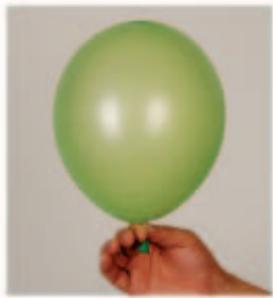  
甲  
图1.6-2 反冲现象

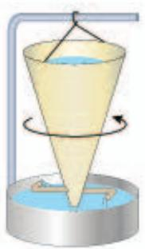  
乙

## 火箭

我国早在宋代就发明了火箭（图1.6-3）。箭杆上捆了一个前端封闭的火药筒，点燃后生成的燃气以很大速度向后喷出，箭杆由于反冲而向前运动。

喷气式飞机和火箭的飞行应用了反冲的原理，它们都靠喷出气流的反冲作用而获得巨大的速度。现代的喷气式飞机，靠连续不断地向后喷出气体，飞行速度能够超过1 000 m/s。

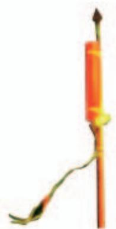  
图1.6-3 古代的火箭（模型）

## 思考与讨论

质量为 m 的人在远离任何星体的太空中，与他旁边的飞船相对静止。由于没有力的作用，他与飞船总保持相对静止的状态。

这个人手中拿着一个质量为 $\Delta m$ 的小物体。现在他以相对于飞船为 u 的速度把小物体抛出（图 1.6-4）。

1. 小物体的动量改变量是多少？

2.人的动量改变量是多少？

3. 人的速度改变量是多少？

图1.6-4

上面“思考与讨论”中所描述的情境与火箭发射的原理大致相同。设火箭飞行时在极短的时间 $\Delta t$ 内喷射燃气的质量是 $\Delta m$ ，喷出的燃气相对喷气前火箭的速度是 $u$ ，喷出燃气后火箭的质量是 $m$ 。我们就可以计算火箭在这样一次喷气后增加的速度 $\Delta v$ 。

以喷气前的火箭为参考系。喷气前火箭的动量是0，喷气后火箭的动量是 $m\Delta v$ ，燃气的动量是 $\Delta mu$ 。根据动量守恒定律，喷气后火箭和燃气的总动量仍然为0，所以

$$
m \Delta v + \Delta m u = 0
$$

解出

$$
\Delta v = - \frac {\Delta m}{m} u
$$

上式表明，火箭喷出的燃气的速度 u 越大、火箭喷出物质的质量与火箭本身质量之比越大，火箭获得的速度 $\Delta v$ 就越大。

## 科学漫步

## 三级火箭

现代火箭发动机的喷气速度通常在 $2000 \sim 5000 \mathrm{~m} / \mathrm{s}$ ，近期内难以大幅度提高。因此，若要提高火箭的速度，需要在减轻火箭本身质量上下功夫。火箭起飞时的质量与火箭除燃料外的箭体质量之比叫作火箭的质量比。这个参数一般小于10，否则火箭结构的强度就有问题。但是，这样的火箭还是达不到发射人造地球卫星的 $7.9 \mathrm{~km} / \mathrm{s}$ 的速度。

为了解决这个问题，科学家提出了多级火箭的概念。把火箭一级一级地接在一起，第一级燃

料用完之后就把箭体抛弃，减轻负担，然后第二级开始工作，这样一级一级地连起来，理论上火箭的速度可以提得很高（图1.6-5）。但是实际应用中一般不会超过四级，因为级数太多时，连接机构和控制机构的质量会增加很多，工作的可靠性也会降低。

我国自1956年建立了专门的航天研究机构到现在，火箭技术有了长足的发展。截至2018年年底，已经完成约300次各种卫星的发射任务，成功地实现了载人航天飞行，并在国际航天市场占有一席之地（图1.6-6）。我国的火箭技术已经跨入了世界先进行列。

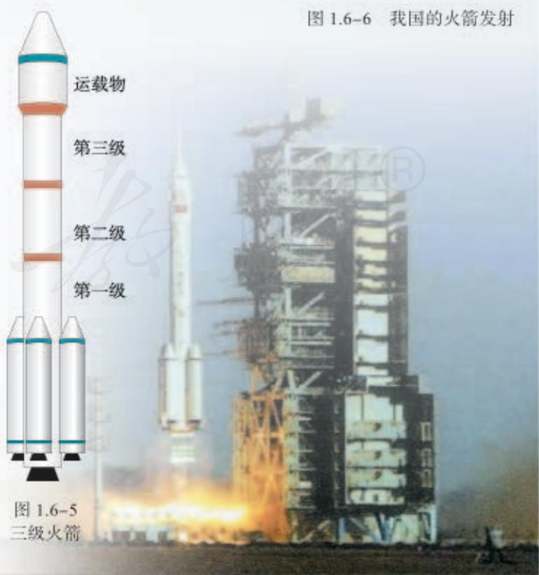

1. 一架喷气式飞机（图 1.6-7）飞行的速度是 800 m/s，如果它喷出的气体相对飞机的速度小于 800 m/s，那么以地面为参考系，气体的速度方向实际上是与飞机飞行的方向相同的。如果在这种情况下继续喷出气体，飞机的速度还会增加吗？为什么？

  
图1.6-7

2. 一个连同装备共有 $100 \mathrm{~kg}$ 的航天员，脱离宇宙飞船后，在离飞船 $45 \mathrm{~m}$ 的位置与飞船处于相对静止的状态（图1.6-8）。装备中有一个高压气源，能以 $50 \mathrm{~m} / \mathrm{s}$ 的速度喷出气体。航天员为了能在 $10 \mathrm{~min}$ 内返回飞船，他需要在开始返回的瞬间一次性向后喷出多少气体？

  
图1.6-8

3. 用火箭发射人造地球卫星，假设最后一节火箭的燃料用完后，火箭壳体和卫星一起以 $7.0 \times 10^{3} \mathrm{~m} / \mathrm{s}$ 的速度绕地球做匀速圆周运动。已知卫星的质量为 $500 \mathrm{~kg}$ ，最后一节火箭壳体的质量为 $100 \mathrm{~kg}$ 。某时刻火箭壳体与卫星分离，分离时卫星与火箭壳体沿轨道切线方向的相对速度为 $1.8 \times 10^{3} \mathrm{~m} / \mathrm{s}$ 。试分析计算：分离后卫星的速度增加到多大？火箭壳体的速度是多大？分离后它们将如何运动？

4. 一个士兵坐在皮划艇上，他连同装备和皮划艇的总质量是 $120 \mathrm{~kg}$ 。这个士兵用自动步枪在 $2 \mathrm{~s}$ 内沿水平方向连续射出 10 发子弹，每发子弹的质量是 $10 \mathrm{~g}$ ，子弹离开枪口时相对步枪的速度是 $800 \mathrm{~m} / \mathrm{s}$ 。射击前皮划艇是静止的，不考虑水的阻力。

(1)每次射击后皮划艇的速度改变多少?

(2) 连续射击后皮划艇的速度是多大?

（3）连续射击时枪所受到的平均反冲作用力是多大？

## A组

1. 120 kg 的铁锤从 3.2 m 高处落下，打在水泥桩上，与水泥桩撞击的时间是 0.005 s。撞击时，铁锤对桩的平均冲击力有多大？g 取 $10 \, m/s^{2}$ 。

2. 两个质量不同而初动量相同的物体，在水平地面上由于摩擦力的作用而停止运动。它们与地面的动摩擦因数相同，请比较它们的滑行时间。

3. 在离地面同一高度有质量相同的三个小球 a、b、c，a 球以速度 $v_{0}$ 竖直上抛，b 球以速度 $v_{0}$ 竖直下抛，c 球做自由落体运动，不计空气阻力，三球落地时动量是否相同？从抛出到落地，三球动量的变化量是否相同？

4. 质量为 0.5 kg 的金属小球，以 6 m/s 的速度水平抛出，抛出后经过 0.8 s 落地，g 取 $10 \, m/s^{2}$ 。

（1）小球抛出时和刚落地时，动量的大小、方向如何？

（2）小球从抛出到落地的动量变化量的大小和方向如何？

（3）小球在空中运动的 0.8 s 内所受重力的冲量的大小和方向如何？

（4）说出你解答上述问题后的认识。

5. 图1-1是用木槌把糯米饭打成糍粑的场景，有人据此编了一道练习题：“已知木槌质量为 $18\mathrm{kg}$ ，木槌刚接触糍粑时的速度是 $22\mathrm{m / s}$ ，打击糍粑 $0.1\mathrm{s}$ 后木槌静止，求木槌打击糍粑时平均作用力的大小。”

  
图1-1  
解答此题，你是否发现，以上数据所描述

的是一个不符合实际的情景。哪些地方不符合实际？

6. A、B两个粒子都带正电，B的电荷量是A的2倍，B的质量是A的4倍。A以已知速度v向静止的B粒子飞去。由于静电力，它们之间的距离缩短到某一极限值后又被弹开，然后各自以新的速度做匀速直线运动。设作用前后它们的轨迹都在同一直线上，计算A、B之间的距离最近时它们各自的速度。

7. 质量为 $m_{1}$ 和 $m_{2}$ 的两个物体在光滑的水平面上正碰，碰撞时间不计，其位移—时间图像如图 1-2 所示。

(1) 若 $m_{1}=1$ kg，则 $m_{2}$ 等于多少？

（2）两个物体的碰撞是弹性碰撞还是非弹性碰撞？

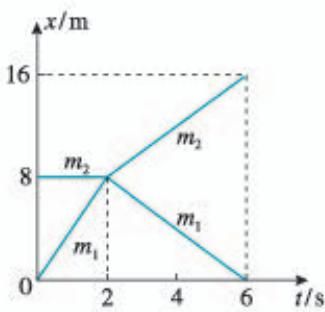  
图1-2

8. 把一个质量为 0.2 kg 的小球放在高度为 5.0 m 的直杆的顶端（图 1-3）。一颗质量为 0.01 kg 的子弹以 500 m/s 的速度沿水平方向击中小球，并穿过球心，小球落地处离杆的距离为 20 m，g 取 $10 \, m/s^{2}$ 。求子弹落地处离杆的距离。

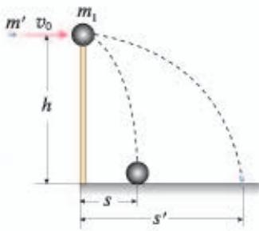  
图1-3

## B组

1. 物体受到方向不变的力 $F$ 作用，其中力的大小随时间变化的规律为 $F = 5t$ （ $F$ 的单位是 $\mathrm{N}$ ），求力在 $2\mathrm{s}$ 内的冲量大小。

2. 用水平力拉一个质量为 m 的物体，使它在水平面上从静止开始运动，物体与水平面间的动摩擦因数为 $\mu$ 。经过时间 t 后，撤去这个水平力，物体在摩擦力的作用下又经过时间 t 停止运动。求拉力的大小。

3. 城市进入高楼时代后，高空坠物已成为危害极大的社会安全问题。图1-4为一则安全警示广告，非常形象地描述了高空坠物对人伤害的严重性。小明同学用下面的实例来检验广告词的科学性：设一个 $50\mathrm{g}$ 的鸡蛋从18楼的窗户自由落下，相邻楼层的高度差为 $3\mathrm{m}$ ，与地面撞击时鸡蛋的竖直高度为 $5\mathrm{cm}$ ，认为鸡蛋下沿落地后，鸡蛋上沿的运动是匀减速运动，并且上沿运动到地面时恰好静止，以鸡蛋的上、下沿落地的时间间隔作为鸡蛋与地面的撞击时间，不计空气阻力。试估算从18楼下落的鸡蛋对地面的平均冲击力。

  
图1-4

4. 水流射向墙壁，会对墙壁产生冲击力。假设水枪喷水口的横截面积为 S，喷出水流的流速为 v，水流垂直射向竖直墙壁后速度变为 0。已知水的密度为 $\rho$ ，重力加速度大小为 g，求墙壁受到的平均冲击力。

5. 长为 l、质量为 m 的小船停在静水中，质量为 $m'$ 的人从静止开始从船头走到船尾。不计水的阻力，求船和人对地面位移的大小。

6. 在光滑水平地面上有两个相同的弹性小球 A、B，质量都为 m，现 B 球静止，A 球向 B 球运动，发生正碰。已知碰撞过程中总机械能守恒，两球压缩最紧时的弹性势能为 $E_{p}$ ，求碰前 A 球的速度。

7. 如图1-5，光滑水平轨道上放置长板A（上表面粗糙）和滑块C，滑块B置于A的左端，三者质量分别为 $m_{A}=2kg,\ m_{B}=1kg,\ m_{C}=2kg$ 。开始时C静止，A、B一起以 $v_{0}=5m/s$ 的速度匀速向右运动，A与C发生碰撞（时间极短）后C向右运动，经过一段时间，A、B再次达到共同速度一起向右运动，且恰好不再与C碰撞。求A与C发生碰撞后的瞬间A的速度大小。

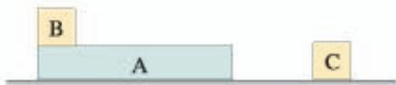  
图1-5

8. 如图 1-6，质量均为 m 的木块 A 和 B，并排放在光滑水平面上，A 上固定一竖直轻杆，轻杆上端的 O 点系一长为 l 的细线，细线另一端系一质量为 $m_{0}$ 的球 C。现将 C 球拉起使细线水平伸直，并由静止释放 C 球。求 A、B 两木块分离时，A、B、C 的速度大小。

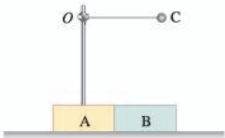  
图1-6

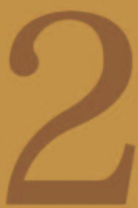

## 第二章机械振动

人类生活在运动的世界里，机械运动是最常见的运动。在机械运动中，振动也很常见。琴弦的振动带给人们优美的音乐，地震则可能给人类带来巨大的灾难。本章我们将从最简单的振动开始，学习怎样描述振动，分析振动的特点。

科学是一种方法, 它教导人们: 一些事物是如何被了解的, 不了解的还有些什么, 对于了解的, 现在了解到了什么程度……

——费恩曼 $^{①}$

## 1 简谐运动

## 问题

钟摆来回摆动，水中浮标上下浮动，担物行走时扁担下物体的颤动，树梢在微风中的摇摆……在生活中我们会观察到很多类似这样的运动。这些运动的共同点是什么？

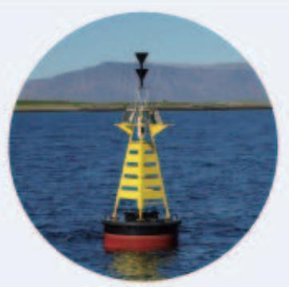

通过观察我们会发现，上述物体总是在某一位置附近做往复性的运动。

我们把物体或物体的一部分在一个位置附近的往复运动称为机械振动（mechanical vibration），简称振动。

## 弹簧振子

如图 2.1-1，把一个有小孔的小球连接在弹簧的一端，弹簧的另一端固定，小球套在光滑的杆上，能够自由滑动。弹簧的质量与小球相比可以忽略。小球运动时空气阻力很小，也可以忽略。弹簧未形变时，小球所受合力为 0，处于平衡位置（equilibrium position）。把小球拉向右方，然后放开，它就在平衡位置附近运动起来。

我们把小球和弹簧组成的系统称为弹簧振子（spring oscillator），有时也简称为振子。

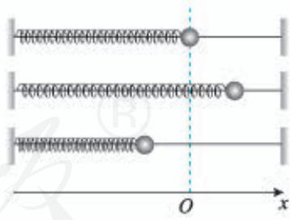  
图2.1-1 弹簧振子的振动

弹簧振子是一个理想化模型，它是研究一般性振动的基础。

要想了解弹簧振子运动的特点，就要知道它的位置随时间变化的关系。我们以小球的平衡位置为坐标原点 $O$ ，沿着它的振动方向建立坐标轴，规定水平向右为正方向。小球在平衡位置的右边时它的位置坐标 $x$ 为正，在左边时位置坐标 $x$ 为负，这样描述小球的位置既方便，又突出了小球位置变化的特点。小球的位置坐标反映了小球相对于平衡位置的位移，小球的位置—时间图像就是小球的位移—时间图像。

## 思考与讨论

怎样才能得到小球位移与时间的关系？

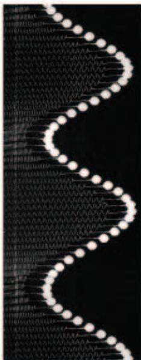  
图2.1-2 弹簧振子的频闪照片

要想得到位移与时间的关系，关键在于记录不同时刻小球的位置，为了便于分析，最好是相等时间间隔的位置。利用频闪照相、照相机连拍，或用摄像机摄像后逐帧观察的方式，都可以得到相等时间间隔的不同时刻小球的位置。

图 2.1-2 是图 2.1-1 所示的弹簧振子的频闪照片。频闪仪每隔 0.05 s 闪光一次，闪光的瞬间振子被照亮，从而得到闪光时小球的位置，相邻两个位置之间的时间间隔为 0.05 s。拍摄时底片从下向上匀速运动，因此在底片上留下了小球和弹簧的一系列的像。

选取小球平衡位置为坐标原点，建立如图2.1-3所示的坐标系，横轴和纵轴分别表示时间 $t$ 和小球的位移 $x$ 。在坐标系中标出各时刻小球球心的位置，用曲线把各点连接起来，就是小球在平衡位置附近往复运动时的位移—时间图像，即 $x - t$ 图像。 $x - t$ 图像即振动图像。

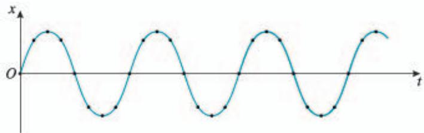  
图2.1-3 振动图像

## 做一做

## 用数码相机和计算机绘制弹簧振子的 $x - t$ 图像

图2.1-2的照片是通过频闪照相得到的。使用数码相机或手机的连拍功能也能得到类似的图片。

轻质弹簧的下端悬挂一个钢球，上端固定，它们组成了一个振动系统，称为竖直弹簧振子。用手把钢球向上托起一段距离，然后释放，钢球便上下振动。钢球原来静止时

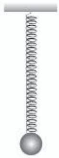  
图2.1-4 钢球释放后上下振动

的位置就是振子的平衡位置（图2.1-4）

用数码相机拍摄钢球的运动。通常每隔0.04 s（这个时间间隔通常可以设定）数码相机就会拍摄一帧照片。拍摄时最好把钢球的位置放在取景框的最左侧。

在计算机中建立一个幻灯片的演示文稿，把这些照片插入文稿中的同一张空白幻灯片中，照片会按拍摄时间的先后一帧一帧自动向右平铺开来。把这些照片的上端对齐，便能得到与图2.1-2相似的画面。这样就可以在同一个画面上看到钢球在各个不同时刻的位置。

## 简谐运动

从获得的弹簧振子的 $x - t$ 图像（图2.1-3）可以看出，小球位移与时间的关系似乎可以用正弦函数来表示。是不是这样呢？还需要进行深入的研究。

## 思考与讨论

如何确定弹簧振子中小球的位移与时间的关系是否遵从正弦函数的规律？

数学课中我们已经学过正弦函数的有关知识。要想确定弹簧振子中小球的位移与时间的关系是否遵从正弦函数的规律，可采用下面的方法。

方法一：假定图2.1-3中的曲线是正弦曲线，测量它的振幅和周期，写出对应的正弦函数的表达式。需要注意的是，这个表达式中计时开始时位移应该是0，随后位移开始增加并为正值。

然后，在图2.1-3的曲线中选小球的若干个位置，用刻度尺在图中测量它们的纵坐标（位移），将每一个位移对应的振动时间代入表达式求出函数值，比较这一函数值与测量值，看一看二者是否相等。若可视为相等，则这条曲线就是一条正弦曲线。

方法二：在图2.1-3中，测量小球在各个位置的横坐标和纵坐标。把测量值输入计算机中，作出这条曲线，看一看小球的位移—时间关系是否可以用正弦函数表示。

通过仔细分析会发现，图 2.1-3 所示小球位移与时间的关系是正弦函数关系。

如果物体的位移与时间的关系遵从正弦函数的规律，即它的振动图像（x-t 图像）是一条正弦曲线，这样的振动是一种简谐运动（simple harmonic motion）。简谐运动是最基本的振动。图 2.1-1 中小球的运动就是简谐运动。

## 练习与应用

1. 如图 2.1-5，两人合作，模拟振动曲线的记录装置。先在白纸中央画一条直线，使它平行于纸的长边，作为图像的横坐标轴。一个人用手使铅笔尖在白纸上沿垂直于这条直线的方向水平振动，另一个人沿这条直线的方向匀速拖动白纸，纸上就画出了一条描述笔尖振动情况的 x-t 图像。

请完成这个实验，并解释：横坐标代表什么物理量？纵坐标代表什么量？为什么必须匀速拖动白纸？如果拖动白纸的速度是 $5 \times 10^{-2} \mathrm{~m} / \mathrm{s}$ ，在横坐标轴上应该怎样标出坐标的刻度？

2. 图 2.1-6 是某质点做简谐运动的振动图像。根据图像中的信息，回答下列问题。

(1) 质点离开平衡位置的最大距离有多大?

（2）在 $1.5 \mathrm{~s}$ 和 $2.5 \mathrm{~s}$ 这两个时刻，质点的位置在哪里？质点向哪个方向运动？

（3）质点相对于平衡位置的位移方向在哪些时间内跟它的瞬时速度的方向相同？在哪些时间内跟瞬时速度的方向相反？

(4) 质点在第 2 s 末的位移是多少?

(5) 质点在前 2 s 内运动的路程是多少?

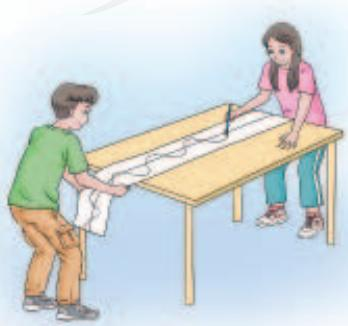  
图2.1-5

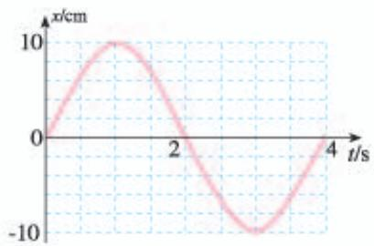  
图2.1-6

## 2 简谐运动的描述

## 问题

有些物体的振动可以近似为简谐运动，做简谐运动的物体在一个位置附近不断地重复同样的运动。如何描述简谐运动的这种独特性呢？

我们已经知道，做简谐运动的物体的位移 $x$ 与运动时间 $t$ 之间满足正弦函数关系，因此，位移 $x$ 的一般函数表达式可写为

$$
x = A \sin (\omega t + \varphi)
$$

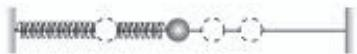

下面我们根据上述表达式，结合图2.2-1所示情景，分析简谐运动的特点。

图2.2-1 弹簧振子的简谐运动

## 振幅

因为 $|\sin (\omega t + \varphi)|\leqslant 1$ ，所以 $|x|\leqslant A$ ，这说明 $A$ 是物体离开平衡位置的最大距离。

▶ 请大家复习高中数学的相关知识。

如图2.2-2，如果用M点和 $M'$ 点表示水平弹簧振子在平衡位置O点右端及左端最远位置，则 $|OM|=|OM'|=A$ ，我们把振动物体离开平衡位置的最大距离，叫作振动的振幅（amplitude）。振幅是表示振动幅度大小的物理量，常用字母A表示。振幅的单位是米。振动物体运动的范围是振幅的两倍。

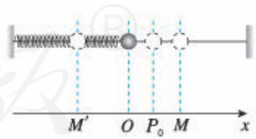  
图2.2-2 简谐运动的振幅

## 周期和频率

在图2.2-2中，如果从振动物体向右通过 $O$ 的时刻开始计时，它将运动到 $M$ ，然后向左回到 $O$ ，又继续向左运动到达 $M^{\prime}$ ，之后又向右回到 $O$ 。这样一个完整的振动过程称为一次全振动。做简谐运动的物体总是不断地重复着这样

▶ 描述任何周期性过程都要用到周期和频率这两个概念。实际上，它们的应用范围已经扩展到物理学以外的领域了。

的运动过程，不管以哪里作为开始研究的起点。例如从图中的 $P_{0}$ 点开始研究，做简谐运动的物体完成一次全振动的时间总是相同的。

做简谐运动的物体完成一次全振动所需要的时间，叫作振动的周期（period）。物体完成全振动的次数与所用时间之比叫作振动的频率（frequency），数值等于单位时间内完成全振动的次数。用T表示周期，用f表示频率，则有

$$
f = \frac {1}{T}
$$

在国际单位制中，周期的单位是秒。频率的单位是赫兹（hertz），简称赫，符号是Hz。1 Hz=1 s $^{-1}$ 。

周期和频率都是表示物体振动快慢的物理量，周期越小，频率越大，表示振动越快。

根据正弦函数规律， $(\omega t+\varphi)$ 在每增加 $2\pi$ 的过程中，函数值循环变化一次。这一变化过程所需要的时间便是简谐运动的周期 T。

于是有 $[\omega (t + T) + \varphi ] - (\omega t + \varphi) = 2\pi$

由此解出

$$
\omega = \frac {2 \pi}{T}
$$

根据周期与频率间的关系，则

$$
\omega = 2 \pi f
$$

可见， $\omega$ 是一个与周期成反比、与频率成正比的量，叫作简谐运动的“圆频率”。它也表示简谐运动的快慢。

## 做一做

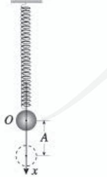  
图2.2-3 测量小球振动的周期

## 测量小球振动的周期

如图2.2-3，弹簧上端固定，下端悬挂钢球。把钢球从平衡位置向下拉一段距离 $A$ ，放手让其运动， $A$ 就是振动的振幅。用停表测出钢球完成 $n$ 个全振动所用的时间 $t$ $\frac{t}{n}$ 就是振动的周期。 $n$ 的值取大一些可以减小测量误差。

再把振幅减小为原来的一半，用同样的方法测量振动的周期。

通过这个实验你会发现，弹簧振子的振动周期与其振幅无关。不仅弹簧振子的简谐运动，所有简谐运动的周期均与其振幅无关。

## 相位

从 $x = A\sin (\omega t + \varphi)$ 可以发现，当 $(\omega t + \varphi)$ 确定时， $\sin (\omega t + \varphi)$ 的值也就确定了，所以 $(\omega t + \varphi)$ 代表了做简谐运动的物体此时正处于一个运动周期中的哪个状态。物理学中把 $(\omega t + \varphi)$ 叫作相位（phase）。 $\varphi$ 是 $t = 0$ 时的相位，称作初相位，或初相。

实际上，经常用到的是两个具有相同频率的简谐运动的相位差（phase difference）。如果两个简谐运动的频率相同，其初相分别是 $\varphi_{1}$ 和 $\varphi_{2}$ ，当 $\varphi_{1} > \varphi_{2}$ 时，它们的相位差是

$$
\Delta \varphi = (\omega t + \varphi_ {1}) - (\omega t + \varphi_ {2}) = \varphi_ {1} - \varphi_ {2}
$$

此时，我们常说1的相位比2超前 $\Delta\varphi$ ，或者说2的相位比1落后 $\Delta\varphi$ 。

## 演示

## 观察两个小球的振动情况

并列悬挂两个相同的弹簧振子（图 2.2-4）。把小球向下拉同样的距离后同时放开，观察两球的振幅、周期、振动的步调。

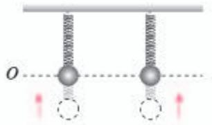

再次把两个小球拉到相同的位置，先把第一个小球放开，再放开第二个，观察两球的振幅、周期、振动的步调。

图2.2-4 观察两小球的振动

通过观察我们会发现，两个小球同时释放时，除了振幅和周期都相同外，还总是向同一方向运动，同时经过平衡位置，并同时到达同一侧的最大位移处。在一个周期内，如果不同时释放小球，它们的步调就不一致。例如，自开始释放，当第一个小球到达平衡位置时再放开第二个，那么当第一个小球到达最高点时，第二个刚刚到达平衡位置；而当第二个小球到达最高点时，第一个已经返回平衡位置了。与第一个小球相比，第二个小球总是滞后 $\frac{1}{4}$ 个周期，或者说总是滞后 $\frac{1}{4}$ 个全振动。

上例中同时放开的两个小球振动步调总是一致，我们说它们的相位是相同的；而对于不同时放开的两个小球，我们说第二个小球的相位落后于第一个小球的相位。

根据一个简谐运动的振幅 $A$ 、周期 $T$ 、初相位 $\varphi_0$ ，可以知道做简谐运动的物体在任意时刻 $t$ 的位移 $x$ 是

$$
x = A \sin \left(\frac {2 \pi}{T} t + \varphi_ {0}\right)
$$

所以，振幅、周期、初相位是描述简谐运动特征的物理量。

## 【例题】

如图 2.2-5，弹簧振子的平衡位置为 O 点，在 B、C 两点之间做简谐运动。B、C 相距 20 cm。小球经过 B 点时开始计时，经过 0.5 s 首次到达 C 点。

（1）画出小球在第一个周期内的 $x - t$ 图像。

  
图2.2-5

(2) 求 5 s 内小球通过的路程及 5 s 末小球的位移。

分析 根据简谐运动的位移与时间的函数关系，可以画出简谐运动的 $x - t$ 图像。

要得到简谐运动的位移与时间的函数关系，就需要首先确定计时的起点，进而确定初相位。根据振幅、周期及初相位写出位移与时间的函数关系，画出图像。

我们也可以采用描点法来画出位移—时间图像。根据题意，可以确定计时起点的位移、通过平衡位置及最大位移处的时刻，在 $x - t$ 图上描出这些特殊坐标点，根据正弦图像规律画出图像。

根据简谐运动的周期性，在一个周期内，小球的位移为0，通过的路程为振幅的4倍。据此，可以求出5s内小球通过的路程及5s末小球的位移。

解（1）以 O 点作为坐标原点，沿 OB 建立坐标轴，如图 2.2-5 所示。以小球从 B 点开始运动的时刻作为计时起点，用正弦函数来表示小球的位移—时间关系，则函数的初相位为 $\frac{\pi}{2}$ 。

由于小球从最右端的 B 点运动到最左端的 C 点所用时间为 0.5 s，所以振动的周期 T = 1.0 s；由于 B 点和 C 点之间的距离为 0.2 m，所以，振动的振幅 A = 0.1 m。

根据 $x = A\sin \left(\frac{2\pi}{T} t + \varphi_0\right)$ ，可得小球的位移一时间关系为

$$
x = 0. 1 \sin (2 \pi t + \frac {\pi}{2}) \mathrm{m}
$$

据此，可以画出小球在第一个周期内的位移—时间图像，如图2.2-6所示。

（2）由于振动的周期 $T = 1\mathrm{s}$ ，所以在时

  
图2.2-6

间 $t = 5\mathrm{s}$ 内，小球一共做了 $n = \frac{t}{T} = 5$ 次全振动。小球在一次全振动中通过的路程为 $4A = 0.4\mathrm{m}$ ，所以小球运动的路程为 $s = 5\times 0.4\mathrm{m} = 2\mathrm{m}$ ；经过5次全振动后，小球正好回到 $B$ 点，所以小球的位移为 $0.1\mathrm{m}$ 。

## 做一做

## 用计算机呈现声音的振动图像

绝大多数计算机都有录音、放音的功能，并能在放音时显示声振动的图像。

用计算机的录音功能录制两个乐音，例如笛声，一个是do，另一个是sol，把它们保存起来。用媒体播放软件显示这两个声音，把播放软件界面中“条形与波浪”的选项设为“波形”。这样可以从计算机屏幕上看到播放声音时的振动图像。按下“暂停”键得到静止的图像。

  
图2.2-7 比较两个声音的频率

把do和sol这两个声音的振动图像复制到同一张空白幻灯片上，并把图像以外多余的区域裁掉，

就得到图2.2-7所示的图形。在屏幕上作出矩形框，调节框的宽度，使框内包含do的10个周期。在屏幕上观察，多少个sol的周期与do的10个周期的时间相等，由此可以得到sol和do的频率之比。如果已知其中一个声音的频率，还可以推知另一个声音的频率。

请你想办法完成上面的操作。

## 科学漫步

## 乐音和音阶

在音乐理论中，把一组音按音调高低的次序排列起来就成为音阶，也就是大家都知道的do, re, mi, fa, sol, la, si, do（高）。下表列出了某乐律C调音阶中各音的频率。

<table><tr><td>唱名</td><td>do</td><td>re</td><td>mi</td><td>fa</td><td>sol</td><td>la</td><td>si</td><td>do(高)</td></tr><tr><td>该唱名的频率与do的频率之比</td><td>1:1</td><td>9:8</td><td>5:4</td><td>4:3</td><td>3:2</td><td>5:3</td><td>15:8</td><td>2:1</td></tr><tr><td>f/Hz(C调)</td><td>264</td><td>297</td><td>330</td><td>352</td><td>396</td><td>440</td><td>495</td><td>528</td></tr></table>

有趣的是，高音do的频率正好是中音do的2倍，而且音阶中各音的频率与do的频率之比都是整数之比。

还有更有趣的事情。喜欢音乐的同学都知道，有些音一起演奏时听起来好听，有些音一起演奏时听起来不好听，前者叫作谐和音，后者叫作不谐和音。著名的大三和弦do、mi、sol的频率比是4:5:6，而小三和弦re、fa、la的频率比是10:12:15。大三和弦听起来更为和谐，那是因为三个音的频率比是更小的整数之比。随便拼凑在一起的三个音听起来不和谐，有兴趣的同学可以算一算它们的频率比，一定是三个比较大的整数。

从这个例子可以看到艺术后面的科学道理，但是，艺术远比“1+1=2”复杂。从上表中看出，频率增加一倍，音程高出8度。实际上这只对于中等音高是正确的。人的感觉十分复杂，对于高音段来说，频率要增加一倍多，听起来音高才高出一个8度。如果一个调音师按照“频率翻倍”的办法调钢琴，那就要出问题了。

尽管如此，科学家们还是可以通过音乐家的实际测听，确定音高与频率的对应关系，并且据此设计出优美动听的电子乐器。

## 练习与应用

1. 一个小球在平衡位置 O 点附近做简谐运动，若从 O 点开始计时，经过 3 s 小球第一次经过 M 点，再继续运动，又经过 2 s 它第二次经过 M 点；求该小球做简谐运动的可能周期。

2. 有两个简谐运动: $x_{1} = 3a \sin \left(8\pi bt + \frac{\pi}{4}\right)$ 和 $x_{2} = 9a \sin \left(8\pi bt + \frac{\pi}{2}\right)$ , 它们的振幅之比是多少? 它们的频率各是多少? 它们的相位差是多少?

3. 图2.2-8是两个简谐运动的振动图像，它们的相位差是多少？

  
图2.2-8

4. 有甲、乙两个简谐运动：甲的振幅为 $2 \mathrm{~cm}$ ，乙的振幅为 $3 \mathrm{~cm}$ ，它们的周期都是 $4 \mathrm{~s}$ ，当 $t = 0$ 时甲的位移为 $2 \mathrm{~cm}$ ，乙的相位比甲落后 $\frac{\pi}{4}$ 。请在同一坐标系中画出这两个简谐运动的位移—时间图像。

5. 图2.2-9为甲、乙两个简谐运动的振动图像。请根据图像写出这两个简谐运动的位移随时间变化的关系式。

  
图2.2-9

## 3 简谐运动的回复力和能量

## 问题

当我们把弹簧振子的小球拉离平衡位置释放后，小球就会在平衡位置附近做简谐运动。小球的受力满足什么特点才会做这种运动呢？

-

根据牛顿运动定律，可以作出以下判断：做简谐运动的物体偏离平衡位置向一侧运动时，一定有一个力迫使物体的运动速度逐渐减小直到减为0，然后，物体在这个力的作用下，运动速度又由0逐渐增大并回到平衡位置；物体由于具有惯性，到达平衡位置后会继续向另一侧运动，这个力使它再一次回到平衡位置。正是在这个力的作用下，物体在平衡位置附近做往复运动。我们把这样的力称为回复力（restoring force）。

## 简谐运动的回复力

做简谐运动的物体受到的回复力有什么特点？下面我们以弹簧振子做简谐运动为例进行分析。

如图2.3-1甲，当小球在 $O$ 点（平衡位置）时，所受的合力为0；在 $O$ 点右侧任意选择一个位置 $P$ ，无论小球向右运动还是向左运动，小球在 $P$ 点相对平衡位置的位移都为 $x$ ，受到的弹簧弹力如图2.3-1乙所示。从图中可以看出，迫使小球回到平衡位置的回复力应该是由弹簧弹力提供的，回复力大小为 $F = kx$ （ $k$ 为弹簧的劲度系数），方向指向平衡位置。

  
图2.3-1 简谐运动的回复力

同样道理，当小球在 $O$ 点左侧某一位置 $Q$ 时，迫使小球回到平衡位置的回复力还是由弹簧弹力提供，大小仍为 $F = kx$ ，方向指向平衡位置（如图2.3-1丙所示）。

从上面的分析可以看出，弹簧对小球的弹力是小球做简谐运动的回复力，这个力的大小与小球相对平衡位置的位移成正比，方向与位移方向相反，可表示为： $F = -kx$ ，式中“-”号表示 $F$ 与 $x$ 反向。

理论上可以证明，如果物体所受的力具有 $F = -kx$ 的形式，物体就做简谐运动。也就是说：如果物体在运动方向上所受的力与它偏离平衡位置位移的大小成正比，并且总是指向平衡位置，质点的运动就是简谐运动。

## 简谐运动的能量

弹簧振子中小球的速度在不断变化，因而它的动能在不断变化；弹簧的伸长量或压缩量在不断变化，因而它的势能也在不断变化。弹簧振子的能量变化具有什么规律呢？

## 做一做

弹簧振子的势能与弹簧的伸长量有关，动能与小球的速度有关。请在下表中填出图2.3-1中的弹簧振子在各位置的能量。某量为最大值、最小值用“最大”和“最小”表示，某量为零用数字“0”表示，增加和减少分别用“↗”和“↘”表示（假设P、Q为最大位移处）。

<table><tr><td>位置</td><td>Q</td><td>Q→O</td><td>O</td><td>O→P</td><td>P</td></tr><tr><td>位移的大小</td><td></td><td></td><td></td><td></td><td></td></tr><tr><td>速度的大小</td><td></td><td></td><td></td><td></td><td></td></tr><tr><td>动能</td><td></td><td></td><td></td><td></td><td></td></tr><tr><td>弹性势能</td><td></td><td></td><td></td><td></td><td></td></tr><tr><td>机械能</td><td></td><td></td><td></td><td></td><td></td></tr></table>

沿水平方向振动的弹簧振子的势能为弹性势能，其大小取决于弹簧的形变量。小球运动远离平衡位置时，势能会增大。与此同时，小球的速度减小，动能减小。小球到达最大位移时，动能为0，势能最大。小球通过平衡位置时，动能最大，势能为0。

理论上可以证明，在弹簧振子运动的任意位置，系统的动能与势能之和都是一定的，遵守机械能守恒定律。

实际的运动都有一定的能量损耗，所以简谐运动是一

种理想化的模型。

当小球运动到最大位移时，动能为0，弹性势能最大，系统的机械能等于最大弹性势能。对于弹簧劲度系数和小球质量都一定的系统，振幅越大，机械能越大。

## 练习与应用

1. 把图 2.3-2 中倾角为 $\theta$ 的光滑斜面上的小球沿斜面拉下一段距离，然后松开。假设空气阻力可忽略不计，试证明小球的运动是简谐运动。

  
图2.3-2

2. 若想判定以下振动是不是简谐运动，请你陈述求证的思路（可以不进行定量证明），空气阻力可忽略。

（1）粗细均匀的一根木筷，下端绕几圈铁丝，竖直浮在较大的装有水的杯中（图2.3-3）。把木筷往上提起一段距离后放手，木筷就在水中上下振动。

  
图2.3-3

  
图2.3-4

（2）光滑圆弧面上有一个小球，把它从最低点移开一小段距离，放手后，小球以最低点为平衡位置左右振动（图2.3-4）。

3. 做简谐运动的物体经过 A 点时，加速度的大小是 $2 \, m/s^{2}$ ，方向指向 B 点；当它经过 B 点时，加速度的大小是 $3 \, m/s^{2}$ ，方向指向 A 点。若 A、B 之间的距离是 10 cm，请确定它的平衡位置。

4. 图 2.3-5 为某物体做简谐运动的图像，在 0～1.5 s 范围内回答下列问题。

（1）哪些时刻物体的回复力与 0.4 s 时的回复力相同？

（2）哪些时刻物体的速度与0.4s时的速度相同？

（3）哪些时刻的动能与0.4s时的动能相同？

（4）哪段时间的加速度在减小？

(5) 哪段时间的势能在增大?

  
图2.3-5

## 4 单摆

## 问题

生活中经常可以看到悬挂起来的物体在竖直平面内往复运动。将一小球用细绳悬挂起来，把小球拉离最低点释放后，小球就会来回摆动。小球的摆动是否为简谐运动呢？

研究单摆时还有一个条件：与小球受到的重力及绳的拉力相比，空气等对它的阻力可以忽略。

为了更好地满足这个条件，实验时我们总要尽量选择质量大、体积小的球和尽量细的线。

如果细线的长度不可改变，细线的质量与小球相比可以忽略，球的直径与线的长度相比也可以忽略，这样的装置就叫作单摆（simple pendulum）。单摆是实际摆的理想化模型。显然，单摆摆动时摆球在做振动，下面我们来研究单摆的运动情况。

## 思考与讨论

用什么方法探究单摆的振动是否为简谐运动？

可以用两种不同方法来研究上述问题：一种方法是分析单摆的回复力，看其与位移是否成正比并且方向相反；另一种方法是分析单摆位移与时间的关系是否满足正弦关系。

  
图2.4-1 分析单摆的回复力

下面我们采用第一种方法来分析。

## 单摆的回复力

如图2.4-1，单摆摆长为 $l$ 、摆球质量为 $m$ 。将摆球拉离平衡位置 $O$ 后释放，摆球沿圆弧做往复运动。当摆球沿圆弧运动到某一位置 $P$ 时，摆线与竖直方向的夹角为 $\theta$ 。此时摆球受到重力 $G$ 和摆线拉力 $F_{\mathrm{T}}$ 的作用。重力 $G$ 沿圆弧切线方向的分力 $F = m g \sin \theta$ ，正是这个力充当回复力，

迫使摆球回到平衡位置 $O$ 。

回复力 F 与小球从 O 点到 P 点的位移 x 并不成正比也不反向。但是，当摆角 $\theta$ 很小时，摆球运动的圆弧可以看成直线，可认为 F 指向平衡位置 O，与位移 x 反向。圆弧 $\widehat{OP}$ 的长度可认为与摆球的位移 x 大小相等，即

▶ 如果角 $\theta$ 很小，用弧度表示的 $\theta$ 与它的正弦 $\sin \theta$ 近似相等。

$$
\sin \theta \approx \theta = \frac {\widehat {O P}}{l} \approx \frac {x}{l}
$$

因此，单摆振动的回复力 $F$ 可表示为

$$
F = - \frac {m g}{l} x
$$

式中负号表示回复力与位移的方向相反。对一个确定的单摆来说，摆球质量m和摆长l是一定的， $\frac{mg}{l}$ 可以用一个常量k表示，于是上式可以写成

$$
F = - k x
$$

可见，单摆在摆角很小的情况下做简谐运动。

## 做一做

如图 2.4-2，细线下悬挂一个除去了柱塞的注射器，注射器内装上墨汁。当注射器摆动时，沿着垂直于摆动的方向匀速拖动木板，观察喷在木板上的墨汁图样。

  
图2.4-2 观察墨汁图样

## 单摆的周期

一条短绳系一个小球，它的振动周期较短。悬绳较长的秋千（图2.4-3），周期较长。单摆的周期与哪些因素有关？

下面我们通过实验来研究这个问题。

  
图2.4-3 悬绳长度不同的秋千

## 演示

## 影响单摆周期的因素

如图 2.4-4，在铁架台的横梁上固定两个单摆，按照以下几种情况，把它们拉起一定角度后同时释放，观察两摆的振动周期。

  
图 2.4-4 研究单摆的振动周期

1. 两摆的摆球质量、摆长相同，振幅不同（都在小偏角下）。2. 两摆的摆长、振幅相同，摆球质量不同。3. 两摆的振幅、摆球质量相同，摆长不同。

比较三种情况下两摆的周期，可以得出什么结论？

实验表明：单摆做简谐运动的周期与摆长有关，摆长越长，周期越大；单摆的周期与摆球质量和振幅无关。

单摆周期与摆长之间有什么定量的关系呢？

## 实验

## 探究单摆周期与摆长之间的关系

如图 2.4-4，改变摆长 l，测出对应的单摆周期 T（在小偏角下），测量时要尽可能在比较大的范围改变摆长。

设计表格，记录实验数据。根据你的实验数据，能否找出周期与摆长之间的关系？

如果从数据中不能直接找出周期和摆长间的关系，可尝试在坐标纸上画出 $T - l$ 图像，看看曲线是什么形状？你能根据 $T - l$ 图像判断单摆周期与摆长的关系吗？

如果 $T - l$ 图像不是直线，应该怎么办？

为了找出单摆周期与摆长之间定量的关系，荷兰物理学家惠更斯进行了详尽的研究，发现单摆做简谐运动的周期 $T$ 与摆长 $l$ 的二次方根成正比，与重力加速度 $g$ 的二次方根成反比，而与振幅、摆球质量无关。惠更斯确定了计算单摆周期的公式

$$
T = 2 \pi \sqrt {\frac {l}{g}}
$$

惠更斯（Christiaan Huygens，1629—1695）  
单摆周期公式的发现，为人类利用简谐运动定量计时提供了可能，并以此为基础发明了真正可持续运转的时钟。  

## 科学漫步

## 从日晷到原子钟

在人类文明进步和科学技术发展的历史长河中，人类活动与时间测量的精度是密不可分的。很久很久以前，我们的祖先记录时间是利用天体的周期性运动。例如，利用太阳和月亮相对自己的位置等来模糊地定义时间。

图2.4-5 日晷  

后来，人们从观察自然现象到逐渐发明了日晷（图2.4-5）、水钟、沙漏等人造计时装置，这标志着人造时钟开始出现。

当钟摆等可长时间周期性运动的振荡器出现后，人们把能产生确定的振荡频率的装置，作为时间频率标准，并以此为基础发明了真正可持续运转的时钟。

从20世纪30年代开始，随着晶体振荡器的发明，小型化、低能耗的石英晶体钟表代替了机械钟，广泛应用在电子计时器和其他各种计时领域。

20世纪40年代开始，科学家们利用原子超精细结构跃迁能级具有非常稳定的跃迁频率这一特点，发展出比晶体钟更高精度的原子钟。

随着激光冷却原子技术的发展，利用激光冷却的原子制造的冷原子钟（图2.4-6）使时间

测量的精度进一步提高。到目前为止，地面上精度最高的冷原子喷泉钟已经达到每3亿年只有1 s的误差，更高精度的冷原子光钟也在快速发展中。

近年来，科学家们将激光冷却原子技术与空间微重力环境相结合，有望在空间轨道上获得比地面上的线宽要窄一个数量级的原子钟谱线，从而进一步提高原子钟的精度，这将是原子钟发展史上又一个重大突破。

  
图2.4-6 我国制造的空间冷原子钟

## 练习与应用

1. 一个理想单摆，已知其周期为 T。如果由于某种原因（如转移到其他星球）自由落体加速度变为原来的 $\frac{1}{2}$ ，它的周期变为多少？

2. 周期是 2 s 的单摆叫秒摆，秒摆的摆长是多少？把一个地球上的秒摆拿到月球上去，已知月球上的自由落体加速度为 $1.6 \, m/s^{2}$ ，它在月球上做 50 次全振动要用多少时间？

3. 图 2.4-7 是两个单摆的振动图像。

  
图2.4-7

(1) 甲、乙两个摆的摆长之比是多少?

（2）以向右的方向作为摆球偏离平衡位置的位移的正方向，从 $t = 0$ 起，乙第一次到达右方最大位移时，甲摆动到了什么位置？向什么方向运动？

4. 一条细线下面挂着一个小球，让它自由摆动，画出它的振动图像如图 2.4-8 所示。

（1）请根据图中的数据计算出它的摆长。

（2）请根据图中的数据估算出它摆动的最大偏角。

  
图2.4-8

# 5 实验: 用单摆测量重力加速度

理论上，与重力相关的物理现象都可以用来测量g。例如，利用自由落体运动就可以测量g。

了解地球表面重力加速度的分布，对地球物理学、航空航天技术及大地测量等领域有十分重要的意义。为此，就需要了解测量重力加速度的方法。

## 实验思路

惠更斯在推导出单摆的周期公式后，用一个单摆测出了巴黎的重力加速度。我们也可以采用同样的办法，测量所在地区的重力加速度数值。

当摆角较小时，单摆做简谐运动，根据其周期公式可得

  
图2.5-1 实验装置

$$
g = \frac {4 \pi^ {2} l}{T ^ {2}}
$$

想一想，要根据上式测量重力加速度，需要测量哪些物理量？应该如何设计实验装置、选择实验器材？怎样才能减小实验误差？

## 实验装置

如图 2.5-1，在细线的一端打一个比小球上的孔径稍大些的结，将细线穿过球上的小孔，并把细线上端固定在铁架台上，就制成一个单摆。将铁夹固定在铁架台的上端，铁架台放在实验桌边，使铁夹伸到桌面以外，方便使用不同长度的摆线。

## 思考与讨论

  
甲

  
图2.5-2 细线上端的两种悬挂方式  
乙

1. 线有粗细、长短的不同，伸缩性也有区别。不同的小球，质量和体积有差异。想一想，应如何选择摆线和摆球？为什么？

2. 图 2.5-2 展示出了细线上端的两种不同的悬挂方式。应该选用哪种方式？为什么？你还有更好的设计吗？

## 物理量的测量

## 摆长的测量

摆长是摆线长度和小球半径之和。怎样测量才能减小误差？可以用刻度尺直接测量小球球心与悬挂点之间的距离作为摆长的测量值，用图2.5-3所示的方法减小误差；也可用游标卡尺测量小球的直径，算出它的半径，再测量悬挂点与小球上端之间的距离，以两者之和作为摆长的测量值。

## 周期的测量

我们一般用停表测量单摆的周期。实验时，可以测量单摆做一次全振动的时间作为它的周期的测量值；也可以测量单摆做多次全振动（例如几十次）的时间，然后通过计算求出它的周期的测量值。哪种方法比较好？为什么？

  
图2.5-3 测摆线长度

## 数据分析

从测量的数据中选择几组，根据前面推导的公式，分别计算重力加速度，然后取平均值作为测量结果。  
除了这种方法,你还能想出别的方法来处理实验数据,得到重力加速度吗?  
查询所在地区的重力加速度值，并与测得的结果进行比较。如果有差异，想想可能是什么原因造成的。  

## 练习与应用

1. 在用单摆测量重力加速度的实验中，下面的叙述哪些是正确的，哪些是错误的？

A. 摆线要选择细些的、伸缩性小些的，并且适当长一些

B. 摆球尽量选择质量大些、体积小些的

C. 为了使摆的周期大一些，以方便测量，开始时拉开摆球，使摆角较大

D. 用刻度尺测量摆线的长度 I，这就是单摆的摆长

E. 释放摆球，从摆球经过平衡位置开始计时，记下摆球做50次全振动所用的时间t，则单摆周期 $T=\frac{t}{50}$

2. 某同学在实验探究 $a$ 、 $b$ 两个物理量之间的定量关系时，测得了6组实验数据如右表所

示，它们的单位为P、Q。请用图像（图2.5-4）处理实验数据，寻找它们之间的定量关系，根据图像推出 $a$ 、 $b$ 之间关系的表达式，如果有常数，写出常数的数值和单位。

<table><tr><td>a/P</td><td>0.5</td><td>0.8</td><td>0.9</td><td>1.0</td><td>1.2</td><td>1.5</td></tr><tr><td>b/Q</td><td>1.42</td><td>1.79</td><td>1.90</td><td>2.00</td><td>2.20</td><td>2.45</td></tr></table>

  
图2.5-4

## 6 受迫振动 共振

## 问题

“洗”是古代盥洗用的脸盆，多用青铜铸成，现代亦有许多仿制的工艺品。倒些清水在其中，用手掌慢慢摩擦盆耳，盆就会发出嗡嗡声，到一定节奏时还会溅起层层水花。这是为什么？

通过对弹簧振子及单摆的研究，我们知道弹簧振子与单摆在没有外力干预的情况下做简谐运动，周期或频率与振幅无关，仅由系统自身的性质决定，我们把这种振动称为固有振动，其振动频率称为固有频率（natural frequency）。倘若振动系统受到外力作用，它将如何运动？

  
图2.6-1 阻尼振动图像

## 振动中的能量损失

生活中，摇曳的树叶会停下来，摆动的秋千也会停止运动。由于实际的振动系统都会受到摩擦力、黏滞力等阻碍作用，振幅必然逐渐减小。这种振幅随时间逐渐减小的振动称为阻尼振动（damped vibration），其振动图像如图2.6-1所示。

振动系统能量衰减的方式通常有两种。一种是由于振动系统受到摩擦阻力的作用，使振动系统的机械能逐渐转化为内能。例如单摆运动时受到空气的阻力。另一种是由于振动系统引起邻近介质中各质点的振动，使能量向四周辐射出去，从而自身机械能减少。例如音叉发声时，一部分机械能随声波辐射到周围空间，导致音叉振幅减小。

## 受迫振动

阻尼振动最终要停下来，那么怎样才能产生持续的振动呢？最简单的办法是使周期性的外力作用于振动系统，外力对系统做功，补偿系统的能量损耗，使系统的振动维持下去。这种周期性的外力叫作驱动力，系统在驱动力作用下的振动叫作受迫振动（forced vibration）。机器运转时底座发生的振动、扬声器纸盆的振动，都是受迫振动。

受迫振动的频率与什么因素有关呢？

## 做一做

  
图2.6-2 研究受迫振动的频率

## 研究受迫振动的频率

如图 2.6-2，架子上面的电动机向下面的两组弹簧—钩码系统施加周期性的驱动力，使钩码做受迫振动。改变电动机的转速可以调整驱动力的频率。

接通电源，使钩码做受迫振动，记录驱动力的频率和钩码振动的频率。改变驱动力的频率，再做记录。钩码做受迫振动的频率与驱动力的频率有什么关系？

大量的实验都证实：物体做受迫振动达到稳定后，物体振动的频率等于驱动力的频率，与物体的固有频率无关。

## 共振现象及其应用

在周期性驱动力作用下的受迫振动，其振幅是否也跟它的固有频率无关呢？

## 做一做

如图2.6-3，铁架横梁上挂着几个摆长不同的摆。其中，A与D、G的摆长相同，D的摆球质量大于其他摆球。使D摆偏离平衡位置后释放，D摆在振动中通过横梁对其他几个摆施加周期性的驱动力。在振动稳定后比较各摆的振幅。

  
图2.6-3 演示共振现象

  
图2.6-4 受迫振动振幅与驱动力频率的关系

共振不仅存在于机械振动中，还广泛应用于电磁振动等其他形式的振动中。

通过观察会发现，固有频率与D摆相同的A摆、G摆振幅最大，固有频率与D摆相差较多的C摆、E摆振幅最小。这说明物体在做受迫振动时，驱动力的频率与物体的固有频率相差越小，受迫振动的振幅越大；当驱动力的频率与物体的固有频率相等时，受迫振动的振幅达到最大。

图2.6-4反映了受迫振动振幅 $A$ 与驱动力频率 $f$ 之间的关系。图中 $f_{0}$ 等于物体的固有频率，可以看出，当驱动力的频率等于固有频率时，物体做受迫振动的振幅达到最大值，这种现象称为共振（resonance）。

共振是十分普遍的现象，在工程技术的许多领域都可以观察到它，都要应用到它。

把一些不同长度的钢片安装在同一个支架上，可以制作转速计。把这样的转速计与开动着的机器紧密接触，机器的振动引起转速计的轻微振动，这时固有频率与机器转速一致的那个钢片发生共振，振幅最大。读出这个钢片的固有频率，就可以知道机器的转速。

有的情况下需要避免共振。例如，在桥梁、码头等各种建筑的设计施工中，以及飞机、汽车、轮船的发动机等机器设备的设计、制造、安装中，都必须考虑防止共振产生的危害，以保证建筑和设备的安全。

## 振动控制技术

1940年11月7日早晨，跨度为850 m的美国塔科马峡湾悬索大桥遭到了一场大风的袭击，引发了桥梁的扭转共振。人们束手无策，只能眼看着大桥扭转晃动的幅度越来越大。两小时后，这座建成通车仅4个月的大桥轰然倒塌。从那以后，土木工程师们就开始研究风激振机理和各种桥梁建筑的振动控制技术。

有一种工程减振装置叫作调谐质量阻尼器，是目前大跨度、大悬挑与高耸结构振动控制中应用最广泛的结构被动控制装置之一。这种装置是一个由弹簧、阻尼器和质量块组成的振动控制系统，附加在需要振动控制的主结构上。主结构在外界驱动力的作用下产生振动时，会带动减振装置一起振动。当满足一定条件时，减振装置的弹性力与外来驱动力的方向相反，抵消了一部分驱动力，从而最大限度地降低主结构的振动，达到减振的效果。

在科技工作者的共同努力下，我国的振动控制技术得到了长足发展。目前，包括港珠澳大桥（图2.6-5）在内的许多大型建筑工程中都采用了振动控制技术。

1. 如图2.6-6，一个竖直圆盘转动时，固定在圆盘上的小圆柱带动一个T形支架在竖直方向振动，T形支架下面系着一个弹簧和小球组成的振动系统，小球浸没在水中。当圆盘静止时，让小球在水中振动，其阻尼振动的频率约为 $3\mathrm{Hz}$ 。现使圆盘以 $4\mathrm{s}$ 的周期匀速运动，经过一段时间后，小球振动达到稳定，它振动的频率是多少？

  
图2.6-6

2. 如图 2.6-7，张紧的水平绳上吊着 A、B、C 三个小球。B 球靠近 A 球，但两者的悬线长度不同；C 球远离 A 球，但两者的悬线长度相同。

（1）让A球在垂直于水平绳的方向摆动，在起初一段时间内将会看到B、C球有什么表现？

  
图2.6-7

(2) 在C球摆动起来后, 用手使A、B球静止, 然后松手, 在起初一段时间内又将看到A、B球有什么表现?

3. 汽车的车身是装在弹簧上的，某车的车身—弹簧系统的固有周期是1.5 s。这辆汽车在一条起伏不平的路上行驶，路面凸起之处大约都相隔8 m。汽车以多大速度行驶时，车身上下颠簸得最剧烈？

4. 图2.6-8是一个单摆的共振曲线。

（1）试估计此单摆的摆长。

（2）若摆长增大，共振曲线振幅最大值所对应的横坐标将怎样变化？

  
图2.6-8

5. 图2.6-9是单摆做阻尼振动的位移—时间图像，请比较摆球在 $P$ 与 $N$ 时刻的势能、动能、机械能的大小。

  
图2.6-9

## A组

1. 做简谐运动的质点在通过平衡位置时，哪些物理量分别具有最大值和最小值？

2. 某一弹簧振子完成10次全振动需要2 s的时间，在此2 s的时间内通过的路程是80 cm。求此弹簧振子的振幅、周期和频率。

3.如图2-1，滑块在 $M$ 、 $N$ 之间做简谐运动。以平衡位置 $O$ 为原点，建立 $Ox$ 轴，向右为 $x$ 轴正方向。若滑块位于 $N$ 点时开始计时，试画出其振动图像。

  
图2-1

4.一座摆钟走得慢了，要把它调准，应该怎样改变它的摆长？为什么？

5. 如图 2-2，小球在半径为 R 的光滑球面上

  
图2-2

1. 一个单摆完成 10 次全振动的时间是 40 s，摆球的质量为 0.2 kg，它振动到最大位移时距最低点的高度为 1.5 cm，它完成 10 次全振动回到最大位移时，距最低点的高度变为 1.2 cm。如果每完成 10 次全振动给它补充一次能量，使的 $A$ 、 $B$ 之间来回运动。若 $\widehat{AB} \ll R$ ，试证明小球的运动是简谐运动，并求出其振动的频率。

6. 使悬挂在长绳上的小球偏离平衡位置一个很小的角度，然后放开它，同时使另一个小球从静止开始由悬点自由下落。哪一个小球先到达第一个小球的平衡位置？

7. 图2-3是某简谐运动的振动图像，试根据图像回答下列问题。

  
图2-3

（1）该简谐运动的振幅、周期、频率各是多大？

（2）从C点算起，到曲线上的哪一点，表示完成了一次全振动？

（3）曲线上A、B、C、D、E、F、G、H各点中，哪些点表示振子的动能最大，哪些点表示振子的势能最大？

## B组

摆球回到原来的高度，在 $200\mathrm{s}$ 内总共应补充多少能量？

2. 一个单摆在质量为 $m_{1}$ 、半径为 $R_{1}$ 的星球上做周期为 $T_{1}$ 的简谐运动，在质量为 $m_{2}$ 、半径为 $R_{2}$ 的星球上做周期为 $T_{2}$ 的简谐运动。求

$T_{1}$ 与 $T_{2}$ 之比。

3. 某同学用单摆测重力加速度。实验时改变摆长，测出几组摆长 l 和对应的周期 T 的数据，作出 $l-T^{2}$ 图像，如图 2-4 所示。

（1）利用 A、B 两点的坐标可求得重力加速度 g，请写出重力加速度的表达式。

（2）本实验用 $l-T^{2}$ 图像计算重力加速度，是否可以消除因摆球质量分布不均匀而造成的测量误差？请说明道理。

  
图2-4

4. 图 2-5 是一个弹簧振子的振动图像，试完成以下问题。

(1) 写出该小球位移随时间变化的关系式。

（2）在第 2 s 末到第 3 s 末这段时间内，小球的加速度、速度、动能和弹性势能各是怎样变化的？

（3）该小球在第 $100\mathrm{s}$ 时的位移是多少？路程是多少？

  
图2-5

5. 如图2-6甲，O点为单摆的固定悬点，将力传感器接在摆球与O点之间。现将摆球拉到

A点，释放摆球，摆球将在竖直面内的A、C之间来回摆动，其中B点为运动中的最低位置。图2-6乙表示细线对摆球的拉力大小F随时间t变化的曲线，图中t=0为摆球从A点开始运动的时刻，g取 $10\ m/s^{2}$ 。

(1) 求单摆的振动周期和摆长。

(2) 求摆球的质量。

（3）求摆球运动过程中的最大速度。

  
甲

  
乙  
图2-6

6. 把一个筛子用四根弹簧支撑起来，筛子上装一个电动偏心轮，它每转一周，给筛子一个驱动力，这就做成了一个共振筛，如图2-7甲所示。该共振筛的共振曲线如图2-7乙所示。已知增大电压，可使偏心轮转速提高，增加筛子质量，可增大筛子的固有周期。现在，在某电压下偏心轮的转速是54 r/min。为了使筛子的振幅增大，请提出两种方案。

  
甲

  
乙  
图2-7

## 3

## 第三章 机械波

“隔墙有耳”“一石激起千层浪”……我们对这些现象耳熟能详，它们都与波动有关。测绘科技人员利用声呐绘制海底地形图，医生用“B超”诊断疾病，狂风巨浪使船舶颠簸，地震波对建筑物造成破坏……种种现象表明：波既能传递信息，又能传递能量。

多姿多彩的波有许多共同的特征和规律，我们应该很好地认识波，以便更好地利用波，或预防和减轻波所造成的破坏。

## 1 波的形成

水波离开了它产生的地方，而那里的水并不离开，就像风在田野里掀起的麦浪。我们看到，麦浪滚滚地在田野里奔去，但是麦子却仍旧留在原来的地方。

—达·芬奇 $^{①}$

## 问题

在艺术体操的带操表演中，运动员手持细棒抖动彩带的一端，彩带随之波浪翻卷。彩带上的波浪向前传播时，彩带上的每个点也在向前运动吗？

彩带上的波浪翻卷实际是振动在彩带上传播的结果。振动的传播称为波动，简称波（wave）。波是怎样形成的？

## 波的形成

## 演示

  
图3.1-1 沿绳传播的波

## 观察绳波的产生和传播

如图 3.1-1，取一条较长的软绳，用手握住一端拉平后向上抖动一次，可以看到绳上形成一个凸起部分，这个凸起部分向另一端传去。向下抖动一次，可以看到绳上形成一个凹下部分，这个凹下部分也向另一端传去。连续向上、向下抖动长绳，可以看到一列波产生和传播的情形。

在绳上做个红色标记，在波传播的过程中，这个标记怎样运动？它是否随着波向绳的另一端移动？

仔细观察会发现，绳子上的各点只是在一定位置上下振动，没有向前运动，而振动这种形式却传播出去了。为什么会这样呢？

绳子是有弹性的物体。设想把一条绳子分成一个个小段，这些小段可以看作一个个相连的质点，这些质点之间存在着弹性力的作用。当手握绳端上下振动时，绳端带动相邻的质点，使它也上下振动，这个质点又带动更远一些的质点……绳子上的质点都跟着振动起来，只是后面的质点总比前面的质点迟一些开始振动。这样依次带动下去，绳端这种上下振动的状态就沿绳子传出去了，整体上形成了凹凸相间的波形。

图 3.1-2 更清楚地描绘了绳中质点的运动与波的传播的关系。图中小圆点代表绳中的质点，相邻质点之间有相互作用力，这使得一个质点的运动会影响相邻质点的运动。

质点 $P_{0}$ 在沿上下方向振动，依次牵动质点 $P_{1}, P_{2}, P_{3}, \cdots$ 使它们也运动起来。若在 $t = \frac{1}{4} T$ 时刻，质点 $P_{0}$ 到达了最高点，则 $P_{2}$ 刚要开始运动。质点 $P_{0}$ 到达最高点后又开始下落，当 $t = \frac{1}{2} T$ 时它又回到平衡位置，而这时 $P_{2}$ 刚刚到达最高点，质点 $P_{4}$ 则刚要开始运动。下面两幅图是随后 $\frac{3}{4} T, T$ 时刻各质点的位置及波的形状。

  
图3.1-2 横波的形成

## 做一做

一组学生手挽手排成一行，从左边第一位同学开始，周期性地下蹲、起立，依次带动旁边的同学重复他的动作，只是后边的一位总比前边的一位稍迟一点点。这样就会看到凹凸相间的波沿着队伍传播开来，而每个学生的位置并没有移动。

运动会上的团体操表演常常用这种办法来表现波浪（图 3.1-3）。

  
图3.1-3 团体操表现波浪

## 横波和纵波

图3.1-2表现的是绳子中传播的波。在这列波中质点上下振动，波向右传播，二者的方向相互垂直。质点的振动方向与波的传播方向相互垂直的波，叫作横波（transverse wave）。在横波中，凸起的最高处叫作波峰（wave crest），凹下的最低处叫作波谷（wave trough）。

我们再看另外一种波。

## 演示

  
图3.1-4

## 观察弹簧形成的波

如图 3.1-4，将一根长而软的弹簧水平放置在光滑平面上，在左端沿弹簧轴线方向不断推、拉弹簧，观察实验现象。

实验中观察到，弹簧圈密集的部分和稀疏的部分交替向右传播，在弹簧上形成一种与横波不一样的波。

这种波又是如何形成的呢？我们把一系列弹簧圈看成一系列质点，它们之间由弹力联系着。手执弹簧一端左右振动起来以后，近端的质点依次带动远端的质点左右振动，但后一个质点总比前一个质点迟一些开始振动。也就是说，后一个质点振动的相位总比前一个质点落后一些。这样，弹簧一端左右振动的状态就沿弹簧传播开来。从整体上看，就形成了疏密相间的波。

在图 3.1-4 所示的波中，质点左右振动，波向右传播，二者的方向在同一直线上。质点的振动方向与波的传播方向在同一直线上的波，叫作纵波（longitudinal wave）。在纵波中，质点分布最密的位置叫作密部，质点分布最疏的位置叫作疏部。

  
图3.1-5 声波示意图

发声体振动时在空气中产生的声波是纵波。例如振动的音叉，它的叉股向一侧振动时，压缩邻近的空气，使这部分空气变密，叉股向另一侧振动时，又使这部分空气变得稀疏。这种疏密相间的状态向外传播就形成声波（图3.1-5）。声波传入人耳，使鼓膜振动，就引起声音的感觉。声波不仅能在空气中传播，也能在液体、固体中传播。

## 机械波

绳上和弹簧上的波是在绳和弹簧上传播的，水波是在水面传播的，声波通常是在空气中传播的。绳、弹簧、水、空气等是波借以传播的物质，叫作介质（medium）。组成介质的质点之间有相互作用，一个质点的振动会引起相邻质点的振动。机械振动在介质中传播，形成了机械波（mechanical wave）。

介质中有机械波传播时，介质本身并不随波一起传播。例如绳上或弹簧上有波传播时，它们的质点发生振动，但质点并不随波迁移，传播的只是振动这种运动形式。

介质中本来静止的质点，随着波的传来而发生振动，这表示它获得了能量。这个能量是从波源通过前面的质点依次传来的，所以波在传播“振动”这种运动形式的同时，也将波源的能量传递出去。波是传递能量的一种方式。

波不但传递能量，而且可以传递信息。我们用语言进行交流，就是利用声波传递信息。

## 做一做

有一盆平静的水，上面漂着一片小纸屑。用笔尖轻点水面，观察产生的水波。使笔尖周期性地轻点同一处水面，观察水波的传播和纸屑的运动。

## 练习与应用

1. 举出一个生活中的例子，说明机械波是“质点振动”这种运动形式在介质中的传播，质点并没迁移。

2. 图3.1-6是某绳波形成过程的示意图。质点1在外力作用下沿竖直方向做简谐运动，带动其余质点依次上下振动，把振动从绳的左端传到右端。已知 $t = 0$ 时，质点1开始向上运动； $t = \frac{1}{4} T$ 时，1到达最上方，5开始向上运动。

  
图3.1-6

(1) $t=\frac{1}{2}T$ 时，质点8、12、16的运动

状态如何？

(2) $t=\frac{3}{4}T$ 时，质点8、12、16的运动状态如何？

(3) t = T 时, 质点 8、12、16 的运动状态如何?

3. 图 3.1-7 是以质点 P 为波源的机械波在绳上传到质点 Q 时的波形。

(1) 请判断此机械波的类型。

(2) P 点从平衡位置刚开始振动时, 是朝着哪个方向运动的?

  
图3.1-7

## 2 波的描述

## 问题

观察水波，可以看出波在空间、时间上具有周期性，我们能否用图像的方法来描述一列波呢？如果能，坐标轴表示的是什么物理量？

过去我们研究的是单个质点的运动情况，用 $x - t$ 图像可以很方便地描述质点在任意时刻的位移。而波却是很多质点的运动，在同一时刻各个质点的位移都不尽相同，不方便用 $x - t$ 图像来描述。能否用其他的图像来描述波呢？我们以横波为例研究波的图像。

## 波的图像

  
图3.2-1 绳上的横波

图 3.2-1 是根据一张绳上横波的照片画出的图，记录了绳上各质点在该时刻的具体位置。如果建立直角坐标系，把该时刻绳上各质点的具体位置反映在坐标系中，就可以得到这一时刻绳子上波的图像。

  
图3.2-2 横波的图像

在图3.2-2中，用横坐标 $x$ 表示在波的传播方向上绳中各质点的平衡位置，纵坐标 $y$ 表示某一时刻绳中各质点偏离平衡位置的位移。我们规定，位移向上时 $y$ 取正值，向下时 $y$ 取负值。

把平衡时位于 $x_{1},x_{2},x_{3},\cdots$ 的质点的位移 $y_{1},y_{2},y_{3},\cdots$ 画在Oxy坐标平面内，得到一系列坐标为 $(x_{1},y_{1}),(x_{2},y_{2}),(x_{3},y_{3}),\cdots$ 的点，这些点的集合就是这一时刻波的图像。波的图像有时也称波形图。

如果波的图像是正弦曲线，这样的波叫作正弦波，也叫简谐波（simple harmonic wave）。可以证明，介质中有正弦波传播时，介质的质点在做简谐运动。

简谐波的波形图与质点的振动图像都是正弦曲线，但它们的意义是不同的。波形图表示介质中的“各个质点”在“某一时刻”的位移，振动图像则表示介质中“某一质点”在“各个时刻”的位移。

## 波长、频率和波速

在上节图3.1-2中，从 $t = 0$ 到 $t = T$ 这段时间里，由质点 $P_{0}$ 发出的振动传到质点 $P_{8}$ ，使质点 $P_{8}$ 开始振动。这时质点 $P_{0}$ 恰好结束了一次全振动而开始下一次全振动，此后质点 $P_{0}$ 和质点 $P_{8}$ 的振动步调完全一致。也就是说，这两个质点振动的相位相同，它们在任何时刻对平衡位置的位移的大小和方向总是相同的。同样，质点 $P_{1}$ 和 $P_{9}, P_{2}$ 和 $P_{10}$ ……它们每一对在振动中的相位也总是相同的。

在波的传播方向上，振动相位总是相同的两个相邻质点间的距离，叫作波长（wavelength），通常用 $\lambda$ 表示（图 3.2-3）。

在横波中，两个相邻波峰或两个相邻波谷之间的距离等于波长。在纵波中，两个相邻密部或两个相邻疏部之间的距离等于波长。

在波动中，各个质点的振动周期或频率是相同的，它们都等于波源的振动周期或频率，这个周期或频率也叫作波的周期或频率。在图3.1-2中，由质点 $P_{0}$ 发出的振动，经过一个周期传到质点 $P_{8}$ ，也就是说，经过一个周期T，振动在介质中传播的距离等于一个波长 $\lambda$ ，所以机械波在介质中传播的速度为

$$
v = \frac {\lambda}{T}
$$

而 $f=\frac{1}{T}$ ，所以上式也可以写成 $v=f\lambda$

机械波在介质中的传播速度由介质本身的性质决定，在不同的介质中，波速是不同的。声速还与温度有关，表中列出了 $0\%$ 时声波在几种介质中的传播速度。

## 思考与讨论

图3.2-4中实线为 $t = 0$ 时刻的波形图，虚线为 $t = 0.1\mathrm{s}$ 时刻的波形图。据此能否判定波的传播方向？

我们可以形象地说: 波的图像是“照相式”的, 而振动图像是“录像式”的。

  
图3.2-3 波长

表 0℃时几种介质中的声速

<table><tr><td>介质</td><td>声速/(m·s-1)</td></tr><tr><td>空气</td><td>332</td></tr><tr><td>水</td><td>1450</td></tr><tr><td>铜</td><td>3800</td></tr><tr><td>铁</td><td>4900</td></tr><tr><td>玻璃</td><td>5000~6000</td></tr><tr><td>松木</td><td>约3320</td></tr><tr><td>软木</td><td>430~530</td></tr><tr><td>橡胶</td><td>30~50</td></tr></table>

  
图3.2-4 不同时刻的波形图

【例题】

图 3.2-5 中的实线是一列正弦波在某一时刻的波形图。经过 0.5 s 后，其波形如图中虚线所示。设该波的周期 T 大于 0.5 s。

（1）如果波是向左传播的，波的速度是多大？波的周期是多大？

图3.2-5

（2）如果波是向右传播的，波的速度是多大？波的周期是多大？

分析 这列波的周期大于 0.5 s，所以经过 0.5 s 的时间，这列波传播的距离不可能大于一个波长 $\lambda$ 。当波向左传播时，图中的波峰 1 只能到达波峰 2，而不可能向左到达更远的波峰。当波向右传播时，图中的波峰 1 只能到达波峰 3，而不可能向右到达更远的波峰。

已知波传播的时间 $t = 0.5\mathrm{s}$ ，由图可以知道波的传播距离 $\Delta x$ ，由公式 $v = \frac{\Delta x}{t}$ 就能够求出波的传播速度 $v$ 。

由图又可以知道波长 $\lambda$ ，由公式 $v = \frac{\lambda}{T}$ 就能够求出周期 $T$ 。

解（1）如果波是向左传播的，从图3.2-5看出，虚线所示的波形相当于实线所示的波形向左移动了 $6\mathrm{cm}$ （ $\frac{1}{4}$ 个波长），由此可求出波速的大小

$$
v = \frac {\Delta x}{t} = \frac {0 . 0 6}{0 . 5} \mathrm{m/s} = 0. 1 2 \mathrm{m/s}
$$

波的周期为

$$
T = \frac {\lambda}{v} = \frac {0 . 2 4}{0 . 1 2} \mathrm{s} = 2. 0 \mathrm{s}
$$

(2) 如果波是向右传播的, 从图 3.2-5 看出, 虚线所示的波形相当于实线所示的波形向右移动了 $18 \mathrm{~cm} (\frac {3}{4} \text {个波长})$ , 由此可以求出波速的大小

$$
v = \frac {\Delta x}{t} = \frac {0 . 1 8}{0 . 5} \mathrm{m/s} = 0. 3 6 \mathrm{m/s}
$$

波的周期为

$$
T = \frac {\lambda}{v} = \frac {0 . 2 4}{0 . 3 6} \mathrm{s} = 0. 6 7 \mathrm{s}
$$

1. 图 3.2-6 为一列沿 x 轴正方向传播的简谐波在初始时刻的波形，试画出该简谐波经过极短一段时间后的波形图，并确定初始时刻图中 A、B、C、D 四个质点的振动方向及这段时间内质点速度大小的变化情况。

  
图3.2-6

2. 简谐横波某时刻的波形如图3.2-7所示，P为介质中的一个质点，波沿x轴的正方向传播。

（1）此时刻与 $\frac{1}{4} T$ 时刻，质点 $P$ 的速度与加速度的方向各是怎样的？

（2）经过一个周期，质点 $P$ 通过的路程为多少？

（3）有同学说由此时刻起经过 $\frac{1}{4} T$ 后，质点 $P$ 通过的路程为 $A_0$ ，你认为这种说法对吗？

  
图3.2-7

3. 图 3.2-8 是一列波的图像。

(1) 如果波沿着 x 轴的正方向传播，K、L、

$M$ 三个质点，哪一个最先回到平衡位置？

（2）如果波沿着 $x$ 轴的负方向传播， $K, L, M$ 三个质点，哪一个最先回到平衡位置？

  
图3.2-8

4. 一列横波某时刻的波形如图3.2-9甲所示，图3.2-9乙表示介质中某质点此后一段时间内的振动图像。

（1）若波沿 x 轴的正方向传播，图乙为 K、L、M、N 四点中哪点的振动图像？

（2）若波沿x轴的负方向传播，图乙为K、L、M、N四点中哪点的振动图像？

  
甲

  
乙  
图3.2-9

5. 在空气中波长为 $1 \, m$ 的声波，由空气传入水中，声波在水中的频率和波长各是多少？（此时温度为 $0 \, ^{\circ}C$ ）

6. 湖面上停着 A、B 两条小船，它们相距 20 m。一列水波正在湖面上沿 A、B 连线的方向传播，每条小船每分钟上下浮动 20 次。当 A 船位于波峰时，B 船在波谷，两船之间还有一个波峰。求水波的波速。

## 3 波的反射、折射和衍射

## 问题

我们知道，声音在传播过程中，遇到障碍物时会发生反射。对着远处的峭壁大喊一声会听到回声，就是声波在峭壁上反射的结果。生活中，你是否注意过水波的反射？波的反射应该遵从什么规律？

## 波的反射

我们可以通过实验来研究水波的反射规律。

## 演示

  
甲  
乙  
图3.3-1 水波的反射

## 水波的反射

如图 3.3-1 甲，在发波水槽一端有一平板振动发生器，振动发生器在水槽中能够产生水波。在水槽中斜向放置一个挡板，观察水波在传播过程中发生的现象。

如图3.3-1乙，当水波遇到挡板时会发生反射（reflection）。如果用一条射线代表水波的入射方向（入射线），用另一条射线代表水波的反射方向（反射线），我们发现水波的反射与初中学过的光的反射遵循同样的规律。反射线、法线与入射线在同一平面内，反射线与入射线分居法线两侧，反射角等于入射角。

## 波的折射

我们知道光从一种介质进入另一种介质时会发生折射，机械波会发生折射吗？理论和实验证明，一切波都会发生折射现象。一列水波在深度不同的水域传播时，在交界面处将发生折射（refraction），如图3.3-2所示。

如果用一条射线代表水波的入射方向，用另一条射线代表水波的折射方向，可以更清晰地看出水波的折射现象。

  
图3.3-2 水波的折射

## 波的衍射

在水塘里，微风激起的水波遇到小石、芦苇等细小的障碍物，会绕过它们继续传播。在波的前进方向上放一个有孔的屏，可以看到波通过小孔而在屏的后面向各个方向传播。

波可以绕过障碍物继续传播，这种现象叫作波的衍射（diffraction）。波在什么条件下能够发生明显的衍射现象？

## 演示

## 水波的衍射

在水槽里放两块挡板，中间留一个狭缝，观察水波通过狭缝后的传播情况(图3.3-3甲)。

保持水波的波长不变，改变狭缝的宽度，观察水波的传播情况有什么变化(图3.3-3乙)。

  
甲

  
乙  
图3.3-3 波长一定的水波通过宽度不同的狭缝

通过实验可以看到，在狭缝宽度比波长大得多的情况下，波的传播如同光沿直线传播一样，在挡板后面产生“阴影区”，如图3.3-3甲所示；在狭缝宽度与波长相差不多或者狭缝宽度比波长更小的情况下，发生明显的衍射现象，水波可以绕到挡板后面继续传播，如图3.3-3乙所示。

保持狭缝的宽度不变，改变水波的波长，观察波的传播情况有什么变化。图3.3-4是实验时拍摄的照片，在甲、乙、丙三幅照片中，波长分别是狭缝宽度的 $\frac{7}{10}$ 、 $\frac{5}{10}$ 、 $\frac{3}{10}$ 。对比这三张照片会再次看到，波长与狭缝宽度相差不多时，有明显的衍射现象，随着波长的减小，衍射现象变得不明显。可以推测，当波长与狭缝宽度相比非常小时，水波将沿直线传播，观察不到衍射现象。

  
甲

  
乙

  
丙  
图3.3-4 波长不同的水波通过宽度一定的狭缝

实验表明，只有缝、孔的宽度或障碍物的尺寸跟波长相差不多，或者比波长更小时，才能观察到明显的衍射现象。

不只是水波，声波也能发生衍射。“闻其声而不见其人”，这是司空见惯的现象。通常的声波，波长为1.7 cm\~17 m，跟一般障碍物的尺寸相当，所以声波能绕过一般的障碍物，使我们能听到障碍物另一侧的声音。

一切波都能发生衍射。衍射是波特有的现象。

## 练习与应用

1. 蝙蝠是通过声波的反射来判断前方是否有障碍物的。科学家在蝙蝠飞行的空间里横跨了很多系有铜铃的绳索，蝙蝠在黑暗中飞行时不会碰撞这些绳索而导致铜铃发声。据此，你认为蝙蝠发出的声波频率应该具有怎样的特征？尽可能用数量级来描述你的估算。

2. 操场上的喇叭正在播放音乐，有高音也有低音。走到离操场不远的教学大楼后面，听到喇叭播放的音乐声有所减弱。是高音还是低音减弱得明显一些？为什么？

3. 如图 3.3-5，挡板 M 是固定的，挡板 N可以上下移动。现在把M、N两块挡板中的空隙当作一个“小孔”做水波的衍射实验，出现了图示中的图样，P点的水没有振动起来。为了使挡板左边的振动传到P点，可以采用什么办法？

  
图3.3-5

4. 假想人耳可听的声波波长在毫米数量级。从波的衍射角度思考，这对我们的生活会产生什么影响？

## 4 波的干涉

## 问题

在平静的水面上，下落的雨滴激起层层涟漪，形成了复杂而美丽的图案。这种图案是怎样产生的？

要研究上述问题，我们需要先了解一个现象——波的叠加。

## 波的叠加

在介质中常常有几列波同时传播。两列波相遇时，会不会像两个小球相碰时那样，改变各自的运动特征呢？

## 演示

## 观察波的叠加现象

甲
乙

丙
1
2
1
T

在一根水平长绳的两端分别向上抖动一下，在绳上分别产生相向传播的两列波（图3.4-1甲）。

观察两列波的传播情况（图3.4-1）

图3.4-1 波的叠加

可以发现，两列波在彼此相遇并穿过后，波的形状和相遇前一样，传播的情形也和相遇前一样（图3.4-1戊）。生活中常见的水波也是如此，两列水波相遇后彼此穿过，仍然保持各自的运动特征，继续传播，就像没有跟另一列水波相遇一样。

事实表明，几列波相遇时能够保持各自的运动特征，继续传播，在它们重叠的区域里，介质的质点同时参与这几列波引起的振动，质点的位移等于这几列波单独传播时

“保持各自的运动特征”指的是各自的波长、频率等保持不变，不因其他波的存在而受影响。

引起的位移的矢量和（图3.4-1丙）。

## 波的干涉

两列周期相同的波相遇时，在它们重叠的区域里会发生什么现象？我们先观察，然后再作解释。

## 演示

## 观察水波的干涉

水槽中，波源是固定在同一个振动片上的两根细杆，当振动片振动时，两根细杆周期性地触动水面，形成两个波源。这两个波源发出的是频率相同的波。两列波的振动方向也相同，水面质点的振动都沿上下方向。由于两根细杆是同步振动的，所以它们振动的相位差保持不变（总是0）。

  
图3.4-2 水波的干涉图样

这两列波相遇后，在它们重叠的区域形成如图3.4-2所示的图样：水面上出现了一条条相对平静的区域和激烈振动的区域，这两类区域在水面上的位置是稳定的。

怎样解释上面观察到的现象呢？

如图3.4-3，用两组同心圆表示从波源发出的两列波，蓝线圆表示波峰，黑线圆表示波谷。蓝线圆与黑线圆间的距离等于半个波长，蓝线与蓝线、黑线与黑线之间的距离等于一个波长。

  
图3.4-3 波的干涉示意图

如果在某一时刻，一列波的波峰与另一列波的波峰在水面上的某点（例如图中的 $M$ 点）相遇，也就是说，两列波在这里引起的振动的相位相同，那么经过半个周期，一定是波谷与波谷在这里相遇。波峰与波峰相遇时，质点向上的位移最大，等于两列波的振幅之和；波谷与波谷相遇时，质点的位移尽管是向下的，但也是最大，也等于两列波的振幅之和。又由于两列波在这点的相位差保持不变，因此，在这一点，两列波引起的振动总是相互加强的，质点的振幅最大。

如果在某一时刻，两列波的波峰与波谷在水面上的某点（例如图中的N点）相遇，也就是说，两列波在这里引起的振动的相位相反，相互削弱；经过半个周期，变成波谷与波峰在这里相遇，两列波在这一点引起的振动仍然相互削弱。又由于两列波在这点的相位差保持不变，所以它们在这点引起的振动总是相互削弱的。如果两列波的振幅相同，质点的位移之和就总等于0。

在图3.4-3中，蓝线圆与蓝线圆的交点或者黑线圆与黑线圆的交点，是振动的加强区，它们连成的区域用红实线画出；蓝线圆与黑线圆的交点为振动的减弱区，它们连成的区域用红虚线画出。从图3.4-3中可以看出，情况与实验结果是一致的。

在上面的实验中，两个波源的频率是相同的。如果两列波的频率不同，在相互叠加时，波中相遇区域的各个质点的振幅会随时间变化，不会出现振动总是加强与总是减弱的区域。

同时，在上面的实验中，两个波源的相位差是保持不变的。如果两波源的相位差随时间变化，波中相遇区域的各个质点的相位差会随时间变化，同样不会出现振动总是加强与总是减弱的区域。

另外，在上面的实验中，两列波在相遇区域各质点引起的振动方向也应该总是相同的。否则也不会出现振动总是加强与总是减弱的区域。

可见，频率相同、相位差恒定、振动方向相同的两列波叠加时，某些区域的振动总是加强，某些区域的振动总是减弱，这种现象叫作波的干涉（interference）。形成的这种稳定图样叫作干涉图样。

不仅水波会发生干涉现象，声波、电磁波等一切波，只要满足上述条件都能发生干涉。跟衍射一样，干涉也是波特有的现象。

## 做一做

## 声音的干涉

安装两个相同的扬声器，并且使它们由同一个信号源带动，发出相同频率的声音。同学们分成两组，手持不同颜色的标志（如A组持白，B组持黑），分散在两个扬声器之间，注意听扬声器发出的声音，并且小范围地移动。A组同学移动到声音最大位置停住，B组同学移动到声音最小（或听不到声音）位置停住。找到位置后都把标志举起，看看A组和B组同学所在位置的分布有什么规律。

## 主动降噪技术

噪声会影响我们的日常生活，人们通常在声源处、传播过程中以及人耳处采取措施，以控制噪声。声音是一种波，通过波的干涉能够起到消音的作用。这一原理使我们可以主动出击，通过发出与噪声振幅、频率相同，相位相反的声波来抵消噪声（图3.4-4）。

具有主动降噪功能的耳机就是根据这一原理制成的。简单来说，在耳机内设有麦克风，用来收集周围环境中的噪声信号，在此基础上，耳机的处理器能够预测下一时刻噪声的情况，并产生相应的抵消声波。为了保证降噪质量，耳机内还设有另一个麦克风来检测合成后的噪声是否变小。这时，处理器会根据这个麦克风的测量结果，对处理过程不断优化，进一步降低合成后的噪声音量，达到最佳的降噪效果，使人们更好地欣赏音乐或是进行通信等活动。

主动降噪技术使我们摆脱噪声的困扰，它不仅能够营造安静的生活氛围，而且能够在机场等强噪声场景下保护人们的健康（图3.4-5）。

  
图3.4-4 消声原理  
图3.4-5 佩戴耳机保护听力

1. 图3.4-6表示两列频率相同的横波相遇时某一时刻的情况，实线表示波峰，虚线表示波谷。

（1）描述一个周期内 M、N 两个质点的运动情况。

（2）用空心小圆圈把半个周期后图中具有最大正位移的点标出来，用实心小圆点把半个周期后图中具有最大负位移的点标出来。

（3）把图中比较“平静”的地方用虚线标出来。

  
图3.4-6

2. 在图 3.4-6 所描述的时刻，M 是波峰与波峰相遇的点，是凸起最高的位置之一。

(1) 随着时间的推移, 这个凸起最高的位置在向哪个方向移动? 是不是 $M$ 质点在向那个方向迁移? $M$ 质点在哪个方向上运动?

（2）指出图中哪个位置是凹下最低的位置（只需指出一个）。随着时间的推移，这个凹下最低的位置在向哪个方向移动？

（3）由图中时刻经过 $\frac{T}{4}$ 时， $M$ 质点的位移有什么特点？

  
图3.4-7

3. 消除噪声污染是当前环境保护的一个重要课题，内燃机、通风机等在排放各种高速气流的过程中都会发出噪声，图3.4-7所示的消声器可以用来削弱高速气流产生的噪声。波长为 $\lambda$ 的声波沿水平管道自左向右传播，在声波到达 $a$ 处时，分成上下两束波，这两束声波在 $b$ 处相遇时可削弱噪声。试说明该消声器的工作原理及要达到良好的消声效果必须满足的条件。

4. 波源 $S_{1}$ 和 $S_{2}$ 振动方向相同，频率均为 4 Hz，分别置于均匀介质中的 A、B 两点，AB = 1.2 m，如图 3.4-8 所示。两波源产生的简谐横波沿直线 AB 相向传播，波速为 4 m/s。已知两波源振动的初始相位相同，求 A、B 间合振动振幅最小的点的位置。

  
图3.4-8

## 5 多普勒效应

## 问题

仔细听急救车的鸣笛声，你会发现一个现象：当车从你身边疾驰而过的时候，鸣笛的音调会由高变低。这到底是怎么回事？

1842年，奥地利物理学家多普勒带着女儿在铁道旁散步时就注意到了类似上面描述的现象。他经过认真的研究，发现波源与观察者相互靠近或者相互远离时，接收到的波的频率都会发生变化。人们把这种现象叫作多普勒效应（Doppler effect）。

## 多普勒效应

## 演示

  
图3.5-1 蜂鸣器音调的变化

## 蜂鸣器音调的变化

将一个以电池为电源的蜂鸣器固定在长竹竿的一端，闭合开关后听一听它发出的声音。请一位同学用竹竿把蜂鸣器举起并在头顶快速转动（图3.5-1），在几米之外听它的声音有什么变化。

要了解多普勒效应，可以做如下的模拟实验。让一队人沿路行走，观察者站在路旁不动，假设每分钟有30个人从他身边通过（图3.5-2甲），这种情况下的“过人频率”是30人每分。如果观察者逆着队伍行走，每分钟与观察者相遇的人数增加，也就是频率增加（图3.5-2乙）；反之，如果观察者顺着队伍行走，频率降低（图3.5-2丙）。

  
图3.5-2 多普勒效应的模拟实验

在这个模拟实验中，人不表示介质中的质点，只代表传播中的波峰或波谷，于是“过人频率”就代表波的频率。

观察者顺着队伍的方向行走时，假设他的速度小于队伍行进的速度。

我们可以这样理解声波的多普勒效应：当波源与观察者相对静止时，1 s 内通过观察者的波峰（或密部）的数目是一定的，观测到的频率等于波源振动的频率；当波源与观察者相互接近时，1 s 内通过观察者的波峰（或密部）的数目增加，观测到的频率增加；反之，当波源与观察者相互远离时，观测到的频率变小。

## 思考与讨论

固定在振动片上的金属丝周期性触动水面可以形成水波。当振动片在水面上移动时拍得一幅如图3.5-3所示的照片，显示出此时波的图样。由照片是否可知，振动片正在向图中哪个方向移动？单位时间内是水波槽左边接收完全波个数多还是右边接收完全波个数多？

  
图3.5-3

## 多普勒效应的应用

多普勒效应在科学技术中有广泛的应用。交通警察向行进中的车辆发射频率已知的超声波，同时测量反射波的频率，根据反射波频率变化的多少就能知道车辆的速度。装有多普勒测速仪的监视器可以装在公路上方，在测速的同时把车辆牌号拍摄下来，并把测得的速度自动打印在照片上。利用多普勒测速仪，还可以测量水在海底的流速，为养殖场寻找适合贝类生长的场所（图3.5-4）。

  
图3.5-4 水下多普勒测速仪

医生向人体内发射频率已知的超声波，超声波被血管中的血流反射后又被仪器接收。测出反射波的频率变化，就能知道血流的速度。这种方法俗称“彩超”，可以检查心脏、大脑和眼底血管的病变。

理论和实验都证明，光波或电磁波都有多普勒效应，多普勒效应在科学技术中也有着广泛的应用。宇宙中的星球都在不停地运动。测量星球上某些元素发出的光波的频率，然后与地球上这些元素静止时发光的频率对照，就可以算出星球靠近或远离我们的速度。

## 练习与应用

1. 为了理解多普勒效应，可以设想一个抛球的游戏（图3.5-5）。设想甲每隔 $1\mathrm{~s}$ 向乙抛一个球，如果甲、乙都站着不动，乙每隔1s接到一个球。如果甲抛球时仍然站着不动，而乙以一定速度向甲运动，这时乙接球的时间间隔是否还是1s？如果乙靠向甲的速度增大，乙接球的时间间隔是否会有变化？

  
抛球时两人站着不动

  
抛球时乙向甲跑来  
图3.5-5

2. 火车上有一个声源发出频率一定的乐音。当火车静止、观察者也静止时，观察者听到并记住了这个乐音的音调。以下哪种情况中，观察者听到这个乐音的音调比原来低？请解释原因。

A.观察者静止，火车向他驶来B.观察者静止，火车离他驶去C.火车静止，观察者乘汽车向着火车运动D.火车静止，观察者乘汽车远离火车运动

3. 在网络搜索引擎上键入“多普勒效应”一词，查找多普勒效应的应用，并写出一篇介绍文章，全班同学进行交流。

## A组

1. 向水面上扔一个石块，形成如图3-1所示的波形，已知相邻实线间的距离等于一个波长，不考虑水波的反射，试大致画出水波通过图3-1甲的孔A和B以及遇到图3-1乙中障碍物C和D之后的传播情况。

  
甲

  
图3-1  
乙

2. 第一次测定声音在水中的传播速度是1827年在日内瓦湖上进行的，现有两位同学模拟当年情景（图3-2）：两条船相距 $14\mathrm{km}$ ，一位同学在一条船上敲响水里的一口钟，同时点燃船上的火把使其发光；另一条船上的同学在看到火把发光后 $10\mathrm{s}$ ，通过水里的听音器听到了水下的钟声。试根据这些数据计算水中的声速。

  
图3-2

3. 图3-3的横波正在沿x轴的正方向传播，波速为0.5 m/s，分别画出1 s和4 s后的两个波形图。

  
图3-3

4.一列简谐横波在 $t = 0$ 时的波形图如图3-4所示。介质中 $x = 2\mathrm{m}$ 处的质点 $P$ 沿 $y$ 轴方向做简谐运动的表达式为 $y = 10\sin (5\pi t)$ （ $y$ 的单位是 $\mathrm{cm}$ ）。

(1) 由图确定这列波的波长 $\lambda$ 与振幅。

(2) 求出这列波的波速。

(3) 试判定这列波的传播方向。

  
图3-4

5. 某波源S发出一列简谐横波，波源S的振动图像如图3-5所示。在波的传播方向上有A、B两点，它们到S的距离分别为45m和55m。测得A、B两点开始振动的时间间隔为1.0s。

(1) 求这列波的波长 $\lambda$ 。

（2）当B点离开平衡位置的位移为6cm时，A点离开平衡位置的位移是多少？

  
图3-5

1. 如图 3-6 甲，两列沿相反方向传播的横波，形状相当于正弦曲线的一半，上下对称，其振幅和波长都相等。它们在相遇的某一时刻会出现两列波“消失”的现象，如图乙所示。请判断：从此时刻开始，a、b 两质点将向哪个方向运动？

  
甲

  
图3-6  
乙

2. 振源 A 从 0 时刻开始带动细绳上各点上下做简谐运动，振幅为 0.2 m。0.4 s 时绳上形成的波形如图 3-7 所示。规定向上为质点振动位移的正方向，试画出 A 点的振动图像。

  
图3-7

3. 图 3-8 中的 a 是一列正弦波在某时刻的波形曲线，b 是 0.2 s 后它的波形曲线。试求这列波可能的传播速度。

  
图3-8

4. 如图 3-9, S 点是波源, 振动频率为 $100 \mathrm{~Hz}$ , 产生的简谐波向右传播, 波速为 $80 \mathrm{~m} / \mathrm{s}$ 。波在传播过程中经过 $P$ 、 $Q$ 两点, 已知 $SP$ 为 $4.2 \mathrm{~m}$ , $SQ$ 为 $5.4 \mathrm{~m}$ 。

（1）在某一时刻 $t$ ，当 $S$ 点通过平衡位置向上运动时， $P$ 点和 $Q$ 点是处于波峰还是处于波谷，或者处于其他位置？

  
图3-9

(2) 取时刻 t 为时间的起点, 分别作出 S、P、Q 三点的振动图像。

5. 在学校运动场上 50 m 直跑道的两端，分别安装了由同一信号发生器带动的两个相同的扬声器。两个扬声器连续发出波长为 5 m 的声波。一同学从该跑道的中点出发，向某一端点缓慢行进 10 m。求在此过程中他听到扬声器声音由强变弱的次数。

6. 如图 3-10，一列简谐横波在 x 轴上传播，图甲和图乙分别为 x 轴上 a、b 两质点的振动图像，且 $x_{ab}$ 为 6 m。试求出这列波的波长与波速。

  
甲

  
乙  
图3-10

7. 两列简谐横波分别沿x轴正方向和负方向传播，两波源分别位于 $x=-0.2\ m$ 和 $x=1.2\ m$ 处，两列波的波速均为0.4m/s，波源的振幅均为2cm。图3-11为0时刻两列波的图像，此刻平衡位置在 $x=0.2\ m$ 和 $x=0.8\ m$ 的P、Q两质点刚开始振动。质点M的平衡位置处于 $x=0.5\ m$ 处。

(1) 求两列波相遇的时刻。

(2) 求 1.5 s 后质点 M 运动的路程。

  
图3-11

## 第四章 光

光给世界带来光明，使我们能看清周围的景物，进行各种活动；光从太阳、星球射到我们这里，给我们带来了宇宙空间的信息，使我们能够认识宇宙；光从原子、分子内部发射出来，使我们认识了微观世界的奥秘。光学既是物理学中一门古老的学科，又是现代科学领域中最活跃的前沿科学之一，具有强大的生命力和不可估量的发展前景。

按照不同的研究目的，光学可以粗略地分为两大分支：一支利用几何学的概念和方法研究光的传播规律，称为几何光学；另一支主要研究光的本性以及光与物质相互作用的规律，通常称为物理光学。

在本章中，我们将学习几何光学和物理光学的初步知识。

固执于光的旧有理论的人们，最好是从它自身的原理出发，提出实验的说明。并且，如果他的这种努力失败的话，他应该承认这些事实。

——托马斯·杨 $^{①}$

## 1 光的折射

## 问题

射水鱼在水中能准确射中水面上不远处的小昆虫。水中的鱼看到小昆虫在什么位置？是在昆虫实际位置的上方还是下方？

  
图4.1-1 光的反射和折射同时发生

阳光照射水面时，我们能够看到水中的鱼和草，同时也能看到太阳的倒影，这说明：光从空气射到水面时，一部分光射进水中，另一部分光返回到空气中。一般来说，光从第1种介质射到该介质与第2种介质的分界面时，一部分光会返回到第1种介质，这个现象叫作光的反射；另一部分光会进入第2种介质，这个现象叫作光的折射（图4.1-1）。

光在反射时遵从反射定律，光在折射时遵从什么规律呢？

  
图4.1-2 光的折射

## 折射定律

如图4.1-2，让一束光由一种介质斜着射向另一种介质，例如，从空气射向水中，入射光线与法线的夹角 $\theta_{1}$ 称为入射角，折射光线与法线的夹角 $\theta_{2}$ 称为折射角。光在折射时，折射角与入射角之间会有什么定量的关系？

我们可以通过做类似图 4.1-2 所示的实验，测量多个入射角和折射角，找出这些数据之间的关系。1621 年，荷兰数学家斯涅耳在分析了大量实验数据后，找到了两者之间的关系，并把它总结为光的折射定律（refraction law）：折射光线与入射光线、法线处在同一平面内，折射光线与入射光线分别位于法线的两侧；入射角的正弦与折射角的正弦成正比，即

$$
\frac {\sin \theta_ {1}}{\sin \theta_ {2}} = n _ {1 2}\tag{1}
$$

式中 $n_{12}$ 是比例常数，它与入射角、折射角的大小无关，只与两种介质的性质有关。①我们在初中学过的透镜就是根据光的折射原理制成的。

事实表明，当光从水中斜射入空气时也会发生偏折，而且当光线沿图4.1-2中 $BO$ 的方向进入空气时，折射光线必沿 $OA$ 的方向射出。也就是说，与光的反射现象一样，在光的折射现象中，光路也是可逆的。

## 折射率

下面我们讨论光从真空射入介质的情形。这时，（1）式中的常数 $n_{12}$ 可以简单地记为 $n$ 。

对于不同的介质来说，常数 $n$ 是不同的。例如，光从真空射入水中时， $n = 1.33$ ；光从真空射入某种玻璃时， $n = 1.50$ 。可见常数 $n$ 与介质有关系，是一个反映介质的光学性质的物理量。常数 $n$ 越大，光线以相同入射角从真空斜射入这种介质时偏折的角度越大。

在实际应用中，遇到最多的情形是光从空气射入某种介质，或从某种介质射入空气，而空气对光的传播的影响很小，可以作为真空处理。

光从真空射入某种介质发生折射时，入射角的正弦与折射角的正弦之比，叫作这种介质的绝对折射率，简称折射率（refractive index），用符号 n 表示。真空的折射率为 1，空气的折射率近似为 1。

研究表明，光在不同介质中的传播速度不同；某种介质的折射率，等于光在真空中的传播速度 $c$ 与光在这种介质中的传播速度 $v$ 之比，即

$$
n = \frac {c}{v}
$$

由于光在真空中的传播速度 c 大于光在任何其他介质中的传播速度 v，因而任何介质的折射率 n 都大于 1。所以，光从真空射入任何介质时， $\sin\theta_{1}$ 都大于 $\sin\theta_{2}$ ，即入射角总是大于折射角。下表列出了几种介质的折射率。

表 几种介质的折射率（ $\lambda = 589.3 \mathrm{~nm} t = 20^{\circ} \mathrm{C}$ ）

<table><tr><td>介质</td><td>折射率</td><td>介质</td><td>折射率</td></tr><tr><td>金刚石</td><td>2.42</td><td>氯化钠</td><td>1.54</td></tr><tr><td>二硫化碳</td><td>1.63</td><td>酒精</td><td>1.36</td></tr><tr><td>玻璃</td><td>1.5~1.8</td><td>水</td><td>1.33</td></tr><tr><td>水晶</td><td>1.55</td><td>空气</td><td>1.000 28</td></tr></table>

折射率是衡量材料光学性能的重要指标。根据折射定律，可以测量材料的折射率。

## 实验

  
图4.1-3 测量玻璃的折射率

## 测量玻璃的折射率

根据光的折射定律，测量玻璃折射率的关键是想办法测量出入射角和折射角，为此必须要确定一条光路。怎样确定光路呢？请说出你的想法。

一种方法如图4.1-3所示，当光以一定的入射角透过一块两面平行的玻璃砖时，只要找出与入射光线 $AO$ 相对应的出射光线 $O^{\prime}D$ ，就能够画出光从空气射入玻璃后的折射光线 $OO^{\prime}$ ，于是就能测量入射角 $\theta_{1}$ 、折射角 $\theta_{2}$ 。根据折射定律，就可以求出玻璃的折射率了。

怎样确定与入射光线 AO 相对应的折射光线 $OO'$ ?

在木板上面铺一张白纸，把玻璃砖放在纸上，描出玻

璃砖的两个边 $a$ 和 $a'$ 。然后，在玻璃砖的一侧插两个大头针 $A 、 B 、 AB$ 的延长线与 $a$ 的交点就是 $O$ 。眼睛在另一侧透过玻璃砖看两个大头针，使 $B$ 把 $A$ 挡住（图4.1-3），这样大头针 $A 、 B$ 就确定了射入玻璃砖的光线。

在眼睛这一侧再插第三个大头针 C，使它把 A、B 都挡住，插第四个大头针 D，使它把前三个大头针都挡住，那么，后两个大头针就确定了从玻璃砖射出的光线。

在白纸上描出光线的径迹，测量相应的角度，计算玻璃的折射率 $n$ 。

实验中，应该采取哪些措施以减小误差？你还可以设计其他实验方案吗？

## 【例题】

如图4.1-4，一个储油桶的底面直径与高均为 $d$ 。当桶内没有油时，从某点 $A$ 恰能看到桶底边缘的某点 $B$ 。当桶内油的深度等于桶高的一半时，仍沿 $AB$ 方向看去，恰好看到桶底上的点 $C$ ， $C$ 、 $B$ 两点相距 $\frac{d}{4}$ 。求油的折射率和光在油中传播的速度。

  
甲 没有油时刚好看到 $B$ 点

  
乙 有油时沿同一方向看去可以看到 $C$ 点  
图4.1-4

分析 在图乙中过直线 $AB$ 与油面的交点 $O$ 作油面的垂线，交桶底于 $N'$ 点。根据题意可知，来自 $C$ 点的光线沿 $CO$ 到达油面后沿 $OA$ 方向射入空气。折射现象中光路是可逆的，因此如果光线沿 $AO$ 方向由空气射到油面，折射光线将沿 $OC$ 进入油中。以 $\angle AON$ 作为入射角，以 $\angle CON'$ 作为折射角，由折射定律可以求出油的折射率 $n$ 。

解 因为底面直径与桶高相等，所以

$$
\angle A O N = \angle B O N ^ {\prime} = 4 5 ^ {\circ}
$$

由 $ON' = 2CN'$ 可知

$$
\sin \angle C O N ^ {\prime} = \frac {C N ^ {\prime}}{\sqrt {C N ^ {2} + O N ^ {2}}} = \frac {1}{\sqrt {5}}
$$

因此，油的折射率

$$
n = \frac {\sin \angle A O N}{\sin \angle C O N ^ {\prime}} = \frac {\frac {\sqrt {2}}{2}}{\frac {1}{\sqrt {5}}} = \sqrt {\frac {5}{2}} = 1. 5 8
$$

因为 $n = \frac{c}{v}$ ，所以光在油中的传播速度

$$
v = \frac {c}{n} = \frac {3 . 0 \times 1 0 ^ {8}}{1 . 5 8} \mathrm{m/s} = 1. 9 \times 1 0 ^ {8} \mathrm{m/s}
$$

## 练习与应用

1. 图 4.1-5 是光线由空气射入半圆形玻璃砖，再由玻璃砖射入空气中的光路图。O 点是半圆形玻璃砖的圆心，指出哪些情况是可能发生的，哪些情况是不可能发生的。

  
甲

丙  
  
丁  
图4.1-5

2. 光以 $60^{\circ}$ 入射角从空气射入折射率 $n = \sqrt{3}$ 的玻璃中，折射角是多大？画出光路图。

3. 图 4.1-6 是光由空气射入某种介质时的折射情况，试由图中所给出的数据求出这种介质的折射率和这种介质中的光速。

  
图4.1-6

4. 为了从坦克内部观察外部的目标，在坦克壁上开了一个孔。假定坦克壁厚 $20 \mathrm{~cm}$ ，孔的左右两边距离 $12 \mathrm{~cm}$ ，孔内安装一块折射率为1.52的玻璃，厚度与坦克的壁厚相同（图4.1-7，俯视图）。坦克内的人通过这块玻璃能看到的外界角度范围为多大？

  
坦克内部  
图4.1-7

5. 依据图 4.1-3 测量玻璃折射率的实验，回答以下问题。

（1）证明图中的入射光线与射出玻璃砖的光线是平行的。

（2）射出玻璃砖的光线相对入射光线来说产生了侧移。证明：入射角越大，侧移越大。

6. 将一根筷子竖直插入装有水的玻璃杯中，从水平方向拍摄的照片如图 4.1-8 所示。看上去，浸在水中的这段筷子产生了侧移，而且变粗了。如何解释观察到的现象？

  
图4.1-8

## 2 全反射

## 问题

水中的气泡看上去特别明亮，这是为什么呢？

## 全反射

对于折射率不同的两种介质，我们把折射率较小的称为光疏介质（optically thinner medium），折射率较大的称为光密介质（optically denser medium）。光疏介质与光密介质是相对的，例如水、水晶和金刚石三种物质相比较，水晶对水来说是光密介质，对金刚石来说则是光疏介质。根据折射定律，光由光疏介质射入光密介质（例如由空气射入水）时，折射角小于入射角；光由光密介质射入光疏介质（例如由水射入空气）时，折射角大于入射角。

光由光密介质进入光疏介质时，如果入射角不断增大，使折射角增大到 $90^{\circ}$ 时，会出现什么现象？

## 演示

## 观察全反射现象

如图4.2-1，让光沿着半圆形玻璃砖的半径射到它的平直的边上，在这个边与空气的界面上会发生反射和折射。逐渐增大入射角，观察反射光线和折射光线的变化。

  
图4.2-1 观察全反射现象

当光从光密介质射入光疏介质时，同时发生折射和反射。如果入射角逐渐增大，折射光离法线会越来越远，而且越来越弱，反射光却越来越强。当入射角增大到某一角度，使折射角达到 $90^{\circ}$ 时，折射光完全消失，只剩下反射光，这种现象叫作全反射（total reflection），这时的入射角叫作临界角（critical angle）。

当光从光密介质射入光疏介质时，如果入射角等于或大于临界角，就会发生全反射现象。

## 思考与讨论

  
图4.2-2 计算全反射的临界角

由于不同介质的折射率不同，在光从介质射入空气（真空）时，发生全反射的临界角是不一样的。怎样计算光从折射率为 $n$ 的某种介质射入空气（真空）发生全反射时的临界角 $C$ ？

计算时可以先考虑图4.2-2的情形：光以接近 $90^{\circ}$ 的入射角从空气射入介质，求出这时的折射角。根据光路可逆的道理，也就知道光从介质射入空气时发生全反射的临界角了。

光从介质射入空气（真空）时，发生全反射的临界角 $C$ 与介质的折射率 $n$ 的关系是

$$
\sin C = \frac {1}{n}
$$

从这个关系式可以看出，介质的折射率越大，发生全反射的临界角越小。水的临界角为 $48.8^{\circ}$ ，各种玻璃的临界角为 $32^{\circ}\sim42^{\circ}$ ，金刚石的临界角为 $24.4^{\circ}$ 。

科研和技术中常常通过测量临界角来测定材料的折射率。

全反射是自然界中常见的现象。例如，水中或玻璃中的气泡，看起来特别明亮，就是因为光从水或玻璃射向气泡时，一部分光在界面上发生了全反射的缘故。

【例题】

在潜水员看来，岸上的所有景物都出现在一个倒立的圆锥里，为什么？这个圆锥的顶角是多大？

分析 如图 4.2-3，岸上所有景物发出的光，射向水面时入射角 $\theta_{1}$ 分布在 $0^{\circ}$ 到 $90^{\circ}$ 之间，射入水中后的折射角 $\theta_{2}$ 都在 $0^{\circ}$ 至临界角 C 之间。

解 几乎贴着水面射入水里的光线，在潜水员看来是从折射角为 C 的方向射来的，水面上其他方向射来的光线，折射角都小于 C。因此他认为水面以上所有的景物都出现在顶角为 2C 的圆锥里。

由公式 $\sin C = \frac{1}{n}$ 和水的折射率 $n = 1.33$ ，可求得临界角

$$
C = \arcsin \frac {1}{1 . 3 3} = 4 8. 8 ^ {\circ}
$$

设圆锥的顶角为 $\alpha$ ，则有

$$
\alpha = 2 C = 9 7. 6 ^ {\circ}
$$

即圆锥的顶角为 $97.6^{\circ}$ 。

图4.2-3

## 全反射棱镜

如图 4.2-4，玻璃棱镜的截面为等腰直角三角形，当光从图中所示的方向射入玻璃时，由于光的方向与玻璃面垂直，光线不发生偏折。但在玻璃内部，光射向玻璃与空气的界面时，入射角大于临界角，发生全反射。与平面镜相比，它的反射率高，几乎可达 100%。这种棱镜在光学仪器中可用来改变光的方向，应用十分广泛，例如图 4.2-5 所示的双筒望远镜中的全反射棱镜等。

  
图4.2-4 全反射棱镜

  
图4.2-5 双筒望远镜中的全反射棱镜

## 演示

  
图4.2-6 弯曲的有机玻璃棒能导光

  
图4.2-7 光导纤维

## 观察光在弯曲的有机玻璃棒中传播的路径

如图4.2-6，激光笔发出的光射入一根弯曲的有机玻璃棒的一端，观察光传播的路径有什么特点。

当光在有机玻璃棒内传播时，如果从有机玻璃射向空气的入射角大于临界角，光会发生全反射，于是光在有机玻璃棒内沿着锯齿形路线传播。这就是光导纤维（optical fiber）导光的原理。 $^{①}$

实用光导纤维的直径只有几微米到一百微米。因为很细，一定程度上可以弯折。它由内芯和外套两层组成，内芯的折射率比外套的大，光传播时在内芯与外套的界面上发生全反射（图4.2-7）。

如果把光导纤维聚集成束，使纤维在两端排列的相对位置一样，图像就可以从一端传到另一端（图4.2-8）。医学上用这种光纤制成内窥镜 $^{②}$ （图4.2-9），用来检查人体胃、肠、气管等脏器的内部。实际的内窥镜装有两组光纤，一组把光传送到人体内部进行照明，另一组把体内的图像传出供医生观察。

  
图4.2-8 传像束

  
图4.2-9 内窥镜

光也可以像无线电波那样，作为载体来传递信息。载有声音、图像以及各种数字信号的激光从光纤的一端输入，就可以传到千里以外的另一端，实现光纤通信。

光纤通信有传输容量大的特点。例如，一路光纤的传输能力的理论值为二十亿路电话，一千万路电视。此外，光纤传输还有衰减小、抗干扰性及保密性强等多方面的优点。

尽管光纤通信的发展历史较短，但是发展速度惊人。我国的光纤通信起步较早，现已成为技术先进的几个国家之一，目前已经建立了纵横城市之间的光缆通信网络，而且与邻国建立了海底光缆。随着技术的发展，光纤宽带也越来越普及，已有许多企业、家庭实现了光纤入户。光缆线路已经与通信卫星、微波中继站、普通电缆相结合，构成了现代国家的“神经系统”。

## 做一做

## 水流导光

将塑料瓶下侧开一个小孔，瓶中灌入清水，水就从小孔流出。用激光水平射向塑料瓶小孔（图4.2-10，激光可由激光笔产生），观察光的传播路径。

  
图4.2-10 水流导光

## 练习与应用

1. 光由折射率为 1.5 的玻璃和 2.42 的金刚石进入空气时的临界角各是多大？

2. 光从折射率为 $\sqrt{2}$ 的介质中以 $40^{\circ}$ 的入射角射到介质与空气的界面上时，能发生全反射吗？

3. 图 4.2-11 是一个用折射率 n = 2.4 的透明介质做成的四棱柱的横截面图，其中 $\angle A = \angle C = 90^{\circ}$ ， $\angle B = 60^{\circ}$ ，现有一束光从图示的位置垂直入射到棱镜的 AB 面上，画出光路图，确定射出光线。注意：每个面的反射光线和折射光线都不能忽略。

4. 图 4.2-12 为光导纤维（可简化为长玻璃丝）的示意图，玻璃丝长为 $l$ ，折射率为 $n(n < \sqrt{2})$ ，AB代表端面。为使光能从玻璃丝的AB端面传播到另一端面，求光在端面AB上的入射角应满足的条件。

  
图4.2-11

  
图4.2-12

## 3 光的干涉

## 问题

肥皂膜看起来常常是彩色的，雨后公路积水上面漂浮的油膜，也经常显现出彩色条纹。

这些彩色条纹或图样是怎样形成的？

我们知道：如果两列机械波的频率相同、相位差恒定、振动方向相同，就会发生干涉。光是一种电磁波，那么光也应该会发生干涉现象。怎样才能观察到光的干涉现象呢？

## 光的双缝干涉

## 演示

## 光的双缝干涉

在暗室中用氦氖激光器发出的红色激光照射金属挡板上的两条平行的狭缝（图4.3-1甲），在后面的屏上观察光的干涉情况（图4.3-1乙）。

  
甲 实验装置(屏在挡板右侧,没有显示)

  
乙 干涉条纹  
图 4.3-1 用氦氖激光器做双缝干涉实验

如何解释这个现象呢？如图4.3-2，让一束单色光投射到一个有两条狭缝 $S_{1}$ 和 $S_{2}$ 的挡板上，狭缝 $S_{1}$ 和 $S_{2}$ 相距很近。狭缝就成了两个波源，它们的频率、相位和振动方向总是相同的。这两个波源发出的光在挡板后面的空间互相叠加，发生干涉现象：来自两个光源的光在一些位置相互加强，在另一些位置相互削弱，因此在挡板后面的屏上得到明暗相间的条纹。

具体地说，如图4.3-3，狭缝 $S_{1}$ 和 $S_{2}$ 相当于两个频率、相位和振动方向都相同的波源，它们到屏上 $P_{0}$ 点的距离相同。由于 $S_{1}$ 和 $S_{2}$ 发出的两列波到达 $P_{0}$ 点的路程一样，所以这两列波的波峰或波谷同时到达 $P_{0}$ 点，也就是相位仍然相同。在这点，两列波叠加后相互加强，因此这里出现亮条纹。

再考察 $P_{0}$ 点上方的另外一点 $P_{1}$ ，它距 $S_{2}$ 比距 $S_{1}$ 远一些，两列波到达 $P_{1}$ 点的路程不相同，两列波的波峰或波谷不一定同时到达 $P_{1}$ 。如果路程差正好是半个波长 $\frac{1}{2}\lambda$ ，那么，当一列波的波峰到达 $P_{1}$ 时，另一列波正好在这里出现波谷。这时两列波叠加的结果是互相抵消，于是这里出现暗条纹。

对于更远一些的 $P_{2}$ 点，来自两个狭缝的光波的路程差更大。如果路程差正好等于波长 $\lambda$ ，那么，两列光波的波峰或波谷会同时到达这点，它们相互加强，这里也出现亮条纹。距离屏的中心越远，路程差越大。每当路程差等于 $\lambda$ ， $2\lambda, 3\lambda, \cdots$ 时，也就是每当路程差等于 $\frac{2}{2}\lambda, \frac{4}{2}\lambda, \frac{6}{2}\lambda, \cdots$ 时，两列光波得到加强，屏上出现亮条纹；每当路程差等于 $\frac{1}{2}\lambda, \frac{3}{2}\lambda, \frac{5}{2}\lambda, \cdots$ 时，两列光波相互削弱，屏上出现暗条纹。

综合以上分析，可以说，当两个光源与屏上某点的距离之差等于半波长的偶数倍时（即恰好等于波长的整数倍时），两列光波在这点相互加强，这里出现亮条纹；当两个光源与屏上某点的距离之差等于半波长的奇数倍时，两列光波在这点相互削弱，这里出现暗条纹。

光的干涉实验最早是英国物理学家托马斯·杨在1801年成功完成的。托马斯·杨的时代没有激光。他用强光照亮一条狭缝，通过这条狭缝的光再通过双缝，发生干涉。这就是历史上著名的杨氏双缝干涉实验，它有力地证明了光是一种波。

图4.3-2 双缝干涉的示意图  
  
图4.3-3 双缝干涉的原理图

“两个光源与屏上某点的距离之差等于半波长的偶数倍”，包括了“距离之差为0”这种情况。这时在 $P_{0}$ 点出现亮条纹。

## 思考与讨论

光的双缝干涉条纹特征，如条纹间距、宽度等，能反映出光的波长、频率等信息吗？

  
图4.3-4 导出相邻亮条纹距离的表达式

当角 $\theta$ 很小时，用弧度表示的 $\theta$ 与它的正弦 $\sin\theta$ 、正切 $\tan\theta$ ，三者近似相等。

如图 4.3-4，波长为 $\lambda$ 的单色光照射到双缝上。两缝中心之间的距离为 d，两缝 $S_{1}$ 、 $S_{2}$ 的连线的中垂线与屏的交点为 $P_{0}$ ，双缝到屏的距离 $OP_{0}=l$ 。

我们考察屏上与 $P_{0}$ 的距离为 $x$ 的一点 $P_{1}$ ，两缝与 $P_{1}$ 的距离分别为 $P_{1}S_{1} = r_{1}, P_{1}S_{2} = r_{2}$ 。

在线段 $P_{1}S_{2}$ 上作 $P_{1}M = P_{1}S_{1}$ ，于是， $S_{2}M = r_{2} - r_{1}$ 。由于两缝之间的距离 $d$ 远远小于缝到屏的距离 $l$ ，所以，能够认为 $\triangle S_{1}S_{2}M$ 是直角三角形。根据三角函数的关系有

$$
r _ {2} - r _ {1} = d \sin \theta
$$

另一方面

$$
x = l \tan \theta \approx l \sin \theta
$$

消去 $\sin \theta$ ，有

$$
r _ {2} - r _ {1} = d \frac {x}{l}
$$

根据前面的分析，当两列波的路程差为波长的整数倍，即 $d \frac{x}{l} = n \lambda (n = 0, \pm 1, \pm 2, \cdots)$ 时出现亮条纹，也就是说，亮条纹中心的位置为

$$
x = n \frac {l}{d} \lambda\tag{®}
$$

相邻两条亮条纹或暗条纹的中心间距是

$$
\Delta x = \frac {l}{d} \lambda\tag{1}
$$

根据这个关系式可以测出波长。

## 思考与讨论

不同颜色的单色光产生的干涉条纹会有什么不同？请你作出猜想，并在下节的实验中验证。

根据（1）式可知，条纹之间的距离与光波的波长成正比，因此能够断定：在其他条件不变的情况下，不同颜色的光（波长不同），条纹间距不同。实验中确实发现，各种颜色的单色光都会发生干涉，但条纹之间的距离不一样。用黄光做这个实验，条纹之间的距离比用红光时小；用蓝光时更小。

## 薄膜干涉

## 做一做

## 用肥皂膜做薄膜干涉实验

在酒精灯的灯芯上撒一些食盐，灯焰就能发出明亮的黄光。把铁丝圈在肥皂水中蘸一下，让它挂上一层薄薄的液膜。把这层液膜当作一个平面镜，用它观察灯焰（图4.3-5）。这个像与直接看到的灯焰有什么不同？

  
图4.3-5 灯焰在肥皂膜上所成的像

灯焰的像和节前“问题”中提到的现象，都是液膜前后两个面反射的光共同形成的。来自两个面的反射光相互叠加，发生干涉，也称薄膜干涉。如图4.3-6，通常而言，不同位置的液膜，厚度不同，因此在膜上不同的位置，来自前后两个面的反射光（即图中的实线和虚线波形代表的两列光）的路程差不同。在某些位置，这两列波叠加后相互加强，出现了亮条纹；在另一些位置，叠加后相互削弱，出现了暗条纹。

  
图4.3-6 薄膜前后两个面的反射光

如果用另一种颜色的光做这个实验，由于光的波长不同，导致从肥皂膜的前后两面反射的光将在别的位置相互加强，所以，从肥皂膜上看到的亮条纹的位置也会不同。薄膜上不同颜色的光的条纹的明暗位置不同，相互交错，所以，看上去会有彩色条纹。

薄膜干涉在技术上有很多应用。例如，可以在光学元件的表面镀一层特定厚度的薄膜，增加光的透射或者反射，还可以利用薄膜干涉的原理对镜面或其他精密的光学平面的平滑度进行检测。

## 光的本性

光到底是什么？这个问题早就引起了人们的注意，不过在很长的时期内人们对它的认识却进展得很慢。

到17世纪时，科学界已经形成了两种学说。一种是光的微粒说，认为光是从光源发出的一种物质微粒，在均匀的介质中以一定的速度传播，牛顿支持微粒说。另一种是光的波动说，是惠更斯首先提出的，认为光是在空间传播的某种波。微粒说和波动说都能解释一些光现象，但又不能解释当时观察到的全部光现象。

到了19世纪初，人们在实验中观察到了光的干涉和衍射现象，这是波动的特征，不能用微粒说解释，因而证明了波动说的正确性。19世纪60年代，麦克斯韦预言了电磁波的存在，并认为光也是一种电磁波。此后，赫兹在实验中证实了这种假说，至此，光的波动理论取得了巨大的成功。

但是，19世纪末又发现了新的现象——光电效应，这种现象用波动说无法解释。爱因斯坦于20世纪初提出了光子说，认为光具有粒子性，从而解释了光电效应。不过，这里说的光子已经不同于过去说的“微粒”了。

现在人们认识到，光既具有波动性，又具有粒子性，即光具有波粒二象性。

## 练习与应用

1. 光的干涉现象对认识光的本性有什么意义？

2. 两列光干涉时，光屏上的亮条纹和暗条纹到两个光源的距离与波长有什么关系？

声的干涉也遵循类似的规律。设想在空旷的地方相隔一定位置的两个振动完全一样的声源，发出的声波波长是0.6 m，观察者A离两声源的距离分别是4.5 m和5.4 m，观察者B离两声源的距离分别是4.3 m和5.5 m。这两个观察者听到声音的大小有什么区别？

3. 在双缝干涉实验中，光屏上某点 P 到双缝 $S_{1}$ 和 $S_{2}$ 的路程差为 $7.5 \times 10^{-7} \, m$ ，如果用频率为 $6.0 \times 10^{14} \, Hz$ 的光照射双缝，试通过计算分析 P 点出现的是亮条纹还是暗条纹。

4. 劈尖干涉是一种薄膜干涉，如图 4.3-7 所示。将一块平板玻璃放置在另一平板玻璃之上，在一端夹入两张纸片，从而在两玻璃表面之间形成一个劈形空气薄膜，当光从上方入射后，从上往下看到的干涉条纹有如下特点：

（1）任意一条明条纹或暗条纹所在位置下面的薄膜厚度相等；

（2）任意相邻明条纹或暗条纹所对应的薄膜厚度差恒定。

现若在如图所示装置中抽去一张纸片，则当光入射到劈形空气薄膜后，从上往下可以观察到干涉条纹发生了怎样的变化？

  
图4.3-7

# 4 实验: 用双缝干涉测量光的波长

前面我们通过理论推导，得到了双缝干涉相邻亮（暗）条纹的间距和光的波长之间的关系，即 $\Delta x = \frac{l}{d}\lambda$ 。本节我们利用该结果，通过双缝干涉实验测量光的波长。

## 实验思路

图 4.4-1 为双缝干涉实验装置示意图。

光源发出的光经滤光片（装在单缝前）成为单色光，把单缝照亮。单缝相当于一个线光源，它又把双缝照亮。来自双缝的光在双缝右边的空间发生干涉。遮光筒的一端装有毛玻璃屏，我们可以在这个屏上观察到干涉条纹，并由 $\lambda = \frac{d}{l} \Delta x$ 计算出光的波长。透镜的作用是使射向单缝的光更集中。

  
图4.4-1 双缝干涉的实验装置

## 物理量的测量

根据 $\lambda = \frac{d}{l}\Delta x$ 可知，本实验需要测量的物理量是双缝到屏的距离 $l$ 和相邻两条亮条纹间的距离 $\Delta x$ （双缝间的距离 $d$ 已知）。具体操作如下。

l 的测量 双缝到屏的距离 l 可以用刻度尺测出。

  
甲

$\Delta x$ 的测量 相邻两条亮条纹间的距离 $\Delta x$ 需用测量头测出。测量头通常有两种（图 4.4-2），但都由分划板、目镜、手轮等构成。转动手轮，分划板会左右移动。测量时，应使分划板的中心刻线与亮条纹的中心对齐（图4.4-3），记下此时手轮上的读数。然后转动测量头，使分划板中心刻线与另一相邻亮条纹的中心对齐，再次记下手轮上的读数。两次读数之差表示这两条亮条纹间的距离 $\Delta x$ 。

  
乙  
图4.4-2 测量头

  
图4.4-3 分划板中心刻线

蓝光 双缝间距 0.36 mm  

红光 双缝间距 0.36 mm  
红光 双缝间距 0.18 mm  
  
图 4.4-4 不同色光、不同双缝的双缝干涉条纹

为了减小测量误差，可测多条亮条纹间的距离，再求出相邻两条亮条纹间的距离。例如，可测出 n 条亮条纹间的距离 a，再求出相邻两条亮条纹间的距离 $\Delta x = \frac{a}{n - 1}$ 。

## 进行实验

如图 4.4-1，实验前先取下双缝，打开光源，调节光源的高度和角度，使它发出的光束沿着遮光筒的轴线把屏照亮。然后放好单缝和双缝。注意使单缝与双缝相互平行，尽量使缝的中点位于遮光筒的轴线上。

做好以上调整后，在单缝与光源之间放上滤光片就可以观察到单色光的双缝干涉图样（图4.4-4）。

测量双缝到屏的距离 l 和相邻两条亮条纹间的距离 $\Delta x$ 。

分别改变滤光片的颜色和双缝的距离，观察干涉条纹的变化，并求出相应的波长。

## 数据分析

设计表格记录实验数据。d 是已知的，l 和 n 条亮条纹间的距离 a 是直接测量值。

由 $\Delta x = \frac{a}{n - 1}$ 可以求出相邻两条亮条纹间的距离 $\Delta x$ 。最后，根据 $\lambda = \frac{d}{l}\Delta x$ 算出波长。

## 拓展学习

## 用光传感器做双缝干涉的实验

用光传感器可以更方便地演示双缝干涉现象。

图4.4-5是实验装置图（实验在暗室中进行）。光源在铁架台的最上端，中间是刻有双缝的挡板，下面是光传感器。这个实验的光路是自上而下的。

图中带有白色狭长矩形的小盒是光传感器，沿矩形的长边分布着许多光敏单元。传感器各个光敏单元得到的光照信息经计算机处理后，在显示器上显示出来。

根据显示器上干涉图像的条纹间距，可以算出光的波长。

与图 4.4-4 的方法相比，这种方法除了同样可以测量条纹间距外，它还可以方便、形象地展示亮条纹的分布，并能测出传感器上各点的光照强度。

## 练习与应用

1. 用如图4.4-1所示的实验装置观察双缝干涉图样，双缝之间的距离是 $0.2\mathrm{mm}$ ，用的是绿色滤光片，从目镜中可以看到绿色干涉条纹。

（1）如果把毛玻璃屏向远离双缝的方向移动，相邻两条亮条纹中心的距离如何变化？

（2）把绿色滤光片换成红色，相邻两条亮条纹中心的距离增大了。这说明哪种色光的波长较长？

（3）如果改用间距为 0.3 mm 的双缝，相邻两条亮条纹中心的距离会有什么变化？

2. 在用双缝干涉测量光的波长的实验中，为什么不直接测 $\Delta x$ ，而要通过测 n 条条纹的间距求出 $\Delta x$ ?

3. 某同学在用双缝干涉测量光的波长的实验中，已知两缝间的间距为 $0.3 \mathrm{~mm}$ ，以某种单色光照射双缝时，在离双缝 $1.2 \mathrm{~m}$ 远的屏上，用测量头测量条纹间的宽度：先将测量头的分划板中心刻线与某亮纹中心对齐，将该亮纹定为第1条亮纹，此时手轮上的示数如图4.4-6甲所示；然后同方向转动测量头，使分划板中心刻线与第6条亮纹中心对齐，此时手轮上的示数如图4.4-6乙所示。根据以上实验，测得的这种光的波长是多少？

  
图 4.4-5 用传感器和计算机观察双缝干涉的实验装置

  
图4.4-6

## 5 光的衍射

## 问题

我们知道，波能够绕过障碍物发生衍射。例如，声音能够绕过障碍物传播。

既然光也是一种波，为什么在日常生活中我们观察不到光的衍射，而且常常说“光沿直线传播”呢？

## 光的衍射

在挡板上安装一个宽度可调的狭缝，缝后放一个光屏。用单色平行光照射狭缝，我们看到，当缝比较宽时，光沿着直线通过狭缝，在屏上产生一条与缝宽相当的亮条纹。但是，当缝调到很窄时，尽管亮条纹的亮度有所降低，但是宽度反而增大了，而且还出现了明暗相间的条纹（图4.5-1）。

这表明，光没有沿直线传播，它绕过了缝的边缘，传播到了相当宽的地方。这就是光的衍射现象。图4.5-2是在一次实验中拍摄的屏上亮条纹的照片，上图的狭缝较窄，衍射后在屏上产生的中央亮条纹较宽。

  
图4.5-1 单缝衍射示意图

  
图4.5-2 单缝衍射产生的图样

如果用白光做上述实验，得到的条纹是彩色的（图4.5-3）。这是因为白光中包含了各种颜色的光，衍射时不同色光的亮条纹的位置不同，于是各种色光就区分开了。

  
图4.5-3 白光的单缝衍射条纹

在单缝衍射和圆孔衍射的照片中，都有一些亮条纹和暗条纹。这是由于来自单缝或圆孔上不同位置的光，通过缝或孔之后叠加时加强或者削弱的结果。各种不同形状的障碍物都能使光发生衍射，致使影的轮廓模糊不清，出现明暗相间的条纹（图4.5-4）。

对衍射现象的研究表明，光在没有障碍物的均匀介质中是沿直线传播的，在障碍物的尺寸比光的波长大得多的情况下，衍射现象不明显，也可以近似认为光是沿直线传播的。但是，在障碍物的尺寸与光的波长相当，甚至比光的波长还小的时候，衍射现象十分明显，这时就不能说光沿直线传播了。

  
图4.5-4 光经过大头针尖时的衍射照片

## 衍射光栅

单缝衍射的条纹比较宽，而且距离中央亮条纹较远的条纹，亮度也很低。因此，无论从测量的精确度，还是从可分辨的程度上说，单缝衍射都不能达到实用要求。

实验表明，如果增加狭缝的个数，衍射条纹的宽度将变窄，亮度将增加。光学仪器中用的衍射光栅就是据此制成的。它是由许多等宽的狭缝等距离地排列起来形成的光学元件。在一块很平的玻璃上刻出一系列等距的平行刻痕，刻痕产生漫反射而不太透光，未刻的部分相当于透光的狭缝，这样就做成了透射光栅（图4.5-5）。如果在高反射率的金属上刻痕，就可以做成反射光栅。

  
图4.5-5 透射光栅

## 一、泊松亮斑趣事

1818年，法国的巴黎科学院为了鼓励对衍射问题的研究，悬赏征集这方面的论文。一位年轻的物理学家菲涅耳在论文中按照波动说深入研究了光的衍射。

当时的另一位法国科学家泊松是光的波动说的反对者，他按照菲涅耳的理论计算了光在圆盘

后的影的问题，发现对于一定的波长、在适当的距离上，影的中心会出现一个亮斑！泊松认为这是荒谬可笑的，并认为这样就驳倒了光的波动说。

但是，就在竞赛的关键时刻，评委阿拉果在实验中观察到了这个亮斑（图4.5-6），这样，泊松的计算反而支持了光的波动说。后人为了纪念这个有意义的事件，把这个亮斑称为泊松亮斑，也称为阿拉果亮斑。

  
图4.5-6 泊松亮斑

## 二、X射线衍射与双螺旋

晶体中原子的排列是规则的，原子间距与X射线波长接近。这使得X射线照射在晶体上会发生明显的衍射现象。衍射图样中斑点的强度和位置包含着有关晶体的大量信息。因此，人们可以利用X射线衍射探测晶体的结构（图4.5-7）。

1912年，德国科学家劳厄观测到了这种衍射现象。在当时人们并不确信X射线是一种电磁波，也不确信晶体是由周期性排列的原子组成的。劳厄的观测，同时证实了X射线的波动性和晶体内部的原子点阵结构，被爱因斯坦誉为物理学中最美的实验。劳厄因此获得了1914年诺贝尔物理学奖。

  
图4.5-7 X射线晶体衍射实验示意图

之后，英国物理学家布拉格父子深入研究了利用X射线测量和分析晶体结构的方法。他们的工作奠定了这一技术的实验和理论基础，为此，布拉格父子共同获得了1915年诺贝尔物理学奖。

今天，X射线衍射已经成为人们探测晶体和大分子结构的标准技术手段之一，被广泛应用于物理学和生物学等许多领域。这一技术所带来的最重要成果之一，就是DNA双螺旋结构的发现。

在20世纪50年代，生物学家已经知道DNA是细胞中携带遗传信息的物质，下一步就是要搞清楚DNA的结构，从而确定它的化学作用。从1951年开始，英国物理学家威尔金斯和富兰克林研究了DNA对X射线的衍射，获得了一系列DNA纤维的X射线衍射图样（图4.5-8）。英国卡文迪什实验室（主任为小布

  
图4.5-8 富兰克林使用X射线拍摄的DNA晶体

拉格）的美国生物学家沃森和英国生物学家克里克则根据这些数据提出了DNA的双螺旋结构模型。这是生物学史上划时代的事件。它宣告了分子生物学的诞生，标志着生物学已经进入了分子水平。沃森、克里克和威尔金斯因此获得了1962年的诺贝尔生理学或医学奖。

## 练习与应用

1. 用两支铅笔夹成一条狭缝，将眼睛紧贴着狭缝且让狭缝与日光灯管或其他线状光源平行，你会观察到怎样的现象？试解释这个现象。

2. 在挡板上安装一个宽度可以调节的狭缝，缝后放一个光屏。用平行单色光照射狭缝，当缝的宽度较小时，我们会从光屏上看到衍射条纹。此时，如果进一步调小狭缝的宽度，所看到的衍射条纹有什么变化？做这个实验，看你的判断是否正确。

也可以用游标卡尺两个卡脚之间的缝隙做单缝，用眼睛通过这个单缝观察线状光源。

3. 太阳光照射一块遮光板，遮光板上有一个大的三角形孔，太阳光透过这个孔，在光屏上形成一个三角形光斑。请说明：遮光板上三角形孔的尺寸不断减小时，光屏上的图形将怎样变化？请你说明其中的道理。

4. 可见光的波长是微米数量级的，人眼的瞳孔直径是毫米数量级的。假想有一种眼睛的瞳孔直径是微米数量级的，视网膜非常灵敏，能感觉非常微弱的光线，这时所看到的外部世界将是一幅什么景象？

## 6 光的偏振 激光

## 问题

在观看立体电影时，观众要戴上特制的眼镜，如果不戴这副眼镜，银幕上的图像就模糊不清了。这是为什么？

## 偏振

波分为纵波和横波。在纵波中，各点的振动方向总与波的传播方向在同一直线上。在横波中，各点的振动方向总与波的传播方向垂直。

不同的横波，即使传播方向相同，振动方向也可能是不同的。这个现象称为“偏振现象”。例如，一列沿水平方向传播的横波，既可能沿上下方向振动，也可能沿左右方向振动，还可能沿其他“斜”的方向振动。横波的振动方向称为“偏振方向”。

图 4.6-1 狭缝的方向影响横波的传播

让绳穿过一块带有狭缝的木板，先后将狭缝与振动方向平行放置及与振动方向垂直放置（图4.6-1）。对于图4.6-1甲的情形，绳上的横波能穿过狭缝，而对于图4.6-1乙的情形则不能。如图4.6-2，在一条弹簧上传播的纵波，无论狭缝的取向如何，波都能穿过。

  
图4.6-2 纵波可以穿过不同方向的狭缝

光的干涉和衍射现象说明光具有波动性。光是横波还是纵波呢？研究表明，光是一种横波。我们可以用与上述实验类似的方法来研究光的偏振。为此，利用“偏振片”代替图4.6-1中带有狭缝的木板来做光学实验。偏振片由特定的材料制成，每个偏振片都有一个特定的方向，沿着这个方向振动的光波 $^{①}$ 能顺利通过偏振片，偏振方向与这个方向垂直的光不能通过，这个方向叫作“透振方向”。偏振片对光波的作用就像图4.6-1中的狭缝对于机械波的作用一样。

我们来看下面的实验。

事实上，只要光的振动方向不与透振方向垂直，它都可以不同程度地通过偏振片，不过强度要比振动方向与透振方向平行的光弱一些。

## 演示

如图 4.6-3 甲，让阳光或灯光通过偏振片 P，在 P 的另一侧观察，可以看到偏振片是透明的，只是透射光暗了一些。以光的传播方向为轴旋转偏振片 P，透射光的强度变化吗？

在偏振片 P 的后面再放置另一个偏振片 Q（图 4.6-3 乙），以光的传播方向为轴旋转偏振片 Q（图 4.6-3 丙），观察通过两块偏振片的透射光的强度变化。

## 观察光的偏振现象

  
图4.6-3 自然光通过偏振片的实验结果

## 思考与讨论

怎样解释上面的实验呢？如果光波是纵波，上面演示的现象是否会发生？

  
图4.6-4 太阳光是自然光

▶ 偏振片 P、Q 上的狭缝用来形象地表示它们的透振方向，真实的偏振片上没有这样的狭缝。

  
图 4.6-5 反射引起自然光的偏振

实际上，太阳以及日光灯、发光二极管等普通光源发出的光，包含着在垂直于传播方向上沿一切方向振动的光，而且沿着各个方向振动的光波的强度都相同。这种光是“自然光”（图4.6-4）。

自然光在通过偏振片 P 时，只有振动方向与偏振片的透振方向一致的光波才能顺利通过。也就是说，通过偏振片 P 的光波，在垂直于传播方向的平面上，沿着某个特定的方向振动。这种光叫作偏振光（polarized light）。

通过偏振片 P 的偏振光照射到偏振片 Q 时，如果两个偏振片的透振方向平行，那么，通过 P 的偏振光的振动方向与偏振片 Q 的透振方向一致，可以透过 Q（图 4.6-3 乙）；如果两个偏振片的透振方向垂直，那么，偏振光的振动方向跟偏振片 Q 的透振方向垂直，不能透过 Q（图 4.6-3 丙）。

偏振光并不罕见。除了从太阳、白炽灯等光源直接发出的光以外，我们通常看到的绝大部分光，都是不同程度的偏振光。自然光在玻璃、水面、木质桌面等表面反射时，反射光和折射光都是偏振光（图4.6-5），入射角变化时偏振的程度也有变化。

## 偏振现象的应用

光的偏振现象有很多应用。例如，摄影师在拍摄池中的游鱼、玻璃橱窗里的陈列物时，由于水面和玻璃表面的反射光的干扰，景象会不清楚。如果在照相机镜头前装一片偏振滤光片，转动滤光片，让它的透振方向与水面和玻璃表面的反射光的偏振方向垂直，就可以减弱反射光而使水下和玻璃后的景象清晰（图4.6-6）。

  
图4.6-6 相机的偏振滤光片能减弱玻璃表面反射光的影响（右图）

## 做一做

将一个偏振片放于眼睛的前方，观察通过窗户进入室内的自然光。转动偏振片，你感觉到的明暗有没有明显的变化？

再透过偏振片观察玻璃表面、光滑桌面反射来的自然光，同时转动偏振片。你感觉到的明暗有没有明显的变化？玻璃表面、光滑桌面反射的光是偏振光吗？

透过偏振片观察手机等液晶屏幕上的字，你有什么发现？

## 激光的特点及其应用

光是从物质的原子中发射出来的。原子获得能量以后处于不稳定状态，它会以光的形式把能量发射出去。但是，普通的光源，例如白炽灯，灯丝中某个原子在什么时刻发光、在哪个方向偏振，完全是随机的，发出的光传播方向各异，频率也不一定相同，这导致不同原子发出的光没有确定的相位差。因此，普通光源发出的自然光是许多频率、相位、偏振以及传播方向各不相同的光的杂乱无章的混合。这导致两个独立的普通光源发出的光不会发生干涉。

1960年，美国物理学家梅曼率先在实验室中制造出了频率相同、相位差恒定、振动方向一致的光波，这就是激光（laser）。由于上述性质，激光具有高度的相干性，这是它的第一个特点。迄今为止，人类已经制造了各种类型的激光器，比如气体激光器、半导体激光器、染料激光器、宝石激光器，等等。

激光的诞生是一件大事。它使得人类获得了极其理想的、自然界中不存在的光源。激光纯净的特性能在实际应用中带来很多方便。例如，我们前面讲过的双缝干涉实验和衍射实验，用激光要比用自然光更容易完成。因此，激光被广泛地应用于生产生活和科学研究中。

激光能像无线电波那样被调制，用来传递信息。光纤通信就是激光和光导纤维相结合的产物。今天，每时每刻都有无数激光信号承载着海量的信息在海底光缆中传输。借助它们，大洋两岸的人们可以实现廉价的实时通信，全世界被连接成一个整体。

梅曼（Theodore Harold Maiman，1927-2007）

激光的另一个特点是它的平行度非常好，在传播很远的距离后仍能保持一定的强度。激光的这个特点使它可以用来进行精确的测距。对准目标发出一个极短的激光脉冲，测量发射脉冲与收到反射回波的时间间隔，就可以求出目标的距离。利用激光测量地球到月亮的距离（大约为38万千米），准确度可以达到厘米级别（图4.6-7）。现在，廉价的激光测距装置已经被应用到房屋装修等日常生活中。此外，人们还可以利用激光束等各种实用的指向设备，为枪械、火炮、导弹等武器提供目标指引。

  
图 4.6-7 阿波罗 11 号宇宙飞船在月球安放的激光反射器

激光的亮度很高，也就是说，它可以在很小的空间和很短的时间内集中很大的能量。如果把强大的激光束会聚起来照射到物体上，可以使物体的被照部分在不到千分之一秒的时间内产生几千万度的高温，最难熔化的物质在这一瞬间也要汽化了。因此，可以利用激光束来切割、焊接，以及在很硬的材料上打孔。医学上可以用激光做“光刀”来切开皮肤、切除肿瘤，还可以用激光“焊接”剥落的视网膜。

  
图4.6-8 上海超强超短激光实验装置

此外，激光还是科学研究的有力工具。例如，以激光为光源，科学家们可以深入研究原子、分子和固体材料的光谱，从而了解这些物质的结构；利用激光，可以研究分子的运动和化学反应的过程；利用激光制作的高精度光钟，可以实现对频率和时间的超高精度测量，这是人类能完成的最准确的测量之一。

激光的用途还有很多。人们现在还在努力实现更多种类的激光，比如，频率远高于可见光、与X射线接近的超高频率激光（图4.6-8）。它们也将成为生产和科研的有力工具。

## 科学漫步

## 立体电影和偏振光

观看立体电影（3D电影）时，观众戴的眼镜就是一对透振方向互相垂直的偏振片。

这要从人眼看物的立体感说起。人的两只眼睛同时观察物体，不但能扩大视野，而且能判断物体的远近，产生立体感。这是由于人的两只眼睛同时观察一个物体时，两眼看到的两个像并不完全相同，左眼看到物体的左侧面较多，右眼看到物体的右侧面较多，这两个像经过大脑综合以后就能区分物体的前后、远近，从而产生立体感。

拍摄立体电影时，可以用两个镜头如人眼那样从两个不同方向同步拍摄景物的像，制成电影胶片。放映时通过两台放映机，同步放映两组胶片，使略有差别的两幅图像重叠在银幕上。这时如果用眼睛直接观看，看到的画面好像是电视信号不好时出现的“重影”。

实际上，每架放映机前还要安装一块偏振片，两架放映机射出的光，通过偏振片后成了偏振光。左右两架放映机前的偏振片的透振方向互相垂直，因而产生的两束偏振光的偏振方向也互相垂直。

这两束偏振光投射到银幕上再反射到观众那里，偏振方向不变。观众用上述的偏振眼镜观看，每只眼睛只看到相应的偏振光图像，即左眼只看到左机映出的画面，右眼只看到右机映出的画面，这样就会像直接观看物体那样产生立体感（图4.6-9）。实际拍摄立体电影时只用一台摄影机，让它通过两个窗口（相当于人的双眼）交替拍摄，两套图像交替地印在同一条电影胶片上。放映时也是只用一台放映机，把两套图像交替地映在银幕上。为了实现这些功能还需要一套复杂的装置，但原理就是上面所说的那些。

  
图4.6-9 用偏振眼镜观看立体电影

## 练习与应用

1. 什么是光的偏振现象？光的偏振现象对认识光的本性有什么意义？

2. 市场上有一种太阳镜，它的镜片是偏振片。为什么不用普通的带色玻璃而用偏振片？安装镜片时它的透振方向应该沿什么方向？利用偏振眼镜可以做哪些实验，做哪些检测？

3. 激光是相干光源。根据激光的这个特点，可以将激光应用在哪些方面？

4. 一张光盘可以记录几亿个字节，其信息量相当于几千本十多万字的书，其中一个重要的原因就是光盘上记录信息的轨道可以做得很密， $1\mathrm{mm}$ 的宽度至少可以容纳650条轨道。这是应用了激光的什么特性？

5. 激光可以在很小的空间和很短的时间内聚集很大的能量。例如一台红宝石巨脉冲激光器，激光束的发散角只有 $10^{-3} \mathrm{rad}$ ，在垂直于激光束的平面上，平均每平方厘米面积的功率达到 $10^{9} \mathrm{~W}$ 。激光的这一特性有哪些应用价值？请你举例说明。

## A组

1. 由哪些现象或实验结果可以说明：

(1) 光是一种波；

(2) 光是横波；

（3）与水波的波长相比较，光波的波长非常短；

(4) 绿光的波长比红光的波长短。

2. 把一块厚玻璃板压在书上，透过玻璃板看书上的字与原来的感觉有什么不同？试试看，并说明原因。

3. 如图4-1，光沿AO从空气射入折射率为n的介质中，以O点为圆心、R为半径画圆，与折射光线的交点为B，过B点向两介质的交界面作垂线，交点为N，BN与AO的延长线的交点为M。以O点为圆心，OM（设为r）为半径画另一圆。试证明 $n=\frac{R}{r}$ 。

  
图4-1

4. 如图 4-2, OBCD 为半圆柱体玻璃的横截面，OD 为直径，一束由紫光和红光组成的复色光沿 AO 方向从真空射入玻璃，紫光、红光分别从 B、C 点射出。设紫光由 O 到 B 的传播时间为 $t_{B}$ ，红光由 O 到 C 的传播时间为 $t_{C}$ ，请比较 $t_{B}$ 、 $t_{C}$ 的大小。

A  
  
图4-2

1. 一束光斜射入界面相互平行、折射率递增的多层介质膜中，光的轨迹将如何？若斜射入界面相互平行、折射率递减的多层介质膜中，光的轨迹又将如何？请画出光路图。

5. 在光学仪器中，“道威棱镜”被广泛用来进行图形翻转。如图4-3，ABCD是棱镜的横截面，是底角为 $45^{\circ}$ 的等腰梯形。现有与BC平行的三条光线射入AB，已知棱镜材料的折射率 $n=\sqrt{2}$ ，请根据计算结果在原图上准确作出这三条光线从进入棱镜到射出棱镜的光路图，论证BC面是否有光线射出棱镜，并说明从DC射出的光线跟入射光线相比有什么特点。

  
图4-3

## B组

2. 用下面的方法可以测量液体的折射率：取一个半径为 $r$ 的软木塞，在它的圆心处插上一枚大头针，让软木塞浮在液面上（图4-4）。调整大头针插入软木塞的深度，使它露在外面的长度为 $h$ 。这时从液面上方的各个方向向液体中看，恰好看不到大头针。利用测得的数据 $r$ 和 $h$ 即可求出液体的折射率。

(1) 写出用 r 和 h 求折射率的计算式。

（2）用这种方法实际做一下，求出水的折射率。

  
图4-4

3. 单镜头反光相机简称单反相机，它用一块放置在镜头与感光部件之间的透明平面镜把来自镜头的图像投射到对焦屏上。对焦屏上的图像通过五棱镜的反射进入人眼中。图4-5为单反照相机取景器的示意图，ABCDE为五棱镜的一个截面， $AB \perp BC$ 。光线垂直AB射入，分别在CD和EA上发生反射，且两次反射的入射角相等，最后光线垂直BC射出。若两次反射都为全反射，则该五棱镜折射率的最小值是多少？（计算结果可用三角函数表示）

  
图4-5

4. 1801年，托马斯·杨用双缝干涉实验研究了光波的性质。1834年，洛埃利用单面镜同样得到了杨氏干涉的结果（称洛埃镜实验）。洛埃镜实验的基本装置如图4-6所示，S为单色光源。 $S$ 发出的光直接照在光屏上，同时 $S$ 发出的光还通过平面镜反射在光屏上。从平面镜反射的光相当于 $S$ 在平面镜中的虚像发出的，这样就形成了两个一样的相干光源。

设光源 S 到平面镜的距离和到光屏的距离分别为 a 和 l，光的波长为 $\lambda$ 。写出相邻两条亮纹（或暗纹）间距离 $\Delta x$ 的表达式。

  
图4-6

5. 如图 4-7，图中阴影部分 ABC 为一透明材料做成的柱形光学元件的横截面，该种材料折射率 n=2， $\widehat{AC}$ 为一半径为 R 的 $\frac{1}{4}$ 圆弧，D 为圆弧面圆心，ABCD 构成正方形，在 D 处有一点光源。若只考虑首次从圆弧 $\widehat{AC}$ 直接射向 AB、BC 的光线，从点光源射入圆弧 $\widehat{AC}$ 的光中，有一部分不能从 AB、BC 面直接射出，求这部分光穿过圆弧 $\widehat{AC}$ 的弧长。

  
图4-7

# 课题研究

## 研究样例

## 单摆周期与重力加速度定量关系的实验研究

## 问题的提出

关于单摆周期公式 $T = 2\pi \sqrt{\frac{l}{g}}$ 中周期和摆长的定量关系，我们已经进行了实验探究，所得到的结论跟公式吻合。公式中周期与重力加速度的定量关系是否也可以通过实验进行检验呢？从公式看，似乎只有在其他星体上，或者在一个稳定的超重或失重的场景下能够改变 $g$ 时，才能进行实验检验。那么，在地球上的普通实验条件下，是否可以对 $T$ 与 $g$ 的定量关系进行实验研究呢？如果可以，怎样实验？

## 实验方案的设计

## 1. 进一步思考 $g$ 的实验含义

重力 $mg$ 是单摆在简谐运动中产生回复力的原因， $g$ 是重力加速度，这是单摆周期公式中 $g$ 的物理意义。

从实验的视角看， $g$ 是什么？ $g$ 是单摆的摆球在失去摆线拉力的情况下运动的加速度（摆球脱离摆线时，它的加速度是 $g$ ），该加速度大小和方向都是不变的。由此我们设想，是否可以设计一个这样的实验环境：摆球在没有摆线作用的情况下，它运动的加速度是另外一个大小和方向都不变的值，而且这个值是可以人为调节的。

## 2. 伽利略用斜面“冲淡”重力的启示

伽利略研究小球自由落体运动规律时，用斜面来“冲淡”重力，通过小球在斜面上运动的实验研究，把结论外推到自由落体运动。由此我们想到，用斜面“冲淡”重力的设计思路也可以用在单摆上。没有摆线的钢珠，在光滑斜面上运动的加速度大小和方向是一个不变的值，而且这个值可以通过改变斜面倾角来调节，这和我们需要的实验环境是完全吻合的。

## 3. 实验的基本方案

本实验的基本方案就是在摩擦力可以忽略的斜面上做单摆实验，如图研-1所示。如果没有摆线的约束，摆球在该倾角为 $\theta$ 的斜面上运动的加速度为 $a = g\sin \theta$ ，相当于被“冲淡”后的重力加速度。本研究中，把 $a$ 称为“等效重力加速度”。本实验的目的是：在摆长一定的情况下，检验单摆周期 $T$ 是否与 $a$ 的二次方根成反比。即检验 $T \propto \frac{1}{\sqrt{a}}$ 是否成立。

  
图研-1 斜面上的单摆

## 实验装置和物理量的测量

## 1. 实验装置

图研-2是双线摆，双线摆也是一种单摆，它的优点是可以把摆球的运动轨迹约束在一个确定的平面上。现把双线摆的其中一根悬线，换成一根很轻的硬杆，组成一个“杆线摆”，如图研-3所示。杆线摆可以绕着悬挂轴 $OO^{\prime}$ 来回摆动，其摆球的运动轨迹被约束在一个倾斜的平面内，这相当于单摆在斜面上来回摆动，但避免了摆球在真实斜面上运动时所受的摩擦力。测量该倾斜平面的倾角 $\theta$ ，能求出等效重力加速度 $a$ 的大小，测量不同倾角下的单摆周期 $T$ ，便能检验 $T$ 和 $a$ 的定量关系。

  
图研-2 双线摆

  
图研-3 杆线摆

## 2. 斜面倾角 $\theta$ 的测量

如图研-4，铁架台上装一根铅垂线。在铁架台的立柱跟铅垂线平行的情况下把杆线摆装在立柱上，调节摆线的长度，使摆杆与立柱垂直，则此时摆杆是水平的。

  
图研-4 水平放置的杆线摆

  
图研-5 倾斜放置的杆线摆

如图研-5，把铁架台底座的一侧垫高，立柱倾斜，绕立柱摆动的钢球实际上是在一倾斜平面上运动。测出静止时摆杆与铅垂线的夹角为 $\beta$ ，则该倾斜平面与水平面的夹角 $\theta = 90^{\circ} - \beta$ 。

## 3. 单摆周期 $T$ 的测量

在图研-5的情况下，尽量减小摆杆与支柱之间的摩擦，使该摆能较长时间绕支柱自由摆动而不停下来。让单摆做小偏角下的振动，用停表测量单摆完成20个全振动所用的时间 $t$ ，则单摆周期 $T = \frac{t}{20}$ 。同样的操作进行三次，取平均值作为该周期的测量值。

改变铁架台的倾斜程度，测出不同倾斜程度下斜面倾角 $\theta$ 的值以及在该倾角下单摆的周期 T，把各组 $\theta$ 和 T 的值填在实验数据表中。

## 实验数据与分析

为检验在相同摆长下单摆周期是否跟等效重力加速度的二次方根成反比，即对公式 $T \propto \frac{1}{\sqrt{a}}$ 进行检验，需要把斜面倾角 $\theta$ 转化为 $\frac{1}{\sqrt{a}}$ 的值。为此，取 $g = 9.8 \, \text{m/s}^2$ ，计算 $a = g \sin \theta$ 的值作为表格中的一列，再计算 $\frac{1}{\sqrt{a}}$ 的值，得到表格中的另一列，如下表所示。

表 实验记录

<table><tr><td>次数</td><td> $\theta \left( ^{\circ} \right)$ </td><td>T/s</td><td> $a/(m·s^{-2})$ </td><td> $\frac{1}{\sqrt{a}}/(m^{-\frac{1}{2}}·s)$ </td></tr><tr><td>1</td><td>11.0</td><td>2.52</td><td>1.87</td><td>0.731</td></tr><tr><td>2</td><td>14.5</td><td>2.11</td><td>2.45</td><td>0.639</td></tr><tr><td>3</td><td>19.0</td><td>1.83</td><td>3.19</td><td>0.560</td></tr><tr><td>4</td><td>22.5</td><td>1.73</td><td>3.75</td><td>0.516</td></tr><tr><td>5</td><td>25.5</td><td>1.62</td><td>4.22</td><td>0.487</td></tr><tr><td>6</td><td>29.0</td><td>1.50</td><td>4.75</td><td>0.459</td></tr></table>

如图研-6，以 $T$ 为纵坐标、以 $\frac{1}{\sqrt{a}}$ 为横坐标建立坐标系，根据以上表格中 $T$ 和 $\frac{1}{\sqrt{a}}$ 的各组数据在坐标系中描点。发现这些点都在一条过坐标原点的直线附近，说明 $T$ 和 $\frac{1}{\sqrt{a}}$ 成正比，验证了单摆在摆长一定的情况下，其周期跟重力加速度的二次方根成反比。

## 参考选题

图研-6 $T - \frac{1}{\sqrt{a}}$ 图像

## 弹簧振子运动周期的实验研究

## 研究内容

由于弹簧振子由轻质弹簧和振动小球组成，因此猜想：弹簧振子的运动周期跟弹簧的劲度系数、振动小球的质量有关。

为减小振动过程的摩擦，用竖直的弹簧振子的上下振动进行实验，如图研-7所示。不过首先要证明，竖直方向的弹簧振子的上下振动是简谐运动，而且其回复力与位移之比等于弹簧的劲度系数。

在保持弹簧劲度系数不变的情况下，改变小球质量，探究弹簧振子的运动周期跟振子质量的定量关系；在保持振子质量不变的情况下，改变弹簧的劲度系数，探究弹簧振子运动的周期跟弹簧劲度系数的定量关系。

  
图研-7 弹簧振子

弹簧劲度系数的改变，可以通过改变弹簧的长度来实现。理论上可以证明，对同一根均匀弹簧，取其中不同长度进行实验，其劲度系数跟所取的弹簧长度具有确定的定量关系。也可以通过实验来测量不同长度弹簧的劲度系数。

## 索引

（名词后面的数字是该名词中、英文第一次出现的页码）

B
波 58
波长 63
波峰 60
波谷 60
C
冲量 6
D
单摆 44
动量 4
动量定理 7
动量守恒定律 12
多普勒效应 74
F
反冲 24
反射 66
非弹性碰撞 21
G
干涉 71
共振 52
固有频率 50
光导纤维 88
光密介质 85
光疏介质 85

H
赫兹 36
横波 60
回复力 41
J
激光 105
机械波 61
机械振动 31
简谐波 62
简谐运动 34
介质 61
L
临界角 86
N
内力 12
P
偏振光 104
频率 36
平衡位置 31
Q
全反射 86

## S

受迫振动 51
T
弹簧振子 31
弹性碰撞 21
W
外力 12
X
系统 12
相位 37
相位差 37
Y
衍射 67
Z
折射 67
折射定律 81
折射率 81
振幅 35
周期 36
纵波 60
阻尼振动 50

## 后记

本册教科书是人民教育出版社课程教材研究所物理课程教材研究开发中心依据教育部《普通高中物理课程标准（2017年版）》编写的，经国家教材委员会2019年审查通过。

本册教科书的编写，集中反映了我国十余年来普通高中课程改革的成果，吸取了2004年版《普通高中课程标准实验教科书物理》的编写经验，凝聚了参与课改实验的教育专家、学科专家、教材编写专家、教研人员和一线教师，以及教材设计装帧专家的集体智慧。孙昌璞院士对本套书的编写提出了指导性意见并亲自撰写了序言。本册教科书的执笔者还有邢红军、伏森泉、涂琨。为本书进行整体设计的有新思维设计、吕旻、王艾，为本书绘制插图的有张傲冰、潘伟，为本书摄影或提供照片的有朱京、东方IC等。

北京市、浙江省、武汉市、昆明市、大连市的部分师生参与了编写研讨或试教。

我们感谢所有对教科书的编写、出版、试教等提供过帮助与支持的同人和社会各界朋友。

本册教科书出版之前，我们通过多种渠道与教科书选用作品（包括照片、画作）的作者进行了联系，得到了他们的大力支持。对此，我们表示衷心的感谢！

我们真诚地希望广大教师、学生及家长在使用本册教科书的过程中提出宝贵意见。我们将集思广益，不断修订，使教科书趋于完善。

联系方式

电话：010-58758866

电子邮箱：jcfk@pep.com.cn

人民教育出版社 课程教材研究所

物理课程教材研究开发中心

2019年10月

人数版®